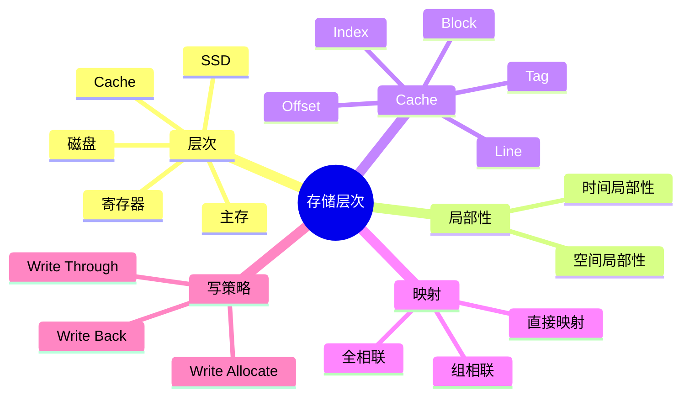
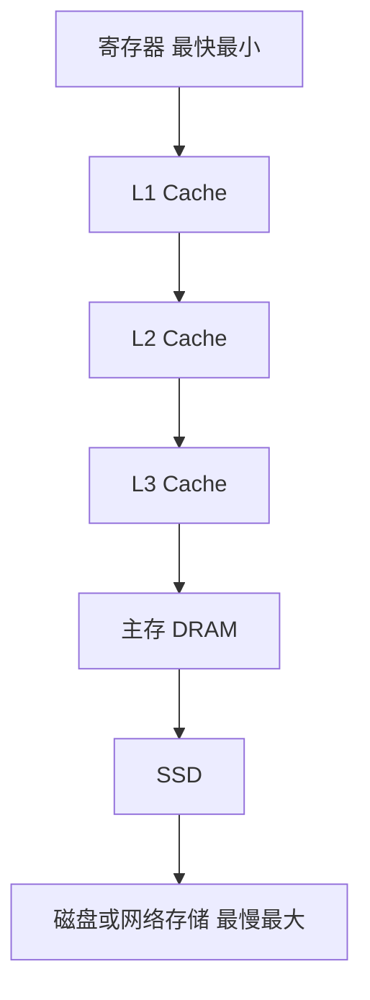
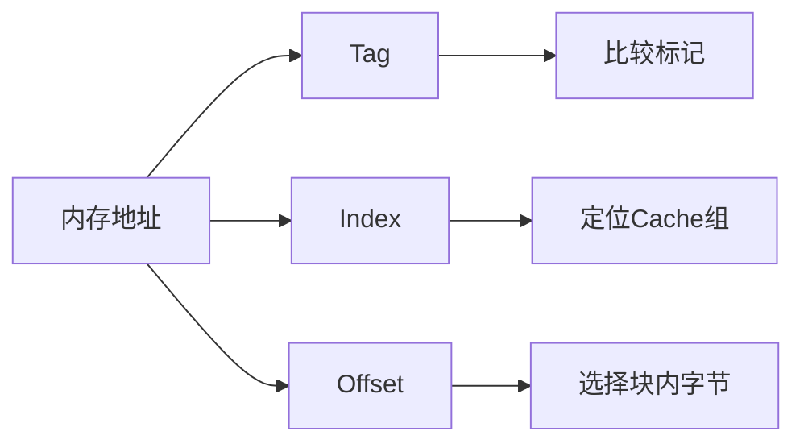
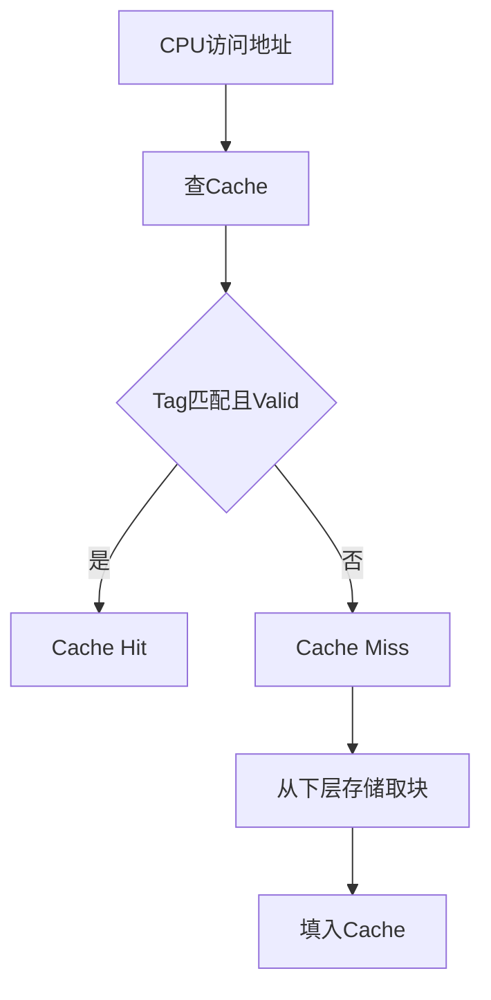
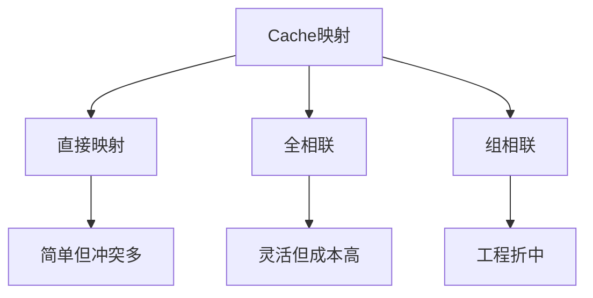
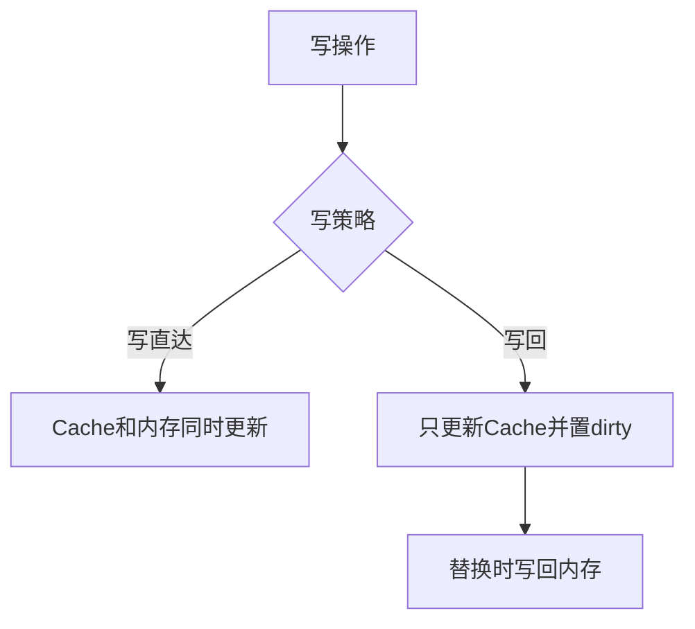

# 06. 存储层次、Cache 与主存

## 学习目标

读完本章，你应该能回答：

1. 为什么需要存储层次结构？
2. 时间局部性和空间局部性是什么？
3. Cache 的块、行、组、标记分别是什么？
4. 直接映射、全相联、组相联有什么区别？
5. 写直达、写回、替换策略分别解决什么问题？

## 一句话总纲

存储层次用少量高速存储缓存大量低速存储中的热点数据，以局部性原理弥合 CPU 与主存之间的速度差距。

> 记忆口诀：**越靠近 CPU 越快越小越贵，越远离 CPU 越慢越大越便宜。**

## 思维导图



## 1. 存储层次结构



特点：

| 层级 | 速度 | 容量 | 成本 |
| --- | --- | --- | --- |
| 寄存器 | 极快 | 极小 | 极高 |
| Cache | 很快 | 小 | 高 |
| 主存 | 中等 | 大 | 中 |
| 外存 | 慢 | 很大 | 低 |

## 2. 局部性原理

### 时间局部性

最近访问过的数据，短时间内可能再次访问。

例子：循环变量。

### 空间局部性

访问某个地址后，附近地址很可能被访问。

例子：数组顺序遍历。

```mermaid
flowchart LR
  A[访问a[i]] --> B[很快再次访问a[i]]
  A --> C[很快访问a[i+1]]
  B --> D[时间局部性]
  C --> E[空间局部性]
```

## 3. Cache 基本概念

Cache 不是按单个字节缓存，而是按块 Cache Block 缓存。

地址通常拆成：

```text
Tag + Index + Block Offset
```



## 4. Cache 命中与缺失



平均访问时间：

```text
AMAT = Hit Time + Miss Rate × Miss Penalty
```

## 5. Cache 映射方式

### 直接映射

每个内存块只能放到一个固定 Cache 行。

优点：简单快。  
缺点：冲突缺失多。

### 全相联

任意内存块可以放到任意 Cache 行。

优点：冲突少。  
缺点：比较复杂，硬件成本高。

### 组相联

Cache 分成若干组，每个块映射到固定组，但可放在组内任意行。

这是常见折中。



## 6. 替换策略

当一个组满了，需要决定替换哪一行。

常见策略：

| 策略 | 思想 |
| --- | --- |
| LRU | 替换最久未使用 |
| FIFO | 替换最早进入 |
| Random | 随机替换 |
| LFU | 替换最少使用 |

硬件中严格 LRU 成本可能较高，常用近似 LRU。

## 7. 写策略

### 写直达 Write Through

写 Cache 的同时写下层存储。

优点：一致性简单。  
缺点：写流量大。

### 写回 Write Back

只写 Cache，等块被替换时再写回下层。需要 dirty bit。

优点：减少写流量。  
缺点：一致性复杂。



## 8. Cache 缺失类型

| 类型 | 说明 | 缓解 |
| --- | --- | --- |
| 强制缺失 | 第一次访问不可避免 | 预取 |
| 容量缺失 | Cache 太小放不下工作集 | 增大 Cache |
| 冲突缺失 | 多块竞争同一位置 | 提高相联度 |

## 9. 主存 DRAM 与 SRAM

| 类型 | 特点 | 用途 |
| --- | --- | --- |
| SRAM | 快、贵、不需刷新 | Cache |
| DRAM | 慢些、便宜、需刷新 | 主存 |

Cache 通常用 SRAM，主存通常用 DRAM。

## 10. 程序局部性示例

数组按行遍历通常比按列遍历更快，因为内存按行连续存储，更符合空间局部性。

```c
for (int i = 0; i < n; ++i)
  for (int j = 0; j < m; ++j)
    sum += a[i][j];
```

比下面更 Cache 友好：

```c
for (int j = 0; j < m; ++j)
  for (int i = 0; i < n; ++i)
    sum += a[i][j];
```

## 11. 常见坑

| 坑 | 说明 |
| --- | --- |
| 以为 Cache 由程序员手动控制 | 通常硬件自动管理 |
| 命中率高就一定快 | 还要看命中时间和缺失代价 |
| LRU 总能最优 | LRU 是启发式，不总最优 |
| 写回不写内存 | 替换时仍要写回 dirty block |
| 忽略局部性 | 访问模式会显著影响性能 |

## 12. 学习自检

1. 为什么需要 Cache？
2. 时间局部性和空间局部性分别是什么？
3. 地址中的 Tag、Index、Offset 分别做什么？
4. 直接映射和组相联有什么区别？
5. 写回策略为什么需要 dirty bit？
