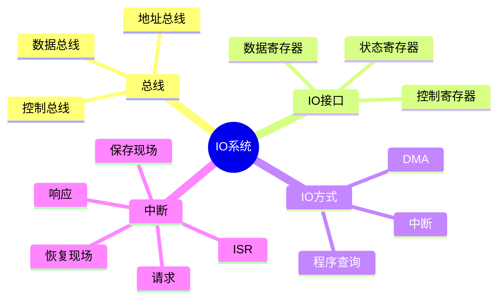
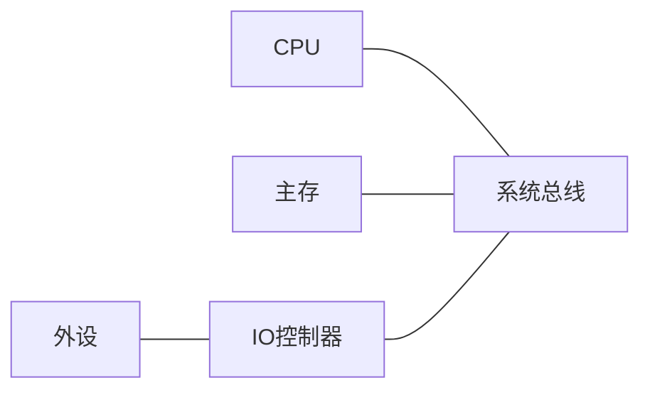
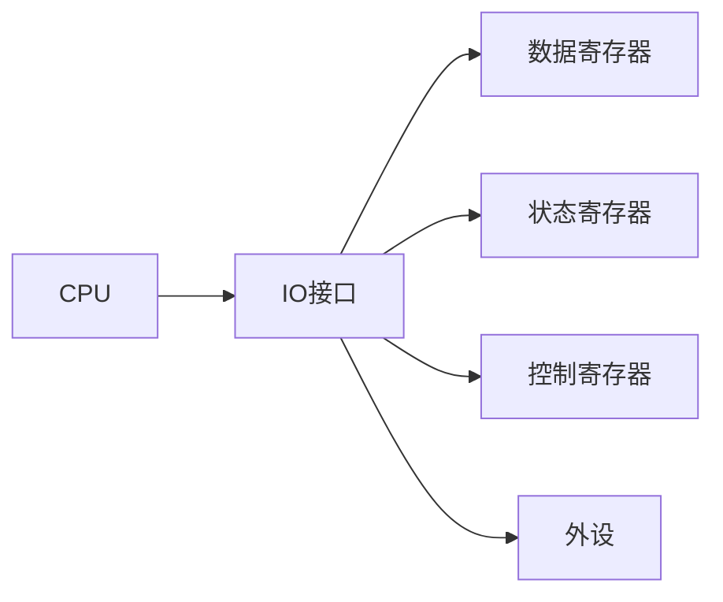
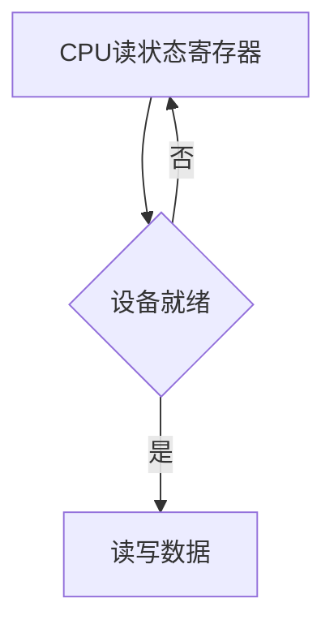
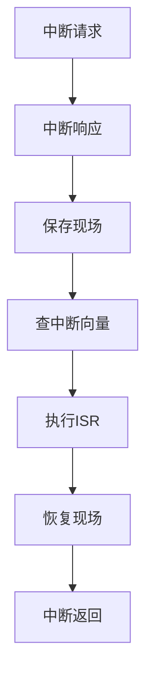
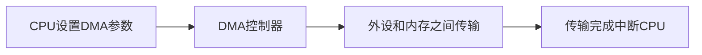
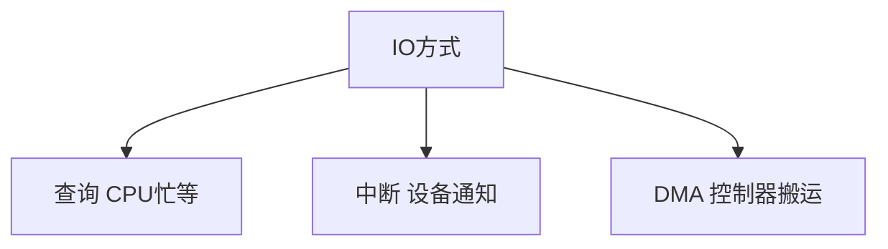

# 07. 总线、I/O、中断与 DMA

## 学习目标

读完本章，你应该能回答：

1. 总线是什么？地址总线、数据总线、控制总线分别传什么？
2. CPU 和外设为什么需要 I/O 接口？
3. 程序查询、中断、DMA 三种 I/O 方式有什么区别？
4. 中断处理的大致流程是什么？
5. DMA 为什么能减少 CPU 负担？

## 一句话总纲

I/O 系统负责让 CPU、内存和外设协同工作。由于外设慢且种类多，计算机通过总线、控制器、中断和 DMA 在性能与复杂度之间折中。

> 记忆口诀：**总线连部件，中断叫 CPU，DMA 搬大块。**

## 思维导图



## 1. 总线是什么？

总线是一组共享通信线路，用来连接 CPU、内存和 I/O 设备。



总线类型：

| 总线 | 传递内容 |
| --- | --- |
| 地址总线 | 要访问的地址 |
| 数据总线 | 读写的数据 |
| 控制总线 | 读写控制、时钟、中断等信号 |

## 2. 总线性能指标

- 总线宽度：一次能传多少位。
- 总线频率：每秒传输多少次。
- 带宽：单位时间传输数据量。
- 仲裁方式：多个设备争用总线时如何决定谁使用。

```text
理论带宽 ≈ 总线宽度 × 频率
```

实际带宽还受协议开销和等待周期影响。

## 3. I/O 接口为什么需要？

外设速度、数据格式、控制方式差异很大，CPU 不能直接管理所有细节，因此需要 I/O 控制器或接口。

I/O 接口常包含：

- 数据寄存器。
- 状态寄存器。
- 控制寄存器。
- 缓冲区。



## 4. I/O 编址方式

| 方式 | 说明 |
| --- | --- |
| 独立编址 I/O | I/O 端口有独立地址空间，使用专门指令 |
| 内存映射 I/O | 把设备寄存器映射到内存地址空间 |

内存映射 I/O 的优点是可用普通 load/store 指令访问设备寄存器。

## 5. 程序查询方式

CPU 不断轮询设备状态，直到设备准备好。



优点：简单。  
缺点：浪费 CPU 时间。

## 6. 中断方式

设备准备好后主动发出中断请求，CPU 暂停当前程序去处理中断。


中断提高 CPU 利用率，因为 CPU 不必一直轮询等待。

## 7. 中断处理流程

1. 设备发出中断请求。
2. CPU 在合适时机响应。
3. 保存现场，例如 PC、状态寄存器。
4. 根据中断向量找到中断服务程序 ISR。
5. 执行 ISR。
6. 恢复现场。
7. 返回原程序。



## 8. DMA

DMA，Direct Memory Access，直接内存访问。DMA 控制器可以在外设和内存之间搬运数据，CPU 只需初始化参数和处理完成中断。



适合大块数据传输，例如磁盘、网卡、声卡。

## 9. 三种 I/O 方式对比

| 方式 | CPU 参与 | 适合场景 |
| --- | --- | --- |
| 程序查询 | CPU 一直等待 | 简单低速设备 |
| 中断 | 就绪时通知 CPU | 零散事件和低中速 I/O |
| DMA | CPU 初始化和收尾 | 大块高速数据传输 |



## 10. 常见坑

| 坑 | 说明 |
| --- | --- |
| 中断等于异常 | 中断常来自外部，异常常来自指令执行内部 |
| DMA 不需要 CPU | CPU 仍需初始化和处理完成 |
| 总线带宽等于实际吞吐 | 协议开销会降低实际吞吐 |
| 内存映射 I/O 是普通内存 | 访问设备寄存器有副作用 |
| 轮询一定不好 | 简单短等待场景轮询可能更低开销 |

## 11. 学习自检

1. 地址总线和数据总线分别传什么？
2. 为什么需要 I/O 控制器？
3. 程序查询方式为什么浪费 CPU？
4. 中断处理为什么要保存现场？
5. DMA 适合什么类型的数据传输？
