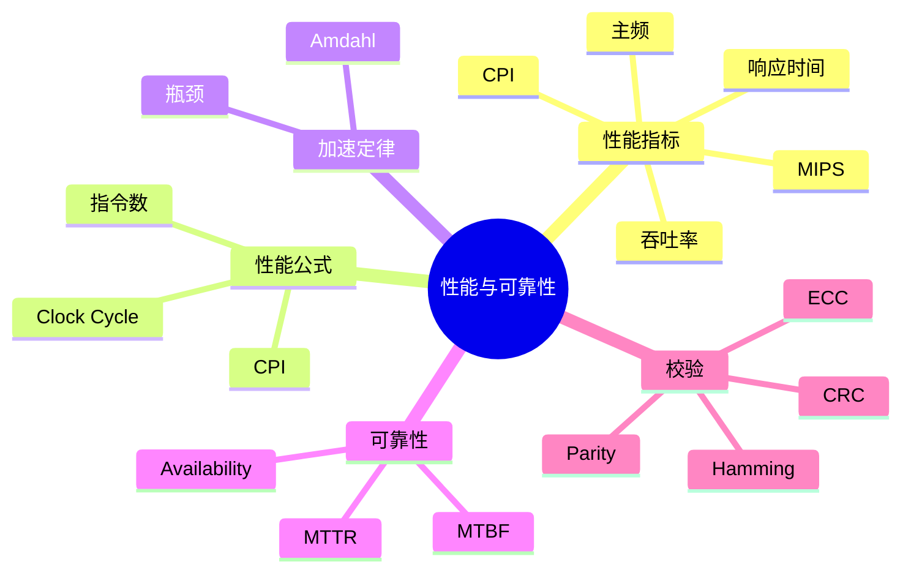
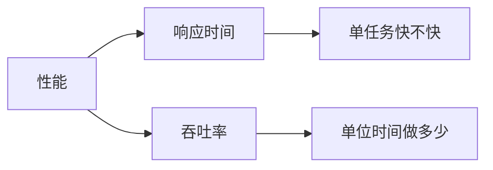
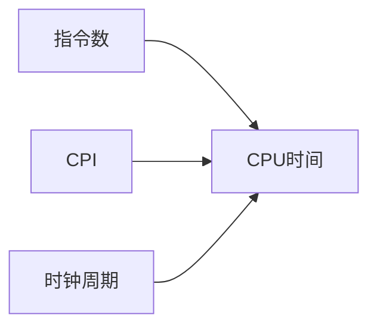
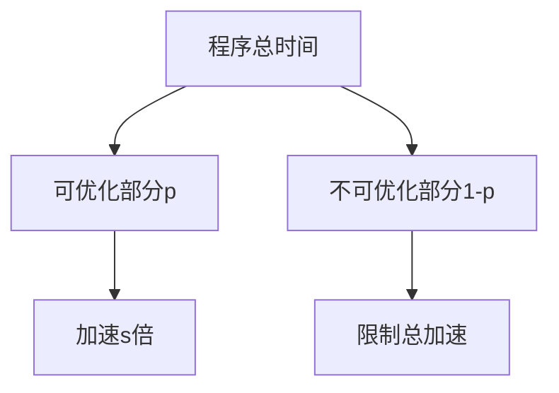
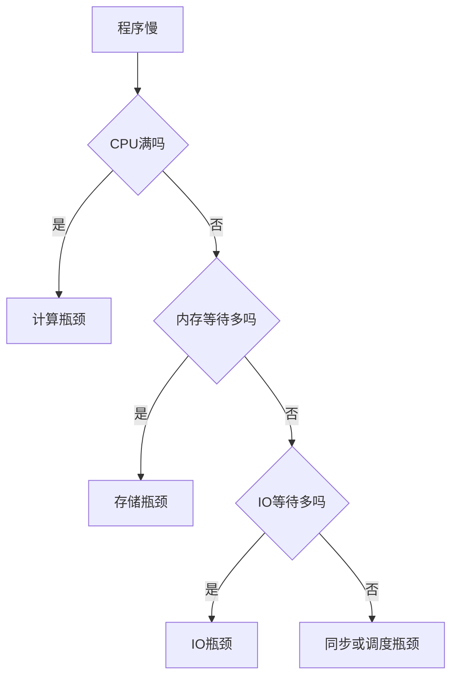
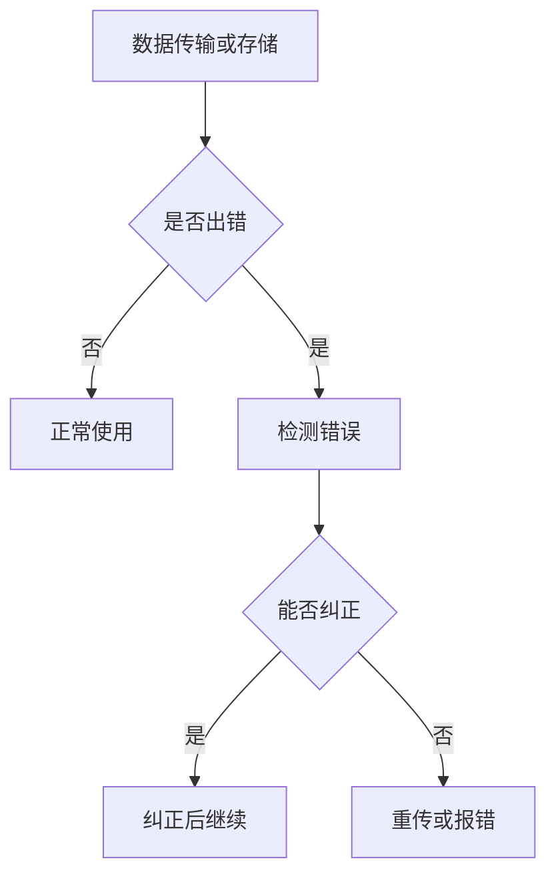

# 08. 性能指标、可靠性与校验

## 学习目标

读完本章，你应该能回答：

1. CPU 主频、CPI、MIPS、吞吐率、响应时间分别是什么？
2. CPU 执行时间公式如何使用？
3. Amdahl 定律说明了什么？
4. 可靠性、可用性、MTBF、MTTR 如何理解？
5. 校验码和纠错码如何提升数据可靠性？

## 一句话总纲

计算机性能不是只看主频，而是由指令数、CPI、时钟周期、存储访问、并行度和 I/O 等共同决定；可靠性则依赖错误检测、纠错、冗余和恢复机制。

> 记忆口诀：**性能看时间，时间看指令数、CPI 和周期；可靠看发现错误、纠正错误和快速恢复。**

## 思维导图



## 1. 响应时间与吞吐率

| 指标 | 含义 |
| --- | --- |
| 响应时间 | 完成一个任务需要多久 |
| 吞吐率 | 单位时间完成多少任务 |

例子：

- 用户打开网页更关心响应时间。
- 服务器批处理更关心吞吐率。



## 2. CPU 执行时间公式

经典公式：

```text
CPU Time = Instruction Count × CPI × Clock Cycle Time
```

也可写为：

```text
CPU Time = Instruction Count × CPI / Clock Rate
```

含义：

- Instruction Count：程序执行了多少条指令。
- CPI：平均每条指令多少周期。
- Clock Cycle Time：每个周期多长。



## 3. 主频不是全部

提高主频可以减少时钟周期时间，但如果 CPI 变大、Cache miss 增多、指令数增加，程序未必更快。

比较 CPU 性能要看具体工作负载。

## 4. MIPS 的局限

MIPS：每秒百万条指令。

问题：

- 不同 ISA 的指令工作量不同。
- 同一任务在不同机器上指令数可能不同。
- MIPS 高不一定程序更快。

因此实际更常用基准测试和真实 workload。

## 5. Amdahl 定律

Amdahl 定律说明：系统整体加速受限于不能被优化的部分。

如果某部分占比 `p`，加速 `s` 倍，则整体加速比：

```text
Speedup = 1 / ((1 - p) + p / s)
```



结论：只优化小部分，即使无限加速，整体收益也有限。

## 6. 性能瓶颈分析



组成原理中要特别关注：

- Cache miss。
- 分支预测失败。
- 流水线停顿。
- 内存带宽。
- I/O 等待。

## 7. 可靠性指标

| 指标 | 含义 |
| --- | --- |
| MTBF | Mean Time Between Failures，平均故障间隔时间 |
| MTTR | Mean Time To Repair，平均修复时间 |
| Availability | 可用性 |

可用性近似：

```text
Availability = MTBF / (MTBF + MTTR)
```

提高可用性：

- 增大 MTBF。
- 减小 MTTR。
- 使用冗余和快速恢复。

## 8. 错误检测与纠正



常见机制：

- 奇偶校验：检测简单错误。
- CRC：强检错，常用于网络和存储。
- ECC：可纠错，常用于内存。
- RAID：磁盘冗余。

## 9. ECC 内存

ECC 内存可以检测并纠正部分内存 bit 错误，常用于服务器场景。

它通常能纠正单比特错误，检测多比特错误，具体能力取决于编码方案。

## 10. 冗余思想

可靠性常用冗余换稳定性：


## 11. 常见坑

| 坑 | 说明 |
| --- | --- |
| 只看主频判断性能 | 还要看 CPI 和指令数 |
| MIPS 跨 ISA 比较 | 可能误导 |
| Amdahl 定律忽略不可优化部分 | 会高估加速收益 |
| 校验码等同加密 | 校验码用于检错，不保证安全 |
| 可用性只看故障少 | 修复速度同样重要 |

## 12. 学习自检

1. CPU 执行时间公式是什么？
2. 为什么主频高不一定更快？
3. Amdahl 定律说明了什么？
4. MTBF 和 MTTR 分别表示什么？
5. 校验和纠错有什么区别？
