# 09. 计算机组成原理面试 50 问

## 使用方式

这份文档用于快速复习计算机组成原理面试高频题。每个问题先给标准回答，再用图辅助记忆。

> 答题口诀：**先讲部件职责，再讲数据流；先讲不变量，再讲性能权衡。**

---

## 思维导图：高频考点地图

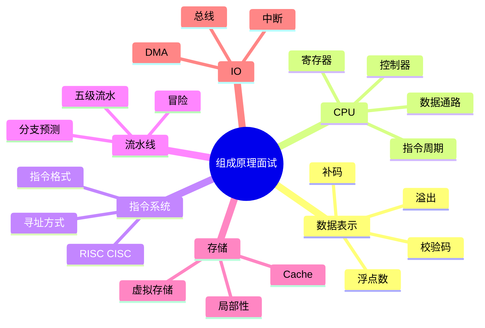

---

## Q1. 冯·诺依曼结构的核心思想是什么？

### 标准回答

程序和数据都存储在存储器中，CPU 按地址取出指令并执行。计算机由运算器、控制器、存储器、输入设备、输出设备组成。

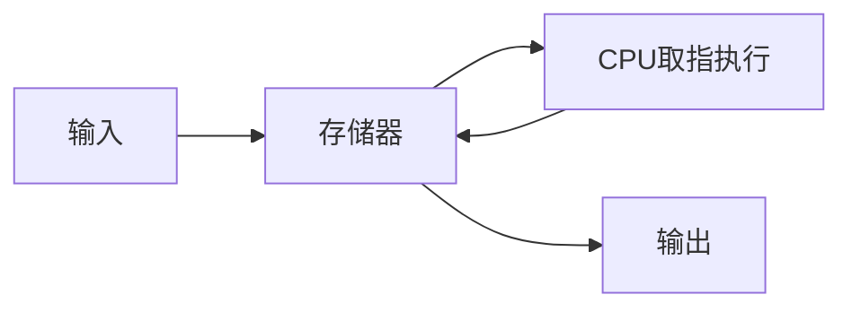

---

## Q2. CPU 执行一条指令通常经历哪些阶段？

### 标准回答

通常包括取指、译码、取操作数、执行、访存、写回。流水线中常简化为 IF、ID、EX、MEM、WB 五级。


---

## Q3. 原码、反码、补码有什么区别？

### 标准回答

原码最高位表示符号，数值位表示绝对值；反码负数数值位取反；补码负数等于反码加 1。现代计算机使用补码，因为它能统一加减法且只有一个 0。


---

## Q4. 为什么补码能统一加法和减法？

### 标准回答

因为减法 `A - B` 可以变成 `A + (-B)`，而 `-B` 的补码可以通过取反加 1 得到。这样硬件只需加法器就能完成加法和减法。


---

## Q5. 补码加法如何判断溢出？

### 标准回答

有符号补码加法中，两个同号数相加，如果结果符号与操作数符号不同，则溢出。异号相加不会发生有符号溢出。

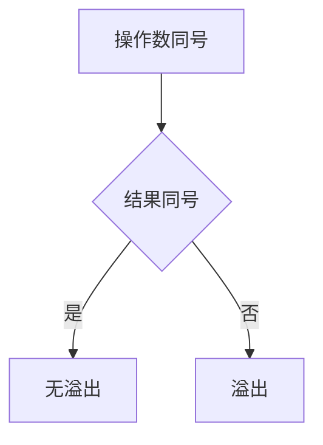

---

## Q6. 定点数和浮点数有什么区别？

### 标准回答

定点数小数点位置固定，硬件简单但范围有限；浮点数类似科学计数法，小数点位置随指数移动，表示范围大但存在精度误差。

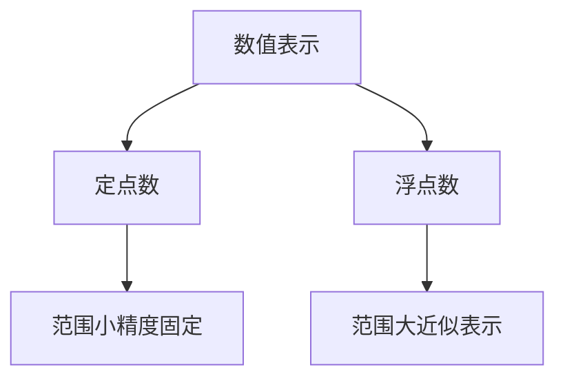

---

## Q7. IEEE 754 单精度浮点数由哪些部分组成？

### 标准回答

32 位单精度浮点数由 1 位符号位、8 位阶码、23 位尾数组成。符号决定正负，阶码决定数量级，尾数决定有效精度。


---

## Q8. 为什么浮点数不能直接用等号比较？

### 标准回答

很多十进制小数在二进制中无法精确表示，只能近似存储，运算后会产生舍入误差。因此比较浮点数通常使用误差范围 `abs(a-b) < eps`。


---

## Q9. 奇偶校验、海明码、CRC 有什么区别？

### 标准回答

奇偶校验能检测奇数位错误但不能定位；海明码可以定位并纠正单比特错误；CRC 检错能力强，常用于网络和存储传输。

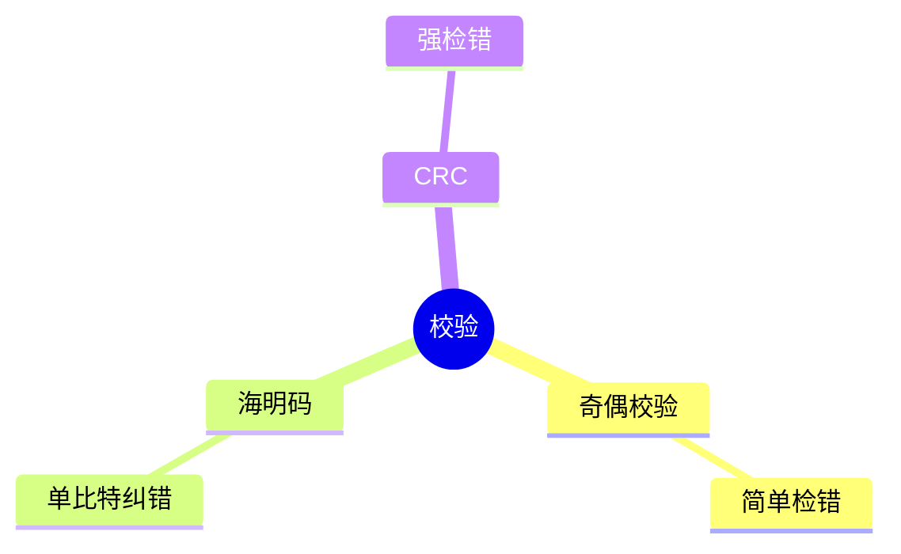

---

## Q10. ALU 是什么？

### 标准回答

ALU 是算术逻辑单元，负责执行加减、逻辑与或非、移位、比较等操作，并产生结果和状态标志位。

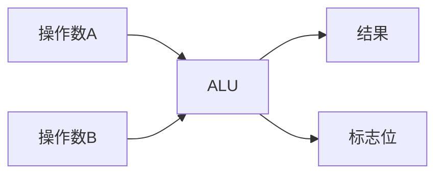

---

## Q11. CF 和 OF 有什么区别？

### 标准回答

CF 表示无符号运算的进位或借位，常用于判断无符号溢出；OF 表示有符号补码运算溢出。两者关注的数值解释不同。

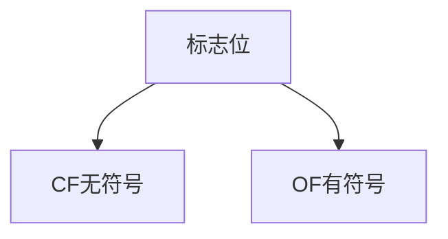

---

## Q12. 逻辑右移和算术右移有什么区别？

### 标准回答

逻辑右移高位补 0，适合无符号数；算术右移高位补符号位，适合有符号数保持正负号。

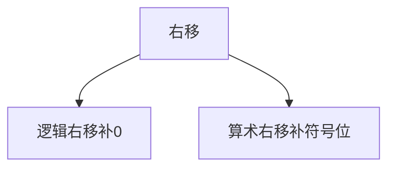

---

## Q13. 指令系统 ISA 是什么？

### 标准回答

ISA 是软件和硬件之间的接口，规定指令、寄存器、数据类型、寻址方式、异常中断等。编译器面向 ISA 生成机器码，CPU 实现 ISA 来执行程序。

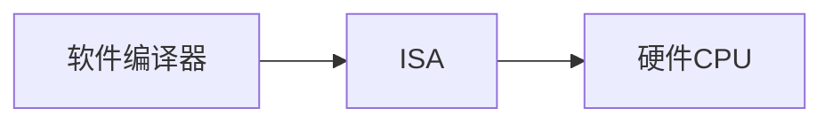

---

## Q14. 一条机器指令通常包含哪些字段？

### 标准回答

通常包含操作码和操作数字段。操作码说明执行什么操作，操作数字段说明操作数位置、寄存器编号、立即数或地址信息。


---

## Q15. 立即寻址和直接寻址有什么区别？

### 标准回答

立即寻址中操作数本身在指令里；直接寻址中指令给出的是内存地址，需要到该地址取操作数。

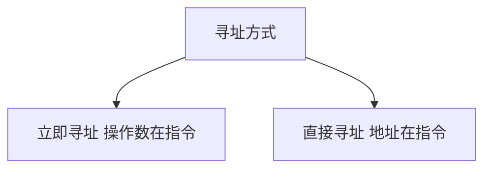

---

## Q16. RISC 和 CISC 的核心区别是什么？

### 标准回答

RISC 指令少而简单，常定长，便于流水线；CISC 指令复杂灵活，常变长，编码紧凑但译码复杂。现代处理器实现中两者思想有融合。

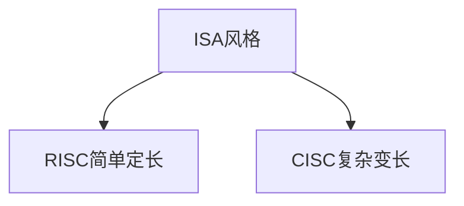

---

## Q17. PC、IR、MAR、MDR 分别是什么？

### 标准回答

PC 保存下一条指令地址；IR 保存当前指令；MAR 保存要访问的内存地址；MDR 保存从内存读出或准备写入内存的数据。

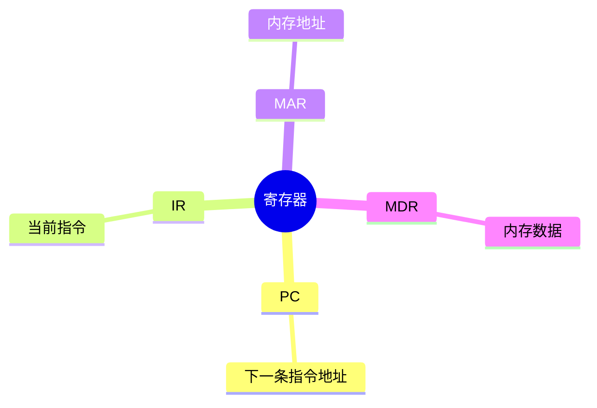

---

## Q18. 数据通路和控制器有什么区别？

### 标准回答

数据通路负责数据的传送、选择和运算，包括寄存器、ALU、MUX、总线；控制器负责根据指令和时序产生控制信号，指挥数据通路工作。

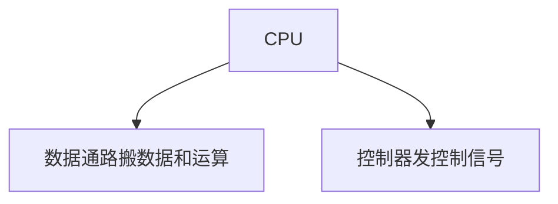

---

## Q19. 硬布线控制和微程序控制有什么区别？

### 标准回答

硬布线控制用组合逻辑直接产生控制信号，速度快但修改困难；微程序控制通过微指令序列产生控制信号，灵活但可能较慢。

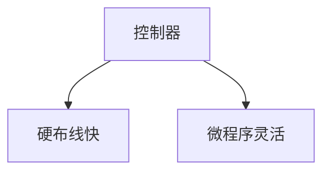

---

## Q20. 什么是指令周期、机器周期、时钟周期？

### 标准回答

时钟周期是 CPU 最基本节拍；机器周期是完成一个基本操作的时间；指令周期是完成一条指令的时间，通常包含多个机器周期或时钟周期。

```mermaid
flowchart LR
  A[时钟周期] --> B[机器周期]
  B --> C[指令周期]
```

---

## Q21. 流水线为什么能提升性能？

### 标准回答

流水线把指令执行拆成多个阶段，让多条指令在不同阶段重叠执行。它主要提高吞吐率，使稳定后接近每周期完成一条指令，但不一定减少单条指令延迟。

```mermaid
flowchart LR
  A[指令1执行阶段] --> B[指令2取指阶段]
  B --> C[多条指令重叠]
```

---

## Q22. 五级流水线是哪五级？

### 标准回答

经典五级流水线包括 IF 取指、ID 译码读寄存器、EX 执行、MEM 访存、WB 写回。

```mermaid
flowchart LR
  A[IF] --> B[ID]
  B --> C[EX]
  C --> D[MEM]
  D --> E[WB]
```

---

## Q23. 三类流水线冒险是什么？

### 标准回答

结构冒险是硬件资源冲突；数据冒险是后续指令依赖前面尚未写回的结果；控制冒险来自分支跳转导致下一条指令地址不确定。

```mermaid
mindmap
  root((流水线冒险))
    结构冒险
      资源冲突
    数据冒险
      数据依赖
    控制冒险
      分支跳转
```

---

## Q24. Forwarding 解决什么问题？

### 标准回答

Forwarding 转发把前面流水线阶段刚产生的结果直接送给后续指令使用，不必等写回寄存器，从而减少数据冒险导致的暂停。

```mermaid
flowchart LR
  A[EX结果] --> B[转发路径]
  B --> C[下一条指令ALU输入]
```

---

## Q25. 分支预测失败会发生什么？

### 标准回答

CPU 已经沿预测路径取入和执行的指令可能是错误的，需要清空或取消这些错误路径指令，重新从正确目标取指，造成流水线停顿和性能损失。

```mermaid
flowchart LR
  A[预测取指] --> B{预测正确}
  B -- 是 --> C[继续]
  B -- 否 --> D[清空错误路径]
  D --> E[重新取指]
```

---

## Q26. 什么是 Cache？为什么需要 Cache？

### 标准回答

Cache 是位于 CPU 和主存之间的小容量高速存储，用来缓存近期或附近会被访问的数据。它利用时间局部性和空间局部性缓解 CPU 与主存速度差距。

```mermaid
flowchart LR
  A[CPU] --> B[Cache]
  B --> C[主存]
```

---

## Q27. 时间局部性和空间局部性是什么？

### 标准回答

时间局部性指刚访问过的数据近期可能再次访问；空间局部性指访问某地址后，附近地址也可能很快被访问。

```mermaid
flowchart TD
  A[局部性] --> B[时间局部性 再次访问]
  A --> C[空间局部性 访问附近]
```

---

## Q28. Cache 地址如何划分？

### 标准回答

Cache 访问中，内存地址通常拆成 Tag、Index 和 Offset。Index 定位 Cache 组或行，Tag 判断是否是目标块，Offset 选择块内具体字节或字。

```mermaid
flowchart LR
  A[地址] --> B[Tag]
  A --> C[Index]
  A --> D[Offset]
```

---

## Q29. 直接映射、全相联、组相联有什么区别？

### 标准回答

直接映射中每个内存块只能放到固定 Cache 行，简单但冲突多；全相联中块可放任意行，冲突少但硬件复杂；组相联是折中，块映射到固定组，组内任意行可放。

```mermaid
flowchart TD
  A[Cache映射] --> B[直接映射]
  A --> C[全相联]
  A --> D[组相联]
```

---

## Q30. 写直达和写回有什么区别？

### 标准回答

写直达在写 Cache 的同时写下层存储，一致性简单但写流量大；写回只写 Cache，并设置 dirty bit，块替换时再写回下层，写流量小但一致性更复杂。

```mermaid
flowchart TD
  A[写策略] --> B[写直达]
  A --> C[写回]
  B --> B1[立即写内存]
  C --> C1[替换时写回]
```

---

## Q31. Cache 缺失有哪些类型？

### 标准回答

强制缺失是第一次访问不可避免；容量缺失是 Cache 容量不足；冲突缺失是多个块映射到同一位置竞争导致。

```mermaid
mindmap
  root((Cache Miss))
    强制缺失
      第一次访问
    容量缺失
      Cache太小
    冲突缺失
      映射竞争
```

---

## Q32. SRAM 和 DRAM 有什么区别？

### 标准回答

SRAM 速度快、成本高、不需刷新，常用于 Cache；DRAM 密度高、成本低、需要刷新，常用于主存。

```mermaid
flowchart TD
  A[存储芯片] --> B[SRAM Cache]
  A --> C[DRAM 主存]
```

---

## Q33. 什么是虚拟存储？

### 标准回答

虚拟存储让程序看到连续、较大的虚拟地址空间，操作系统和硬件通过页表把虚拟地址映射到物理地址，并可把不常用页面换出到磁盘。

```mermaid
flowchart LR
  A[虚拟地址] --> B[页表转换]
  B --> C[物理地址]
```

---

## Q34. TLB 是什么？

### 标准回答

TLB 是地址转换后备缓冲，用来缓存虚拟页号到物理页号的页表项。它减少每次访存都查页表的开销。

```mermaid
flowchart LR
  A[虚拟页号] --> B[TLB]
  B --> C{命中}
  C -- 是 --> D[物理页号]
  C -- 否 --> E[查页表]
```

---

## Q35. 总线分为哪几类？

### 标准回答

按传递内容常分为地址总线、数据总线和控制总线。地址总线传地址，数据总线传数据，控制总线传读写、中断、时钟等控制信号。

```mermaid
mindmap
  root((总线))
    地址总线
      地址
    数据总线
      数据
    控制总线
      控制信号
```

---

## Q36. 程序查询 I/O、中断 I/O、DMA 有什么区别？

### 标准回答

程序查询由 CPU 轮询设备状态，简单但浪费 CPU；中断由设备就绪后通知 CPU，提高利用率；DMA 由 DMA 控制器在内存和设备间搬运大块数据，CPU 只负责初始化和完成处理。

```mermaid
flowchart TD
  A[IO方式] --> B[查询轮询]
  A --> C[中断通知]
  A --> D[DMA搬运]
```

---

## Q37. 中断处理流程是什么？

### 标准回答

设备发出中断请求，CPU 响应后保存现场，根据中断向量找到中断服务程序，执行 ISR，恢复现场并返回原程序。

```mermaid
flowchart LR
  A[中断请求] --> B[保存现场]
  B --> C[执行ISR]
  C --> D[恢复现场]
  D --> E[返回]
```

---

## Q38. 中断和异常有什么区别？

### 标准回答

中断通常来自 CPU 外部设备，异步发生；异常通常由当前指令执行引起，例如除零、缺页、非法指令，和当前程序执行同步相关。

```mermaid
flowchart TD
  A[事件] --> B[中断 外部异步]
  A --> C[异常 内部同步]
```

---

## Q39. DMA 为什么能提高 I/O 效率？

### 标准回答

DMA 控制器直接在外设和内存之间传输数据，CPU 不需要逐字节参与搬运，只需设置传输参数并处理完成中断，适合大块高速数据传输。

```mermaid
flowchart LR
  A[CPU设置参数] --> B[DMA控制器]
  B --> C[外设和内存传输]
  C --> D[完成中断]
```

---

## Q40. 内存映射 I/O 是什么？

### 标准回答

内存映射 I/O 把设备寄存器映射到处理器地址空间，CPU 可以用普通 load/store 指令访问设备寄存器。注意这些地址访问可能有设备副作用。

```mermaid
flowchart LR
  A[CPU地址访问] --> B[地址空间]
  B --> C[普通内存]
  B --> D[设备寄存器]
```

---

## Q41. CPU 执行时间公式是什么？

### 标准回答

CPU Time = Instruction Count × CPI × Clock Cycle Time，也可写成 Instruction Count × CPI / Clock Rate。性能不能只看主频，还要看指令数和 CPI。

```mermaid
flowchart LR
  A[指令数] --> D[CPU时间]
  B[CPI] --> D
  C[周期时间] --> D
```

---

## Q42. CPI 是什么？

### 标准回答

CPI 是 Cycles Per Instruction，平均每条指令需要的时钟周期数。流水线停顿、Cache miss、分支预测失败等都会提高实际 CPI。

```mermaid
flowchart TD
  A[CPI] --> B[理想执行]
  A --> C[流水线停顿]
  A --> D[Cache Miss]
  A --> E[分支失败]
```

---

## Q43. Amdahl 定律说明什么？

### 标准回答

Amdahl 定律说明系统整体加速受限于不可优化部分。即使某部分无限加速，只要它占比有限，整体加速也有上限。

```mermaid
flowchart TD
  A[总时间] --> B[可加速部分]
  A --> C[不可加速部分]
  C --> D[限制总加速]
```

---

## Q44. MIPS 指标有什么局限？

### 标准回答

MIPS 表示每秒百万条指令，但不同 ISA 指令工作量不同，同一程序在不同机器上的指令数也不同。因此 MIPS 高不一定表示真实程序更快。

```mermaid
flowchart LR
  A[MIPS高] --> B[指令多或简单]
  B --> C[不一定程序快]
```

---

## Q45. 为什么主频高不一定性能好？

### 标准回答

性能还取决于指令数、CPI、Cache 命中率、分支预测、内存带宽和 I/O 等。主频只影响时钟周期，不能单独决定程序运行时间。

```mermaid
mindmap
  root((性能因素))
    主频
    指令数
    CPI
    Cache
    内存带宽
    IO
```

---

## Q46. MTBF、MTTR、可用性分别是什么？

### 标准回答

MTBF 是平均故障间隔时间，MTTR 是平均修复时间。可用性近似等于 `MTBF / (MTBF + MTTR)`，提高可用性可以减少故障或加快恢复。

```mermaid
flowchart LR
  A[MTBF] --> C[可用性]
  B[MTTR] --> C
```

---

## Q47. ECC 内存有什么作用？

### 标准回答

ECC 内存通过纠错码检测并纠正部分内存 bit 错误，常见能力是纠正单比特错误、检测多比特错误，适合服务器和高可靠场景。

```mermaid
flowchart LR
  A[内存数据] --> B[ECC校验]
  B --> C{发现错误}
  C -- 可纠正 --> D[纠正]
  C -- 不可纠正 --> E[报告错误]
```

---

## Q48. 为什么程序访问模式会影响 Cache 性能？

### 标准回答

Cache 利用局部性。顺序访问数组能利用空间局部性，命中率较高；跳跃访问或随机访问可能频繁 Cache miss，导致性能下降。

```mermaid
flowchart TD
  A[访问模式] --> B[顺序访问]
  A --> C[随机访问]
  B --> D[局部性好]
  C --> E[Cache Miss多]
```

---

## Q49. Load/Store 架构是什么意思？

### 标准回答

Load/Store 架构中，只有 load 和 store 指令访问内存，算术逻辑运算只在寄存器之间进行。这种设计常见于 RISC，便于简化数据通路和流水线。

```mermaid
flowchart LR
  A[内存] --> B[Load到寄存器]
  B --> C[寄存器间运算]
  C --> D[Store回内存]
```

---

## Q50. 如何系统回答一道组成原理题？

### 标准回答

先定位层次：数据表示、指令、CPU、流水线、存储、I/O 还是性能；再说明相关部件职责；然后画出数据流或控制流；最后分析复杂度、时延、吞吐或可靠性权衡。

```mermaid
flowchart LR
  A[定位层次] --> B[说明部件职责]
  B --> C[画数据流]
  C --> D[分析权衡]
  D --> E[总结答案]
```

---

## 面试快速复盘表

| 模块 | 高频关键词 | 最短记忆 |
| --- | --- | --- |
| 数据表示 | 补码、浮点、溢出 | 编码决定解释 |
| 运算器 | ALU、标志位 | 运算并产生状态 |
| 指令系统 | 操作码、寻址 | 软硬件接口 |
| CPU | 数据通路、控制器 | 通路搬数据，控制发信号 |
| 流水线 | IF ID EX MEM WB | 提吞吐，有冒险 |
| Cache | 局部性、映射、写策略 | 缓解 CPU 和内存速度差 |
| I/O | 总线、中断、DMA | 外设通信和数据搬运 |
| 性能 | CPI、Amdahl | 主频不是全部 |
| 可靠性 | ECC、CRC、MTBF | 检错纠错和恢复 |

---

## 最终记忆图

```mermaid
mindmap
  root((组成原理总口诀))
    表示
      补码
      浮点
      校验
    执行
      指令
      CPU
      ALU
    加速
      流水线
      Cache
      分支预测
    通信
      总线
      中断
      DMA
    评价
      CPI
      Amdahl
      可靠性
```
