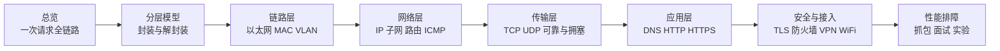
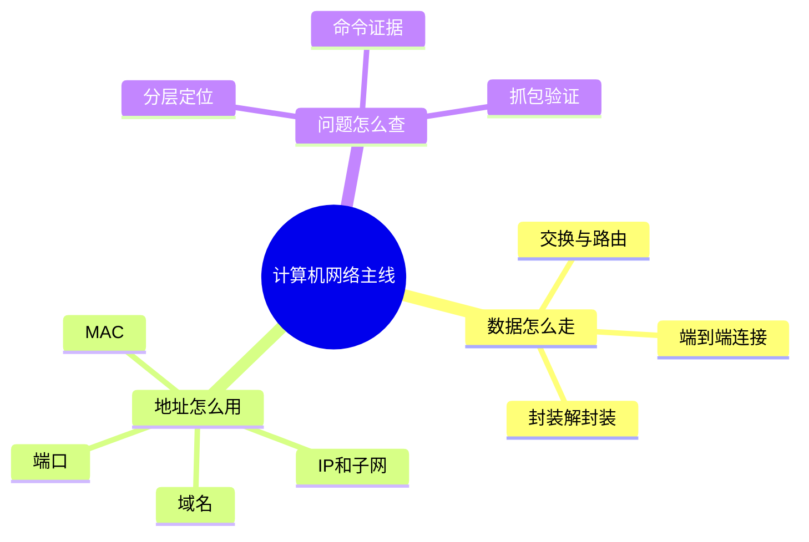

---
tags:
  - 计算机网络
  - MOC
  - 系统教程
aliases:
  - 计算机网络教程目录
  - 计算机网络系统学习路线
created: 2026-04-27
updated: 2026-05-03
---

# 计算机网络系统性教程 MOC

这套笔记的目标不是背概念，而是建立一套能用于 **开发、面试、排障、系统设计** 的网络心智模型。

建议学习顺序：

1. [[01-计算机网络总览与学习路线]]
2. [[02-网络分层模型与封装解封装]]
3. [[03-物理层与链路层：以太网、MAC、交换机、VLAN]]
4. [[04-网络层：IP、子网划分、ARP、ICMP、路由]]
5. [[05-传输层：UDP、TCP、可靠传输与拥塞控制]]
6. [[06-应用层基础：DNS、HTTP、HTTPS、WebSocket]]
7. [[07-网络安全基础：TLS、证书、防火墙、NAT、VPN]]
8. [[08-无线网络、移动网络与现代接入]]
9. [[09-网络性能与排障：ping、traceroute、抓包]]
10. [[10-常见面试题与核心问答]]
11. [[11-实验路线：从零搭建与抓包练习]]
12. [[12-速查表：端口、报文、命令、概念对比]]
13. [[13-进阶专题：CDN、BGP、QUIC、数据中心网络]]

---

## 一、全局学习地图

```text
应用层：DNS / HTTP / HTTPS / WebSocket / RPC / SMTP
  ↑  解决：应用如何表达请求、响应、资源和语义
传输层：TCP / UDP / QUIC
  ↑  解决：端到端进程通信、可靠性、拥塞控制
网络层：IP / ICMP / 路由 / NAT / BGP
  ↑  解决：跨网络寻址与转发
链路层：Ethernet / Wi-Fi / ARP / VLAN / 交换机
  ↑  解决：同一链路内的帧传输与局域网互联
物理层：网线 / 光纤 / 无线电 / 编码调制
     解决：比特如何变成物理信号
```

一个请求从浏览器发出时，大致会经历：

```text
输入 URL
  ↓
DNS 解析域名到 IP
  ↓
选择传输协议：TCP+TLS 或 QUIC
  ↓
构造 HTTP 请求
  ↓
经过本机协议栈封装成报文、数据包、帧
  ↓
经过网卡、交换机、路由器、运营商、骨干网、CDN
  ↓
到达服务器或边缘节点
  ↓
服务器处理后反向返回响应
```

---

## 二、每章解决的问题

| 章节 | 核心问题 | 学完应该能回答 |
|---|---|---|
| 总览 | 网络为什么分层 | 浏览器访问网站发生了什么 |
| 分层模型 | OSI/TCP-IP 如何映射 | 封装、解封装、PDU 是什么 |
| 链路层 | 局域网内如何传输 | MAC、交换机、VLAN、ARP 的关系 |
| 网络层 | 跨网络如何寻址 | IP、子网、网关、路由、ICMP 的作用 |
| 传输层 | 进程之间如何通信 | TCP 为什么可靠、为什么有三次握手 |
| 应用层 | 应用协议如何工作 | DNS、HTTP、HTTPS、WebSocket 的流程 |
| 安全 | 网络如何加密与隔离 | TLS、证书、防火墙、NAT、VPN 的边界 |
| 无线/移动 | 现代接入如何不同 | Wi-Fi、蜂窝网络、漫游的基础 |
| 排障 | 出问题怎么定位 | ping、traceroute、dig、tcpdump、Wireshark 怎么用 |
| 面试 | 高频问题如何回答 | 用因果链条而不是背诵回答网络题 |
| 实验 | 如何动手验证 | 本地抓包、搭建服务、模拟网络问题 |
| 速查 | 常用信息 | 端口、命令、报文字段、概念对比 |
| 进阶 | 工程真实网络 | CDN、BGP、QUIC、数据中心网络如何协作 |

---

## 三、学习方法

1. **先画路径，再学协议**：每个协议都问它解决哪一段路径上的什么问题。
2. **先抓包，再背字段**：字段只有出现在真实报文里才容易记住。
3. **先定位层次，再排障**：物理不通、链路不通、IP 不通、端口不通、TLS 不通、应用不通，是不同问题。
4. **用端到端案例串起来**：围绕“访问一个 HTTPS 网站”反复回到全链路。

---

## 四、推荐实践节奏

- 第 1 天：读 [[01-计算机网络总览与学习路线]]、[[02-网络分层模型与封装解封装]]
- 第 2 天：读链路层与网络层，完成 ARP / ping / traceroute 实验
- 第 3 天：读传输层，抓 TCP 三次握手、四次挥手
- 第 4 天：读应用层，抓 DNS、HTTP、HTTPS 流程
- 第 5 天：读安全、排障、进阶专题，整理自己的面试答案
- 后续：用 [[11-实验路线：从零搭建与抓包练习]] 反复验证

---

## 五、关键词索引

- 分层：[[02-网络分层模型与封装解封装]]
- MAC / 交换机 / VLAN：[[03-物理层与链路层：以太网、MAC、交换机、VLAN]]
- IP / 子网 / 路由：[[04-网络层：IP、子网划分、ARP、ICMP、路由]]
- TCP / UDP：[[05-传输层：UDP、TCP、可靠传输与拥塞控制]]
- DNS / HTTP / HTTPS：[[06-应用层基础：DNS、HTTP、HTTPS、WebSocket]]
- TLS / 防火墙 / NAT / VPN：[[07-网络安全基础：TLS、证书、防火墙、NAT、VPN]]
- ping / traceroute / tcpdump：[[09-网络性能与排障：ping、traceroute、抓包]]
- CDN / BGP / QUIC：[[13-进阶专题：CDN、BGP、QUIC、数据中心网络]]

<!-- CN-DEEP-EXPANSION:START -->
## 深入学习导航：这套笔记应该怎么读

如果你现在觉得“看不懂”，通常不是因为你不适合学网络，而是因为网络知识天然是**链式依赖**：你还没理解“下一跳”，就很难理解 ARP；你还没理解“端口”，就很难理解 TCP；你还没理解“证书链”，就很难理解 HTTPS。

所以不要按“背名词”的方式读这套笔记。建议按下面 4 条主线反复阅读。

### 主线一：一条数据从哪里来，到哪里去

把所有协议都放进同一个故事：

```text
我在浏览器输入网址
  ↓
浏览器要先知道域名对应哪个 IP：DNS
  ↓
操作系统要知道目标是否在本地网络：子网 / 路由表
  ↓
如果不在本地网络，要把帧交给网关：ARP 找网关 MAC
  ↓
建立到服务器进程的通信：TCP 或 QUIC
  ↓
确认对方是真的服务器：TLS 证书
  ↓
表达我要什么资源：HTTP
  ↓
中间可能经过 CDN / 负载均衡 / 反向代理
  ↓
服务器处理并返回响应
```

学习任何章节时都问：**它在这条链路中解决哪一步的问题？**

### 主线二：四类地址不要混在一起

很多初学者卡住，是因为把域名、IP、MAC、端口混成一个东西。请牢牢记住：

| 名称 | 你可以这样理解 | 典型问题 |
|---|---|---|
| 域名 | 人类给服务起的名字 | `example.com` 是谁？ |
| IP | 网络层的目的地位置 | 包要送到哪台主机/接口？ |
| MAC | 当前局域网下一跳网卡 | 这一帧交给哪个网卡？ |
| 端口 | 主机里的具体应用入口 | 交给 Web、SSH 还是数据库？ |

一个生活类比：

```text
域名：公司名称
IP：公司所在城市和街道地址
MAC：快递到达当前中转站后，下一个分拣口
端口：公司大楼里的具体办公室门牌号
```

这个类比不完全严谨，但能帮你先建立方向感。

### 主线三：排障永远从“哪一层坏了”开始

遇到“访问不了网站”不要直接猜。按这个顺序查：

```text
1. 我有没有连上网络？             → 链路层
2. 我有没有 IP、网关、DNS？        → 网络配置
3. 我能不能 ping 公网 IP？         → 网络层
4. 域名能不能解析？                → DNS
5. 端口能不能连上？                → TCP/UDP
6. TLS 证书和握手正常吗？          → 安全层
7. HTTP 状态码是什么？             → 应用层
8. 服务端日志有没有收到请求？       → 业务层
```

你可以把 [[09-网络性能与排障：ping、traceroute、抓包]] 当成整套教程的“实战索引”。

### 主线四：不要一次读完，按任务读

如果目标是面试：先读 [[10-常见面试题与核心问答]] 和 [[14-计算机网络面试官50问]]，不会的题再回到对应章节。

如果目标是排障：先读 [[09-网络性能与排障：ping、traceroute、抓包]]、[[12-速查表：端口、报文、命令、概念对比]]，再补 [[04-网络层：IP、子网划分、ARP、ICMP、路由]]、[[05-传输层：UDP、TCP、可靠传输与拥塞控制]]。

如果目标是系统性学习：按 01 到 13 顺序读，每章读完都做 [[11-实验路线：从零搭建与抓包练习]] 中对应实验。

### 最小掌握标准

读完这套笔记，不要求你成为网络工程师，但至少应该能做到：

- 能画出一次 HTTPS 请求的完整链路。
- 能解释 DNS、ARP、IP、TCP、TLS、HTTP 各自解决什么问题。
- 能区分 ping 通、端口通、TLS 通、HTTP 通、业务成功不是一回事。
- 能用 `dig`、`ping`、`traceroute`、`nc`、`curl -v`、`tcpdump` 做基础定位。
- 能把面试问题回答成“机制 + 场景 + 排障”，而不是背定义。
<!-- CN-DEEP-EXPANSION:END -->

## 思维导图

> 记忆建议：先记“一次请求全链路”，再用“分层、地址、排障”三条主线复习所有章节。

### 1. 学习路线总览



### 2. 网络学习三条主线


