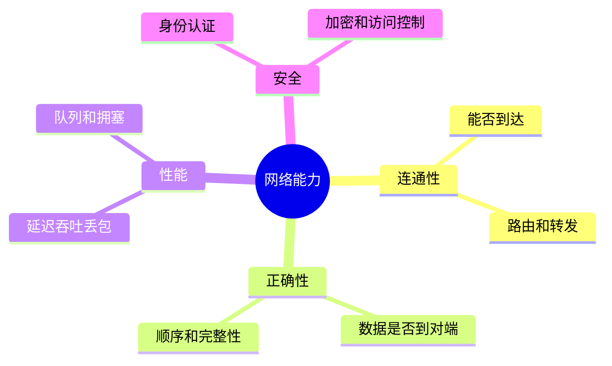
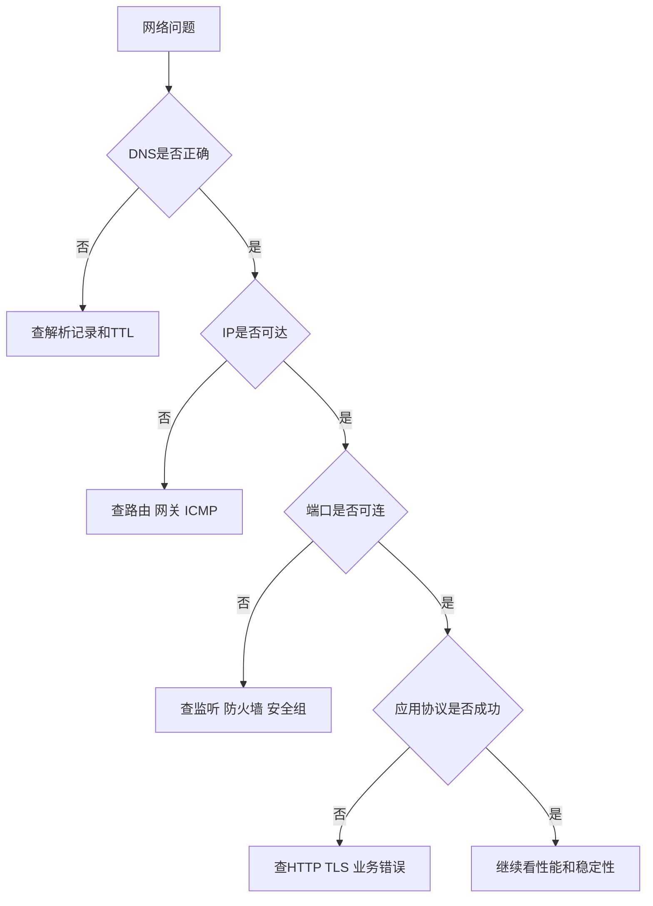

---
tags:
  - 计算机网络
  - 学习路线
  - 网络基础
aliases:
  - 计算机网络总览
  - 网络学习路线
created: 2026-04-27
updated: 2026-05-03
---

# 01-计算机网络总览与学习路线

> 返回：[[00-MOC]]

计算机网络的核心任务只有一句话：

> 让不同设备上的不同进程，能够跨越各种物理介质、网络设备和管理边界，正确、高效、安全地交换数据。

如果把“访问一个网站”拆开，网络不是一个单点技术，而是一条链：

```text
应用发起请求
  ↓
操作系统协议栈选择协议和端口
  ↓
本机网卡把数据变成帧
  ↓
局域网交换机转发
  ↓
默认网关路由到外部网络
  ↓
运营商、骨干网、CDN、数据中心继续转发
  ↓
服务器应用处理请求并返回响应
```

---

## 1. 学网络要先避免的误区

### 1.1 不要从背 OSI 七层开始

OSI 七层是分类工具，不是学习起点。真正有用的起点是：

- 我现在在哪一层？
- 这一层的输入输出是什么？
- 它解决了上一层不能解决的什么问题？
- 出问题时应该用什么工具验证？

### 1.2 不要把协议当孤立名词

比如 ARP、IP、TCP、DNS、HTTP 不是独立知识点，而是同一次访问中的连续环节：

```text
DNS：域名变成 IP
ARP：下一跳 IP 变成 MAC
IP：决定去哪里
TCP：保证进程间可靠传输
TLS：保证传输内容不被窃听和篡改
HTTP：表达应用层语义
```

### 1.3 不要只学“正常流程”

工程中更重要的是异常：

- 能 ping 通但访问不了网站
- DNS 解析慢
- TCP 连接建立失败
- TLS 证书错误
- HTTP 502 / 504
- 内网服务只能本机访问
- Wi-Fi 已连接但无互联网

这些问题都需要分层定位。

---

## 2. 一次 HTTPS 访问的全链路

以访问 `https://example.com/path` 为例：

### 2.1 浏览器解析 URL

URL 包含：

```text
scheme: https
host: example.com
port: 默认 443
path: /path
```

浏览器先确定协议、主机名、端口、路径，然后准备建立连接。

### 2.2 DNS 解析

浏览器和操作系统会先查缓存。如果没有命中，则向 DNS 递归解析器查询。

结果可能是：

- A 记录：IPv4 地址
- AAAA 记录：IPv6 地址
- CNAME：别名，继续解析到真实域名

DNS 的输出是 IP 地址，但 IP 地址还不等于能访问成功。

### 2.3 找下一跳

主机判断目标 IP 是否在本地子网：

- 如果在同一子网：直接发给目标主机
- 如果不在同一子网：发给默认网关

这一步依赖：

- 本机 IP
- 子网掩码 / 前缀长度
- 路由表
- 默认网关

### 2.4 ARP 或邻居发现

在以太网或 Wi-Fi 局域网内，真正发帧需要 MAC 地址。

- IPv4 常用 ARP：问“这个 IP 对应哪个 MAC？”
- IPv6 使用 NDP：基于 ICMPv6 的邻居发现

### 2.5 建立传输连接

传统 HTTPS：

```text
TCP 三次握手
  ↓
TLS 握手
  ↓
HTTP 请求/响应
```

HTTP/3：

```text
UDP
  ↓
QUIC 握手，集成加密与传输控制
  ↓
HTTP/3 请求/响应
```

### 2.6 中间网络转发

数据会经过：

- 家用路由器或企业网关
- NAT 设备
- 运营商接入网
- 骨干路由器
- CDN 边缘节点或数据中心入口
- 负载均衡器
- 后端服务

每个路由器通常只关心网络层转发：看目标 IP，查路由表，决定下一跳。

---

## 3. 计算机网络的四类能力

### 3.1 连通性

能不能到达目标。

常见验证：

```bash
ping 8.8.8.8
traceroute example.com
ip route
```

### 3.2 正确性

到达的是不是正确目标，协议是否正确。

常见验证：

```bash
dig example.com
curl -v https://example.com
openssl s_client -connect example.com:443 -servername example.com
```

### 3.3 性能

速度、延迟、抖动、丢包、吞吐是否满足需求。

指标：

- RTT：往返时延
- 带宽：理论最大传输能力
- 吞吐：实际传输速率
- 丢包率：丢失包比例
- 抖动：延迟变化

### 3.4 安全

数据是否被窃听、篡改、伪造；边界是否隔离。

关键技术：

- TLS
- 证书链
- 防火墙
- NAT
- VPN
- 零信任访问

---

## 4. 学习路线

### 阶段一：建立分层模型

读：

- [[02-网络分层模型与封装解封装]]
- [[03-物理层与链路层：以太网、MAC、交换机、VLAN]]

目标：看到一个网络问题，先判断它大概属于哪一层。

### 阶段二：掌握寻址与转发

读：

- [[04-网络层：IP、子网划分、ARP、ICMP、路由]]

目标：能解释 IP、MAC、网关、路由表、NAT 的关系。

### 阶段三：理解端到端通信

读：

- [[05-传输层：UDP、TCP、可靠传输与拥塞控制]]

目标：理解 TCP 为什么可靠，UDP 为什么仍然重要。

### 阶段四：面向真实应用

读：

- [[06-应用层基础：DNS、HTTP、HTTPS、WebSocket]]
- [[07-网络安全基础：TLS、证书、防火墙、NAT、VPN]]

目标：能完整讲清一次 HTTPS 请求。

### 阶段五：会排障、会解释工程现象

读：

- [[09-网络性能与排障：ping、traceroute、抓包]]
- [[11-实验路线：从零搭建与抓包练习]]
- [[13-进阶专题：CDN、BGP、QUIC、数据中心网络]]

目标：从“知道概念”变成“能定位问题”。

---

## 5. 网络问题的分层排查模板

遇到“访问不了服务”时，不要先猜。按顺序问：

1. **物理层**：网线、Wi-Fi、网卡是否正常？
2. **链路层**：是否拿到局域网连接？MAC/ARP 是否正常？
3. **网络层**：IP、网关、路由、ICMP 是否正常？
4. **传输层**：目标端口是否可连接？TCP 是否建立？
5. **安全层**：TLS、证书、防火墙、ACL、NAT 是否拦截？
6. **应用层**：HTTP 状态码、业务服务、反向代理是否正常？

这套顺序比“凭感觉重启”可靠得多。

---

## 6. 本章小结

- 网络是一条从应用到物理介质再回到应用的链路。
- 分层的价值是降低复杂度，并让排障有顺序。
- 学网络最好的主线是：一次请求如何从浏览器到服务器。
- 后续章节会把这条链路拆成可验证、可抓包、可解释的知识块。

<!-- CN-DEEP-EXPANSION:START -->
## 深入展开：先把“网络”想成一套快递系统

计算机网络刚开始难，是因为它看不见。你看不到数据包经过哪里，也看不到每一层在加什么头。可以先用快递系统建立直觉。

假设你要从家里寄一个文件到另一个城市的朋友手上：

1. 你知道朋友名字，但快递公司需要地址。对应网络中：你知道域名，但机器需要 IP，所以要 DNS。
2. 你把文件装进信封，写上收件人和寄件人。对应网络中：应用数据被加上 HTTP、TCP、IP、以太网等头部。
3. 小区快递员不直接送到朋友家，而是送到下一个中转站。对应网络中：本机通常先把帧发给默认网关。
4. 每个中转站只决定下一站，不关心最终包裹内容。对应网络中：路由器通常只看 IP 头，不看 HTTP 内容。
5. 到达朋友所在城市后，最后一段派送才找到具体门牌。对应网络中：到达目标主机后，端口号决定交给哪个进程。

这个类比对应到网络就是：

```text
域名：朋友名字或公司名
DNS：查通讯录，把名字变成地址
IP：跨城市邮寄地址
路由器：快递中转站
MAC：当前中转站到下一站的局部标签
端口：大楼里的具体房间号
HTTP：信里写的具体请求内容
```

### 一次请求不是“直接连到服务器”

很多人会说“浏览器连接服务器”，这句话太粗略。真实路径至少包含：

```text
浏览器
  ↓ 本机操作系统协议栈
网卡
  ↓ Wi-Fi/网线
家庭路由器/公司网关
  ↓ NAT / 防火墙
运营商接入网
  ↓ 多个骨干路由器
CDN 或云负载均衡
  ↓ 反向代理 / API 网关
应用服务器
  ↓ 数据库 / 缓存 / 下游服务
```

所以一个网页慢，不一定是“服务器慢”。可能是 DNS 慢、Wi-Fi 干扰、运营商绕路、CDN 回源慢、TLS 握手慢、后端数据库慢、前端 JS 太大。

### 初学者最容易混淆的 5 个判断

#### 1. “有 IP”不等于“能上网”

你可能拿到了 `192.168.1.10`，但如果默认网关缺失，仍然只能访问本地网络。

#### 2. “能 ping”不等于“服务可用”

ping 用 ICMP，网站用 TCP 443 + TLS + HTTP。ICMP 通，只说明网络层部分路径可达。

#### 3. “端口通”不等于“业务成功”

`nc -vz host 443` 成功只说明 TCP 能连接。证书可能错误，HTTP 可能 500，业务可能数据库挂了。

#### 4. “DNS 解析到 IP”不等于“解析正确”

有可能解析到旧 IP、错误 CDN 节点、内网地址、IPv6 坏路径。

#### 5. “HTTPS 加密”不等于“所有信息都隐藏”

HTTPS 会保护内容，但传统情况下目标 IP、SNI 域名、流量大小和时序仍可能被观察。

### 建议你用一张表记录每次排障

```markdown
| 层次 | 我验证了什么 | 命令 | 结果 | 结论 |
|---|---|---|---|---|
| DNS | 域名是否解析 | dig example.com | 返回 A 记录 | DNS 正常 |
| 网络层 | 目标是否可达 | ping 1.2.3.4 | 丢包 0% | 基础连通正常 |
| 传输层 | 端口是否开放 | nc -vz host 443 | connected | TCP 正常 |
| TLS | 证书是否正确 | curl -v | 证书 OK | TLS 正常 |
| HTTP | 状态码 | curl -I | 502 | 上游或代理问题 |
```

这样的表能逼你按层思考，而不是凭感觉猜。
<!-- CN-DEEP-EXPANSION:END -->

## 思维导图

> 记忆建议：把网络理解成“应用请求被逐层翻译、寻址、转发、确认和保护”的过程。

### 1. 一次 HTTPS 访问全链路


### 2. 网络四类能力



### 3. 分层排障模板


