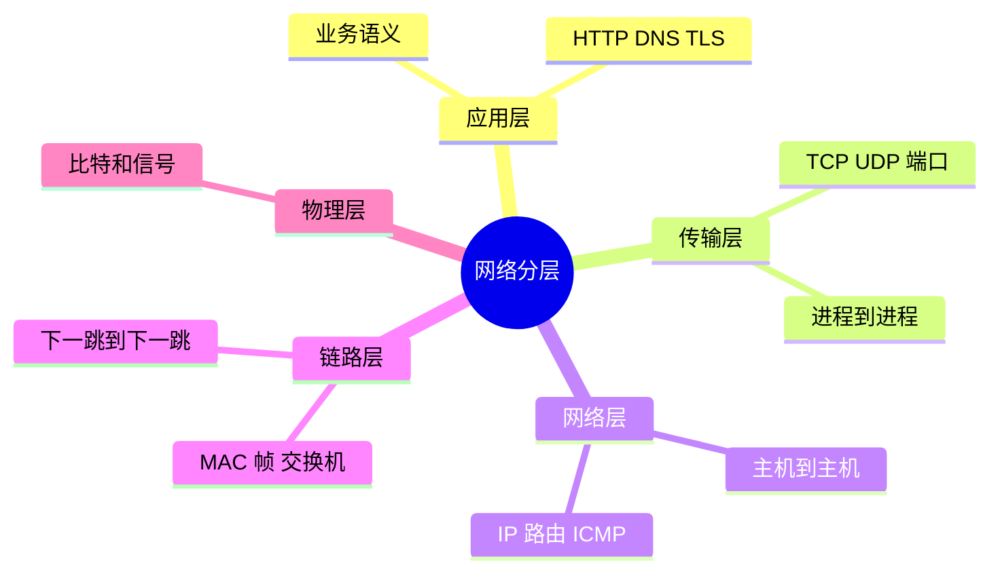
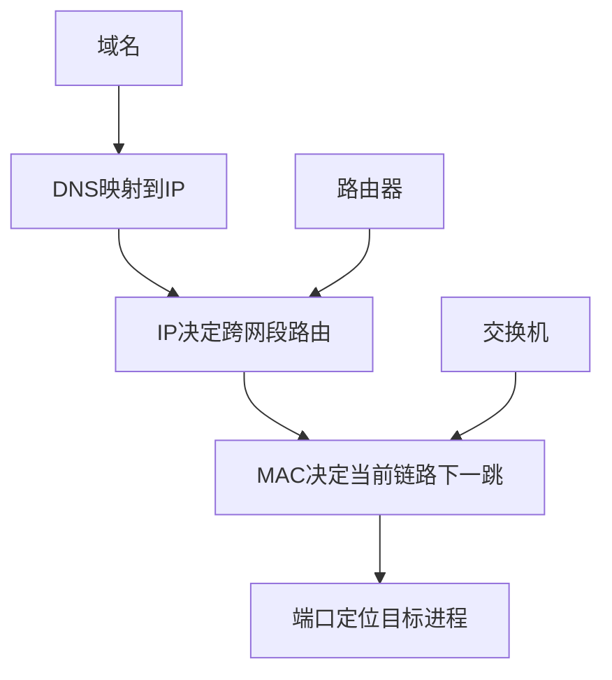

---
tags:
  - 计算机网络
  - OSI
  - TCPIP
  - 网络分层
aliases:
  - OSI七层模型
  - TCP/IP四层模型
created: 2026-04-27
updated: 2026-05-03
---

# 02-网络分层模型与封装解封装

> 返回：[[00-MOC]] ｜ 上一章：[[01-计算机网络总览与学习路线]] ｜ 下一章：[[03-物理层与链路层：以太网、MAC、交换机、VLAN]]

分层模型的意义不是考试分类，而是工程中的两个能力：

1. **设计能力**：每层只关心自己的职责，复杂系统可以组合。
2. **排障能力**：从底向上验证，快速缩小问题范围。

---

## 1. OSI 七层模型

```text
7 应用层 Application：HTTP、DNS、SMTP、SSH
6 表示层 Presentation：编码、压缩、加密语义
5 会话层 Session：会话建立、保持、恢复
4 传输层 Transport：TCP、UDP、QUIC 的传输语义
3 网络层 Network：IP、ICMP、路由
2 数据链路层 Data Link：Ethernet、Wi-Fi、MAC、VLAN
1 物理层 Physical：电信号、光信号、无线电、线缆
```

OSI 更像教学模型。真实互联网工程中更常用 TCP/IP 模型。

---

## 2. TCP/IP 四层模型

```text
应用层：HTTP / DNS / SMTP / SSH / TLS 上层语义
传输层：TCP / UDP / QUIC
网络层：IP / ICMP / 路由
网络接口层：Ethernet / Wi-Fi / ARP / 物理介质
```

二者大致映射：

| OSI | TCP/IP | 常见协议/设备 |
|---|---|---|
| 应用/表示/会话 | 应用层 | HTTP、DNS、TLS、SSH、Nginx |
| 传输层 | 传输层 | TCP、UDP、端口、socket |
| 网络层 | 网络层 | IP、ICMP、路由器 |
| 数据链路/物理 | 网络接口层 | 以太网、Wi-Fi、交换机、网卡 |

---

## 3. 每层的核心问题

### 3.1 物理层：比特怎么传出去

物理层处理：

- 电压、光脉冲、无线电波
- 频率、调制、编码
- 网线、光纤、无线信道

它不理解 IP，也不理解 HTTP，只负责把 0 和 1 变成信号。

### 3.2 链路层：同一链路内怎么发帧

链路层处理：

- 帧格式
- MAC 地址
- 局域网转发
- 错误检测
- VLAN 隔离

它解决“同一个局域网里下一跳是谁”。

### 3.3 网络层：跨网络怎么寻址和转发

网络层处理：

- IP 地址
- 子网划分
- 路由表
- 路由器转发
- ICMP 错误与诊断

它解决“目标在哪个网络，下一跳走哪里”。

### 3.4 传输层：进程之间怎么通信

传输层处理：

- 端口
- 连接
- 可靠性
- 流量控制
- 拥塞控制

它解决“同一台机器上的哪个进程在通信”。

### 3.5 应用层：数据有什么业务含义

应用层处理：

- 请求/响应语义
- 状态码
- 资源路径
- 认证授权
- 序列化格式

HTTP 的 `GET /users/1` 属于应用层语义，下面的 TCP/IP 不关心它代表什么。

---

## 4. 封装与解封装

应用要发送一段数据：

```text
应用数据
  ↓ 加上传输层头部
TCP/UDP 段
  ↓ 加上 IP 头部
IP 数据包
  ↓ 加上以太网头部和尾部
以太网帧
  ↓ 转换为物理信号
比特流
```

接收方反过来：

```text
物理信号 → 帧 → IP 包 → TCP/UDP 段 → 应用数据
```

这就是封装与解封装。

---

## 5. PDU：每层数据单元

| 层   | 常见 PDU 名称          | 示例                       |
| --- | ------------------ | ------------------------ |
| 应用层 | Message / Data     | HTTP 请求                  |
| 传输层 | Segment / Datagram | TCP Segment、UDP Datagram |
| 网络层 | Packet / Datagram  | IP Packet                |
| 链路层 | Frame              | Ethernet Frame           |
| 物理层 | Bits               | 电信号/光信号                  |

面试中如果问“包、帧、段有什么区别”，核心就是它们属于不同层。

---

## 6. 地址也分层

| 地址     | 所属层 | 作用域     | 典型问题      |
| ------ | --- | ------- | --------- |
| MAC 地址 | 链路层 | 局域网内下一跳 | 这个帧发给哪个网卡 |
| IP 地址  | 网络层 | 跨网络寻址   | 目标主机在哪个网络 |
| 端口号    | 传输层 | 主机内进程   | 交给哪个应用进程  |
| 域名     | 应用层 | 人类可读名称  | 这个服务叫什么   |
|        |     |         |           |

一次访问里四者会同时出现：

```text
域名 example.com
  ↓ DNS
IP 93.184.216.34
  ↓ 路由选择下一跳
网关 IP 192.168.1.1
  ↓ ARP
网关 MAC aa:bb:cc:dd:ee:ff
  ↓ TCP
目标端口 443
```

---

## 7. 设备也分层

| 设备           | 主要工作层次      | 说明                         |
| ------------ | ----------- | -------------------------- |
| 集线器 Hub      | 物理层         | 几乎只转发信号，现代网络少见             |
| 交换机 Switch   | 链路层         | 根据 MAC 地址转发帧               |
| 路由器 Router   | 网络层         | 根据 IP 路由表转发包               |
| 防火墙 Firewall | 网络层/传输层/应用层 | 按规则过滤流量                    |
| 负载均衡器 LB     | 传输层或应用层     | L4 看 IP/端口，L7 看 HTTP 等应用信息 |
| 网关 Gateway   | 泛称          | 连接不同网络或协议边界的设备             |

不要把“路由器”和“家用 Wi-Fi 盒子”混为一谈。家用设备通常同时承担交换机、无线 AP、路由器、NAT、防火墙、DHCP 等多个角色。

---

## 8. 分层不等于完全隔离

分层是抽象，不是绝对墙。真实系统会跨层优化：

- TLS 在应用层与传输层之间，但经常被视作安全层。
- QUIC 基于 UDP，却在用户态实现了类似 TCP 的可靠传输和拥塞控制。
- 负载均衡器可以在四层或七层工作。
- CDN 同时涉及 DNS、HTTP、TLS、路由、缓存策略。

学习时先用分层理解，再接受真实工程中的跨层设计。

---

## 9. 排障中的分层思维

假设访问 `https://example.com` 失败：

```bash
ping 8.8.8.8          # 网络层基本连通性
ping example.com      # DNS + 网络层
traceroute example.com# 路径定位
nc -vz example.com 443# 传输层端口连通性
curl -v https://example.com # TLS + HTTP
```

如果：

- `ping 8.8.8.8` 不通：优先查本机网络、网关、路由。
- `ping 8.8.8.8` 通但 `ping example.com` 不通：查 DNS。
- `ping` 通但 `nc 443` 不通：查端口、防火墙、服务监听。
- `nc` 通但 `curl` TLS 报错：查证书、SNI、TLS 版本。
- TLS 成功但 HTTP 5xx：查应用、反向代理、后端。

---

## 10. 本章小结

- OSI 是教学分类，TCP/IP 是工程主线。
- 封装让上层不用关心下层细节，解封装让接收方逐层还原数据。
- MAC、IP、端口、域名分别解决不同层次的问题。
- 排障时按层次验证，比凭直觉猜测可靠。

<!-- CN-DEEP-EXPANSION:START -->
## 深入展开：分层到底在“分”什么

分层不是为了背“第几层叫什么”，而是为了回答三个问题：

1. **这一层接收什么？**
2. **这一层添加什么控制信息？**
3. **这一层把结果交给谁？**

以发送一个 HTTP 请求为例。应用层生成：

```http
GET /index.html HTTP/1.1
Host: example.com
```

应用层并不知道这个请求会走 Wi-Fi 还是网线，也不知道中间有多少路由器。它只把字节交给传输层。

传输层 TCP 会加上：

```text
源端口：52341
目的端口：443
序列号：1000
确认号：...
窗口大小：...
标志位：ACK/PSH...
```

这些信息解决的是“两个进程之间如何可靠、有序地传字节”。TCP 也不关心域名是什么，不关心网页内容是什么。

网络层 IP 再加：

```text
源 IP：192.168.1.10
目的 IP：93.184.216.34
TTL：64
协议号：6（TCP）
```

这些信息解决的是“跨网络把包送到哪台主机”。

链路层以太网再加：

```text
源 MAC：本机网卡 MAC
目的 MAC：下一跳 MAC，通常是网关
EtherType：IPv4
FCS：校验
```

这些信息只解决“当前这一段链路交给谁”。

### 为什么路由器会换 MAC，但不换 IP

这点很重要。数据从你电脑到服务器可能经过很多路由器。每经过一个路由器：

```text
旧以太网帧被拆掉
IP 包被检查并转发
重新封装新的以太网帧
```

所以：

- 源 MAC / 目的 MAC 每一跳都会变。
- 目的 IP 通常一直是最终服务器 IP。
- TTL 每经过一跳减 1。
- 如果经过 NAT，源 IP/端口可能会变。

这解释了为什么跨网访问时，本机发出的帧目的 MAC 是网关，而不是远端服务器。

### “这一层坏了”是什么意思

分层排障时，你不是在机械套模型，而是在定位失败点：

| 失败现象 | 更可能的层次 | 例子 |
|---|---|---|
| 网卡没连接 | 物理/链路层 | 网线断、Wi-Fi 掉线 |
| ARP 没响应 | 链路层 | 网关不在同一 VLAN、IP 冲突 |
| ping 公网 IP 不通 | 网络层 | 路由、网关、运营商问题 |
| 域名解析失败 | 应用层 DNS | DNS 配置错、内网域名没走公司 DNS |
| TCP 超时 | 传输层/网络策略 | 防火墙丢包、服务不可达 |
| TLS 证书错误 | 安全层 | 证书过期、SNI 错 |
| HTTP 502 | 应用/代理层 | 网关无法访问上游 |

### 分层模型的一个实用记忆法

```text
人要名字：域名
机器要地址：IP
局域网要下一跳：MAC
进程要入口：端口
应用要语义：HTTP 方法、路径、状态码
安全要信任：TLS 证书链
```

当你能把每个名词放到这张图里，网络知识就不再是散的。
<!-- CN-DEEP-EXPANSION:END -->

## 思维导图

> 记忆建议：分层不是背名字，而是记住“每层只解决相邻边界内的问题”。

### 1. TCP/IP 分层职责



### 2. 封装与解封装


### 3. 地址与设备分层


