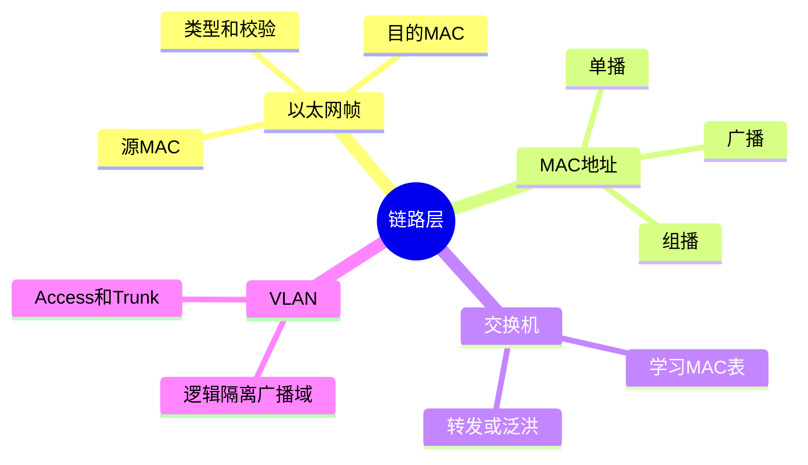
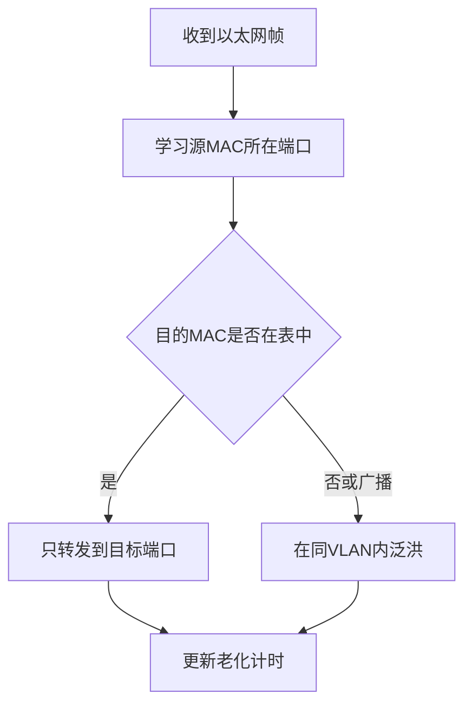
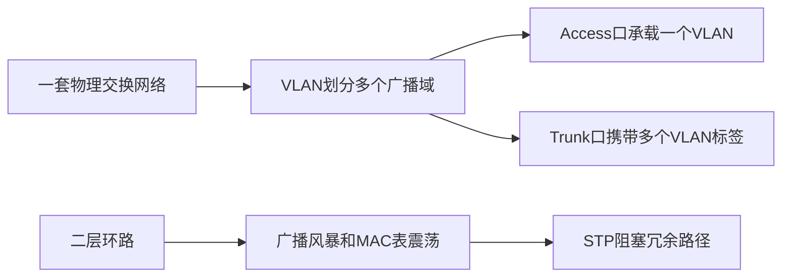

---
tags:
  - 计算机网络
  - 链路层
  - 以太网
  - VLAN
aliases:
  - 链路层教程
  - 以太网与交换机
created: 2026-04-27
updated: 2026-05-03
---

# 03-物理层与链路层：以太网、MAC、交换机、VLAN

> 返回：[[00-MOC]] ｜ 上一章：[[02-网络分层模型与封装解封装]] ｜ 下一章：[[04-网络层：IP、子网划分、ARP、ICMP、路由]]

链路层解决的问题是：

> 在同一条链路或同一个局域网中，如何把一帧数据交给正确的下一跳。

它不负责跨越整个互联网，只负责“下一段路”。

---

## 1. 物理层：信号的世界

物理层关心的是比特如何在介质上传输：

- 双绞线：常见以太网网线
- 光纤：长距离、高带宽、抗干扰
- 无线电：Wi-Fi、蜂窝网络
- 编码调制：把 0/1 映射为可传输信号

常见工程现象：

- 网线质量差导致丢包或协商到低速率
- 光模块不匹配导致链路不起
- Wi-Fi 信号强但干扰大，吞吐仍然低
- 速率、双工模式不匹配导致大量错误帧

物理层问题通常先看：链路灯、网卡状态、协商速率、错误计数。

---

## 2. 以太网帧

以太网在链路层传输“帧”。简化结构：

```text
目的 MAC | 源 MAC | 类型 EtherType | 载荷 Payload | FCS 校验
```

关键字段：

- 目的 MAC：这一帧交给谁
- 源 MAC：这一帧从谁来
- EtherType：上层载荷类型，例如 IPv4、IPv6、ARP
- FCS：帧校验序列，用于检测传输错误

注意：MAC 地址只保证局域网或下一跳意义，不是互联网全局路由依据。

---

## 3. MAC 地址

MAC 地址通常写成：

```text
aa:bb:cc:dd:ee:ff
```

它是链路层地址，一般烧录在网卡中，也可以被软件修改。

### 3.1 单播、广播、组播

| 类型 | 目的 MAC 示例 | 含义 |
|---|---|---|
| 单播 | 某个具体 MAC | 发给一台设备 |
| 广播 | ff:ff:ff:ff:ff:ff | 发给局域网内所有设备 |
| 组播 | 特定组播 MAC | 发给一组订阅者 |

ARP 请求常用广播，因为发送者还不知道目标 IP 对应的 MAC。

---

## 4. 交换机如何转发

交换机维护一张 MAC 地址表：

```text
MAC 地址 → 交换机端口
```

学习过程：

1. 收到帧后，记录“源 MAC 从哪个端口来”。
2. 查目的 MAC：
   - 如果知道端口：只从目标端口转发。
   - 如果不知道：泛洪到除入端口外的其他端口。
3. 表项会老化，过期后重新学习。

这就是交换机比集线器高效的地方：它不会无脑把所有数据发给所有端口。

---

## 5. 广播域与冲突域

### 5.1 冲突域

早期共享介质以太网中，多台设备同时发送会冲突。交换机每个端口通常是独立冲突域，现代全双工网络基本不用关心冲突。

### 5.2 广播域

广播帧能到达的范围叫广播域。

- 同一个 VLAN 通常是一个广播域。
- 路由器默认隔离广播域。
- 广播域太大会产生广播风暴风险。

---

## 6. ARP：IP 到 MAC 的桥梁

ARP 处在网络层与链路层的交界处，解决：

> 已知下一跳 IP，如何找到它的 MAC？

流程：

```text
主机 A：谁是 192.168.1.1？请告诉 192.168.1.10
网关：192.168.1.1 在我这里，我的 MAC 是 aa:bb:cc:dd:ee:ff
主机 A：把结果放入 ARP 缓存
```

查看 ARP 缓存：

```bash
arp -a
ip neigh
```

ARP 常见问题：

- ARP 缓存过期导致首次访问稍慢
- IP 冲突导致 ARP 结果混乱
- ARP 欺骗导致流量被中间人劫持

---

## 7. VLAN：在一套物理网络上划分多个逻辑网络

VLAN 用于隔离广播域。

```text
物理交换机
├── VLAN 10：办公网
├── VLAN 20：服务器网
└── VLAN 30：访客网
```

同一台交换机上的不同 VLAN，默认不能直接二层通信。如果要互通，需要三层路由或三层交换。

### 7.1 Access 口与 Trunk 口

| 端口类型 | 用途 | 特点 |
|---|---|---|
| Access | 连接普通终端 | 帧通常不带 VLAN Tag |
| Trunk | 连接交换机/路由器/虚拟化主机 | 可承载多个 VLAN，帧带 802.1Q Tag |

### 7.2 802.1Q Tag

VLAN 标签插入在以太网帧中，用于标记这帧属于哪个 VLAN。

---

## 8. STP：防止二层环路

交换机之间如果形成环路，广播帧可能无限循环，造成广播风暴。

STP（生成树协议）通过阻塞部分端口，让二层拓扑变成无环树形结构。

简化理解：

```text
物理上可以有冗余链路
逻辑上只放行一棵无环树
故障时重新收敛
```

---

## 9. 链路层排障思路

常用命令：

```bash
ip link
ifconfig
arp -a
ip neigh
sudo tcpdump -e -n arp
```

检查顺序：

1. 网卡是否 up？
2. 是否有链路速率？
3. 是否能看到 ARP 请求与响应？
4. 是否存在 IP 冲突？
5. 是否接入了正确 VLAN？
6. 交换机 MAC 表是否学习到正确端口？

---

## 10. 本章小结

- 链路层处理同一局域网内的帧传输。
- MAC 地址用于下一跳交付，IP 地址用于跨网络寻址。
- 交换机通过学习源 MAC 构建转发表。
- VLAN 用逻辑方式隔离广播域。
- ARP 是理解局域网通信的关键协议。

<!-- CN-DEEP-EXPANSION:START -->
## 深入展开：链路层只关心“下一跳”，不是“最终目的地”

链路层最容易被忽略，因为日常开发很少直接操作 MAC 地址。但很多网络问题，比如 IP 冲突、ARP 欺骗、VLAN 配错、交换机环路，都发生在这一层。

### 1. 先理解“同一个局域网”

如果两台机器在同一个二层网络里，它们可以通过广播找到彼此。例如 A 想找 B 的 MAC：

```text
A 广播：谁是 192.168.1.20？
B 单播回答：我是 192.168.1.20，我的 MAC 是 bb:bb:bb:bb:bb:bb
```

这个广播不会跨过路由器。路由器默认隔离广播域。所以 ARP 的影响范围通常是同一个 VLAN/广播域。

### 2. 交换机不是“群发器”

交换机刚启动时不知道任何 MAC 在哪个端口。它靠学习源 MAC 建表：

```text
收到端口 1 的帧，源 MAC = AA
于是记录：AA 在端口 1
```

下一次如果有帧发给 AA，交换机只从端口 1 转发。如果目的 MAC 不在表里，交换机会泛洪，这叫未知单播泛洪。

### 3. VLAN 是“逻辑切网”

同一台物理交换机可以被切成多个逻辑网络：

```text
VLAN 10：办公电脑
VLAN 20：服务器
VLAN 30：访客 Wi-Fi
```

不同 VLAN 默认二层不通。如果办公电脑要访问服务器 VLAN，需要三层路由或防火墙策略。

这就是为什么你插在同一个交换机上，不一定能访问旁边机器：可能不在同一个 VLAN。

### 4. Access 和 Trunk 用生活场景理解

- Access 口：像普通门，只允许一个部门的人进出。连接电脑、打印机、摄像头等终端。
- Trunk 口：像主干电梯，可以承载多个部门的人，但每个人带着部门标签。连接交换机、路由器、虚拟化主机。

802.1Q Tag 就是 VLAN 标签。普通终端通常看不到标签，交换机在 Access 口会加/去标签。

### 5. 二层环路为什么可怕

IP 包有 TTL，循环一段时间会被丢弃。但以太网帧没有类似 TTL。如果交换机之间形成环路，广播帧可能无限复制，造成广播风暴：

```text
广播帧 → 交换机 A → 交换机 B → 交换机 C → 又回到 A → 不断循环
```

结果是链路打满、MAC 表震荡、网络瘫痪。STP 的作用就是在物理冗余链路中阻塞部分端口，让逻辑拓扑无环。

### 6. 链路层问题的典型现象

| 现象 | 可能原因 |
|---|---|
| 同网段机器互 ping 不通 | VLAN 错、ARP 失败、防火墙、IP 冲突 |
| 网络时断时续 | MAC 漂移、环路、网线/光模块问题 |
| 首次访问慢一下 | ARP 缓存未命中，需要先 ARP |
| 整个局域网突然很慢 | 广播风暴、未知单播泛洪、环路 |
| 网关 MAC 变化 | VRRP 切换、ARP 欺骗、IP 冲突 |

### 7. 你应该会看的最小证据

```bash
arp -a                         # 看 IP 到 MAC 的缓存
sudo tcpdump -e -n arp          # 直接看 ARP 请求/响应
ip link                         # 看网卡状态
ifconfig                        # macOS/Linux 常用网卡信息
```

如果你能看懂 ARP 包，就已经能解释很多“明明 IP 配了但不通”的问题。
<!-- CN-DEEP-EXPANSION:END -->

## 思维导图

> 记忆建议：链路层只关心“这一跳怎么交付”，最终目的地由网络层继续处理。

### 1. 链路层核心对象



### 2. 交换机转发逻辑



### 3. VLAN 与二层环路


