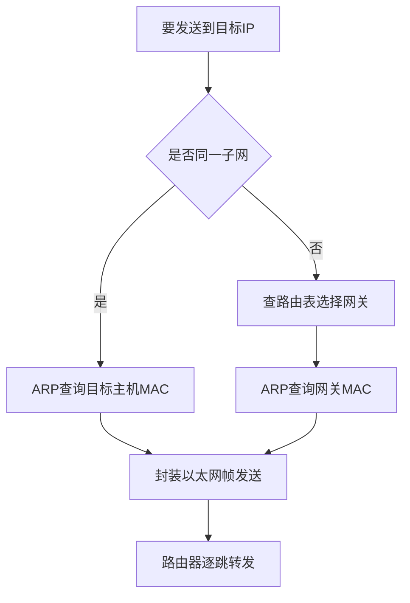
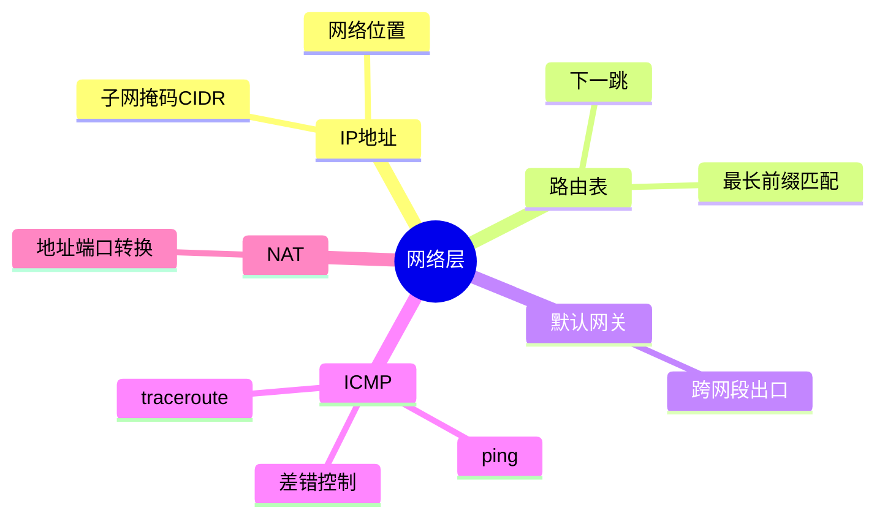

## 4. 路由表

路由表（Routing Table）记录了主机或路由器如何把数据包转发到目标网络。它并不是简单地保存“某个 IP 对应某个网卡”，而是把**目标地址所在的网段**映射到下一跳、出口接口以及相关优先级信息。

当主机准备发送一个数据包时，通常会按照下面的过程查找路由：

1. 从数据包的目标 IP 地址中取出目标地址。
2. 将目标地址与路由表中的各个目标网段进行匹配。
3. 如果有多条路由匹配，优先选择网络前缀最长、也就是最具体的那一条。
4. 确定下一跳和出口网卡。
5. 如果目标不在本地直连网段，则先通过 ARP（IPv4）解析下一跳网关的 MAC 地址，再封装二层帧并发送。
6. 如果没有任何更具体的路由，则尝试使用默认路由；如果默认路由也不存在，通常会返回“Network is unreachable”。

### 4.1 查看路由表

常用命令：

```bash
ip route
route -n
netstat -rn
```

在 Linux 中，`ip route` 是更推荐的查看方式；`route -n` 和 `netstat -rn` 属于较传统的命令，在一些系统或排查旧环境时仍然常见。

```bash
# 查看 IPv4 路由
ip -4 route

# 查看 IPv6 路由
ip -6 route

# 查看某个目标地址实际会使用哪条路由
ip route get 8.8.8.8
```

`ip route get` 特别适合排查“数据包究竟从哪块网卡发出、经过哪个下一跳”的问题。它展示的是内核针对一个具体目标地址做出的路由选择结果。

### 4.2 路由表条目的组成

典型条目：

```text
default via 192.168.1.1 dev en0
192.168.1.0/24 dev en0 scope link
```

含义：

- `default`：默认路由，等价于 `0.0.0.0/0`，可以匹配所有 IPv4 目标地址，但只有在没有更具体路由时才使用。
- `via 192.168.1.1`：下一跳网关是 `192.168.1.1`。对于不在本地直连网段中的目标，主机会把数据包交给这个网关。
- `dev en0`：通过 `en0` 网卡发送。
- `192.168.1.0/24`：目标网段为 `192.168.1.0` 到 `192.168.1.255`。其中网络地址通常是 `192.168.1.0`，广播地址通常是 `192.168.1.255`，可用主机地址通常为 `192.168.1.1` 到 `192.168.1.254`。
- `scope link`：目标在当前二层链路上，可以直接通过 ARP 解析目标主机的 MAC 地址，不需要经过三层网关。

上述两条路由可以理解为：

- 到 `192.168.1.0/24` 的流量直接走 `en0`，目标主机与本机处于同一个直连网段。
- 其他没有更具体匹配项的流量走 `192.168.1.1`，由该网关继续转发。

传统 `route -n` 的输出通常包含以下字段：

| 字段 | 含义 |
| --- | --- |
| Destination | 目标网络或目标主机 |
| Gateway | 下一跳网关；直连路由可能显示为 `0.0.0.0` 或 `*` |
| Genmask | 目标网络掩码 |
| Flags | 路由状态，例如 `U` 表示可用，`G` 表示经过网关，`H` 表示目标是单个主机 |
| Metric | 路由度量值，用于比较同等条件下的候选路由 |
| Iface | 出口网卡 |

### 4.3 最长前缀匹配

路由选择遵循最长前缀匹配（Longest Prefix Match）：匹配目标地址的网络前缀越长，路由越具体，优先级越高。

```text
10.1.2.3 匹配：
10.0.0.0/8
10.1.0.0/16
10.1.2.0/24  ← 最具体，优先使用
```

这里三条路由都能覆盖 `10.1.2.3`，但 `/24` 比 `/16` 更长，`/16` 又比 `/8` 更长，因此最终选择 `10.1.2.0/24`。

可以把它类比为查找地址：

- `10.0.0.0/8` 类似“所有 10 开头的地址”；
- `10.1.0.0/16` 类似“所有 10.1 开头的地址”；
- `10.1.2.0/24` 类似“所有 10.1.2 开头的地址”。

越具体的规则越优先，因此不能简单地认为“路由表中排在前面的条目一定优先”。

### 4.4 路由选择的优先级

一般可以按以下思路理解路由选择：

1. 先比较目标网络前缀长度，最长前缀优先。
2. 如果前缀长度相同，再比较路由的优先级、管理距离或协议相关属性。
3. 在同等条件下，比较 metric 等度量值，通常选择代价更小的路径。
4. 如果多条路径仍然等价，系统或路由器可能进行等价多路径（ECMP）转发。

例如：

```text
10.0.0.0/8       via 192.168.1.1  metric 100
10.0.0.0/8       via 192.168.1.2  metric 200
```

两条路由的前缀长度相同，因此通常会优先选择 metric 更小的第一条路由。需要注意，不同操作系统和路由协议对 `metric`、`priority`、管理距离等字段的具体含义可能不同，排查时应结合实际系统的输出解释。

### 4.5 直连路由、静态路由和默认路由

#### 直连路由

网卡配置了 IP 地址和子网掩码后，系统通常会自动生成对应的直连路由。例如：

```text
192.168.1.0/24 dev en0 scope link
```

这表示本机认为 `192.168.1.0/24` 与自己处于同一个链路上。发送给该网段内其他主机的数据包不需要先交给网关，而是直接通过 ARP 找到目标主机的 MAC 地址。

#### 静态路由

管理员手动配置的路由称为静态路由。例如：

```bash
ip route add 10.10.0.0/16 via 192.168.1.254 dev en0
```

它表示：访问 `10.10.0.0/16` 的数据包交给 `192.168.1.254`，并通过 `en0` 发送。静态路由配置简单、路径明确，但网络拓扑变化后通常需要人工维护。

#### 默认路由

默认路由是兜底规则：

```text
default via 192.168.1.1 dev en0
```

家庭网络中的默认网关通常是路由器。主机访问互联网时，目标地址一般不在本地直连网段中，因此会命中默认路由。默认路由并不意味着所有数据包都一定能到达目标，它只说明“本机应把未知目标交给哪个下一跳”。后续是否能继续转发，还取决于网关、上游路由和 NAT 等配置。

### 4.6 一次路由转发的完整过程

假设主机地址为 `192.168.1.10/24`，默认网关为 `192.168.1.1`，现在访问 `8.8.8.8`：

1. 主机查看路由表，发现 `8.8.8.8` 不属于 `192.168.1.0/24` 直连网段。
2. 主机匹配到默认路由，确定下一跳为 `192.168.1.1`，出口为 `en0`。
3. 主机通过 ARP 查询 `192.168.1.1` 的 MAC 地址。
4. 主机生成二层帧：目标 MAC 是网关 MAC，源 MAC 是本机 `en0` 的 MAC。
5. IP 数据包中的目标 IP 仍然是 `8.8.8.8`，不会被改成网关的 IP；二层帧的目标 MAC 才是网关的 MAC。
6. 网关收到数据包后，去掉原来的二层封装，再根据自己的路由表继续转发。
7. 数据包每经过一个路由器，通常都会重新封装二层帧，但源、目的 IP 通常仍保持端到端的目标关系；TTL 会在每一跳递减。

这也解释了“网关负责三层转发，ARP 负责在当前链路上找到下一跳 MAC”这两个概念之间的关系。

### 4.7 常见排查方法

```bash
# 查看接口地址和状态
ip addr

# 查看路由表
ip route

# 查看到指定地址的路由选择
ip route get 8.8.8.8

# 查看 ARP/邻居缓存
ip neigh

# 查看数据包经过的路由器
traceroute 8.8.8.8
# 或
tracepath 8.8.8.8
```

常见问题及判断思路：

- **只能访问同一局域网，不能访问外网**：重点检查默认路由是否存在、默认网关是否可达，以及网关是否继续向上游转发。
- **有路由但仍然不通**：检查下一跳是否可达、ARP 是否解析成功、防火墙是否丢弃数据包，以及返回方向是否存在路由。
- **访问某个网段走错出口**：检查是否存在更具体的路由，因为最长前缀匹配可能使它覆盖默认路由或较粗的网段路由。
- **路由表看起来正确但应用仍失败**：继续区分 DNS、TCP/UDP 端口、防火墙、MTU 和应用层协议问题；路由正确只代表转发路径选择正确，不代表服务一定可用。
- **出现 `Network is unreachable`**：通常表示本机找不到可用的匹配路由，尤其要检查目标网段路由和默认路由。
- **出现 `Host is unreachable`**：可能是下一跳或目标主机无法通过当前链路到达，也可能是本机或网关返回了不可达 ICMP。

### 4.8 面试总结

- 路由表描述的是“目标网段—下一跳—出口接口”的映射关系。
- 路由选择的核心原则是最长前缀匹配，而不是简单按照路由表显示顺序选择。
- 直连路由通常直接通过 ARP 获取目标主机 MAC；非直连流量通常通过 ARP 获取下一跳网关 MAC。
- 默认路由等价于 `0.0.0.0/0`，只有在没有更具体路由时才作为兜底规则。
- 路由器每一跳都会重新进行路由查找和二层封装，TTL 会逐跳递减。
- “有路由”只说明系统知道数据包往哪里发，不保证下一跳可达、返回路径正确或应用端口开放。 
```

IPv6 示例：

```text
2001:db8::1
```

IP 地址不是“机器永久身份”，而是“网络位置”。同一台机器换网络，IP 可以变化；同一台机器也可以有多个网卡、多个 IP。

---

## 2. IPv4 地址与子网

IPv4 是 32 位地址。子网前缀决定哪些位表示网络，哪些位表示主机。

```text
192.168.1.10/24
```

含义：

- 前 24 位是网络号：192.168.1.0
- 后 8 位是主机号
- 子网掩码：255.255.255.0
- 可用主机大致是 192.168.1.1 到 192.168.1.254

### 2.1 为什么需要子网

子网用于：

- 管理地址空间
- 隔离广播域
- 控制路由规模
- 划分安全边界

### 2.2 判断是否同网段

本机：

```text
IP: 192.168.1.10/24
```

目标：

```text
192.168.1.20 → 同网段，直接 ARP 目标主机
10.0.0.5 → 不同网段，发给默认网关
```

---

## 3. 默认网关

默认网关是当目标不在本地子网时，主机交给它转发的下一跳。

```text
目标 IP 不在本地网段
  ↓
查路由表
  ↓
命中默认路由 0.0.0.0/0
  ↓
发给默认网关
```

默认网关通常是本地路由器或三层交换机接口。

---

## 4. 路由表

路由表决定数据包下一跳。

查看路由表：

```bash
ip route
route -n
netstat -rn
```

典型条目：

```text
default via 192.168.1.1 dev en0
192.168.1.0/24 dev en0 scope link
```

含义：

- 到 192.168.1.0/24 的流量直接走 en0
- 其他流量走 192.168.1.1

### 4.1 最长前缀匹配

路由选择遵循最长前缀匹配：

```text
10.1.2.3 匹配：
10.0.0.0/8
10.1.0.0/16
10.1.2.0/24  ← 最具体，优先使用
```

---

## 5. IP 包结构重点

IPv4 头部包含：

- 源 IP
- 目的 IP
- TTL
- 协议号：TCP=6，UDP=17，ICMP=1
- 分片相关字段
- 头部校验和

### 5.1 TTL

TTL 每经过一个路由器减 1，变成 0 后丢弃，并可能返回 ICMP 超时。

作用：防止路由环路导致包无限转发。

`traceroute` 正是利用 TTL 逐步探测路径。

---

## 6. ICMP：网络层诊断与控制

ICMP 用于传递网络层错误和诊断信息。

常见用途：

- `ping`：Echo Request / Echo Reply
- `traceroute`：TTL 超时消息
- 目的不可达：网络、主机、端口不可达
- 路径 MTU 发现

注意：ICMP 被禁不代表服务一定不可达；有些网络会屏蔽 ping，但允许 TCP/HTTPS。

---

## 7. ARP 与网络层的关系

ARP 严格说在链路层和网络层之间，但理解 IP 通信必须理解它。

当主机准备发送 IP 包时，它需要知道下一跳 MAC：

- 目标同网段：ARP 目标 IP
- 目标不同网段：ARP 默认网关 IP

因此跨网访问时，以太网帧的目的 MAC 通常是网关 MAC，而 IP 包的目的 IP 仍然是最终服务器 IP。

```text
以太网帧：目的 MAC = 网关 MAC
IP 包：目的 IP = 远端服务器 IP
```

这是面试高频点。

---

## 8. NAT：地址转换

NAT 让多个内网地址共享一个或少数公网地址。

典型家用网络：

```text
电脑 192.168.1.10:52341
  ↓ NAT
公网 IP 203.0.113.5:40001
  ↓ Internet
服务器 93.184.216.34:443
```

NAT 设备维护映射表：

```text
内网 IP:端口 ↔ 公网 IP:端口
```

优点：

- 缓解 IPv4 地址不足
- 提供一定入站隔离

缺点：

- 破坏端到端连接模型
- P2P、VoIP、游戏联机需要穿透
- 排障复杂度增加

---

## 9. IPv6 简介

IPv6 地址 128 位，目标是提供更大的地址空间并简化部分网络机制。

特点：

- 地址空间巨大
- 无广播，使用组播和任播
- 邻居发现 NDP 替代 ARP
- 更强调端到端可达，但现实中仍常配合防火墙

不要把 IPv6 理解成“只是更长的 IPv4”。它在地址配置、邻居发现、报文结构上都有变化。

---

## 10. 网络层排障

常用命令：

```bash
ip addr
ip route
ping 8.8.8.8
ping example.com
traceroute example.com
mtr example.com
```

排查顺序：

1. 本机是否有正确 IP？
2. 子网掩码是否正确？
3. 默认网关是否存在？
4. 能否 ping 网关？
5. 能否 ping 公网 IP？
6. DNS 是否解析正确？
7. traceroute 卡在哪一跳？

---

## 11. 本章小结

- IP 负责跨网络寻址，MAC 负责下一跳交付。
- 子网决定目标是在本地还是需要走网关。
- 路由表通过最长前缀匹配选择下一跳。
- ICMP 是网络层诊断的重要工具。
- NAT 改写地址和端口，是现代 IPv4 网络的重要现实。

<!-- CN-DEEP-EXPANSION:START -->
## 深入展开：网络层的核心是“我该把包交给谁”

网络层不负责保证可靠，也不关心 HTTP 内容。它只解决一个问题：**目标 IP 在哪里，下一跳走哪里。**

### 1. IP 地址不是身份证，而是网络位置

很多初学者会把 IP 当成一台机器的固定身份。更准确地说，IP 是某个网络接口在某个网络中的位置。

同一台机器可以有多个 IP：

```text
Wi-Fi 网卡：192.168.1.10
Docker 网桥：172.17.0.1
VPN 网卡：10.8.0.5
本地回环：127.0.0.1
```

所以排障时要问：你访问的是哪个 IP？服务监听在哪个网卡？路由从哪个接口出去？

### 2. 子网判断决定“直接发”还是“交给网关”

假设本机：

```text
IP: 192.168.1.10/24
网关: 192.168.1.1
```

访问 `192.168.1.20`：同网段，本机直接 ARP `192.168.1.20`。

访问 `8.8.8.8`：不同网段，本机不会 ARP `8.8.8.8`，而是 ARP 网关 `192.168.1.1`。

这句话非常重要：

> 跨网段访问时，链路层目的 MAC 是网关 MAC；网络层目的 IP 仍是最终目标 IP。

### 3. 路由表不是只在路由器上有

你的电脑也有路由表。可以理解为本机出门指南：

```text
192.168.1.0/24 直接从 Wi-Fi 出去
10.8.0.0/24 走 VPN
其他所有地址走默认网关 192.168.1.1
```

真实输出可能类似：

```bash
ip route
# default via 192.168.1.1 dev wlan0
# 192.168.1.0/24 dev wlan0 scope link
# 10.8.0.0/24 dev tun0
```

访问一个目标前，可以用：

```bash
ip route get 8.8.8.8
```

看系统到底会从哪个接口、经哪个下一跳出去。

### 4. ICMP 不只是 ping

ICMP 常被误解为“ping 协议”。ping 只是 ICMP 的一种用法。ICMP 还用于：

- TTL 超时：traceroute 依赖它。
- 目的不可达：主机不可达、网络不可达、端口不可达。
- 路径 MTU 发现：告诉发送方包太大且不能分片。

很多网络管理员会禁 ICMP，但完全禁掉可能导致路径 MTU 发现失效，出现“小包通，大包卡”的问题。

### 5. NAT 后到底改了什么

普通路由只转发，不改源/目的 IP。NAT 会改写地址或端口。

家用 NAT 典型过程：

```text
内网请求：192.168.1.10:52341 → 93.184.216.34:443
NAT 后：203.0.113.5:40001 → 93.184.216.34:443
返回时：93.184.216.34:443 → 203.0.113.5:40001
NAT 查表还原：93.184.216.34:443 → 192.168.1.10:52341
```

如果 NAT 表丢了，返回包就不知道该交给哪台内网主机。

### 6. 网络层排障最小路径

```bash
ip addr                 # 我有没有正确 IP
ip route                # 我有没有正确路由和默认网关
ping 网关IP             # 到第一跳通不通
ping 8.8.8.8            # 公网 IP 通不通
traceroute 8.8.8.8      # 卡在哪一跳
```

如果 `ping 网关` 不通，优先查本地链路、VLAN、ARP。如果网关通但公网 IP 不通，查网关之后的路由、NAT、运营商或防火墙。
<!-- CN-DEEP-EXPANSION:END -->

## 思维导图

> 记忆建议：网络层的核心问题是“目标 IP 在哪边，我该把包交给哪个下一跳”。

### 1. 主机发包决策



### 2. 网络层关键概念



### 3. 网络层排障路径


