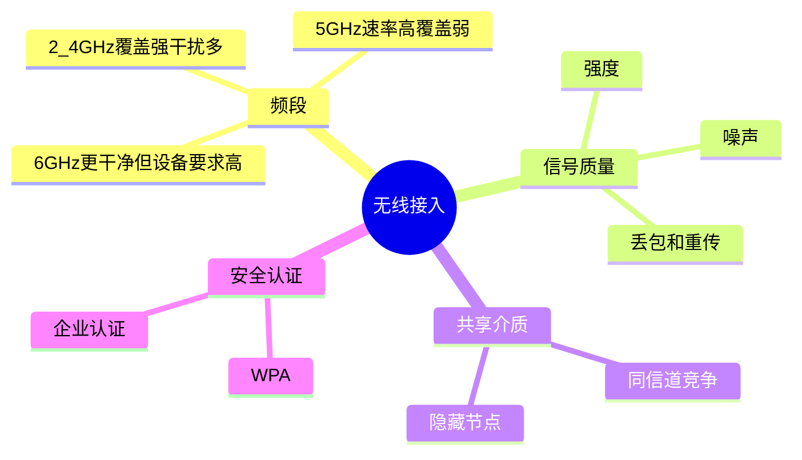
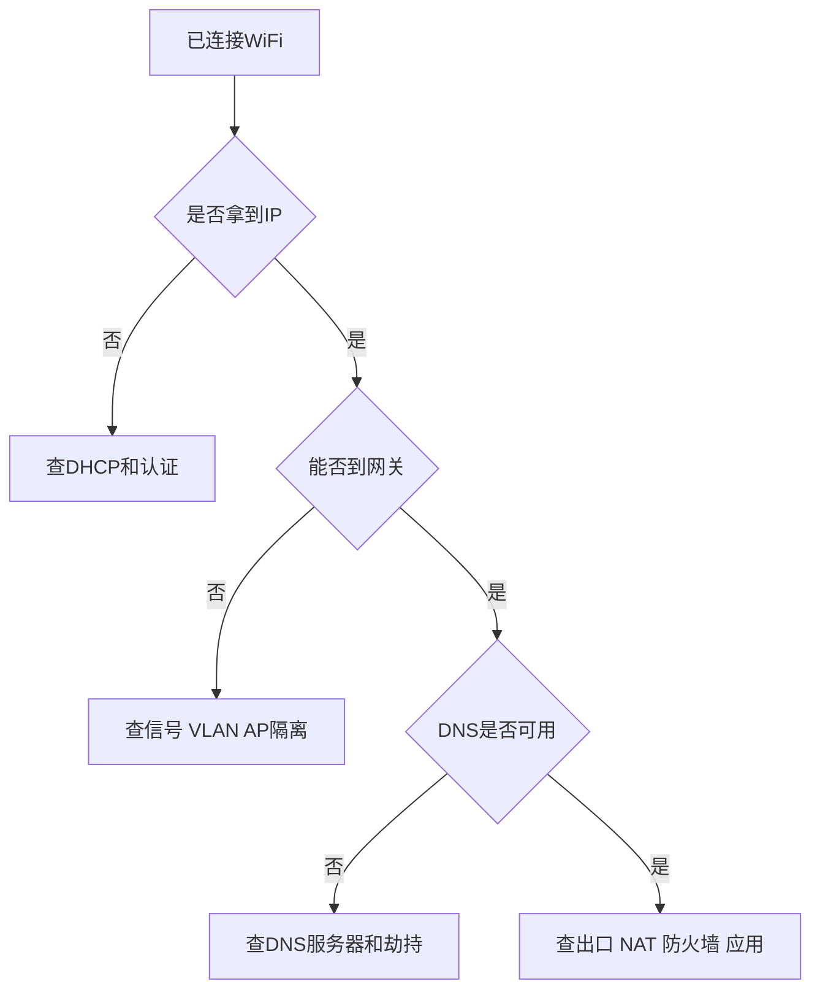

---
tags:
  - 计算机网络
  - WiFi
  - 移动网络
  - 接入网
aliases:
  - 无线网络基础
  - Wi-Fi与移动网络
created: 2026-04-27
updated: 2026-05-03
---

# 08-无线网络、移动网络与现代接入

> 返回：[[00-MOC]] ｜ 上一章：[[07-网络安全基础：TLS、证书、防火墙、NAT、VPN]] ｜ 下一章：[[09-网络性能与排障：ping、traceroute、抓包]]

无线网络和有线网络共享很多上层协议，但接入方式不同，性能问题也更复杂。

有线网络的主要问题常常是“线通不通、配置对不对”。无线网络还要面对：信号、干扰、漫游、频段、共享介质。

---

## 1. Wi-Fi 的基本组成

常见角色：

- STA：无线终端，比如手机、电脑
- AP：无线接入点
- SSID：无线网络名称
- BSSID：某个 AP 无线接口的 MAC
- 信道：无线通信使用的频率范围

家庭路由器通常把 AP、路由器、交换机、NAT、防火墙、DHCP 都集成在一起。

---

## 2. 2.4GHz、5GHz、6GHz

| 频段 | 优点 | 缺点 |
|---|---|---|
| 2.4GHz | 覆盖远、穿墙好 | 干扰多、可用信道少、速度低 |
| 5GHz | 速度高、干扰少 | 穿墙弱、覆盖稍小 |
| 6GHz | 频谱更宽、拥塞少 | 设备支持要求高、覆盖更弱 |

选择经验：

- 距离近、追求速度：优先 5GHz/6GHz
- 距离远、隔墙多：2.4GHz 可能更稳定
- 密集办公环境：关注信道规划，而不是只看信号强度

---

## 3. 无线为什么容易慢

### 3.1 共享介质

无线是共享空气介质，同一信道上的设备会竞争发送机会。

### 3.2 干扰

干扰来源：

- 邻居 Wi-Fi
- 蓝牙设备
- 微波炉
- 无线摄像头
- 过密 AP 部署

### 3.3 信号强不等于质量好

信号强度高，但如果噪声也高，信噪比仍然差。

更重要的指标包括：

- RSSI：信号强度
- SNR：信噪比
- 重传率
- 协商速率
- 丢包与抖动

---

## 4. Wi-Fi 安全

常见安全机制：

- WPA2-Personal
- WPA3-Personal
- 企业网中的 802.1X / RADIUS

风险：

- 弱密码可被暴力破解
- 开放 Wi-Fi 容易被监听
- 恶意 AP 可诱导连接
- 公共 Wi-Fi 应优先使用 HTTPS/VPN

---

## 5. 移动蜂窝网络简化理解

蜂窝网络把区域划分为多个小区，手机连接附近基站。

核心过程：

```text
手机接入基站
  ↓
运营商无线接入网
  ↓
运营商核心网
  ↓
NAT/策略/计费/认证
  ↓
互联网
```

移动网络特点：

- IP 可能频繁变化
- NAT 更常见
- 延迟和抖动更大
- 漫游和切换会影响连接
- 上行带宽通常弱于下行

---

## 6. 漫游与切换

设备从一个 AP 或基站移动到另一个覆盖区时，需要切换连接。

现象：

- 视频会议短暂卡顿
- TCP 连接延迟升高
- 游戏瞬间掉线
- VPN 重连

优化方向：

- 合理 AP 覆盖与功率
- 避免同频干扰
- 企业 Wi-Fi 使用更完善的漫游机制
- 应用层做好重连与断点恢复

---

## 7. 现代接入中的认证与分配

接入网络后，终端通常还需要：

1. 二层关联或链路建立
2. 认证
3. DHCP 获取 IP、网关、DNS
4. DNS 可用性验证
5. 可能的门户认证

很多“Wi-Fi 已连接但不能上网”问题，实际出在 DHCP、DNS 或门户认证。

---

## 8. 无线排障清单

检查顺序：

1. 是否连接正确 SSID？
2. 是否拿到 IP、网关、DNS？
3. 是否能 ping 网关？
4. 是否能 ping 公网 IP？
5. DNS 是否正常？
6. 信号强度和信噪比如何？
7. 是否在拥塞信道？
8. 是否被门户认证或 ACL 限制？

常用命令：

```bash
ip addr
ip route
ping 网关IP
dig example.com
```

macOS 可配合无线诊断工具查看信道、RSSI、噪声等信息。

---

## 9. 本章小结

- 无线上层仍跑 IP/TCP/HTTP，但链路质量更不稳定。
- Wi-Fi 性能受频段、信道、干扰、设备密度、漫游影响。
- 移动网络常见 NAT、抖动和切换问题。
- “已连接不等于可上网”，还要检查 DHCP、网关、DNS、认证。

<!-- CN-DEEP-EXPANSION:START -->
## 深入展开：无线网络难在“空气是共享的”

有线网络里，一根线通常比较可控。无线网络不一样，所有设备在空气中竞争同一段频谱，还会被墙、距离、邻居 Wi-Fi、蓝牙、微波炉影响。

### 1. 信号强不等于网络好

手机上 Wi-Fi 满格，只说明接收到 AP 的信号强。真正影响体验的还有：

- 噪声有多大。
- 同信道有多少设备在抢。
- AP 到上级网络是否拥塞。
- 终端发射功率是否足够。
- 丢包和重传是否严重。
- 是否频繁在 AP 之间漫游。

所以“满格但很慢”完全可能。

### 2. 2.4GHz 和 5GHz 的取舍

2.4GHz 像一条覆盖远但拥挤的老路：穿墙好，但信道少、干扰多。

5GHz 像一条更宽但覆盖短的新路：速度高、干扰相对少，但穿墙差。

6GHz 更宽、更干净，但需要新设备支持，覆盖更弱。

实际选择：

- 离 AP 近：优先 5GHz/6GHz。
- 隔墙远：2.4GHz 可能更稳。
- 办公室密集部署：信道规划比单纯调大功率更重要。

### 3. Wi-Fi 已连接但不能上网的完整流程

连接 Wi-Fi 只是第一步。之后还要：

```text
关联 AP
  ↓
认证/加密协商
  ↓
DHCP 获取 IP、网关、DNS
  ↓
可能进行门户认证
  ↓
能访问网关
  ↓
能访问公网 IP
  ↓
DNS 能解析
  ↓
应用能访问
```

很多“Wi-Fi 问题”其实是 DHCP、DNS、门户认证、代理配置问题。

### 4. 移动网络为什么更容易抖动

蜂窝网络中，手机会在基站之间切换，运营商核心网常有 NAT、策略控制和计费系统。移动时可能发生：

- IP 变化。
- RTT 突然升高。
- 丢包增加。
- VPN 重连。
- TCP 连接断开。

这就是为什么实时音视频和游戏要做重连、缓冲、预测和弱网优化。

### 5. 无线排障不要只重启路由器

更系统的排查：

```text
1. 是否连接正确 SSID？
2. 是否拿到 IP、网关、DNS？
3. ping 网关是否稳定？
4. ping 公网 IP 是否稳定？
5. DNS 是否解析正常？
6. 是否只有某个房间/某个频段慢？
7. 是否同信道 AP 过多？
8. 是否有门户认证、代理或家长控制？
```

如果只有无线慢、有线正常，优先查信号、干扰、信道、AP 负载。如果无线和有线都慢，优先查出口、DNS、运营商或上游服务。
<!-- CN-DEEP-EXPANSION:END -->

## 思维导图

> 记忆建议：无线慢的本质常常不是“信号弱”，而是共享介质、干扰、漫游和接入认证共同影响。

### 1. 无线网络关键变量



### 2. Wi-Fi 已连接但不能上网



### 3. 移动网络抖动来源


