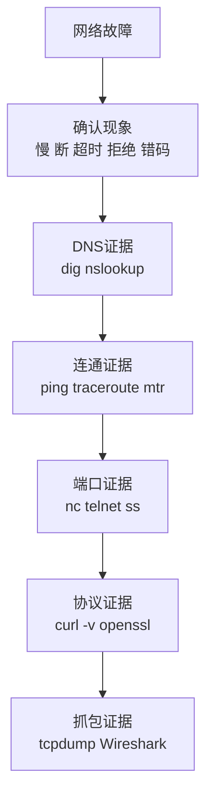
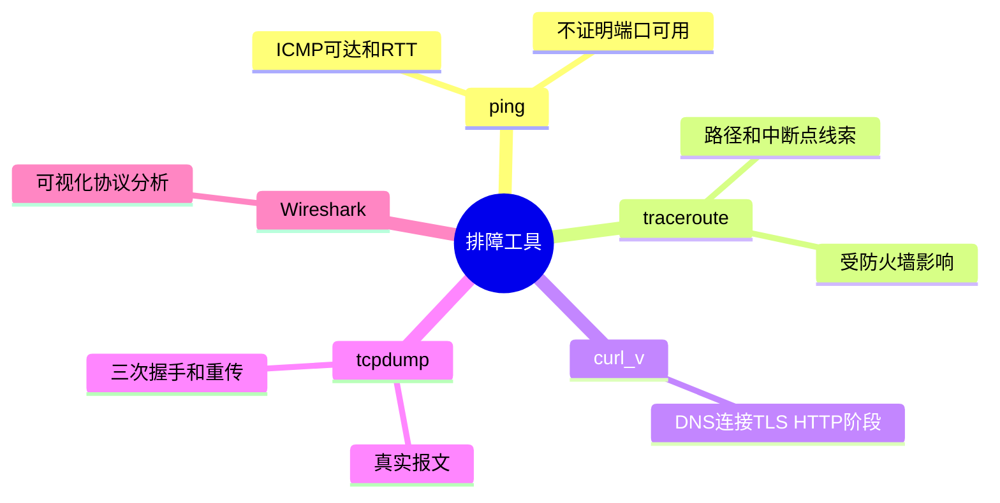
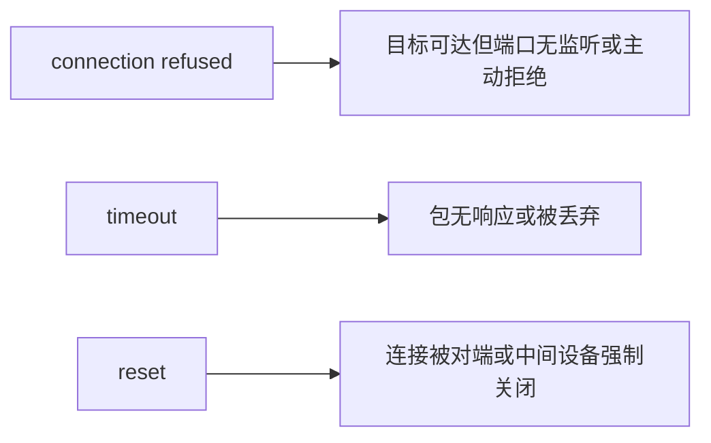

---
tags:
  - 计算机网络
  - 网络排障
  - 抓包
  - 性能
aliases:
  - 网络排障教程
  - ping traceroute tcpdump Wireshark
created: 2026-04-27
updated: 2026-05-03
---

# 09-网络性能与排障：ping、traceroute、抓包

> 返回：[[00-MOC]] ｜ 上一章：[[08-无线网络、移动网络与现代接入]] ｜ 下一章：[[10-常见面试题与核心问答]]

排障的关键不是工具多，而是顺序正确。

> 先判断哪一层失败，再选择对应工具。

---

## 1. 常见性能指标

| 指标 | 含义 | 常见影响 |
|---|---|---|
| 延迟 RTT | 往返时间 | 页面响应、交互体验 |
| 带宽 | 理论传输能力 | 大文件下载上限 |
| 吞吐 | 实际传输速度 | 受协议、拥塞、窗口影响 |
| 丢包率 | 包丢失比例 | 重传、卡顿、音视频破碎 |
| 抖动 | 延迟波动 | 实时音视频、游戏 |
| 连接建立时间 | DNS/TCP/TLS 时间 | 首屏速度 |

---

## 2. 分层排障总流程

```text
物理/链路：网卡、Wi-Fi、ARP、VLAN
  ↓
网络层：IP、路由、ICMP
  ↓
传输层：端口、TCP 握手、重传、RST
  ↓
安全层：TLS、证书、防火墙、代理
  ↓
应用层：HTTP 状态码、业务日志、上游依赖
```

不要跳过底层直接看应用日志，也不要在 DNS 错误时反复调代码。

---

## 3. ping

`ping` 基于 ICMP Echo，用于验证基本连通性和 RTT。

```bash
ping 8.8.8.8
ping example.com
```

可以判断：

- 是否有基本 IP 连通性
- 延迟是否异常
- 是否有明显丢包
- 域名是否能解析

不能判断：

- TCP 端口是否开放
- HTTP 服务是否正常
- TLS 证书是否正确
- 业务逻辑是否可用

---

## 4. traceroute / tracepath / mtr

`traceroute` 利用 TTL 逐跳探测路径。

```bash
traceroute example.com
mtr example.com
```

注意：

- 中间某跳不回 ICMP，不代表后续不可达。
- 某跳延迟高，但后续恢复正常，可能只是该路由器限速响应 ICMP。
- 真正要关注的是从某一跳开始持续丢包或延迟升高。

---

## 5. DNS 工具

```bash
dig example.com
dig A example.com
dig AAAA example.com
nslookup example.com
```

关注：

- 解析到哪个 IP
- 是否返回 CNAME
- TTL 是多少
- 使用了哪个 DNS 服务器
- 内网和外网解析结果是否不同

DNS 问题常见表现：

- 只有域名不通，IP 可通
- 某些地区解析到错误 IP
- 切换网络后缓存未过期
- 公司内网域名只在公司 DNS 可解析

---

## 6. 端口连通性

```bash
nc -vz example.com 443
telnet example.com 80
```

结果解释：

- connected：TCP 能建立
- timeout：包可能被丢弃、路由不通、防火墙静默拦截
- refused：目标可达，但端口未监听或主动拒绝

---

## 7. curl -v

`curl -v` 是应用层排障利器：

```bash
curl -v https://example.com
```

可以看到：

- DNS 解析
- 连接目标 IP
- TCP 连接
- TLS 握手
- ALPN 协商
- HTTP 请求头
- HTTP 响应头
- 状态码

常用：

```bash
curl -I https://example.com
curl --resolve example.com:443:1.2.3.4 https://example.com
curl --connect-timeout 3 -v https://example.com
```

---

## 8. tcpdump

抓包示例：

```bash
sudo tcpdump -n host example.com
sudo tcpdump -n 'tcp port 443'
sudo tcpdump -i any -nn 'icmp or arp'
sudo tcpdump -w capture.pcap 'host 1.2.3.4'
```

参数：

- `-n`：不做 DNS 反查
- `-nn`：端口也不转服务名
- `-i`：指定网卡
- `-w`：写入 pcap 文件

抓包时先缩小过滤条件，否则很快淹没在噪声里。

---

## 9. Wireshark 观察点

常看过滤器：

```text
arp
icmp
dns
tcp
tcp.port == 443
http
tls
ip.addr == 1.2.3.4
```

TCP 问题关注：

- SYN 是否发出
- SYN+ACK 是否返回
- 是否出现 RST
- 是否大量 Retransmission
- 是否 Zero Window
- RTT 是否异常

HTTP/TLS 关注：

- SNI
- ALPN
- 证书链
- HTTP 状态码
- 重定向 Location

---

## 10. 常见故障定位案例

### 10.1 能 ping IP，不能访问域名

优先查 DNS：

```bash
dig example.com
cat /etc/resolv.conf
```

### 10.2 能 ping 域名，打不开 HTTPS

查端口与 TLS：

```bash
nc -vz example.com 443
curl -v https://example.com
```

### 10.3 端口通，但 HTTP 502

说明网络和端口基本可达，问题可能在：

- 反向代理到上游失败
- 上游服务挂了
- 负载均衡健康检查失败
- 应用异常返回

### 10.4 访问很慢

拆分耗时：

- DNS 解析慢
- TCP 连接慢
- TLS 握手慢
- 首字节时间慢
- 下载慢

可以用：

```bash
curl -w '
namelookup:%{time_namelookup}
connect:%{time_connect}
appconnect:%{time_appconnect}
starttransfer:%{time_starttransfer}
total:%{time_total}
' -o /dev/null -s https://example.com
```

---

## 11. 本章小结

- 排障要先分层，再选工具。
- ping 只能证明 ICMP 层面的基本连通性。
- traceroute 用于看路径，但要谨慎解读中间跳。
- curl -v 能串起 DNS、TCP、TLS、HTTP。
- tcpdump/Wireshark 是最终证据来源。

<!-- CN-DEEP-EXPANSION:START -->
## 深入展开：排障不是“跑命令”，而是构造证据链

很多人会用 `ping`、`curl`，但排障还是乱，是因为没有把命令结果放进分层模型里。每个命令只能证明一小段事实。

### 1. 每个工具能证明什么，不能证明什么

| 工具 | 能证明 | 不能证明 |
|---|---|---|
| ping | ICMP 层面可达、RTT、粗略丢包 | TCP 端口、TLS、HTTP、业务成功 |
| traceroute | 路径大致经过哪些跳 | 每跳真实转发性能、应用可用性 |
| dig | DNS 解析结果 | 目标端口是否可用 |
| nc | TCP 端口能否建立连接 | TLS/HTTP 是否正常 |
| curl -v | DNS、TCP、TLS、HTTP 细节 | 服务端内部依赖是否健康 |
| tcpdump | 包级证据 | 加密后的 HTTP 明文内容 |

所以排障时要说：“这个命令证明了什么”，而不是“我试过了”。

### 2. 访问慢要拆时间

“慢”是模糊描述，必须拆成阶段：

```text
DNS 慢：域名解析耗时高
TCP 慢：三次握手耗时高
TLS 慢：证书/握手耗时高
TTFB 慢：服务器或上游处理慢
下载慢：带宽、丢包、响应体太大
渲染慢：前端 JS/CSS/图片问题
```

用 curl 拆：

```bash
curl -w '\nDNS:%{time_namelookup}\nTCP:%{time_connect}\nTLS:%{time_appconnect}\nTTFB:%{time_starttransfer}\nTotal:%{time_total}\n' -o /dev/null -s https://example.com
```

### 3. timeout、refused、reset 要分清

| 现象 | 抓包表现 | 常见原因 |
|---|---|---|
| timeout | SYN 重传，无回应 | 防火墙丢包、路由不通、主机不可达 |
| refused | SYN 后收到 RST | 端口未监听、服务主动拒绝 |
| reset | 连接中收到 RST | 应用异常关闭、中间设备阻断 |
| TLS error | TCP 成功，TLS 失败 | 证书、SNI、协议版本 |

这几个词是线上排障高频关键词。

### 4. 抓包时先写假设

不要一上来抓全量包。先写：

```text
假设：客户端 SYN 发出后没有收到 SYN+ACK。
过滤：tcp and host 1.2.3.4 and port 443
预期：能看到 SYN 重传。
```

然后抓：

```bash
sudo tcpdump -n 'tcp and host 1.2.3.4 and port 443'
```

如果看到 RST，假设就错了，要转向端口未监听或主动拒绝。

### 5. 典型分层排障剧本

```text
用户：打不开网站
你：先确认范围，是所有网站还是某个网站？
  ↓
所有网站都不行：查本机网络、网关、DNS
某个网站不行：查 DNS、端口、TLS、HTTP
  ↓
DNS 失败：换 DNS / 查内外网解析
端口 timeout：查路由、防火墙、安全组
端口 refused：查服务监听
TLS 失败：查证书/SNI
HTTP 5xx：查网关/应用/上游
```

把这个剧本背熟，比背 100 个命令更有用。
<!-- CN-DEEP-EXPANSION:END -->

## 思维导图

> 记忆建议：每个工具只能证明一部分事实；排障要构造证据链，而不是堆命令。

### 1. 分层排障总流程



### 2. 工具能证明什么



### 3. 三种连接失败


