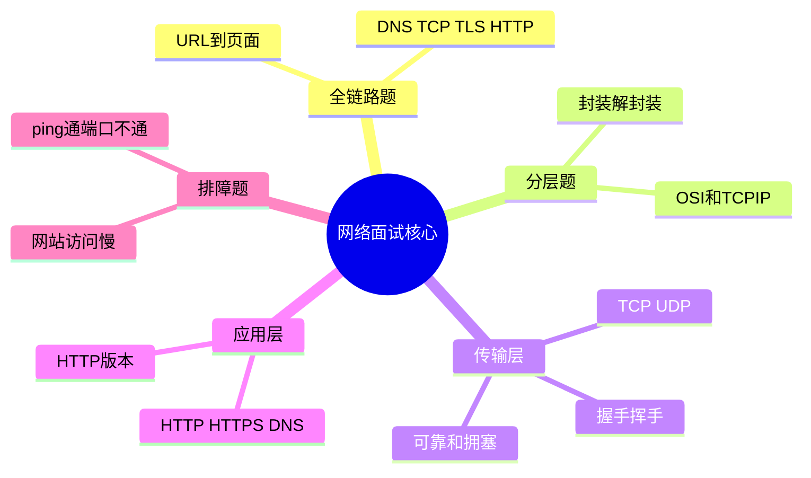
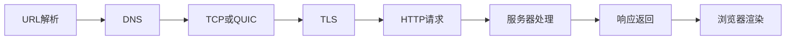

---
tags:
  - 计算机网络
  - 面试
  - 问答
aliases:
  - 计算机网络面试题
  - 网络面试核心问答
created: 2026-04-27
updated: 2026-05-03
---

# 10-常见面试题与核心问答

> 返回：[[00-MOC]] ｜ 上一章：[[09-网络性能与排障：ping、traceroute、抓包]] ｜ 下一章：[[11-实验路线：从零搭建与抓包练习]]

网络面试不要只背定义。高分回答通常包含：

1. 一句话结论
2. 关键机制
3. 为什么这样设计
4. 工程影响或排障方法

---

## 1. 输入 URL 到页面展示发生了什么

简化答案：

1. 浏览器解析 URL，确定协议、域名、端口、路径。
2. 查询缓存，必要时进行 DNS 解析得到 IP。
3. 根据路由表选择下一跳，通过 ARP/NDP 获取下一跳 MAC。
4. 建立传输连接：HTTPS 通常先 TCP 三次握手，再 TLS 握手；HTTP/3 使用 QUIC。
5. 浏览器发送 HTTP 请求。
6. 请求经过 NAT、路由器、运营商、CDN、负载均衡到达服务器。
7. 服务器处理请求并返回响应。
8. 浏览器解析 HTML、CSS、JS，继续加载子资源并渲染页面。

可展开点：DNS、TCP、TLS、HTTP 缓存、CDN、浏览器渲染。

---

## 2. OSI 七层与 TCP/IP 四层怎么对应

回答：

```text
应用层/表示层/会话层 → TCP/IP 应用层
传输层 → TCP/IP 传输层
网络层 → TCP/IP 网络层
数据链路层/物理层 → TCP/IP 网络接口层
```

重点不是层数，而是职责：应用语义、进程通信、跨网络寻址、同链路传输、物理信号。

---

## 3. TCP 和 UDP 的区别

| 对比 | TCP | UDP |
|---|---|---|
| 连接 | 面向连接 | 无连接 |
| 可靠性 | 可靠、有序、重传 | 不保证可靠和顺序 |
| 数据语义 | 字节流 | 数据报 |
| 开销 | 较大 | 较小 |
| 拥塞控制 | 内置 | 通常由应用/上层实现 |
| 典型场景 | Web、文件、数据库连接 | DNS、音视频、游戏、QUIC |

补充：UDP 不等于“不可靠应用”。QUIC 就是在 UDP 上实现可靠传输、多路复用和拥塞控制。

---

## 4. TCP 为什么三次握手

结论：三次握手用于确认双方收发能力，并协商初始序列号。

两次握手的问题：服务端无法确认客户端是否收到自己的响应，也更容易被历史延迟 SYN 干扰。

三次后双方都确认：

- 客户端能发、能收
- 服务端能发、能收
- 双方初始序列号已同步

---

## 5. TCP 为什么四次挥手

因为 TCP 是全双工。关闭连接要分别关闭两个方向的数据发送。

```text
A：我发完了 FIN
B：收到 ACK，但我可能还有数据要发
B：我也发完了 FIN
A：收到 ACK
```

如果 B 没有剩余数据，ACK 和 FIN 可能合并，因此抓包不一定总是四个独立报文。

---

## 6. TIME_WAIT 有什么用

TIME_WAIT 主要有两个作用：

1. 确保最后 ACK 能被对方收到，必要时可重发。
2. 让旧连接中的延迟报文自然消失，避免污染后续同四元组连接。

工程上大量 TIME_WAIT 通常通过连接复用、长连接、合理参数优化，不应简单关闭安全机制。

---

## 7. TCP 如何保证可靠传输

机制组合：

- 序列号：标识字节顺序
- ACK：确认已收到数据
- 超时重传：丢包后补发
- 快速重传：重复 ACK 触发
- 滑动窗口：控制在途数据量
- 校验和：检测损坏
- 流量控制：保护接收方
- 拥塞控制：保护网络

---

## 8. HTTP 和 HTTPS 的区别

HTTPS = HTTP over TLS。

HTTP 定义应用层语义：方法、URL、状态码、头部、正文。
TLS 提供加密、完整性和身份认证。

HTTPS 解决：

- 防窃听
- 防篡改
- 验证服务器身份

---

## 9. HTTP/1.1、HTTP/2、HTTP/3 区别

| 版本 | 关键特点 |
|---|---|
| HTTP/1.1 | 文本协议、持久连接、管线化受限 |
| HTTP/2 | 二进制分帧、多路复用、头部压缩 |
| HTTP/3 | 基于 QUIC/UDP，改善 TCP 层队头阻塞，握手更快 |

注意：HTTP/2 解决应用层队头阻塞，但底层 TCP 丢包仍影响整个连接。HTTP/3 用 QUIC 在传输层改善这个问题。

---

## 10. DNS 解析过程

简化：

1. 查浏览器缓存。
2. 查操作系统缓存和 hosts。
3. 问递归解析器。
4. 递归解析器必要时依次问根、顶级域、权威 DNS。
5. 返回 A/AAAA/CNAME 等记录并缓存。

工程关注：TTL、缓存、内外网解析差异、递归 DNS 质量。

---

## 11. ARP 是什么

ARP 用于 IPv4 局域网内把 IP 地址解析为 MAC 地址。

同网段通信：ARP 目标主机 IP。
跨网段通信：ARP 默认网关 IP。

关键点：跨网访问时，帧目的 MAC 是网关，IP 包目的 IP 仍是最终目标。

---

## 12. 交换机和路由器区别

| 设备 | 工作层 | 根据什么转发 | 作用范围 |
|---|---|---|---|
| 交换机 | 链路层 | MAC 地址表 | 局域网/VLAN 内 |
| 路由器 | 网络层 | IP 路由表 | 不同网络之间 |

交换机隔离冲突域，VLAN 隔离广播域；路由器连接不同网段并默认隔离广播。

---

## 13. NAT 的作用和问题

作用：把内网私有地址转换为公网地址，常伴随端口转换。

优点：缓解 IPv4 地址不足，默认阻止部分外部主动入站。

问题：破坏端到端模型，P2P 和实时通信需要 NAT 穿透，排障更复杂。

---

## 14. 为什么 ping 通但端口不通

因为 ping 使用 ICMP，只说明网络层可能可达；端口是 TCP/UDP 传输层能力。

可能原因：

- 服务没监听
- 防火墙拦截端口
- 安全组未开放
- 目标只允许特定源 IP
- TCP 被 RST 或丢弃

验证：

```bash
nc -vz host port
curl -v http://host:port
```

---

## 15. 如何排查一个网站访问慢

拆成阶段：

1. DNS 解析慢
2. TCP 连接慢
3. TLS 握手慢
4. 服务端处理慢，TTFB 高
5. 内容下载慢
6. 前端渲染慢

工具：

```bash
curl -w '
DNS:%{time_namelookup}
TCP:%{time_connect}
TLS:%{time_appconnect}
TTFB:%{time_starttransfer}
Total:%{time_total}
' -o /dev/null -s https://example.com
```

---

## 16. 面试表达模板

回答网络题时可以用：

```text
这个问题发生在 X 层，核心机制是 Y。
正常流程是 A → B → C。
如果失败，常见原因有 D/E/F。
工程上我会用 G/H 工具验证。
```

这比单纯背书更像工程师。

<!-- CN-DEEP-EXPANSION:START -->
## 深入展开：面试回答要从“背答案”变成“讲机制”

计算机网络面试题看似很多，其实大多围绕同一条链路反复提问。高分回答通常不是把定义背出来，而是能把机制、原因、场景、排障串起来。

### 1. 一个万能回答模板

遇到网络题，可以按这个结构回答：

```text
这个问题发生在 X 层。
它要解决的问题是 Y。
正常流程是 A → B → C。
这样设计的原因是 Z。
工程上如果出问题，我会用 M/N/O 工具验证。
```

例如问“三次握手”：

```text
这是传输层 TCP 建连机制。
它解决的是双方确认收发能力和同步初始序列号。
流程是 SYN、SYN+ACK、ACK。
三次而不是两次，是因为服务端也需要确认客户端收到自己的 SYN+ACK。
排障时我会抓包看 SYN 是否发出、SYN+ACK 是否返回、是否有重传或 RST。
```

### 2. 常见追问方向

面试官通常会从定义追到场景：

| 原问题 | 常见追问 |
|---|---|
| TCP 和 UDP 区别 | 为什么 QUIC 用 UDP？游戏为什么不用 TCP？ |
| 三次握手 | 第三个 ACK 丢了怎么办？SYN Flood 怎么防？ |
| 四次挥手 | TIME_WAIT/CLOSE_WAIT 区别？ |
| DNS 解析 | TTL 对发布有什么影响？内网域名为什么家里解析不到？ |
| HTTPS | 证书没过期为什么仍不可信？SNI 是什么？ |
| 502/504 | 怎么判断是代理问题还是应用问题？ |

所以准备时不要只背第一问，要准备“第二层追问”。[[14-计算机网络面试官50问]] 已经按这个方式扩展。

### 3. 面试中最加分的是“排障意识”

比如问“ping 通但网页打不开”，普通回答：

> ping 是 ICMP，网页是 HTTP。

更好的回答：

```text
ping 通只能说明 ICMP 层面网络可达。
网页还需要 DNS 解析、TCP 443 连接、TLS 握手、HTTP 响应和业务处理。
我会先 dig 看域名，再 nc 看端口，再 curl -v 看 TLS 和 HTTP 状态码。
如果端口通但 HTTP 502，就查反向代理和上游服务。
```

这类回答能体现你真的会用网络知识解决问题。

### 4. 最容易被问穿的薄弱点

- 只会说 TCP 可靠，不知道可靠性由序列号、ACK、重传、窗口、拥塞控制共同实现。
- 只会说 HTTPS 加密，不知道证书链、SNI、ALPN、TLS 握手。
- 只会说 DNS 解析域名，不知道缓存、TTL、CNAME、内外网解析、CDN 调度。
- 只会说 502 是网关错误，不知道怎么查上游连接、健康检查、代理日志。
- 只会说 NAT 省公网 IP，不知道它破坏端到端模型、影响 P2P 和入站访问。

复习时请专门补这些“容易被追问”的点。
<!-- CN-DEEP-EXPANSION:END -->

## 思维导图

> 记忆建议：面试回答不要背孤立结论，要按“场景 → 分层 → 机制 → 排障证据”展开。

### 1. 高频题知识簇



### 2. 万能回答模板


### 3. URL 到页面最小主线


