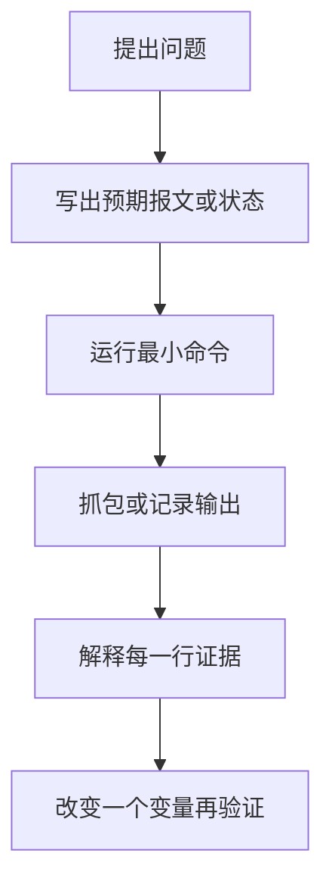
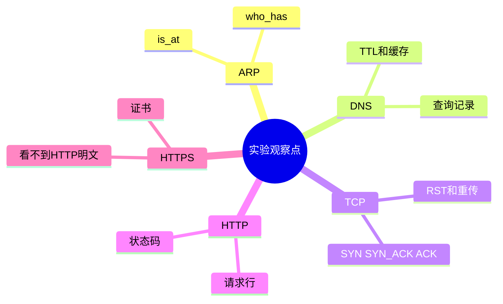

---
tags:
  - 计算机网络
  - 实验
  - 抓包
aliases:
  - 计算机网络实验路线
  - 网络抓包练习
created: 2026-04-27
updated: 2026-05-03
---

# 11-实验路线：从零搭建与抓包练习

> 返回：[[00-MOC]] ｜ 上一章：[[10-常见面试题与核心问答]] ｜ 下一章：[[12-速查表：端口、报文、命令、概念对比]]

网络知识必须靠实验变成直觉。本章给一条从低到高的练习路线。

原则：

- 每次只验证一个概念。
- 先预测抓包结果，再抓包验证。
- 记录异常现象，而不是只看成功路径。

---

## 0. 准备工具

建议安装或准备：

- Wireshark
- tcpdump
- curl
- dig / nslookup
- nc / netcat
- Python 3
- Docker（可选）

常用检查：

```bash
curl --version
dig -v
nc -h
python3 --version
```

---

## 实验 1：查看本机网络配置

目标：理解 IP、网关、DNS、网卡。

命令：

```bash
ip addr
ip route
cat /etc/resolv.conf
```

macOS 可用：

```bash
ifconfig
netstat -rn
scutil --dns
```

记录：

- 本机 IP
- 子网掩码/前缀
- 默认网关
- DNS 服务器
- 活跃网卡名称

---

## 实验 2：ARP 抓包

目标：观察 IP 到 MAC 的解析。

步骤：

1. 清理或等待 ARP 缓存过期。
2. 抓 ARP 包。
3. ping 局域网网关。

命令：

```bash
arp -a
sudo tcpdump -e -n arp
ping 网关IP
```

观察：

```text
Who has 网关IP? Tell 本机IP
网关IP is at 网关MAC
```

结论：访问外网前，主机通常需要先知道默认网关的 MAC。

---

## 实验 3：DNS 解析

目标：观察域名如何解析为 IP。

命令：

```bash
dig example.com
dig A example.com
dig AAAA example.com
dig +trace example.com
```

记录：

- 返回的 A/AAAA 记录
- TTL
- 是否有 CNAME
- 使用的 DNS 服务器

进阶：换不同 DNS 服务器比较：

```bash
dig @8.8.8.8 example.com
dig @1.1.1.1 example.com
```

---

## 实验 4：TCP 三次握手

目标：抓到 SYN、SYN+ACK、ACK。

命令：

```bash
sudo tcpdump -n 'tcp port 80 and host example.com'
curl -I http://example.com
```

Wireshark 过滤器：

```text
tcp.flags.syn == 1
```

观察：

- SYN 的源端口和目的端口
- 服务端 SYN+ACK
- 客户端 ACK
- 序列号和确认号变化

---

## 实验 5：HTTP 明文请求

目标：看到 HTTP 请求和响应内容。

启动本地服务：

```bash
python3 -m http.server 8000
```

另一个终端访问：

```bash
curl -v http://127.0.0.1:8000
```

抓包：

```bash
sudo tcpdump -A -s 0 'tcp port 8000'
```

观察：

- `GET / HTTP/1.1`
- Host 头
- 状态码
- 响应头
- 明文内容

---

## 实验 6：HTTPS 与 TLS

目标：看到 TLS 握手，而不是 HTTP 明文。

命令：

```bash
curl -v https://example.com
openssl s_client -connect example.com:443 -servername example.com
```

观察：

- TLS 版本
- 证书主题和 SAN
- 证书链
- ALPN 协商结果
- 加密后抓包看不到 HTTP 明文

---

## 实验 7：端口监听与连接失败

目标：理解 refused 与 timeout 的区别。

启动服务：

```bash
python3 -m http.server 8000
```

检查端口：

```bash
nc -vz 127.0.0.1 8000
nc -vz 127.0.0.1 8001
```

结果：

- 8000 connected：服务正在监听
- 8001 refused：主机可达，但端口未监听

timeout 通常意味着包被丢弃、路由不通或防火墙静默拦截。

---

## 实验 8：traceroute 路径观察

目标：理解 TTL 与路径探测。

命令：

```bash
traceroute example.com
mtr example.com
```

观察：

- 第一跳通常是网关
- 某些跳显示 `*` 不一定代表中断
- 路径可能随时间变化

---

## 实验 9：curl 分阶段计时

目标：区分 DNS、TCP、TLS、TTFB、总时间。

命令：

```bash
curl -w '
DNS:%{time_namelookup}
TCP:%{time_connect}
TLS:%{time_appconnect}
TTFB:%{time_starttransfer}
Total:%{time_total}
' -o /dev/null -s https://example.com
```

解释：

- DNS 高：解析慢
- TCP 高：网络路径或服务端握手慢
- TLS 高：证书/加密握手慢
- TTFB 高：服务端处理或上游慢
- Total 高但 TTFB 正常：下载内容慢

---

## 实验 10：模拟应用层错误

目标：区分网络通和应用失败。

启动本地服务后访问不存在路径：

```bash
curl -v http://127.0.0.1:8000/not-exist
```

你会看到 TCP 连接成功，但 HTTP 返回 404。

结论：网络通不等于业务成功。排障时要看层次。

---

## 实验记录模板

每做一个实验，建议按下面格式记笔记：

```markdown
## 实验名称

- 目标：
- 环境：
- 预测现象：
- 执行命令：
- 抓包/输出：
- 实际现象：
- 结论：
- 异常与下一步：
```

---

## 本章小结

- 网络实验要围绕分层设计。
- 抓包前先预测，抓包后用证据修正理解。
- 最有价值的实验不是“跑通”，而是解释为什么这样通、为什么那样不通。

<!-- CN-DEEP-EXPANSION:START -->
## 深入展开：每个实验到底要看懂什么

实验不是为了把命令跑一遍，而是为了把“看不见的网络过程”变成你能观察的证据。每个实验都应该有：预测、执行、观察、解释。

### 实验方法模板

```markdown
## 实验：抓 TCP 三次握手

- 我预测会看到：SYN → SYN+ACK → ACK
- 我执行的命令：curl http://example.com
- 我使用的过滤器：tcp and host example.com
- 我实际看到：...
- 如果不同：为什么？DNS 解析到别的 IP？连接复用？走了 HTTPS？
```

如果你没有“预测”，抓包就会变成看天书。

### 1. ARP 实验要看懂什么

你要观察：

```text
Who has 192.168.1.1? Tell 192.168.1.10
192.168.1.1 is at aa:bb:cc:dd:ee:ff
```

这说明：本机发外网包之前，先找的是网关 MAC。你也可以对同网段另一台机器 ping，再观察 ARP 目标变成那台机器 IP。

### 2. DNS 实验要看懂什么

`dig example.com` 不只是看 IP，还要看：

- ANSWER SECTION 中有没有 CNAME。
- TTL 是多少。
- 返回 A 还是 AAAA。
- SERVER 是哪个 DNS。
- `+trace` 时根、顶级域、权威 DNS 如何接力。

你可以比较：

```bash
dig @8.8.8.8 example.com
dig @1.1.1.1 example.com
```

如果结果不同，说明 DNS 不是“全球永远一个答案”。

### 3. TCP 实验要避免连接复用干扰

浏览器可能复用已有连接，让你抓不到三次握手。建议用 curl，并换不同端口或先关闭连接。抓包时注意过滤目标 IP，而不是域名，因为 tcpdump 不一定按域名匹配。

```bash
sudo tcpdump -n 'tcp and host 93.184.216.34 and port 80'
curl -v http://example.com/
```

### 4. HTTPS 实验为什么看不到 HTTP 明文

抓 HTTPS 时，你能看到：

- TCP 握手。
- TLS ClientHello/ServerHello。
- SNI、ALPN、证书部分信息。
- 后续 Application Data。

但你看不到具体 HTTP 路径和响应正文，因为它们被加密了。这正是 HTTPS 的目的。

### 5. 失败实验比成功实验更有价值

你可以故意制造失败：

- 访问未监听端口，看 RST/refused。
- 访问被防火墙丢弃的地址，看 SYN 重传/timeout。
- 用错误域名访问 HTTPS，看证书错误。
- 改 hosts 指向错误 IP，看 DNS 和 TLS 的关系。
- 启动本地服务后访问不存在路径，看 404 与网络通的区别。

当你能解释失败现象，就说明你真正理解了协议。
<!-- CN-DEEP-EXPANSION:END -->

## 思维导图

> 记忆建议：每个实验都要先写假设，再观察报文，最后把现象映射回协议机制。

### 1. 实验路线


### 2. 实验方法模板



### 3. 成功与失败都要看


