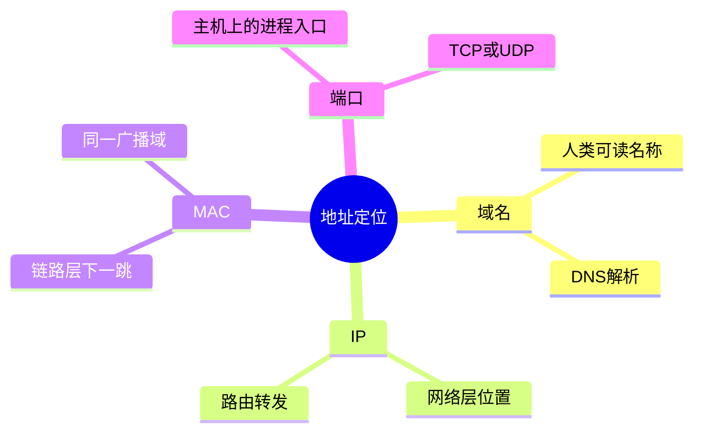
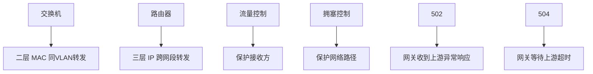

---
tags:
  - 计算机网络
  - 速查表
  - 命令
aliases:
  - 网络速查表
  - 常用端口与命令
created: 2026-04-27
updated: 2026-05-03
---

# 12-速查表：端口、报文、命令、概念对比

> 返回：[[00-MOC]] ｜ 上一章：[[11-实验路线：从零搭建与抓包练习]] ｜ 下一章：[[13-进阶专题：CDN、BGP、QUIC、数据中心网络]]

这是一页用于复习和排障的快速索引。

---

## 1. 常用端口

| 端口 | 协议 | 说明 |
|---:|---|---|
| 20/21 | FTP | 文件传输，控制与数据通道 |
| 22 | SSH | 远程登录、隧道、SCP/SFTP |
| 25 | SMTP | 邮件发送 |
| 53 | DNS | 域名解析，UDP 为主，必要时 TCP |
| 67/68 | DHCP | 自动分配 IP |
| 80 | HTTP | 明文 Web |
| 110 | POP3 | 邮件接收 |
| 123 | NTP | 时间同步 |
| 143 | IMAP | 邮件接收 |
| 443 | HTTPS | HTTP over TLS；HTTP/3 也常用 UDP 443 |
| 3306 | MySQL | MySQL 默认端口 |
| 5432 | PostgreSQL | PostgreSQL 默认端口 |
| 6379 | Redis | Redis 默认端口 |
| 8080 | HTTP 备用 | 常见 Web 服务/代理端口 |

---

## 2. 协议号

| 协议 | IP 协议号 |
|---|---:|
| ICMP | 1 |
| TCP | 6 |
| UDP | 17 |
| GRE | 47 |
| ESP | 50 |
| ICMPv6 | 58 |

---

## 3. TCP 标志位

| 标志 | 含义 |
|---|---|
| SYN | 建立连接，同步序列号 |
| ACK | 确认 |
| FIN | 正常关闭一个方向 |
| RST | 立即重置连接 |
| PSH | 尽快交给应用 |
| URG | 紧急指针有效，现代少见 |

---

## 4. HTTP 状态码速查

| 状态码 | 含义 |
|---:|---|
| 200 | 成功 |
| 201 | 创建成功 |
| 204 | 成功但无响应体 |
| 301 | 永久重定向 |
| 302 | 临时重定向 |
| 304 | 缓存可用，无需重新下载 |
| 400 | 请求格式错误 |
| 401 | 未认证 |
| 403 | 无权限 |
| 404 | 资源不存在 |
| 409 | 冲突 |
| 429 | 请求过多，限流 |
| 500 | 服务端内部错误 |
| 502 | 网关从上游收到无效响应 |
| 503 | 服务不可用 |
| 504 | 网关等待上游超时 |

---

## 5. 常用命令按层分类

### 链路层

```bash
ip link
ifconfig
arp -a
ip neigh
sudo tcpdump -e -n arp
```

### 网络层

```bash
ip addr
ip route
ping 8.8.8.8
traceroute example.com
mtr example.com
```

### DNS

```bash
dig example.com
dig +trace example.com
nslookup example.com
```

### 传输层

```bash
nc -vz host 443
ss -tulpen
netstat -an
sudo tcpdump -n 'tcp port 443'
```

### 应用层

```bash
curl -v https://example.com
curl -I https://example.com
openssl s_client -connect example.com:443 -servername example.com
```

---

## 6. 概念对比

### 6.1 MAC vs IP vs 端口 vs 域名

| 概念 | 层次 | 作用 |
|---|---|---|
| MAC | 链路层 | 下一跳网卡地址 |
| IP | 网络层 | 跨网络主机地址 |
| 端口 | 传输层 | 主机内进程标识 |
| 域名 | 应用层 | 人类可读服务名 |

### 6.2 交换机 vs 路由器

| 对比 | 交换机 | 路由器 |
|---|---|---|
| 层次 | 链路层 | 网络层 |
| 转发依据 | MAC 表 | 路由表 |
| 主要范围 | 同一局域网/VLAN | 不同网络之间 |
| 广播 | 转发同 VLAN 广播 | 默认不转发广播 |

### 6.3 流量控制 vs 拥塞控制

| 对比 | 流量控制 | 拥塞控制 |
|---|---|---|
| 保护对象 | 接收方 | 网络路径 |
| 信号 | 接收窗口 | 丢包、延迟、ACK |
| 目的 | 不压垮接收缓冲区 | 不压垮网络 |

### 6.4 401 vs 403

| 状态码 | 含义 |
|---|---|
| 401 | 你还没证明你是谁 |
| 403 | 我知道你是谁，但你没权限 |

### 6.5 502 vs 504

| 状态码 | 含义 |
|---|---|
| 502 | 网关/代理从上游收到无效响应 |
| 504 | 网关/代理等待上游响应超时 |

---

## 7. 快速排障决策树

```text
访问失败
├── ping 公网 IP 不通 → 查本机 IP、网关、路由、运营商
├── ping IP 通但域名不通 → 查 DNS
├── 域名能解析但端口不通 → 查服务监听、防火墙、安全组
├── 端口通但 TLS 失败 → 查证书、SNI、TLS 版本
├── TLS 成功但 HTTP 错误 → 查状态码、代理、应用日志
└── 偶发慢/卡顿 → 查丢包、重传、RTT、服务端耗时
```

---

## 8. 抓包过滤器

### tcpdump

```bash
sudo tcpdump -n host 1.2.3.4
sudo tcpdump -n 'tcp port 443'
sudo tcpdump -n 'udp port 53'
sudo tcpdump -n 'icmp or arp'
sudo tcpdump -w out.pcap 'host 1.2.3.4'
```

### Wireshark

```text
ip.addr == 1.2.3.4
tcp.port == 443
udp.port == 53
dns
http
tls
arp
icmp
tcp.analysis.retransmission
```

---

## 9. 本章小结

- 速查表用于排障时快速定位，不替代理解。
- 最常用的组合是 `dig`、`ping`、`traceroute`、`nc`、`curl -v`、`tcpdump`。
- 面试和工程排障都要先判断层次，再套用命令。

<!-- CN-DEEP-EXPANSION:START -->
## 深入展开：速查表应该怎么用

速查表不是用来死记的，而是在排障时快速把“现象”映射到“层次”和“工具”。你可以按下面方式使用。

### 1. 先判断你在查哪一层

```text
域名问题 → dig / nslookup
IP 连通问题 → ping / traceroute / mtr
端口问题 → nc / telnet / ss
TLS 问题 → curl -v / openssl s_client
HTTP 问题 → curl -I / 浏览器 Network
包级问题 → tcpdump / Wireshark
```

不要在 DNS 失败时反复看应用日志，也不要在 HTTP 500 时反复 ping。

### 2. 端口号要理解“默认约定”

端口号不是协议本身强制死的，而是社区和标准形成的默认约定。

例如 HTTP 默认 80，但你也可以把 HTTP 服务跑在 8080；HTTPS 默认 443，但也可以跑在 8443。客户端如果不写端口，会根据 scheme 选择默认端口。

```text
http://example.com      → 默认 80
https://example.com     → 默认 443
http://example.com:8080 → 明确 8080
```

### 3. 状态码要联系组件位置

同一个状态码可能来自不同组件：

- 403 可能来自应用权限，也可能来自 WAF。
- 404 可能来自应用路由，也可能来自 Nginx 静态文件路径。
- 502 可能来自 CDN、负载均衡、Ingress、Nginx、Envoy。
- 504 可能是任何一层等待上游超时。

所以看状态码时要同时看响应头，比如 `Server`、`Via`、`X-Cache`、`X-Request-Id`，判断是谁返回的。

### 4. 命令组合比单个命令更重要

一个常用组合：

```bash
dig example.com
ping 解析到的IP
traceroute 解析到的IP
nc -vz example.com 443
curl -v https://example.com/
```

这组命令能依次覆盖 DNS、网络层、路径、传输层、TLS/HTTP。

### 5. 抓包过滤器要从窄到宽

先过滤具体目标：

```bash
sudo tcpdump -n 'host 1.2.3.4 and port 443'
```

如果看不到包，再放宽：

```bash
sudo tcpdump -n 'port 443'
sudo tcpdump -n 'tcp'
```

不要一开始抓全量，否则你会被广播、DNS、系统后台流量淹没。

### 6. 速查表背后的核心判断

```text
timeout：没人回应，多查路由/防火墙/安全组
refused：有人拒绝，多查服务监听/端口
5xx：请求到达某个应用组件，多查代理/上游/业务
证书错：TCP 通了，多查 TLS/SNI/证书链
DNS 错：请求可能根本没到正确机器
```

记住这些判断，比背端口号更重要。
<!-- CN-DEEP-EXPANSION:END -->

## 思维导图

> 记忆建议：速查表不是背诵清单；先判断层次，再查端口、状态码、命令和过滤器。

### 1. 速查使用顺序


### 2. 四类地址不要混



### 3. 常见对比


