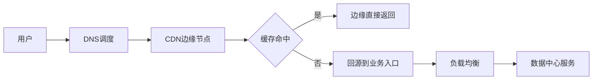
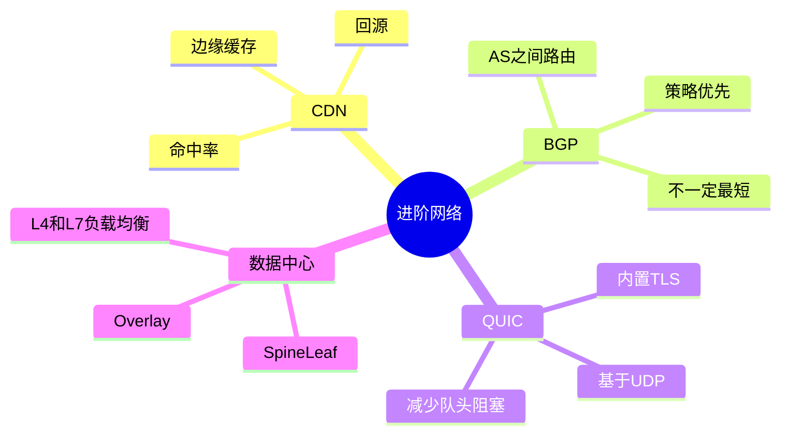
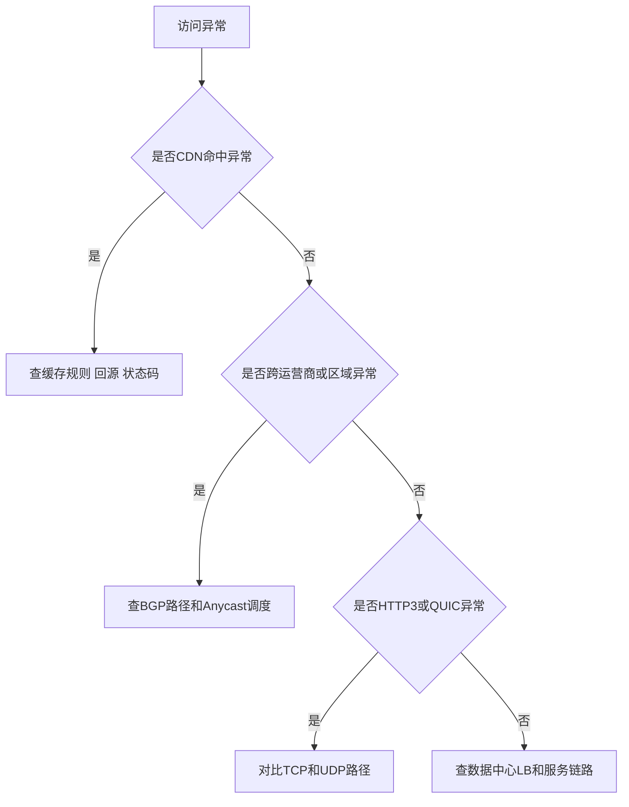

---
tags:
  - 计算机网络
  - CDN
  - BGP
  - QUIC
  - 数据中心网络
aliases:
  - 网络进阶专题
  - CDN BGP QUIC 数据中心网络
created: 2026-04-27
updated: 2026-05-03
---

# 13-进阶专题：CDN、BGP、QUIC、数据中心网络

> 返回：[[00-MOC]] ｜ 上一章：[[12-速查表：端口、报文、命令、概念对比]]

学完基础协议后，需要理解真实互联网为什么比教材复杂：

- 用户不一定直接访问源站，而是访问 CDN 边缘节点。
- 跨运营商、跨国家路径由 BGP 等路由协议影响。
- HTTP/3 和 QUIC 把传输控制搬到 UDP 之上。
- 数据中心内部网络需要面对海量东西向流量。

---

## 1. CDN：把内容放到离用户更近的地方

CDN 解决的问题：

- 降低用户访问延迟
- 减少源站压力
- 提高可用性
- 缓解跨地域、跨运营商访问质量问题
- 提供边缘安全能力，如 DDoS 防护、WAF、TLS 卸载

简化流程：

```text
用户访问 www.example.com
  ↓
DNS 返回 CDN 边缘节点地址
  ↓
用户连接边缘节点
  ↓
边缘节点命中缓存则直接返回
  ↓
未命中则回源到源站
```

---

## 2. CDN 缓存关键概念

| 概念 | 含义 |
|---|---|
| 边缘节点 | 离用户近的 CDN 服务器 |
| 回源 | 边缘没有内容时向源站请求 |
| 命中率 | 请求在边缘缓存命中的比例 |
| TTL | 缓存有效时间 |
| 刷新/预热 | 主动删除或提前拉取缓存 |

HTTP 头部对缓存影响很大：

```http
Cache-Control: max-age=3600
ETag: "abc123"
Last-Modified: Mon, 27 Apr 2026 10:00:00 GMT
```

---

## 3. BGP：自治系统之间的路由协议

互联网不是一个统一运营的网络，而是很多自治系统 AS 组成。

BGP 解决：

> 不同组织的网络之间，如何交换可达性信息并选择路径。

例如：

```text
用户运营商 AS → 骨干 AS → 云厂商 AS → 数据中心
```

BGP 关注的是策略和可达性，不是简单“最短路径”。路径可能受商业关系、策略、拥塞、故障影响。

---

## 4. Anycast

Anycast 让多个地理位置的节点宣告同一个 IP，由路由系统把用户导向“网络上较近或策略上合适”的节点。

常见用途：

- 公共 DNS
- CDN 边缘
- DDoS 清洗
- 全球负载分布

注意：Anycast 的“近”是路由意义上的近，不一定是物理距离最近。

---

## 5. QUIC：基于 UDP 的现代传输协议

QUIC 的目标不是“绕过 TCP”，而是解决一些 TCP 在现代 Web 场景下的限制。

特点：

- 基于 UDP，便于用户态部署和演进
- 集成加密握手
- 支持多路复用
- 改善 TCP 层队头阻塞
- 支持连接迁移，例如移动网络切换 IP 后保持连接标识

HTTP/3 运行在 QUIC 之上。

---

## 6. QUIC 为什么基于 UDP

因为 TCP 在操作系统内核中，协议演进需要系统升级，部署慢。

UDP 提供最小传输外壳，QUIC 在用户态实现：

- 可靠性
- 拥塞控制
- 流管理
- 加密
- 连接迁移

这让浏览器、服务端、库可以更快迭代。

---

## 7. 数据中心网络

数据中心网络与传统企业网的流量形态不同。

传统访问常是南北向：

```text
用户 ↔ 数据中心
```

微服务架构中大量是东西向：

```text
服务 A ↔ 服务 B ↔ 数据库 ↔ 缓存 ↔ 消息队列
```

因此数据中心网络强调：

- 高带宽
- 低延迟
- 多路径
- 自动化配置
- 故障域隔离
- 可观测性

---

## 8. Spine-Leaf 架构

现代数据中心常用 Spine-Leaf：

```text
       Spine   Spine   Spine
        / | \   / | \   / | \
      Leaf  Leaf  Leaf  Leaf
        |     |     |     |
     Server Server Server Server
```

特点：

- 任意两台服务器通常经过 Leaf-Spine-Leaf
- 路径长度更稳定
- 易于横向扩展
- 支持 ECMP 多路径转发

---

## 9. Overlay 网络

云和容器环境中，逻辑网络常构建在物理网络之上。

例如：

- VXLAN
- Geneve
- Kubernetes CNI
- 云 VPC

Overlay 的作用：

- 多租户隔离
- 灵活创建虚拟网络
- 跨物理边界迁移工作负载
- 与安全策略结合

代价：

- 封装开销
- MTU 问题
- 排障复杂度上升

---

## 10. 负载均衡：L4 与 L7

| 类型 | 工作层次 | 依据 | 示例 |
|---|---|---|---|
| L4 负载均衡 | 传输层 | IP、端口、TCP/UDP | TCP 代理、NAT LB |
| L7 负载均衡 | 应用层 | HTTP Host、Path、Header | Nginx、Envoy、Ingress |

L4 更通用、开销低；L7 更懂业务语义，可做路由、鉴权、灰度、重试、熔断等。

---

## 11. 从用户请求看进阶组件如何协作

```text
用户输入域名
  ↓
DNS/Anycast 选择合适 CDN 边缘
  ↓
边缘节点终止 TLS 或转发 TLS
  ↓
命中缓存直接返回；未命中回源
  ↓
BGP 决定跨网络路径
  ↓
云负载均衡接入
  ↓
数据中心 Spine-Leaf 转发
  ↓
服务网格/Ingress 路由到应用
  ↓
应用访问缓存、数据库、消息队列
```

这也是为什么一个 502/504 可能涉及 DNS、CDN、LB、服务网格、后端、数据库，而不只是“服务器坏了”。

---

## 12. 进阶排障关注点

### CDN

- 是否命中缓存
- 回源是否失败
- 缓存是否过期
- 不同地区是否解析到不同边缘
- 源站是否只允许 CDN 回源 IP

### BGP/跨运营商

- 是否只有某运营商异常
- 路径是否绕路
- 是否存在区域性故障
- Anycast 是否导向异常节点

### QUIC/HTTP3

- UDP 443 是否被阻断
- 是否回退到 HTTP/2
- 客户端和服务端是否都支持
- 中间网络是否限制 UDP

### 数据中心

- 负载均衡健康检查
- 安全组/网络策略
- MTU 与 Overlay
- 服务发现
- 东西向流量延迟

---

## 13. 本章小结

- CDN 把内容和安全能力前移到边缘。
- BGP 决定自治系统之间的可达性和路径策略。
- QUIC 基于 UDP，在用户态实现现代传输能力。
- 数据中心网络强调多路径、自动化、隔离和可观测性。
- 真实工程排障要把基础分层模型扩展到 CDN、LB、Overlay、服务网格等组件。

<!-- CN-DEEP-EXPANSION:START -->
## 深入展开：真实互联网不是“客户端直连服务器”

基础章节为了好理解，经常画成：

```text
客户端 → 服务器
```

但真实生产环境更像：

```text
客户端
  ↓ DNS / Anycast / CDN 调度
CDN 边缘节点
  ↓ 回源链路
云负载均衡
  ↓
反向代理 / API 网关 / Ingress
  ↓
服务网格 Sidecar
  ↓
应用服务
  ↓
缓存 / 数据库 / 消息队列 / 第三方 API
```

所以线上故障经常不是“服务器挂了”，而是其中某一段出问题。

### 1. CDN 的关键不是缓存，而是“边缘入口”

CDN 常同时做：

- 静态资源缓存。
- 动态请求加速。
- TLS 终止。
- WAF 防护。
- DDoS 清洗。
- 图片压缩和格式转换。
- 根据地区、运营商、负载调度边缘节点。

因此一个 CDN 问题可能表现为：

- 某地区访问慢。
- 某运营商打不开。
- 只有静态资源旧版本。
- 只有动态接口 502。
- 源站日志没有请求，因为请求卡在边缘或回源。

### 2. BGP 解释“为什么绕路”

用户到服务器的路径不是地图最短路，而是网络自治系统之间按策略选择的路。运营商互联、商业关系、出口拥塞、路由策略都会影响路径。

这就是为什么：

```text
同一个网站：电信快，联通慢
同一个城市：路径绕到外省
同一个 IP：不同地区 traceroute 完全不同
```

BGP 问题通常需要多点探测，单机 `ping` 很难说明全局情况。

### 3. QUIC 改变了排障方式

TCP 时代，中间设备可以看到很多传输层信息。QUIC 默认加密更多传输细节，中间设备更难解析连接内部状态。

这有好处：减少中间盒干扰，提升隐私，协议更容易演进。

也有代价：传统抓包能看到的信息变少，排障更依赖端点日志、qlog、浏览器 NetLog、服务端 QUIC 指标。

### 4. 数据中心内部更关注东西向流量

传统 Web 是南北向：

```text
用户 ↔ 数据中心
```

微服务以后，大量流量是东西向：

```text
订单服务 ↔ 库存服务 ↔ 支付服务 ↔ 风控服务 ↔ 数据库
```

一个用户请求可能触发几十次内部 RPC。网络问题可能不是用户到入口，而是服务 A 到服务 B 的连接池、DNS、服务发现、网络策略、Sidecar 超时。

### 5. 进阶排障的核心是“定位在哪个边界”

| 边界 | 常见问题 |
|---|---|
| 用户 → CDN | DNS 调度、地区/运营商问题、UDP 被阻断 |
| CDN → 源站 | 回源超时、源站白名单、证书/SNI 错误 |
| LB → 后端 | 健康检查失败、端口不通、连接耗尽 |
| Ingress → Service | Kubernetes Service/Endpoint 异常 |
| Sidecar → 应用 | mTLS、熔断、重试、超时策略 |
| 应用 → 数据库 | 连接池、慢查询、网络 ACL |

进阶网络不是新名词堆叠，而是把基础分层模型应用到更多边界上。
<!-- CN-DEEP-EXPANSION:END -->

## 思维导图

> 记忆建议：进阶网络要从“边界”理解：边缘入口、自治系统边界、传输协议边界、数据中心东西向边界。

### 1. 真实互联网请求路径



### 2. 进阶组件记忆图



### 3. 进阶排障定位边界


