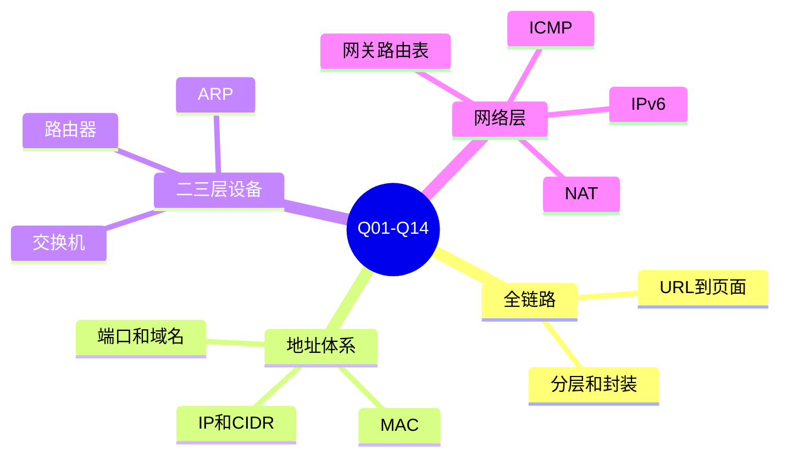
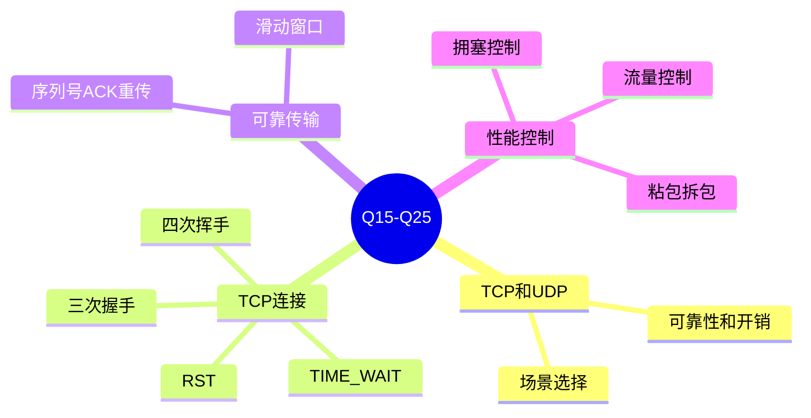
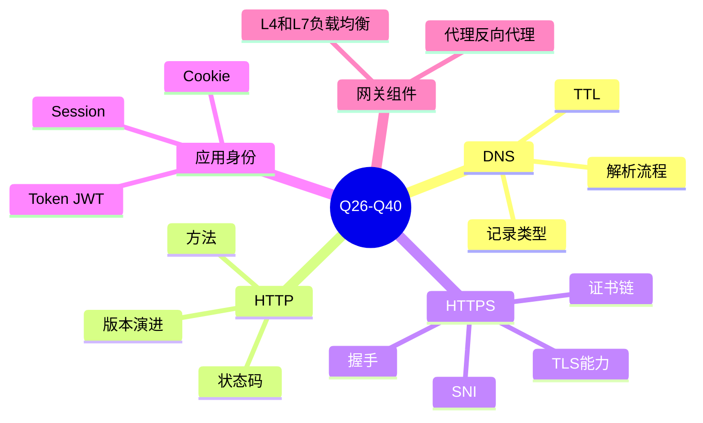
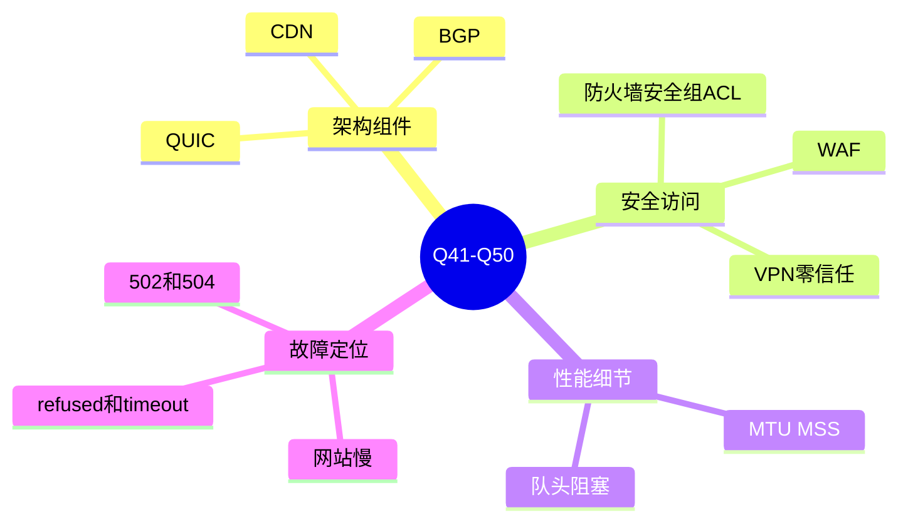
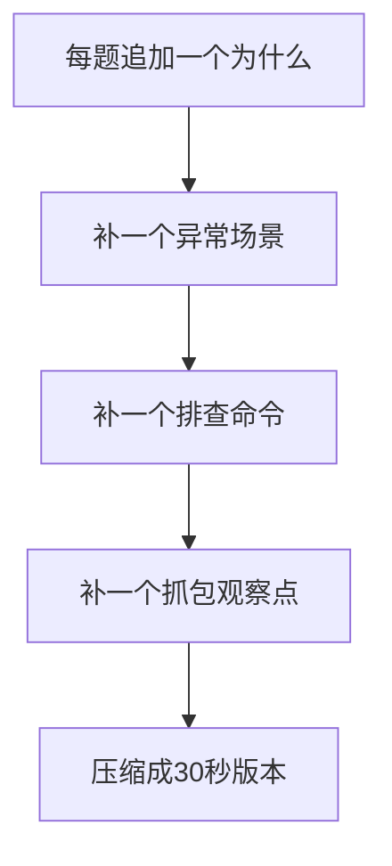

---
tags:
  - 计算机网络
  - 面试
  - 问答
  - 系统教程
aliases:
  - 计算机网络面试官50问
  - 计网面试50问
created: 2026-04-27
updated: 2026-05-03
---

# 14-计算机网络面试官50问

> 返回：[[00-MOC]] ｜ 相关：[[10-常见面试题与核心问答]]、[[12-速查表：端口、报文、命令、概念对比]]

这份文档按“面试官提问”的方式组织：先给出 50 个问题清单，再逐题给出深入版参考答案。

建议回答结构：

```text
一句话结论 → 核心机制 → 为什么这样设计 → 追问点 → 工程排障/实践影响
```

---

## 一、面试官 50 个问题

1. 从浏览器输入 URL 到页面展示，中间发生了什么？
2. OSI 七层模型和 TCP/IP 四层模型分别是什么？如何对应？
3. 为什么网络要分层？分层有什么好处和代价？
4. 封装和解封装是什么？包、帧、段、报文有什么区别？
5. MAC 地址、IP 地址、端口号、域名分别解决什么问题？
6. 交换机和路由器有什么区别？
7. ARP 协议解决什么问题？跨网段访问时 ARP 的目标是谁？
8. 什么是子网掩码和 CIDR？如何判断两个 IP 是否同网段？
9. 默认网关是什么？主机什么时候会把包发给默认网关？
10. 路由表如何决定下一跳？什么是最长前缀匹配？
11. ICMP 是什么？ping 和 traceroute 分别如何工作？
12. 为什么 ping 通不代表服务可用？
13. IPv4 和 IPv6 有哪些关键区别？
14. NAT 是什么？它解决了什么问题，又带来了什么问题？
15. TCP 和 UDP 有什么区别？分别适合哪些场景？
16. 为什么说 TCP 是字节流协议？什么是粘包和拆包？
17. TCP 三次握手的过程是什么？为什么不是两次？
18. TCP 四次挥手的过程是什么？为什么关闭连接需要四次？
19. TIME_WAIT 状态有什么作用？大量 TIME_WAIT 应该如何理解？
20. TCP 如何保证可靠传输？
21. TCP 的流量控制和拥塞控制有什么区别？
22. TCP 滑动窗口是什么？它解决什么问题？
23. TCP 拥塞控制中的慢启动、拥塞避免、快速重传、快速恢复是什么？
24. TCP 出现 RST 通常意味着什么？
25. UDP 不可靠，为什么 DNS、音视频、QUIC 还会使用 UDP？
26. DNS 解析完整流程是什么？
27. DNS 中 A、AAAA、CNAME、MX、TXT、NS 记录分别有什么用？
28. DNS TTL 有什么作用？TTL 设置过长或过短有什么影响？
29. HTTP 请求和响应由哪些部分组成？
30. GET 和 POST 有什么区别？PUT 和 PATCH 又有什么区别？
31. HTTP 常见状态码 200、301、302、304、400、401、403、404、429、500、502、503、504 分别表示什么？
32. HTTP/1.1、HTTP/2、HTTP/3 有什么区别？
33. HTTPS 和 HTTP 有什么区别？TLS 提供了哪些安全能力？
34. TLS 握手大致做了哪些事？证书链如何验证？
35. SNI 是什么？为什么 HTTPS 多域名部署需要 SNI？
36. Cookie、Session、Token、JWT 有什么区别？
37. WebSocket 是什么？它和 HTTP 有什么关系？
38. 什么是 CORS？它解决的是什么问题？
39. 代理、反向代理、负载均衡分别是什么？
40. 四层负载均衡和七层负载均衡有什么区别？
41. CDN 的工作原理是什么？缓存命中和回源是什么意思？
42. BGP 是什么？为什么互联网路由不一定走物理最短路径？
43. QUIC 为什么基于 UDP？它相比 TCP+TLS+HTTP/2 有哪些优势？
44. 防火墙、安全组、ACL、WAF 的区别是什么？
45. VPN 的基本原理是什么？它和专线、零信任访问有什么区别？
46. 什么是 MTU、MSS？路径 MTU 问题会导致什么现象？
47. 什么是队头阻塞？HTTP/2 和 HTTP/3 分别如何处理？
48. 访问网站很慢时，你会如何分层定位？
49. 连接一个服务时出现 connection refused 和 timeout，有什么区别？
50. 如果线上接口偶发 502/504，你会如何从网络角度排查？

---

## 二、逐题深入参考答案

### Q01. 从浏览器输入 URL 到页面展示，中间发生了什么？

**考点定位：** 这是最经典的综合题，考察 DNS、路由、ARP/NDP、TCP、TLS、HTTP、CDN、浏览器缓存和渲染的全链路理解。

**深入回答：**

1. **URL 解析**：浏览器先解析 `scheme://host:port/path?query`，确定协议、域名、端口和资源路径。`https` 默认端口是 443，`http` 默认端口是 80。
2. **缓存检查**：浏览器会先查 HTTP 缓存、HSTS 记录、DNS 缓存、连接池中是否已有可复用连接。若资源命中强缓存，甚至可能不发网络请求。
3. **DNS 解析**：如果没有可用 IP，会查询浏览器缓存、系统缓存、hosts、递归 DNS。递归解析器必要时向根、顶级域、权威 DNS 查询，最终得到 A/AAAA 或 CNAME 链。
4. **路由与下一跳**：主机用目标 IP 和本机子网掩码判断是否同网段。不同网段则查路由表，通常交给默认网关。
5. **链路层寻址**：在以太网/Wi-Fi 中，发送帧需要下一跳 MAC。IPv4 使用 ARP，IPv6 使用 NDP。跨网段访问时 ARP 的是网关 IP，而不是远端服务器 IP。
6. **传输连接**：传统 HTTPS 会建立 TCP 连接，经历 SYN、SYN+ACK、ACK 三次握手。HTTP/3 则基于 QUIC/UDP，不走 TCP 三次握手。
7. **TLS 握手**：HTTPS 会进行 TLS 握手，协商协议版本、密码套件、验证证书链、生成会话密钥，并通过 ALPN 协商 HTTP/1.1、HTTP/2 等应用协议。
8. **HTTP 请求**：浏览器发送请求行、请求头、Cookie、请求体等。请求可能先到 CDN、反向代理、负载均衡，再到源站应用。
9. **服务端处理**：服务端经过网关、应用服务、缓存、数据库、消息队列等处理后返回响应。
10. **浏览器渲染**：浏览器解析 HTML 构建 DOM，解析 CSS 构建 CSSOM，执行 JS，生成渲染树，布局、绘制、合成，并继续加载图片、字体、脚本等子资源。

**面试追问：** 如果问“哪些环节最容易慢”，可拆为 DNS 时间、TCP 连接时间、TLS 握手时间、TTFB、内容下载时间、前端渲染时间。

**实践验证：**

```bash
curl -w 'DNS:%{time_namelookup} TCP:%{time_connect} TLS:%{time_appconnect} TTFB:%{time_starttransfer} Total:%{time_total}\n' -o /dev/null -s https://example.com
curl -v https://example.com
```

---

### Q02. OSI 七层模型和 TCP/IP 四层模型分别是什么？如何对应？

**考点定位：** 考察分层模型、协议归属、工程中如何用分层定位问题。

**深入回答：**

OSI 七层模型是教学和标准化视角：

```text
7 应用层：HTTP、DNS、SMTP、SSH，定义应用语义
6 表示层：编码、压缩、加密表示
5 会话层：会话建立、维持、恢复
4 传输层：TCP、UDP，端到端进程通信
3 网络层：IP、ICMP、路由，跨网络寻址
2 数据链路层：Ethernet、Wi-Fi、MAC、VLAN，同链路交付
1 物理层：电信号、光信号、无线电，比特传输
```

TCP/IP 四层模型更贴近互联网工程实现：

```text
应用层：HTTP、DNS、TLS、SSH、SMTP
传输层：TCP、UDP、QUIC 的传输语义
网络层：IP、ICMP、路由
网络接口层：以太网、Wi-Fi、ARP、物理介质
```

对应关系：

| OSI | TCP/IP | 说明 |
|---|---|---|
| 应用层/表示层/会话层 | 应用层 | 真实协议常把应用语义、编码、加密混在一起 |
| 传输层 | 传输层 | TCP/UDP/QUIC 负责端到端进程通信 |
| 网络层 | 网络层 | IP 和路由决定跨网络转发 |
| 数据链路层/物理层 | 网络接口层 | 负责同链路传输和物理信号 |

**容易踩坑：** TLS 很难机械归入某一层。它位于应用协议和传输协议之间，工程上常说 HTTPS 是 HTTP over TLS over TCP。

**实践意义：** 排障时不要纠结“到底第几层”，而要问：这个问题是域名、端口、路由、链路、证书，还是业务语义的问题？

---

### Q03. 为什么网络要分层？分层有什么好处和代价？

**考点定位：** 考察抽象能力。面试官想看你是否理解网络协议为什么不是一个巨大的单体协议。

**深入回答：**

网络分层的本质是把复杂通信过程拆成多个稳定接口。每一层只向上提供服务，隐藏下层细节。

**好处：**

1. **职责隔离**：应用层只关心请求和响应，不必关心网卡如何把比特变成电信号。
2. **可替换性**：同样的 HTTP 可以跑在以太网、Wi-Fi、蜂窝网络上；上层不用随物理介质变化而重写。
3. **标准化互通**：不同厂商只要遵循协议，就可以互联互通。
4. **便于排障**：可以从物理层、链路层、网络层、传输层、应用层逐层验证。
5. **便于演进**：HTTP/2、HTTP/3、QUIC、IPv6 都是在某些层次上演进，不需要推翻全部网络体系。

**代价：**

1. **额外开销**：每层都可能增加头部、状态、校验、握手。
2. **跨层优化困难**：上层不知道下层细节，有时无法做最优决策。
3. **真实系统会打破纯分层**：CDN 同时涉及 DNS、HTTP、TLS、缓存和路由；QUIC 在 UDP 上重新实现类似 TCP 的可靠传输和拥塞控制。

**工程表达：** 分层是理解模型，不是现实世界的铁墙。先用分层定位问题，再接受真实工程中的跨层设计。

---

### Q04. 封装和解封装是什么？包、帧、段、报文有什么区别？

**考点定位：** 考察封装过程以及不同层数据单元的名称。

**深入回答：**

封装是发送方从上到下逐层添加控制信息；解封装是接收方从下到上逐层解析并移除控制信息。

发送一个 HTTP 请求时：

```text
HTTP 请求数据
  ↓ 加 TCP 头：源端口、目的端口、序列号、ACK、窗口等
TCP Segment
  ↓ 加 IP 头：源 IP、目的 IP、TTL、协议号等
IP Packet
  ↓ 加以太网头尾：源 MAC、目的 MAC、EtherType、FCS
Ethernet Frame
  ↓ 编码成电信号/光信号/无线信号
Bits
```

接收方反向处理：网卡收帧，校验后交给 IP 层；IP 层根据协议号交给 TCP；TCP 根据端口交给应用进程；应用解析 HTTP。

| 名称 | 层次 | 典型例子 | 重点 |
|---|---|---|---|
| Message/报文 | 应用层 | HTTP 请求 | 有业务语义 |
| Segment/段 | TCP | TCP 段 | 面向字节流、序列号 |
| Datagram/数据报 | UDP/IP | UDP Datagram、IP Datagram | 常强调无连接或网络层数据单元 |
| Packet/包 | 网络层 | IP 包 | 有源/目的 IP |
| Frame/帧 | 链路层 | Ethernet Frame | 有源/目的 MAC |
| Bits/比特 | 物理层 | 0/1 信号 | 物理传输 |

**关键理解：** 路由器一般解封装到网络层，重新封装链路层帧；不会理解 HTTP 业务内容。L7 代理才会理解应用层语义。

---

### Q05. MAC 地址、IP 地址、端口号、域名分别解决什么问题？

**考点定位：** 考察不同地址体系的作用域和层次。

**深入回答：**

| 标识 | 层次 | 作用域 | 解决的问题 |
|---|---|---|---|
| 域名 | 应用层 | 全球命名系统 | 服务叫什么，方便人记忆 |
| IP 地址 | 网络层 | 跨网络 | 目标主机或接口在哪个网络位置 |
| MAC 地址 | 链路层 | 同一链路/局域网 | 下一跳网卡是谁 |
| 端口号 | 传输层 | 单台主机内部 | 数据交给哪个进程 |

一次访问中，它们通常这样配合：

```text
example.com
  ↓ DNS
93.184.216.34
  ↓ 路由表判断下一跳
默认网关 192.168.1.1
  ↓ ARP
网关 MAC aa:bb:cc:dd:ee:ff
  ↓ TCP/UDP 端口
443 → Web 服务进程
```

**容易混淆点：**

- MAC 不负责跨互联网寻址；每过一个三层路由器，链路层源/目的 MAC 都会变化。
- IP 包的源/目的 IP 在普通路由转发中通常不变，NAT 场景会被改写。
- 端口不是“机器地址”，而是主机内进程复用网络通信的标识。
- 域名不是必须的，直接访问 IP 也可以，但 HTTPS 证书、虚拟主机和 CDN 常依赖域名。

---

### Q06. 交换机和路由器有什么区别？

**考点定位：** 考察二层转发和三层转发的边界。

**深入回答：**

交换机主要工作在数据链路层，根据 MAC 地址表转发以太网帧。路由器主要工作在网络层，根据 IP 路由表转发 IP 包。

| 对比 | 交换机 | 路由器 |
|---|---|---|
| 工作层次 | 二层为主 | 三层为主 |
| 转发依据 | 目的 MAC | 目的 IP |
| 数据单元 | 帧 Frame | 包 Packet |
| 表项 | MAC 地址表 | 路由表/FIB |
| 范围 | 同一 VLAN/广播域内 | 不同网段/网络之间 |
| 广播 | 同 VLAN 内转发广播 | 默认隔离广播 |

交换机工作流程：收到帧后学习源 MAC 对应端口；查目的 MAC，如果知道就定向转发，不知道就泛洪。

路由器工作流程：收到帧后解出 IP 包；检查目的 IP；TTL 减 1；查路由表选择下一跳；重新封装新的链路层帧发出。

**补充：** 三层交换机同时具备交换和路由能力；家用“路由器”通常还集成了交换机、无线 AP、NAT、防火墙、DHCP、DNS 代理等功能。

---

### Q07. ARP 协议解决什么问题？跨网段访问时 ARP 的目标是谁？

**考点定位：** ARP 是理解“IP 与 MAC 如何协作”的核心。

**深入回答：**

ARP 解决 IPv4 局域网内“已知 IP，求 MAC”的问题。因为 IP 层决定目标或下一跳，但以太网真正发送帧时需要目的 MAC。

同网段通信：

```text
A: 谁是 192.168.1.20？告诉 192.168.1.10
B: 192.168.1.20 是我，我的 MAC 是 bb:bb:bb:bb:bb:bb
A: 缓存这个 IP→MAC 映射，然后发送帧
```

跨网段通信：

```text
目标 IP：8.8.8.8
本机判断不在本地子网
下一跳：默认网关 192.168.1.1
ARP 查询的是 192.168.1.1 的 MAC
以太网帧目的 MAC = 网关 MAC
IP 包目的 IP = 8.8.8.8
```

**重要结论：** ARP 的目标是“下一跳 IP”，不一定是最终目标 IP。

**安全问题：** ARP 没有强认证，可能被 ARP 欺骗利用，中间人可以伪装网关 MAC。企业网络可通过 DHCP Snooping、Dynamic ARP Inspection 等机制缓解。

**排障命令：**

```bash
arp -a
ip neigh
sudo tcpdump -e -n arp
```

---

### Q08. 什么是子网掩码和 CIDR？如何判断两个 IP 是否同网段？

**考点定位：** 考察 IP 地址规划和路由判断基础。

**深入回答：**

子网掩码/CIDR 用于把 IP 地址划分为网络部分和主机部分。

例如：

```text
192.168.1.10/24
```

表示前 24 位是网络位，后 8 位是主机位。对应子网掩码：

```text
255.255.255.0
```

判断两个 IP 是否同网段的方法：

```text
IP AND 子网掩码 = 网络号
```

例子：

```text
192.168.1.10/24 → 网络号 192.168.1.0
192.168.1.20/24 → 网络号 192.168.1.0，同网段
192.168.2.20/24 → 网络号 192.168.2.0，不同网段
```

**/24 可用主机数：** 2^(32-24)-2 = 254，减去网络地址和广播地址。点到点链路、云网络或 IPv6 有些规则不同，但面试中按经典 IPv4 回答即可。

**实践意义：** 子网判断决定主机是直接 ARP 目标，还是把流量交给默认网关。

---

### Q09. 默认网关是什么？主机什么时候会把包发给默认网关？

**考点定位：** 默认网关是理解跨网通信的入口。

**深入回答：**

默认网关是主机访问本地子网之外目标时使用的下一跳三层设备，通常是路由器或三层交换机接口。

主机发送数据时：

1. 用目标 IP 和本机子网掩码计算是否同网段。
2. 如果同网段，直接 ARP 目标 IP。
3. 如果不同网段，查路由表。
4. 如果没有更具体路由，命中默认路由 `0.0.0.0/0`。
5. ARP 默认网关 IP，拿到网关 MAC。
6. 把以太网帧发给网关，但 IP 包目的地址仍是最终目标。

典型路由：

```text
default via 192.168.1.1 dev en0
192.168.1.0/24 dev en0 scope link
```

**常见故障：**

- 没有默认网关：只能访问同网段，不能访问外网。
- 网关配错：ARP 失败或发到错误设备。
- 子网掩码配错：主机误以为目标同网段，导致 ARP 错误。

**排障：**

```bash
ip route
netstat -rn
ping 网关IP
arp -a
```

---

### Q10. 路由表如何决定下一跳？什么是最长前缀匹配？

**考点定位：** 考察路由表匹配规则，尤其是最长前缀匹配。

**深入回答：**

路由表记录目的网段、下一跳、出接口和度量值。发送 IP 包时，系统根据目的 IP 查路由表。

核心规则是 **最长前缀匹配**：匹配范围越小、前缀越长，优先级越高。

例如目标 `10.1.2.3`，路由表有：

```text
10.0.0.0/8       via A
10.1.0.0/16      via B
10.1.2.0/24      via C
0.0.0.0/0        via D
```

会选择 `10.1.2.0/24 via C`，因为 `/24` 最具体。

如果多个路由前缀长度相同，可能再比较 metric、管理距离、协议优先级，或者做 ECMP 等价多路径。

路由器转发时还会：

- 检查 TTL 并减 1。
- 重新计算 IP 头校验和（IPv4）。
- 根据下一跳重新封装链路层帧。

**排障命令：**

```bash
ip route get 目标IP
ip route
traceroute 目标域名
```

---

### Q11. ICMP 是什么？ping 和 traceroute 分别如何工作？

**考点定位：** 考察 ICMP 诊断能力和工具原理。

**深入回答：**

ICMP 是 IP 层的控制和诊断协议，用来传递错误信息和网络状态。它不是传输层协议，没有端口概念。

`ping` 原理：

```text
本机发送 ICMP Echo Request
目标收到后返回 ICMP Echo Reply
本机计算 RTT、丢包率
```

能验证基本 IP 可达性、往返延迟、明显丢包，但不能证明 TCP/HTTP 服务可用。

`traceroute` 原理：

1. 发送 TTL=1 的探测包，第一跳路由器 TTL 减到 0，返回 ICMP Time Exceeded。
2. 再发送 TTL=2，第二跳返回超时。
3. 逐渐增加 TTL，得到路径上的路由器。

不同系统 traceroute 探测包不同：Linux 常用 UDP，高版本或参数可用 ICMP/TCP；Windows `tracert` 常用 ICMP。

**解读注意：** 中间某跳 `*` 不一定是断网，可能只是该路由器不回 ICMP 或限速；真正要看从某跳开始是否持续丢包、延迟升高。

---

### Q12. 为什么 ping 通不代表服务可用？

**考点定位：** 考察分层排障意识。

**深入回答：**

ping 通只说明 ICMP Echo 在网络层可能可达，不能说明传输层端口、TLS、HTTP 或业务逻辑正常。

可能情况：

1. **ICMP 通，TCP 不通**：目标服务没监听端口，或防火墙只允许 ICMP。
2. **TCP 通，TLS 不通**：证书过期、SNI 错误、TLS 版本不兼容。
3. **TLS 通，HTTP 不通**：应用返回 404、500、502、504。
4. **HTTP 通，业务失败**：鉴权失败、数据库异常、上游依赖超时。
5. **ping 不通但服务可用**：很多网络会禁 ICMP，但允许 TCP 443。

正确验证方式：

```bash
ping host                 # 网络层基本可达
nc -vz host 443           # TCP 端口可达
openssl s_client -connect host:443 -servername host  # TLS
curl -v https://host      # HTTP 和应用层
```

**面试表达：** ping 是必要但远远不充分的连通性证据。

---

### Q13. IPv4 和 IPv6 有哪些关键区别？

**考点定位：** 考察 IPv6 是否只停留在“地址更长”的浅层理解。

**深入回答：**

| 对比 | IPv4 | IPv6 |
|---|---|---|
| 地址长度 | 32 位 | 128 位 |
| 表示方式 | 点分十进制 | 冒号分隔十六进制，可压缩 |
| 地址空间 | 有限，依赖 NAT 缓解 | 极大，支持海量地址 |
| 广播 | 支持广播 | 不使用广播，使用组播/任播 |
| 邻居发现 | ARP | NDP，基于 ICMPv6 |
| 配置方式 | 静态、DHCP | SLAAC、DHCPv6、静态 |
| NAT | 普遍存在 | 理论上弱化 NAT，但防火墙仍重要 |
| 头部 | 有校验和、可选项 | 基础头更简洁，扩展头承载额外功能 |

IPv6 的关键变化：

- 地址空间足够大，可以重新强调端到端可达性。
- 没有广播，减少广播风暴风险。
- ICMPv6 更关键，很多 IPv6 基础功能依赖它，不能简单全部禁掉。
- 双栈、NAT64、隧道等过渡技术让现实网络更复杂。

**面试加分点：** IPv6 不等于天然安全；可达性增强后，边界防火墙和访问控制仍然必须设计。

---

### Q14. NAT 是什么？它解决了什么问题，又带来了什么问题？

**考点定位：** NAT 是现代 IPv4 网络和内网访问问题的核心。

**深入回答：**

NAT 是网络地址转换，最常见的是 NAPT/PAT：把内网多个私有 IP 的不同源端口映射到同一个公网 IP 的不同端口。

例子：

```text
192.168.1.10:51000 → 203.0.113.8:40001 → 93.184.216.34:443
192.168.1.11:52000 → 203.0.113.8:40002 → 93.184.216.34:443
```

NAT 设备维护映射表，返回流量根据公网端口反查到内网主机。

**解决的问题：**

- 缓解 IPv4 地址不足。
- 内网主机共享公网出口。
- 默认不允许外部随意主动访问内网。

**带来的问题：**

- 破坏端到端连接模型。
- P2P、VoIP、游戏、视频会议需要 NAT 穿透。
- 日志审计要同时记录源 IP 和源端口。
- 多层 NAT、运营商 CGNAT 会让入站连接更困难。

**注意：** NAT 不是防火墙，但常与有状态防火墙部署在同一设备上，因此容易被混淆。

---

### Q15. TCP 和 UDP 有什么区别？分别适合哪些场景？

**考点定位：** TCP/UDP 是传输层最基础对比题。

**深入回答：**

| 对比 | TCP | UDP |
|---|---|---|
| 连接 | 面向连接，需要握手 | 无连接，直接发送 |
| 可靠性 | 可靠、有序、去重、重传 | 不保证到达、顺序、去重 |
| 数据模型 | 字节流 | 数据报，保留消息边界 |
| 控制机制 | 流量控制、拥塞控制 | 协议本身不提供 |
| 头部开销 | 较大，至少 20 字节 | 较小，8 字节 |
| 延迟 | 建连和控制开销较多 | 更低，适合实时场景 |

TCP 适合：网页访问、文件传输、数据库连接、需要可靠顺序的 RPC。

UDP 适合：DNS、实时音视频、游戏状态同步、QUIC/HTTP/3、自定义传输协议。

**不是简单结论：** UDP 不等于“低级不可靠”。它把可靠性、重传、拥塞控制等策略交给上层。QUIC 就是在 UDP 上实现现代可靠传输。

---

### Q16. 为什么说 TCP 是字节流协议？什么是粘包和拆包？

**考点定位：** 考察 TCP 字节流模型和应用协议设计。

**深入回答：**

TCP 只提供可靠、有序的字节流，不保留应用层消息边界。

应用调用：

```text
send("hello")
send("world")
```

接收端可能读到：

```text
helloworld
```

也可能读到：

```text
hel
lowor
ld
```

这就是所谓粘包/拆包现象。它不是 TCP 错误，而是应用层把“消息”误以为 TCP 会原样保留。

解决方法必须由应用协议定义边界：

1. **固定长度**：每条消息固定 N 字节，简单但浪费或不灵活。
2. **分隔符**：例如 `\n`，适合文本协议，但要处理转义。
3. **长度前缀**：先发送消息长度，再发送消息体，二进制协议常用。
4. **协议字段**：HTTP 使用 `Content-Length` 或 chunked 编码。

**工程例子：** Redis RESP、gRPC、HTTP 都有明确帧或消息边界设计。

---

### Q17. TCP 三次握手的过程是什么？为什么不是两次？

**考点定位：** 高频题，重点是“为什么三次”而不是背流程。

**深入回答：**

三次握手流程：

```text
1. 客户端 → 服务端：SYN, seq=x
2. 服务端 → 客户端：SYN+ACK, seq=y, ack=x+1
3. 客户端 → 服务端：ACK, ack=y+1
```

它完成三件事：

1. **确认双向收发能力**：客户端知道自己能发、能收；服务端也知道自己能发、能收。
2. **同步初始序列号**：双方交换 ISN，后续可靠传输依赖序列号。
3. **建立连接状态**：双方内核为连接分配状态，进入 ESTABLISHED。

为什么不是两次？

- 两次握手后，服务端无法确认客户端是否收到自己的 SYN+ACK。
- 历史延迟 SYN 可能让服务端误以为客户端要建立新连接，造成资源浪费。
- 三次握手可以避免部分旧报文干扰，并确保双方对连接建立达成一致。

**追问：SYN Flood 怎么办？** 服务端收到大量 SYN 后半连接队列耗尽。缓解手段包括 SYN cookies、扩大队列、限速、清洗、防火墙策略等。

---

### Q18. TCP 四次挥手的过程是什么？为什么关闭连接需要四次？

**考点定位：** 高频题，重点是 TCP 全双工和半关闭。

**深入回答：**

四次挥手典型流程：

```text
1. A → B：FIN，表示 A 不再发送数据
2. B → A：ACK，表示收到 A 的关闭请求
3. B → A：FIN，表示 B 也不再发送数据
4. A → B：ACK，表示收到 B 的关闭请求
```

为什么需要四次？因为 TCP 是全双工协议，两个方向的数据流可以独立关闭。A 发 FIN 只表示 A→B 方向关闭，但 B→A 方向可能还有数据要发送。

如果 B 在收到 FIN 时已经没有数据要发，B 的 ACK 和 FIN 可能合并，因此抓包中不一定总是四个独立报文。

常见状态：

- 主动关闭方：FIN_WAIT_1 → FIN_WAIT_2 → TIME_WAIT → CLOSED
- 被动关闭方：CLOSE_WAIT → LAST_ACK → CLOSED

**工程关注：** 如果服务端大量 CLOSE_WAIT，通常说明应用收到对端关闭后没有正确关闭 socket，可能是代码资源释放问题。

---

### Q19. TIME_WAIT 状态有什么作用？大量 TIME_WAIT 应该如何理解？

**考点定位：** 考察 TCP 连接生命周期和工程调优认知。

**深入回答：**

TIME_WAIT 通常出现在主动关闭方，持续 2MSL。

作用一：**保证最后 ACK 的可靠性**。如果被动关闭方没有收到最后 ACK，会重发 FIN，主动关闭方仍能在 TIME_WAIT 中再次 ACK。

作用二：**避免旧连接报文污染新连接**。网络中可能存在延迟报文，等待 2MSL 可以让旧报文自然消失，避免相同四元组的新连接收到旧数据。

大量 TIME_WAIT 常见于：

- 大量短连接。
- 客户端频繁主动关闭。
- HTTP keep-alive 未开启或连接池配置差。
- 代理层高并发短连接。

优化思路：

1. 使用连接池、长连接、HTTP keep-alive。
2. 调整应用关闭策略，减少无意义主动关闭。
3. 合理配置系统参数，但不要盲目关闭安全保护。
4. 观察是否端口耗尽、文件描述符耗尽。

**一句话：** TIME_WAIT 是 TCP 正确性的保护机制，不是看到就应该删除的“垃圾状态”。

---

### Q20. TCP 如何保证可靠传输？

**考点定位：** 考察是否能把 TCP 可靠性拆成机制组合。

**深入回答：**

TCP 的可靠传输不是靠单个功能，而是一组机制配合：

1. **序列号**：每个字节都有逻辑编号，接收方可排序、去重、发现缺失。
2. **确认 ACK**：接收方通过 ACK 告诉发送方“下一个期望收到的字节”。
3. **重传机制**：超时未确认会重传；收到多个重复 ACK 可触发快速重传。
4. **校验和**：检测 TCP 头和数据是否损坏。
5. **滑动窗口**：允许多个未确认数据在途，提高吞吐。
6. **流量控制**：接收方通过接收窗口限制发送方，防止接收缓冲区溢出。
7. **拥塞控制**：根据网络拥塞信号调整发送速率，防止压垮网络。
8. **有序交付**：TCP 会向应用层按顺序交付字节，乱序到达的数据先缓存。

**关键理解：** TCP 保证的是“字节流可靠有序”，不保证应用消息边界，也不保证应用处理成功。

---

### Q21. TCP 的流量控制和拥塞控制有什么区别？

**考点定位：** 考察两个“控制”是否混淆。

**深入回答：**

流量控制保护接收方，拥塞控制保护网络路径。

| 对比 | 流量控制 | 拥塞控制 |
|---|---|---|
| 保护对象 | 接收端缓冲区和处理能力 | 中间网络链路和路由器队列 |
| 主要信号 | 接收窗口 rwnd | 丢包、重复 ACK、RTT、ECN 等 |
| 控制变量 | 接收方通告窗口 | 拥塞窗口 cwnd |
| 典型问题 | 接收方读得慢、窗口变小 | 网络过载、丢包、延迟升高 |

发送方实际可发送的数据量受二者共同约束：

```text
发送窗口 = min(rwnd, cwnd)
```

例子：

- 接收方应用迟迟不读 socket，缓冲区满，rwnd 可能变成 0，这是流量控制问题。
- 网络中间链路丢包严重，cwnd 降低，这是拥塞控制问题。

**排障抓包：** Wireshark 中 `Zero Window` 更偏流量控制；大量 `Retransmission`、RTT 抖动、丢包更偏拥塞或链路质量问题。

---

### Q22. TCP 滑动窗口是什么？它解决什么问题？

**考点定位：** 滑动窗口是 TCP 高吞吐和可靠性的基础。

**深入回答：**

滑动窗口允许发送方在未收到 ACK 前连续发送多个数据段，而不是每发一个等一个 ACK。

窗口可以分为：

```text
已确认 | 已发送未确认 | 可发送未发送 | 暂不可发送
```

当 ACK 到来，窗口右移，这就是“滑动”。

它解决的问题：

1. **提高吞吐**：如果 RTT 很大，单包等待 ACK 会浪费带宽；窗口允许管道化发送。
2. **配合可靠性**：通过序列号和 ACK 追踪哪些字节已确认，哪些需要重传。
3. **支持流量控制**：接收方通告接收窗口，限制发送方未确认数据量。
4. **支持拥塞控制**：拥塞窗口也会限制实际发送窗口。

带宽时延积 BDP 说明窗口大小对吞吐的重要性：

```text
BDP = 带宽 × RTT
```

如果窗口小于 BDP，即使链路带宽很高，也跑不满吞吐。

---

### Q23. TCP 拥塞控制中的慢启动、拥塞避免、快速重传、快速恢复是什么？

**考点定位：** 考察 TCP 拥塞控制的整体思路。

**深入回答：**

TCP 拥塞控制的目标是探测网络可用容量，同时在出现拥塞时降低发送速率。

1. **慢启动**：连接开始时 cwnd 很小，每收到 ACK 增长，表现为指数增长。名字叫慢启动，但相比线性增长其实很快；“慢”是相对于一开始就打满链路。
2. **拥塞避免**：cwnd 达到慢启动阈值 ssthresh 后，转为线性增长，避免过快造成拥塞。
3. **快速重传**：收到多个重复 ACK，说明某个段可能丢失，不等超时就重传。
4. **快速恢复**：发生快速重传后降低 cwnd，但不一定回到最小窗口，尝试保持一定吞吐。

不同算法如 Reno、CUBIC、BBR 策略不同：

- Reno/CUBIC 更多基于丢包作为拥塞信号。
- BBR 试图估计带宽和最小 RTT，基于模型控制发送速率。

**面试表达：** 拥塞控制不是保证接收方不被压垮，而是避免网络路径被过量数据淹没。

---

### Q24. TCP 出现 RST 通常意味着什么？

**考点定位：** 考察异常连接终止和抓包分析能力。

**深入回答：**

RST 表示 Reset，连接被立即重置，不走 FIN 的优雅关闭流程。

常见原因：

1. **端口未监听**：客户端发 SYN，目标主机返回 RST，表现为 connection refused。
2. **应用异常关闭**：进程崩溃、强制关闭 socket、设置 SO_LINGER 导致 RST。
3. **向不存在的连接发包**：连接状态已经消失，对端收到后回 RST。
4. **中间设备注入**：防火墙、代理、审计设备可能伪造 RST 阻断连接。
5. **协议不匹配**：例如把 TLS 请求发到非 TLS 服务，有些服务可能直接重置。

排查重点：看 RST 是谁发的。

```bash
sudo tcpdump -n 'tcp and host 目标IP'
```

如果 RST 来自目标服务器，查服务监听和应用日志；如果 TTL、MAC 或路径显示来自中间设备，要查防火墙、代理、WAF、网关策略。

---

### Q25. UDP 不可靠，为什么 DNS、音视频、QUIC 还会使用 UDP？

**考点定位：** 考察是否能摆脱“UDP=没用”的误解。

**深入回答：**

UDP 的特点是简单、无连接、开销低、保留数据报边界。它不内置可靠性，但这恰好给上层协议更大控制权。

DNS 使用 UDP：

- 查询短小，低延迟优先。
- UDP 一问一答开销小。
- 响应过大、区域传送、DNS over TCP/TLS 时可用 TCP。

音视频使用 UDP：

- 实时性比完整性更重要。
- 迟到的数据包可能已经没有播放价值。
- 应用可自行做抖动缓冲、前向纠错、关键帧恢复。

QUIC 使用 UDP：

- 在用户态实现可靠传输、拥塞控制、多路复用、加密和连接迁移。
- 避免 TCP 协议栈在内核中演进慢的问题。
- 更容易穿过现有网络设备，因为 UDP 已广泛支持。

**总结：** UDP 不是不可靠应用的代名词，而是一个轻量传输底座。

---

### Q26. DNS 解析完整流程是什么？

**考点定位：** DNS 是应用层基础题，也是很多线上问题根因。

**深入回答：**

完整解析流程：

1. 浏览器检查自身 DNS 缓存。
2. 操作系统检查系统缓存。
3. 检查 hosts 文件。
4. 向配置的递归 DNS 解析器发起查询。
5. 递归解析器若无缓存，先问根域名服务器。
6. 根服务器返回顶级域服务器地址，例如 `.com`。
7. 顶级域服务器返回该域名的权威 DNS 服务器。
8. 权威 DNS 返回 A、AAAA、CNAME 等记录。
9. 递归解析器把结果返回客户端，并按 TTL 缓存。

现实优化：

- 递归解析器缓存命中率很高。
- 浏览器可能做 DNS prefetch。
- CDN 会通过 DNS 调度把用户导向合适边缘节点。
- 企业内网可能有 split-horizon DNS，同一个域名内外网解析不同。

**排障：**

```bash
dig example.com
dig +trace example.com
dig @8.8.8.8 example.com
```

---

### Q27. DNS 中 A、AAAA、CNAME、MX、TXT、NS 记录分别有什么用？

**考点定位：** DNS 记录类型是基础，但要能联系实际场景。

**深入回答：**

| 记录 | 作用 | 典型场景 |
|---|---|---|
| A | 域名到 IPv4 | `example.com → 93.184.216.34` |
| AAAA | 域名到 IPv6 | IPv6 访问 |
| CNAME | 别名到另一个域名 | CDN 接入、服务迁移 |
| MX | 邮件服务器 | 企业邮箱收信 |
| TXT | 任意文本 | 域名验证、SPF、DKIM、DMARC |
| NS | 指定权威 DNS | 域名由哪些 DNS 服务器托管 |
| PTR | IP 反向解析到域名 | 邮件反垃圾、审计 |
| SRV | 指定服务位置和端口 | 某些服务发现协议 |

**CNAME 注意点：** CNAME 指向的是另一个域名，不是直接指向 IP。最终仍需继续解析 A/AAAA。

**CDN 例子：**

```text
www.example.com CNAME www.example.com.cdn-provider.net
cdn-provider 根据用户位置/运营商返回边缘 IP
```

**邮件相关：** MX 指定收件服务器，TXT 中 SPF/DKIM/DMARC 用于减少邮件伪造。

---

### Q28. DNS TTL 有什么作用？TTL 设置过长或过短有什么影响？

**考点定位：** TTL 涉及缓存、发布变更和故障恢复。

**深入回答：**

TTL 是 DNS 记录的缓存有效时间。递归解析器和客户端可以在 TTL 内复用解析结果，避免每次都问权威 DNS。

TTL 长的优点：

- 缓存命中高。
- 解析延迟低。
- 权威 DNS 压力小。

TTL 长的缺点：

- IP 切换、灾备切流、CDN 变更生效慢。
- 错误记录影响时间长。

TTL 短的优点：

- 变更更快生效。
- 适合迁移、灰度、故障切换前后。

TTL 短的缺点：

- DNS 查询量增大。
- 递归解析器和权威服务器压力更大。
- 不一定所有客户端严格遵守很短 TTL。

**实践策略：** 大迁移前提前把 TTL 从几小时降到几十秒或几分钟，等待旧缓存过期后再切换；稳定后再调高。

---

### Q29. HTTP 请求和响应由哪些部分组成？

**考点定位：** HTTP 报文结构是理解 Web 协议的基础。

**深入回答：**

HTTP 请求由四部分组成：

```http
GET /api/users?id=1 HTTP/1.1
Host: api.example.com
User-Agent: curl/8.0
Accept: application/json
Cookie: session_id=abc

请求体可选
```

- 请求行：方法、路径、HTTP 版本。
- 请求头：元信息，如 Host、Cookie、Authorization、Content-Type。
- 空行：分隔头部和正文。
- 请求体：POST/PUT/PATCH 常见。

HTTP 响应：

```http
HTTP/1.1 200 OK
Content-Type: application/json
Content-Length: 27
Cache-Control: max-age=60

{"id":1,"name":"Alice"}
```

- 状态行：版本、状态码、原因短语。
- 响应头：内容类型、长度、缓存、Set-Cookie 等。
- 空行。
- 响应体。

**HTTP/2/3 差异：** 它们在线路上不是这种纯文本格式，但语义仍然是方法、路径、头部、状态码和正文。

---

### Q30. GET 和 POST 有什么区别？PUT 和 PATCH 又有什么区别？

**考点定位：** 考察 HTTP 方法语义、幂等性和 API 设计。

**深入回答：**

GET：用于获取资源，语义上安全、幂等。参数常在 URL query 中。安全表示不应改变服务器状态，幂等表示执行多次效果相同。

POST：用于提交数据、创建资源或触发动作，语义上不要求幂等。重复提交可能创建多个订单，所以需要幂等键等机制保护。

PUT：通常表示整体替换资源，语义上幂等。例如 `PUT /users/1` 用请求体完整替换用户 1。

PATCH：通常表示局部更新资源，不一定幂等。例如“余额增加 10”重复执行就不是幂等；“把昵称改成 Bob”则可以是幂等。

**补充：**

- GET 请求也可以有 body，但兼容性和语义不推荐。
- POST 不是因为“更安全”；URL 不显示参数不代表加密，HTTPS 才提供传输加密。
- 方法语义是规范约定，服务端可以乱实现，但良好 API 设计应该遵守。

---

### Q31. HTTP 常见状态码 200、301、302、304、400、401、403、404、429、500、502、503、504 分别表示什么？

**考点定位：** 状态码题既考记忆，也考排障判断。

**深入回答：**

| 状态码 | 含义 | 排障方向 |
|---|---|---|
| 200 | 请求成功 | 正常响应 |
| 301 | 永久重定向 | 搜索引擎和缓存会长期记住 |
| 302 | 临时重定向 | 登录跳转、临时迁移 |
| 304 | 资源未修改 | 浏览器可使用缓存 |
| 400 | 请求格式/参数错误 | 检查 JSON、参数、Header |
| 401 | 未认证 | 需要登录或 token 无效 |
| 403 | 无权限/被禁止 | 权限、ACL、WAF、IP 白名单 |
| 404 | 资源不存在 | 路由、路径、资源 ID |
| 429 | 请求过多 | 限流、配额、重试策略 |
| 500 | 服务端内部错误 | 应用异常、日志堆栈 |
| 502 | 网关收到上游无效响应 | 代理到上游连接失败、协议错误、RST |
| 503 | 服务不可用 | 维护、过载、无可用后端 |
| 504 | 网关等待上游超时 | 上游慢、网络超时、连接池耗尽 |

**重点区分：** 401 是“你还没证明你是谁”；403 是“我知道你是谁，但你不能访问”。502 是“上游响应不对”；504 是“上游太久没响应”。

---

### Q32. HTTP/1.1、HTTP/2、HTTP/3 有什么区别？

**考点定位：** 考察 HTTP 演进和队头阻塞理解。

**深入回答：**

HTTP/1.1：

- 文本协议，容易调试。
- 支持持久连接 keep-alive。
- 同一连接上并发能力弱，管线化实践有限。
- 浏览器常通过开多个 TCP 连接提高并发。

HTTP/2：

- 二进制分帧。
- 多路复用：多个 stream 共享一个 TCP 连接。
- HPACK 头部压缩。
- 支持流优先级。
- 解决了 HTTP 层面的队头阻塞，但底层 TCP 丢包仍会阻塞整个连接字节流。

HTTP/3：

- 基于 QUIC/UDP。
- 默认加密，握手更快。
- QUIC 内部支持多流，单个流丢包不必阻塞其他流。
- 支持连接迁移，例如 Wi-Fi 切 4G 后连接可继续。

**一句话：** HTTP/2 主要优化应用层复用，HTTP/3 进一步优化传输层限制。

---

### Q33. HTTPS 和 HTTP 有什么区别？TLS 提供了哪些安全能力？

**考点定位：** HTTPS/TLS 是安全基础题。

**深入回答：**

HTTP 是明文协议，请求路径、Header、Cookie、响应内容都可能被中间人看到或篡改。HTTPS 是 HTTP over TLS，在 HTTP 和 TCP 之间加入安全层。

TLS 提供四类能力：

1. **机密性**：通过对称加密保护数据内容，防止窃听。
2. **完整性**：通过 AEAD/MAC 检测篡改。
3. **身份认证**：通过证书链验证服务端身份，避免连接到假站点。
4. **密钥协商**：双方在不直接传输会话密钥的情况下生成共享密钥。

HTTPS 不改变 HTTP 语义：GET、POST、状态码、Header 仍然是 HTTP 的内容，只是在线路上被 TLS 加密。

**注意：** HTTPS 不能防止服务端自身作恶，也不能隐藏目标 IP；域名在 TLS 1.3 ECH 普及前仍可能通过 SNI 暴露给网络中间方。

---

### Q34. TLS 握手大致做了哪些事？证书链如何验证？

**考点定位：** 考察 TLS 握手、证书链和信任模型。

**深入回答：**

TLS 握手大致完成：

1. 客户端发送 ClientHello：支持的 TLS 版本、密码套件、随机数、SNI、ALPN、密钥交换参数。
2. 服务端返回 ServerHello：选择版本和密码套件，返回证书和密钥交换参数。
3. 客户端验证证书：域名是否匹配、是否过期、签名是否有效、证书链是否能追溯到可信根 CA、是否被吊销。
4. 双方通过 ECDHE 等算法协商共享秘密，派生会话密钥。
5. 后续数据使用对称加密传输。

证书链：

```text
网站证书 → 中间 CA → 根 CA
```

根 CA 由操作系统或浏览器信任库维护。网站证书不能“自己说自己可信”，必须由可信 CA 链条背书。

**TLS 1.3 变化：** 减少握手轮次，移除过时算法，支持更快的 1-RTT 和特定条件下 0-RTT，但 0-RTT 需注意重放风险。

---

### Q35. SNI 是什么？为什么 HTTPS 多域名部署需要 SNI？

**考点定位：** SNI 是 HTTPS 多租户和证书排障常见问题。

**深入回答：**

SNI 是 Server Name Indication。客户端在 TLS ClientHello 中告诉服务器自己要访问的域名。

为什么需要？因为同一个 IP:443 可以托管多个 HTTPS 站点，每个站点有不同证书。服务端必须在握手阶段就知道该返回哪张证书，而 HTTP Host 头要等 TLS 建立后才看得到。

没有 SNI 或 SNI 错误时：

- 服务端可能返回默认证书。
- 浏览器报证书域名不匹配。
- 反向代理可能路由到错误站点。
- 老客户端访问多域名 HTTPS 站点可能失败。

排障命令：

```bash
openssl s_client -connect 1.2.3.4:443 -servername www.example.com
curl -v --resolve www.example.com:443:1.2.3.4 https://www.example.com/
```

**补充：** SNI 本身传统上是明文，可能暴露访问域名；ECH 试图加密 ClientHello 中的敏感部分。

---

### Q36. Cookie、Session、Token、JWT 有什么区别？

**考点定位：** 考察 Web 身份状态管理和安全风险。

**深入回答：**

Cookie 是浏览器存储并自动随匹配请求发送的数据载体。它可以保存 session id、偏好、追踪标识等。

Session 通常指服务端会话：服务端保存用户状态，客户端只保存 session id。优点是服务端可控、易吊销；缺点是分布式部署要共享 session 或使用粘性会话。

Token 是访问令牌，客户端显式携带，例如：

```http
Authorization: Bearer <token>
```

JWT 是一种自包含 token，由 header、payload、signature 组成。服务端可验证签名和过期时间，不一定查数据库。

对比：

| 方案 | 优点 | 风险/代价 |
|---|---|---|
| Cookie+Session | 服务端可控、易吊销 | 分布式共享状态、CSRF 风险 |
| Token | 适合 API、移动端、跨服务 | 泄漏后可被滥用，吊销复杂 |
| JWT | 无状态验证、扩展方便 | 过期前难吊销，payload 不是加密 |

**安全点：** Cookie 应考虑 `HttpOnly`、`Secure`、`SameSite`；Token 应短期有效并配合刷新机制。

---

### Q37. WebSocket 是什么？它和 HTTP 有什么关系？

**考点定位：** 考察长连接、双向通信和 HTTP Upgrade。

**深入回答：**

WebSocket 是一种在单个 TCP 连接上进行全双工通信的协议。它适合服务端需要主动推送消息的场景。

建立流程：

```text
客户端发起 HTTP 请求
Header 中包含 Upgrade: websocket 和 Connection: Upgrade
服务端同意后返回 101 Switching Protocols
连接从 HTTP 请求-响应模式升级为 WebSocket 帧通信
```

和 HTTP 的关系：

- 握手阶段借用 HTTP。
- 升级后不再是普通 HTTP 请求-响应。
- 底层通常仍是 TCP；安全版本是 WSS，即 WebSocket over TLS。

适合场景：聊天、实时通知、协同编辑、行情推送、在线游戏。

不适合场景：普通 CRUD 请求、可缓存静态资源、短生命周期查询。

**工程关注：** WebSocket 长连接会占用连接资源；需要心跳、断线重连、负载均衡会话保持、反向代理超时配置。

---

### Q38. 什么是 CORS？它解决的是什么问题？

**考点定位：** CORS 是浏览器安全模型题，常与“后端接口明明通但前端报错”相关。

**深入回答：**

CORS 是跨源资源共享机制，用来放宽浏览器同源策略。同源要求协议、域名、端口都相同。

例子：

```text
页面来源：https://app.example.com
请求接口：https://api.example.com
```

域名不同，属于跨源。浏览器会检查服务端是否允许该来源访问。

常见响应头：

```http
Access-Control-Allow-Origin: https://app.example.com
Access-Control-Allow-Methods: GET, POST, OPTIONS
Access-Control-Allow-Headers: Content-Type, Authorization
Access-Control-Allow-Credentials: true
```

复杂请求会先发预检 OPTIONS 请求，确认方法和头部被允许后再发真实请求。

**常见误区：**

- CORS 是浏览器限制，不是 TCP 或服务器之间通信限制。
- Postman/curl 不受浏览器同源策略限制。
- 如果带 Cookie，不能用 `Access-Control-Allow-Origin: *` 搭配 credentials。

**排障：** 看浏览器控制台、Network 中 OPTIONS 响应头是否正确。

---

### Q39. 代理、反向代理、负载均衡分别是什么？

**考点定位：** 考察网络架构组件的方向和职责。

**深入回答：**

正向代理代表客户端访问外部：

```text
客户端 → 正向代理 → 目标网站
```

用途：访问控制、公司出口审计、缓存、隐藏客户端真实地址、科学上网等。服务端看到的通常是代理地址。

反向代理代表服务端接收外部请求：

```text
客户端 → 反向代理 → 后端服务
```

用途：隐藏后端、TLS 终止、压缩、缓存、路由、鉴权、限流、日志、灰度发布。

负载均衡是把请求分发到多个后端实例，可以由反向代理实现，也可以是专门的 L4/L7 LB。

区别总结：

| 组件 | 站在哪一边 | 核心作用 |
|---|---|---|
| 正向代理 | 客户端侧 | 替客户端访问外部 |
| 反向代理 | 服务端侧 | 替服务端接收请求 |
| 负载均衡 | 服务端入口或内部 | 分配流量到多个实例 |

**例子：** Nginx 常作为反向代理和七层负载均衡；企业 HTTP 代理常是正向代理。

---

### Q40. 四层负载均衡和七层负载均衡有什么区别？

**考点定位：** 考察 L4/L7 的转发依据和能力差异。

**深入回答：**

四层负载均衡工作在传输层，依据 IP、端口、协议和连接信息转发。它不理解 HTTP 路径、Header、Cookie 等应用语义。

七层负载均衡工作在应用层，可以解析 HTTP/gRPC 等协议，根据 Host、Path、Header、Cookie、方法等做路由。

| 对比 | 四层 LB | 七层 LB |
|---|---|---|
| 依据 | 源/目的 IP、端口、TCP/UDP | Host、Path、Header、Cookie、Body 部分信息 |
| 性能 | 通常更高，逻辑简单 | 相对复杂，开销更高 |
| 协议感知 | 不理解应用语义 | 理解应用协议 |
| 能力 | 连接分发、NAT、DSR | TLS 终止、灰度、鉴权、重写、限流、重试 |
| 典型 | LVS、云 L4 LB | Nginx、Envoy、Ingress |

**选择：** 数据库、TCP 私有协议常用 L4；Web API、微服务网关、基于路径路由常用 L7。

**注意：** L7 重试可能放大非幂等请求风险，例如重复下单。

---

### Q41. CDN 的工作原理是什么？缓存命中和回源是什么意思？

**考点定位：** CDN 是 DNS、缓存、HTTP、边缘网络的综合题。

**深入回答：**

CDN 通过把内容缓存到离用户更近的边缘节点，降低延迟、减轻源站压力并提升可用性。

典型流程：

```text
用户访问 www.example.com
  ↓
DNS 解析到 CDN 调度域名或边缘 IP
  ↓
用户连接边缘节点
  ↓
边缘节点检查缓存
  ├─ 命中：直接返回
  └─ 未命中：回源到源站，拿到内容后缓存并返回
```

缓存命中：边缘节点已有可用副本。命中率越高，源站压力越小，用户延迟越低。

回源：边缘没有缓存、缓存过期、请求不可缓存或需要校验时，向源站请求。

影响缓存的头部：

```http
Cache-Control: max-age=3600
ETag: "abc"
Last-Modified: ...
Vary: Accept-Encoding
```

**常见问题：**

- 缓存未刷新导致用户看到旧内容。
- 源站只允许特定 IP，CDN 回源被拦。
- 动态接口误缓存导致数据串用户。
- 不同地区解析到不同边缘，故障只影响部分用户。

---

### Q42. BGP 是什么？为什么互联网路由不一定走物理最短路径？

**考点定位：** BGP 用于解释互联网为什么不是“物理最短路径”。

**深入回答：**

BGP 是自治系统 AS 之间交换路由可达性信息的协议。互联网由很多 AS 组成，例如运营商、云厂商、大型企业网络。BGP 告诉其他 AS：“这些 IP 前缀可以通过我到达”。

BGP 选择路径不只看物理距离，而是看策略：

- Local Preference：本地策略偏好。
- AS Path：经过哪些 AS，通常越短越优先，但不是唯一条件。
- MED：建议对方从哪个入口进来。
- 商业关系：客户、供应商、对等互联。
- 流量工程：运营商或云厂商主动调流。
- 故障绕行：链路故障时路径变化。

因此：

- 北京用户访问北京机房不一定直连，可能绕运营商出口。
- 同一网站在不同运营商下体验不同。
- Anycast DNS/CDN 的“最近”是路由意义上的近，不一定是地理最近。

**排障：** 跨运营商、跨地域问题需要看 traceroute/mtr、运营商路径、BGP 公告和 CDN 调度，而不能只看服务器日志。

---

### Q43. QUIC 为什么基于 UDP？它相比 TCP+TLS+HTTP/2 有哪些优势？

**考点定位：** QUIC 是现代 Web 传输协议重点。

**深入回答：**

QUIC 基于 UDP，不是因为 UDP 更可靠，而是因为 UDP 足够简单，便于在用户态实现新的传输能力，绕开 TCP 在操作系统内核中演进慢的问题。

QUIC 相比 TCP+TLS+HTTP/2 的优势：

1. **握手更快**：集成 TLS 1.3 风格加密，减少连接建立往返。
2. **多路复用更好**：不同 stream 独立管理，某个流丢包不必阻塞所有流。
3. **连接迁移**：连接 ID 不依赖固定四元组，Wi-Fi 切换到蜂窝网络后可继续。
4. **用户态演进**：浏览器和服务端升级即可迭代拥塞控制、恢复算法。
5. **默认加密**：减少中间设备干预协议细节。

为什么不直接改 TCP？

- TCP 在内核和大量中间设备中固化，升级慢。
- 新 TCP 选项可能被中间设备丢弃或篡改。
- UDP 更容易作为兼容外壳穿过现有网络。

**注意：** QUIC 仍需要拥塞控制，不是“用 UDP 就可以无限发”。

---

### Q44. 防火墙、安全组、ACL、WAF 的区别是什么？

**考点定位：** 网络安全设备和策略常被混用，面试要讲清边界。

**深入回答：**

| 名称 | 常见层次 | 作用 | 例子 |
|---|---|---|---|
| 防火墙 | L3/L4/L7 | 按策略允许或拒绝流量 | 企业边界防火墙、主机防火墙 |
| 安全组 | 云网络 | 绑定实例/网卡的虚拟防火墙 | AWS SG、云服务器安全组 |
| ACL | 网络设备/子网 | 规则列表，常更偏网络层 | 路由器 ACL、子网 ACL |
| WAF | 应用层 HTTP | 防 Web 攻击和异常请求 | SQL 注入、XSS、恶意爬虫 |

区别：

- 安全组通常是有状态的：允许入站后，返回流量自动允许。
- ACL 常可能无状态，需要同时配置入站和出站。
- WAF 看 HTTP 语义，可能返回 403，而不是简单丢包。
- 防火墙是泛称，可以工作在不同层次。

**排障思路：**

- timeout：可能是防火墙/ACL 静默丢弃。
- connection refused：可能主机可达但端口没监听。
- 403：可能是 WAF、应用权限或 IP 白名单。

要结合网络抓包、云安全组规则、WAF 日志、应用日志判断。

---

### Q45. VPN 的基本原理是什么？它和专线、零信任访问有什么区别？

**考点定位：** 考察远程接入、安全边界和零信任思维。

**深入回答：**

VPN 在不可信网络上建立加密隧道，让用户或网络安全接入另一个私有网络。

常见类型：

- IPsec VPN：常用于站点到站点互联。
- SSL VPN：常用于远程办公。
- OpenVPN/WireGuard：常见开源方案。

VPN 与专线：

| 对比 | VPN | 专线 |
|---|---|---|
| 承载 | 公网之上加密隧道 | 运营商/云厂商专用链路 |
| 成本 | 较低 | 较高 |
| 质量 | 受公网影响 | SLA 和稳定性更好 |
| 安全 | 依赖加密和认证 | 物理/逻辑隔离更强，仍可叠加加密 |

VPN 与零信任：

- 传统 VPN 常把用户接入“内网”，进入后可见范围可能过大。
- 零信任强调不因网络位置而信任，每次访问都基于身份、设备状态、上下文、最小权限授权。

**工程问题：** VPN 容易遇到 MTU、DNS、路由冲突、分流策略、证书过期、客户端兼容问题。

---

### Q46. 什么是 MTU、MSS？路径 MTU 问题会导致什么现象？

**考点定位：** MTU/MSS 常出现在 VPN、容器网络、云网络疑难问题中。

**深入回答：**

MTU 是某条链路一次能承载的最大网络层数据单元大小。以太网常见 MTU 是 1500 字节。

MSS 是 TCP 单段最大应用数据大小：

```text
MSS = MTU - IP头 - TCP头
```

在 IPv4 无选项情况下：

```text
1500 - 20 - 20 = 1460
```

路径 MTU 问题：路径中某段链路 MTU 更小，包太大需要分片；如果设置了 DF 不允许分片，就需要 ICMP Fragmentation Needed 告诉发送方降低包大小。

典型现象：

- 小包能通，大包不通。
- TCP 能握手，但传大响应卡住。
- HTTPS/API 偶发超时。
- VPN、VXLAN、GRE、IPsec 等封装网络更容易出现，因为额外头部降低有效 MTU。

排障：

```bash
ping -s 大小 -M do 目标IP   # Linux 示例
tracepath 目标IP
抓包看 ICMP fragmentation needed
```

解决：调整 MTU、MSS Clamping、修复 ICMP 被屏蔽问题。

---

### Q47. 什么是队头阻塞？HTTP/2 和 HTTP/3 分别如何处理？

**考点定位：** 队头阻塞是理解 HTTP/2 和 HTTP/3 的关键。

**深入回答：**

队头阻塞指前面的数据卡住，导致后面的数据即使已经准备好也无法继续处理。

HTTP/1.1：

- 一个连接上响应顺序受限。
- 管线化实践不佳。
- 浏览器通过开多个 TCP 连接缓解，但有连接数限制和额外开销。

HTTP/2：

- 把请求/响应拆成帧，多个 stream 在一个 TCP 连接上多路复用。
- 解决了 HTTP 应用层队头阻塞。
- 但因为底层仍是 TCP 字节流，一个 TCP 包丢失会阻止后续字节交付，上层所有 stream 都可能受影响。

HTTP/3/QUIC：

- QUIC 自己管理多个 stream。
- 某个 stream 的数据丢失，只阻塞该 stream，不必阻塞其他 stream。
- 因此改善了 TCP 层队头阻塞。

**一句话：** HTTP/2 解决应用层队头阻塞，HTTP/3 进一步解决传输层队头阻塞的影响。

---

### Q48. 访问网站很慢时，你会如何分层定位？

**考点定位：** 综合排障题，考察方法论和工具链。

**深入回答：**

我会把“慢”拆成阶段，而不是直接猜服务器慢。

1. **DNS 阶段**：`dig`、`curl -w time_namelookup` 看解析是否慢，是否解析到异常地区/CDN 节点。
2. **网络路径**：`ping`、`mtr`、`traceroute` 看 RTT、丢包、路径绕路，区分单用户、单地区、单运营商问题。
3. **TCP 建连**：`curl -w time_connect`、抓包看 SYN 重传、RST、窗口、丢包。
4. **TLS 握手**：`time_appconnect`、`openssl s_client` 看证书链、TLS 版本、ALPN、SNI。
5. **服务端首字节**：`time_starttransfer` 高说明 TTFB 慢，可能是应用处理、反向代理、数据库、上游依赖。
6. **内容下载**：TTFB 正常但 total 高，可能是带宽、响应体太大、限速、丢包重传。
7. **浏览器渲染**：网络完成后页面仍慢，要看前端资源、JS 执行、渲染阻塞。

工具：

```bash
curl -w 'DNS:%{time_namelookup} TCP:%{time_connect} TLS:%{time_appconnect} TTFB:%{time_starttransfer} Total:%{time_total}\n' -o /dev/null -s https://example.com
mtr example.com
curl -v https://example.com
```

**面试加分：** 先判断影响范围：单用户、单地区、单运营商、全站；这决定优先查客户端、网络、CDN 还是源站。

---

### Q49. 连接一个服务时出现 connection refused 和 timeout，有什么区别？

**考点定位：** 考察 TCP 连接失败类型和抓包判断。

**深入回答：**

`connection refused` 通常表示目标主机可达，但目标端口没有服务监听，或服务/防火墙主动返回 RST。

抓包表现：

```text
客户端 → SYN
服务端 → RST 或 RST+ACK
```

常见原因：服务没启动、监听地址不对、端口错、容器端口没映射、服务主动拒绝。

`timeout` 表示客户端发出的连接请求没有在超时时间内得到有效响应。

抓包表现：

```text
客户端 → SYN
客户端重传 SYN
一直没有 SYN+ACK 或 RST
```

常见原因：路由不通、防火墙/ACL 安静丢包、安全组未放行、目标主机宕机、中间网络丢包。

区别总结：

```text
refused：有人明确拒绝，通常主机可达。
timeout：没人回应，可能被丢弃或不可达。
```

排查：

```bash
nc -vz host port
sudo tcpdump -n 'tcp and host host'
ss -tulpen
```

---

### Q50. 如果线上接口偶发 502/504，你会如何从网络角度排查？

**考点定位：** 502/504 是网关、代理、上游、网络之间的综合排障题。

**深入回答：**

先区分含义：

- **502 Bad Gateway**：网关/代理连接上游失败、上游返回无效响应、连接被重置、协议错误等。
- **504 Gateway Timeout**：网关/代理等待上游响应超时。

排查路径：

1. **确定影响范围**：是否所有用户、某地区、某运营商、某 CDN 节点、某接口、某后端实例。
2. **看入口层**：CDN 是否回源失败，是否命中异常边缘节点，是否源站白名单拦截 CDN 回源 IP。
3. **看负载均衡**：后端健康检查是否失败，是否某些实例被摘除，连接数是否耗尽。
4. **看反向代理日志**：Nginx/Envoy 中 upstream connect timeout、upstream reset、no healthy upstream、header too large 等。
5. **从代理机访问上游**：用 `curl -v`、`nc -vz` 验证上游端口、TLS、HTTP 响应。
6. **抓包**：看代理到上游是否 SYN 重传、RST、TLS 失败、连接闲置超时。
7. **检查网络策略**：安全组、防火墙、Kubernetes NetworkPolicy、服务网格策略是否变更。
8. **应用与依赖**：请求是否到达应用；若到达，再查线程池、连接池、数据库、缓存、第三方接口。

**结论：** 如果应用日志没有请求记录，优先查 CDN/LB/代理/网络；如果有请求但响应慢或失败，再查应用和依赖。

---

---

## 三、逐题深度追问与回答

这一节模拟面试官的第二轮追问。每个追问都更偏工程场景、边界条件或排障思路。

### F01. 基于 Q01 的追问

**原问题：** 从浏览器输入 URL 到页面展示，中间发生了什么？

**追问：** 如果一个用户说“第一次打开网站很慢，刷新后很快”，你会优先怀疑哪些环节？

**回答：**

优先怀疑冷启动链路：DNS 缓存未命中、TCP/TLS 首次握手、CDN 缓存未命中、浏览器 HTTP 缓存未命中、服务端冷缓存。刷新后变快，说明很多结果被缓存或连接被复用。

排查时先用 `curl -w` 分解 DNS、TCP、TLS、TTFB、Total；再看响应头 `Cache-Control`、`Age`、`ETag`、`Server-Timing`。如果首次 TTFB 高而刷新低，可能是源站缓存、CDN 回源或应用冷启动；如果首次 DNS/TLS 高，更多是解析和握手开销。浏览器 DevTools 里也要区分 disk cache、memory cache、connection reuse。

---

### F02. 基于 Q02 的追问

**原问题：** OSI 七层模型和 TCP/IP 四层模型分别是什么？如何对应？

**追问：** 如果面试官让你用分层模型定位“Wi-Fi 已连接但打不开网页”，你会如何逐层排查？

**回答：**

先不要直接看浏览器。按层验证：物理/链路层看是否连接正确 SSID、信号和是否拿到链路；网络层看 DHCP 是否拿到 IP、网关、DNS，能否 ping 网关和公网 IP；DNS 层看 `dig` 是否能解析域名；传输层用 `nc -vz host 443` 看端口；TLS/HTTP 层用 `curl -v` 看证书、状态码、重定向。

常见真实原因包括：连上了需要门户认证的 Wi-Fi、DHCP 没拿到默认网关、DNS 被污染或不可达、公司代理配置错误、IPv6 优先但 IPv6 路由坏、网关能通但外网出口故障。分层排查能避免把 DHCP/DNS 问题误判成浏览器或网站问题。

---

### F03. 基于 Q03 的追问

**原问题：** 为什么网络要分层？分层有什么好处和代价？

**追问：** 真实工程里经常跨层优化，这是否说明分层模型没用了？

**回答：**

不是。分层模型是理解和排障的坐标系，跨层优化是工程实现的现实选择。比如 CDN 同时利用 DNS 调度、TLS 终止、HTTP 缓存和边缘路由；QUIC 基于 UDP，却在用户态实现可靠传输、拥塞控制和加密；服务网格同时涉及 L4 连接、L7 路由和安全策略。

正确态度是：定位问题时先分层，设计系统时允许有边界清晰的跨层组件。分层失效的地方通常需要更强可观测性，例如代理日志、连接指标、TLS 指标、HTTP 状态码、网络抓包组合起来看。

---

### F04. 基于 Q04 的追问

**原问题：** 封装和解封装是什么？包、帧、段、报文有什么区别？

**追问：** 如果抓包时看到同一个 IP 包每经过一跳以太网头都变了，这说明什么？

**回答：**

说明链路层封装是逐跳的，而网络层目的地址是端到端的。路由器收到上一跳的以太网帧后，会去掉链路层头尾，查看 IP 头，TTL 减 1，查路由表选择下一跳，然后重新封装新的以太网帧。

因此每一跳的源 MAC/目的 MAC 都会变化：源 MAC 是当前出接口，目的 MAC 是下一跳设备。但在没有 NAT 的普通路由场景下，源 IP 和目的 IP 通常不变。这个现象能帮助排查“为什么跨网访问时目的 MAC 是网关而不是服务器”。

---

### F05. 基于 Q05 的追问

**原问题：** MAC 地址、IP 地址、端口号、域名分别解决什么问题？

**追问：** 如果一个服务同时有域名、VIP、真实后端 IP，你如何解释它们在访问链路中的关系？

**回答：**

域名是应用层入口名，DNS 可能解析到 VIP、CDN 边缘 IP 或负载均衡地址。VIP 是对外稳定暴露的虚拟服务地址，背后可能挂多个真实后端 IP。真实后端 IP 是具体服务器、Pod 或实例的地址，通常不直接暴露给用户。

链路可能是：用户访问域名 → DNS 返回 CDN/LB/VIP → L4/L7 负载均衡选择后端 → 后端服务处理。排障时要确认问题发生在哪一层：域名解析错、VIP 不通、LB 健康检查失败、还是某个真实后端异常。

---

### F06. 基于 Q06 的追问

**原问题：** 交换机和路由器有什么区别？

**追问：** 如果交换机 MAC 表被打满或出现 MAC 漂移，会有什么现象？

**回答：**

MAC 表打满时，交换机无法学习新的 MAC，未知单播会被泛洪，局域网流量异常增大，安全性下降，可能像集线器一样把大量流量发到不该到达的端口。MAC 漂移指同一个 MAC 地址在不同端口之间频繁变化，常见于环路、虚拟化迁移、链路聚合配置错误或攻击。

现象包括丢包、时通时断、广播/未知单播暴涨、交换机日志出现 MAC flapping。处理要查二层环路、STP 状态、LACP 配置、虚拟化网络配置，并结合交换机 MAC 表和端口流量定位。

---

### F07. 基于 Q07 的追问

**原问题：** ARP 协议解决什么问题？跨网段访问时 ARP 的目标是谁？

**追问：** 如果 ARP 缓存里网关 IP 对应的 MAC 频繁变化，你会怀疑什么？

**回答：**

首先怀疑 ARP 欺骗、IP 冲突、网关冗余切换或二层环路。正常情况下网关 IP 对应 MAC 应相对稳定；如果使用 VRRP/HSRP 等网关冗余，虚拟 IP 可能对应虚拟 MAC，主备切换时变化是正常的。

排查要看变化是否伴随网络中断，抓 ARP 包看是谁在响应网关 IP，检查是否有多个设备宣称同一 IP，查看交换机 MAC 表定位 MAC 所在端口。安全场景下可以启用 DHCP Snooping、Dynamic ARP Inspection、静态 ARP 或端口安全策略。

---

### F08. 基于 Q08 的追问

**原问题：** 什么是子网掩码和 CIDR？如何判断两个 IP 是否同网段？

**追问：** 线上机器子网掩码配置错，会出现哪些很隐蔽的问题？

**回答：**

子网掩码配置错会导致主机错误判断目标是否同网段。如果掩码过大，主机会把本应走网关的地址当成本地地址，直接 ARP 远端 IP，结果 ARP 无响应，表现为某些地址访问失败。如果掩码过小，本来同网段的目标会被发给网关，可能绕路、被策略拦截，或者依赖网关代理转发。

隐蔽之处在于“有些目标能通，有些不能通”。排查时用 `ip addr`、`ip route get 目标IP`，并抓 ARP 看主机到底在 ARP 谁。

---

### F09. 基于 Q09 的追问

**原问题：** 默认网关是什么？主机什么时候会把包发给默认网关？

**追问：** 如果默认网关能 ping 通，但公网 IP 不通，你下一步看什么？

**回答：**

说明本机到局域网网关的链路基本正常，问题在网关之后或网关策略上。下一步看路由器/网关是否有外网默认路由、NAT 是否正常、上级运营商链路是否正常、防火墙是否拦截出站、是否有认证或欠费等接入问题。

客户端侧可以 `traceroute 8.8.8.8` 看卡在第一跳还是后续；如果第一跳后无响应，登录网关查 WAN 口 IP、默认路由、NAT 表、ACL、防火墙日志。如果只有 DNS 域名不通而公网 IP 通，则转向 DNS 排查。

---

### F10. 基于 Q10 的追问

**原问题：** 路由表如何决定下一跳？什么是最长前缀匹配？

**追问：** 在 Kubernetes 或云网络中，路由表排查为什么更复杂？

**回答：**

因为路径中多了虚拟网络层：VPC 路由表、安全组、子网 ACL、弹性网卡、NAT 网关、负载均衡、容器 CNI、Overlay 隧道、服务网格代理等。Linux 主机路由表只是其中一层，包可能还经过 iptables/ipvs/eBPF、隧道封装和云厂商虚拟路由。

排查要从源 Pod/主机执行 `ip route get`、`iptables`/eBPF 规则、CNI 配置、节点路由、云路由表和安全组逐层看。很多“路由没问题”只是主机路由没问题，云网络或 CNI 策略仍可能拦截。

---

### F11. 基于 Q11 的追问

**原问题：** ICMP 是什么？ping 和 traceroute 分别如何工作？

**追问：** 如果 traceroute 某一跳延迟很高，但后续跳恢复正常，这代表瓶颈在那里吗？

**回答：**

不一定。很多路由器会对发给自身 CPU 的 ICMP TTL 超时报文限速或低优先级处理，但它转发经过的数据包仍然正常。如果某一跳显示高延迟，但后续跳延迟恢复正常，通常不能说明该跳是瓶颈。

更可信的信号是：从某一跳开始，后续所有跳延迟都持续升高或丢包持续存在。排障时应结合终点延迟、mtr 长时间统计、TCP 业务指标，而不是只看 traceroute 的单行结果。

---

### F12. 基于 Q12 的追问

**原问题：** 为什么 ping 通不代表服务可用？

**追问：** 如果 ping 不通但 curl HTTPS 正常，你会如何解释给非技术同事？

**回答：**

可以解释为：ping 和访问网站走的“通道规则”不同。ping 用 ICMP，很多服务器或网络为了安全会禁止回应 ping；浏览器访问 HTTPS 用 TCP 443，只要这个端口允许，就能正常打开网站。

这就像一家公司不接陌生电话问路，但允许预约访客从正门进入。ping 不通只能说明对方不回应这种探测，不能说明网站不可用。工程上要用 `curl -v` 或业务健康检查判断服务是否真的可用。

---

### F13. 基于 Q13 的追问

**原问题：** IPv4 和 IPv6 有哪些关键区别？

**追问：** IPv6 双栈环境中，为什么用户可能访问变慢或失败？

**回答：**

双栈环境中客户端可能优先尝试 IPv6。如果 IPv6 DNS 解析正常但 IPv6 路由、防火墙或服务监听异常，客户端可能先等 IPv6 超时，再回退 IPv4，表现为首次连接慢或失败。Happy Eyeballs 机制会并行或快速错开尝试 IPv6/IPv4 来缓解，但实现和环境不同效果也不同。

排查要分别测试 A 和 AAAA：`dig A`、`dig AAAA`，再用 `curl -4`、`curl -6` 对比。服务端也要确认 IPv6 监听、安全组、证书、CDN 和日志链路完整。

---

### F14. 基于 Q14 的追问

**原问题：** NAT 是什么？它解决了什么问题，又带来了什么问题？

**追问：** 如果内网服务想被公网访问，NAT 场景下有哪些方案？

**回答：**

常见方案有端口映射、反向代理、VPN、内网穿透、云负载均衡、反向连接。家用或小型网络可在路由器上配置公网端口到内网 IP:端口的映射，但前提是有真正公网 IP；如果处在运营商 CGNAT 后面，普通端口映射无效。

生产环境更推荐把服务部署到有公网入口的云 LB 或通过反向代理暴露，并配合 TLS、认证、WAF、最小开放端口。临时调试可用隧道工具，但要注意鉴权和访问范围，避免把内网管理端口暴露到公网。

---

### F15. 基于 Q15 的追问

**原问题：** TCP 和 UDP 有什么区别？分别适合哪些场景？

**追问：** 如果一个实时游戏选择 TCP 会有什么潜在问题？

**回答：**

TCP 保证可靠有序，但实时游戏更关心最新状态。如果某个旧包丢了，TCP 会阻塞后续字节交付，导致队头阻塞；游戏可能宁愿丢掉旧位置更新，也不希望等待旧包重传后再处理新位置。TCP 的拥塞控制和重传也可能增加延迟和抖动。

因此很多实时游戏用 UDP，自行设计序列号、关键状态可靠发送、非关键状态可丢弃、插值/预测、延迟补偿等机制。不是因为游戏不需要可靠，而是可靠性要按消息类型定制。

---

### F16. 基于 Q16 的追问

**原问题：** 为什么说 TCP 是字节流协议？什么是粘包和拆包？

**追问：** 如果你设计一个基于 TCP 的自定义协议，如何避免粘包问题？

**回答：**

最常见方案是长度前缀：先发送固定长度的头部，头部包含消息体长度、版本、类型、请求 ID 等；接收端先读满头部，再按长度读满消息体。这样能处理任意二进制内容，不依赖分隔符。

还要设置最大包长防止内存攻击，处理半包、超时、非法长度、版本兼容和压缩/加密顺序。不要假设一次 `recv` 就能读到完整消息，也不要假设一次 `send` 对应一次 `recv`。

---

### F17. 基于 Q17 的追问

**原问题：** TCP 三次握手的过程是什么？为什么不是两次？

**追问：** 如果三次握手的第三个 ACK 丢了，会发生什么？

**回答：**

客户端发出第三个 ACK 后通常认为连接已建立，可以发送数据。服务端如果没收到 ACK，仍处于 SYN-RECEIVED，可能会重传 SYN+ACK。若客户端随后发送的数据包带 ACK，服务端也可以据此进入 ESTABLISHED。

如果一直没有收到确认，服务端半连接会超时释放。这个问题说明 TCP 对握手中的丢包有重传和状态超时机制，不是某个包丢了就永久卡死。

---

### F18. 基于 Q18 的追问

**原问题：** TCP 四次挥手的过程是什么？为什么关闭连接需要四次？

**追问：** 如果服务端大量 CLOSE_WAIT，而不是 TIME_WAIT，说明什么？

**回答：**

CLOSE_WAIT 表示对端已经发 FIN，内核也通知了本地应用，但本地应用还没有关闭 socket。大量 CLOSE_WAIT 通常说明应用代码没有正确释放连接，例如读到 EOF 后没有 close、线程阻塞、连接泄漏或框架生命周期处理错误。

TIME_WAIT 是主动关闭方的正常保护状态；CLOSE_WAIT 大量堆积更偏应用 bug。排查要看对应进程、文件描述符数量、连接栈、应用线程状态和连接关闭逻辑。

---

### F19. 基于 Q19 的追问

**原问题：** TIME_WAIT 状态有什么作用？大量 TIME_WAIT 应该如何理解？

**追问：** 短连接高并发导致客户端端口耗尽，怎么缓解？

**回答：**

客户端主动发起连接时需要临时端口。如果大量短连接处于 TIME_WAIT，临时端口范围可能耗尽，导致新连接失败。缓解优先从应用层做：使用连接池、HTTP keep-alive、HTTP/2 多路复用、批量请求、减少不必要的短连接。

系统层可以调整 ephemeral port 范围、TIME_WAIT 相关参数、连接复用策略，但要理解风险。服务架构上也可增加客户端实例或源 IP 分散端口压力。不要把调内核参数当成唯一方案。

---

### F20. 基于 Q20 的追问

**原问题：** TCP 如何保证可靠传输？

**追问：** TCP 已经有可靠传输，为什么应用层还需要超时和重试？

**回答：**

TCP 保证字节可靠送达对端内核，不保证对端应用及时处理、业务成功、数据库提交成功或响应符合预期。如果服务端应用卡死，TCP 连接可能仍然存在；如果请求到达后业务失败，TCP 也不会知道。

因此应用层需要请求超时、重试、幂等键、熔断、限流和错误语义。重试必须谨慎：GET 通常安全些，POST 下单这类非幂等操作必须有请求 ID 或幂等键，避免重复执行。

---

### F21. 基于 Q21 的追问

**原问题：** TCP 的流量控制和拥塞控制有什么区别？

**追问：** 如果抓包看到 TCP Zero Window，问题一定在网络吗？

**回答：**

不一定。Zero Window 表示接收方通告接收窗口为 0，说明接收缓冲区满了，发送方应暂停发送。这通常是接收端应用读取太慢、进程阻塞、CPU 忙、GC 停顿或下游处理慢导致的流量控制现象。

网络链路本身可能没问题。排查应看接收端应用性能、socket buffer、线程池、磁盘/数据库写入、GC、CPU，而不是只查交换机和路由。

---

### F22. 基于 Q22 的追问

**原问题：** TCP 滑动窗口是什么？它解决什么问题？

**追问：** 高带宽、高延迟链路上为什么单连接吞吐可能跑不满？

**回答：**

因为吞吐受窗口大小限制。高带宽高 RTT 链路的带宽时延积 BDP 很大，需要足够大的 TCP 窗口让网络中保持足够多的在途数据。如果窗口太小，发送方很快发满窗口，然后等待 ACK，链路就空闲。

解决方向包括 TCP Window Scaling、调大 socket buffer、使用并行连接、优化拥塞控制算法、减少丢包。跨洲传大文件时这个问题很常见。

---

### F23. 基于 Q23 的追问

**原问题：** TCP 拥塞控制中的慢启动、拥塞避免、快速重传、快速恢复是什么？

**追问：** 丢包率很低，比如 0.1%，为什么 TCP 吞吐可能明显下降？

**回答：**

传统 TCP 拥塞控制会把丢包视为拥塞信号，触发降低拥塞窗口。即使丢包率看起来很低，在高带宽长 RTT 链路上也会频繁打断窗口增长，吞吐显著下降。

此外丢包会导致重传和队头阻塞，应用看到的是延迟抖动、下载速度不稳定。排查不能只看平均丢包率，还要看丢包是否集中、RTT、重传率、拥塞窗口变化和链路质量。

---

### F24. 基于 Q24 的追问

**原问题：** TCP 出现 RST 通常意味着什么？

**追问：** 如果 RST 是中间设备伪造的，你如何判断？

**回答：**

可以从 TTL、源 MAC、抓包位置和路径行为判断。真正服务端发来的 RST 经过路径后 TTL 应与其他服务端包相近；如果 RST 的 TTL、窗口、序列号特征异常，或在靠近客户端抓包看到 RST 但服务端侧没有对应包，可能是中间设备注入。

还可以在客户端、服务端两端同时抓包对比。如果客户端看到 RST，服务端没发，基本可定位到中间防火墙、代理、审计或运营商设备。

---

### F25. 基于 Q25 的追问

**原问题：** UDP 不可靠，为什么 DNS、音视频、QUIC 还会使用 UDP？

**追问：** QUIC 运行在 UDP 上，如果网络封锁 UDP 443，会怎样？

**回答：**

客户端访问 HTTP/3 可能失败或回退到 HTTP/2/HTTP/1.1 over TCP，取决于浏览器、服务端和 Alt-Svc 缓存策略。用户可能感知为首次连接慢，因为先尝试 QUIC 超时，再回退 TCP。

排查可用浏览器开发者工具看协议列，或用 `curl --http3`、`curl --http2` 对比。企业网络中若统一封锁 UDP，HTTP/3 优势无法发挥，但 HTTPS over TCP 仍可正常工作。

---

### F26. 基于 Q26 的追问

**原问题：** DNS 解析完整流程是什么？

**追问：** 如果公司内网域名在家里解析不到，你会如何解释？

**回答：**

这通常是 split-horizon DNS 或内网 DNS 的结果。同一个公司域名可能只在公司 DNS 服务器中有记录，外部公共 DNS 没有；或者内外网解析结果不同，内网返回私有地址，外网返回公网入口。

解决需要连接 VPN、配置公司 DNS，或通过零信任网关访问。排查用 `dig @公司DNS 内网域名` 和 `dig @公共DNS 内网域名` 对比即可。

---

### F27. 基于 Q27 的追问

**原问题：** DNS 中 A、AAAA、CNAME、MX、TXT、NS 记录分别有什么用？

**追问：** CNAME 链过长或配置错误会造成什么问题？

**回答：**

CNAME 链过长会增加解析延迟，也可能触发解析器限制；链中任何一环配置错误、过期或指向不存在域名，最终解析都会失败。CDN 接入中常见问题是业务域名 CNAME 到 CDN，CDN 域名再调度到边缘，如果中间记录被误删，用户就无法解析。

排查用 `dig 域名` 查看完整 CNAME 链，必要时 `dig +trace` 看权威侧记录。生产中应避免无意义多级 CNAME，并监控解析成功率和权威 DNS 变更。

---

### F28. 基于 Q28 的追问

**原问题：** DNS TTL 有什么作用？TTL 设置过长或过短有什么影响？

**追问：** DNS 切流时为什么用户不会同时切过去？

**回答：**

因为 DNS 有多级缓存：浏览器、操作系统、递归解析器、运营商 DNS、甚至应用自身缓存都会按 TTL 或自己的策略保存旧结果。即使权威 DNS 已变更，缓存未过期的用户仍会访问旧地址。部分解析器还可能不严格遵守很短 TTL。

因此 DNS 切流要提前降低 TTL，等待旧缓存自然过期；切换后保持旧服务一段兼容窗口，避免仍拿到旧 IP 的用户失败。重大切流还要监控新旧入口流量变化。

---

### F29. 基于 Q29 的追问

**原问题：** HTTP 请求和响应由哪些部分组成？

**追问：** 如果 POST 请求没有 Content-Length，会怎样？

**回答：**

HTTP/1.1 中请求体长度需要通过 `Content-Length`、`Transfer-Encoding: chunked` 或连接关闭来界定。没有明确长度时，服务端可能不知道请求体何时结束，导致等待、拒绝或按无 body 处理，具体取决于协议版本和服务器实现。

在代理链路中，Content-Length 与 Transfer-Encoding 不一致还可能导致请求走私漏洞。因此服务端和代理要严格校验报文边界，拒绝歧义请求。

---

### F30. 基于 Q30 的追问

**原问题：** GET 和 POST 有什么区别？PUT 和 PATCH 又有什么区别？

**追问：** GET 一定是幂等且安全吗？如果服务端用 GET 删除资源会怎样？

**回答：**

规范语义上 GET 应该安全、幂等，但这是约定，不是协议强制。如果服务端把 GET 实现成删除资源，会带来严重问题：浏览器预加载、爬虫、缓存、代理重试都可能无意触发删除。

因此 API 设计必须尊重方法语义。面试中要强调：GET 的“安全/幂等”是语义要求，服务端乱实现会破坏生态假设，并带来安全和数据一致性风险。

---

### F31. 基于 Q31 的追问

**原问题：** HTTP 常见状态码 200、301、302、304、400、401、403、404、429、500、502、503、504 分别表示什么？

**追问：** 如果线上突然大量 304，是好事还是坏事？

**回答：**

不一定。304 表示客户端缓存资源仍可用，服务端无需返回完整内容，通常能节省带宽。但大量 304 也说明客户端仍在频繁向服务端发条件请求；如果资源可以强缓存更久，也许可以通过 `Cache-Control: max-age` 减少请求数。

如果发布后用户拿不到新资源，也要检查缓存策略、ETag/Last-Modified 是否正确、CDN 是否缓存了错误响应。304 本身不是错误，要结合业务发布和性能目标判断。

---

### F32. 基于 Q32 的追问

**原问题：** HTTP/1.1、HTTP/2、HTTP/3 有什么区别？

**追问：** HTTP/2 多路复用后，为什么有时仍建议把静态资源放 CDN 或不同域名？

**回答：**

HTTP/2 减少了同域多连接的必要性，但 CDN 仍能提供地理就近、边缘缓存、带宽卸载、TLS 优化、抗攻击能力。不同域名也可能用于隔离 Cookie，避免静态资源请求携带大量业务 Cookie。

不过 HTTP/2 下过度域名分片可能反而增加 DNS、TCP/TLS 连接开销。现代优化更倾向于少量优质域名 + CDN + 合理缓存，而不是 HTTP/1.1 时代大量域名分片。

---

### F33. 基于 Q33 的追问

**原问题：** HTTPS 和 HTTP 有什么区别？TLS 提供了哪些安全能力？

**追问：** HTTPS 能防止 DNS 被污染或劫持吗？

**回答：**

HTTPS 不能直接保护传统 DNS 查询。DNS 如果被污染，客户端可能解析到错误 IP；但 HTTPS 的证书校验会阻止攻击者用错误服务器冒充目标域名，除非攻击者也有可信证书或用户忽略证书错误。

要保护 DNS 查询本身，需要 DoH、DoT、DNSSEC 等机制。HTTPS 保护的是连接到某个地址后的应用数据和服务端身份，不等于 DNS 安全。

---

### F34. 基于 Q34 的追问

**原问题：** TLS 握手大致做了哪些事？证书链如何验证？

**追问：** 证书没过期但浏览器仍报不可信，可能是什么原因？

**回答：**

可能是域名不匹配、证书链缺中间证书、根 CA 不被信任、证书被吊销、系统时间错误、使用了过弱签名算法、SNI 返回了错误证书、企业代理替换证书但客户端不信任企业根证书。

排查用 `openssl s_client -connect host:443 -servername host -showcerts` 看服务端返回的完整链，再检查 SAN、有效期、issuer、链路是否完整。浏览器错误页通常也会给出具体错误码。

---

### F35. 基于 Q35 的追问

**原问题：** SNI 是什么？为什么 HTTPS 多域名部署需要 SNI？

**追问：** 同一个 IP 上多个 HTTPS 站点，如果客户端不支持 SNI，会发生什么？

**回答：**

服务端不知道客户端要访问哪个域名，只能返回默认证书或默认证书站点。若默认证书不包含目标域名，客户端会报证书不匹配。老旧客户端、某些嵌入式设备或错误配置的探测工具可能出现这种问题。

解决是给旧客户端单独 IP，或确保默认证书覆盖必要域名，但后者不总可行。现代 Web 基本默认依赖 SNI。

---

### F36. 基于 Q36 的追问

**原问题：** Cookie、Session、Token、JWT 有什么区别？

**追问：** JWT 泄漏后为什么比 Session 更难立即失效？

**回答：**

典型 JWT 是自包含且无状态验证，服务端只验证签名和过期时间，不查中央状态。因此一旦泄漏，在过期前攻击者可继续使用，除非系统额外维护黑名单、版本号、token revoke 列表或缩短有效期。

Session 泄漏也危险，但服务端可删除对应 session 立即失效。JWT 系统通常用短有效期 access token + refresh token + 轮换/吊销机制降低风险。

---

### F37. 基于 Q37 的追问

**原问题：** WebSocket 是什么？它和 HTTP 有什么关系？

**追问：** WebSocket 服务在负载均衡后面，为什么需要特别关注连接保持？

**回答：**

WebSocket 是长连接，一旦建立后后续消息都在同一连接上。如果负载均衡器、反向代理或服务端的 idle timeout 太短，会无故断开。扩容、滚动发布、后端摘除也要优雅迁移或允许客户端重连。

如果应用状态保存在单个后端内存中，还可能需要会话粘滞；更好的方式是把状态外置到 Redis、消息队列或发布订阅系统。还要设计心跳、断线重连、消息 ACK 和补偿拉取，避免断线丢消息。

---

### F38. 基于 Q38 的追问

**原问题：** 什么是 CORS？它解决的是什么问题？

**追问：** 为什么 CORS 配错可能造成安全漏洞，而不只是请求失败？

**回答：**

如果服务端错误地允许任意 Origin 且允许携带凭据，恶意网站可能诱导用户浏览器带着 Cookie 调用敏感接口并读取响应。尤其是动态反射 Origin、`Access-Control-Allow-Credentials: true` 和宽松 Header/Method 组合，会扩大数据泄露风险。

正确做法是精确白名单 Origin，区分公开资源和凭据请求，不要简单 `*`，并配合 CSRF 防护、SameSite Cookie、鉴权校验。CORS 是浏览器读响应的授权，不应当当成唯一安全边界。

---

### F39. 基于 Q39 的追问

**原问题：** 代理、反向代理、负载均衡分别是什么？

**追问：** 反向代理后端看到的客户端 IP 变成代理 IP，如何保留真实 IP？

**回答：**

常用 `X-Forwarded-For`、`X-Real-IP` 或标准 `Forwarded` 头传递真实客户端 IP。多级代理会在 `X-Forwarded-For` 后追加地址链。应用不能盲目信任客户端传来的这些头，只应信任来自可信代理设置或覆盖后的头。

在 L4 代理中可用 PROXY protocol 传递源地址。安全上要配置可信代理列表，避免攻击者伪造 IP 绕过限流、审计或访问控制。

---

### F40. 基于 Q40 的追问

**原问题：** 四层负载均衡和七层负载均衡有什么区别？

**追问：** 七层负载均衡做自动重试时，为什么可能导致事故？

**回答：**

如果重试的是非幂等请求，例如创建订单、扣款、发送消息，第一次请求可能已经在后端执行成功但响应超时，L7 代理自动重试会导致重复执行。即使是幂等接口，重试也可能在故障时放大流量，造成重试风暴。

解决需要限制重试方法和状态码，设置重试预算，使用幂等键、请求 ID、去重表，并结合熔断和限流。代理层不应无脑重试所有请求。

---

### F41. 基于 Q41 的追问

**原问题：** CDN 的工作原理是什么？缓存命中和回源是什么意思？

**追问：** CDN 缓存动态接口会有什么风险？

**回答：**

如果动态接口包含用户私有数据却被 CDN 按 URL 缓存，可能导致 A 用户的数据被 B 用户看到，这是严重数据泄露。即使不是私密数据，动态接口缓存也可能导致状态延迟、库存错误、权限变更不生效。

应通过 `Cache-Control: private, no-store` 或按业务设置缓存策略，确保缓存键包含必要维度，如 Authorization、Cookie、语言、设备等；但包含 Cookie 又会降低命中率。上线前要审查 CDN 规则，避免通配符误缓存 API。

---

### F42. 基于 Q42 的追问

**原问题：** BGP 是什么？为什么互联网路由不一定走物理最短路径？

**追问：** BGP 劫持会对用户访问造成什么影响？

**回答：**

BGP 劫持是错误或恶意 AS 宣告不属于自己的 IP 前缀，导致流量被吸走、黑洞、绕路或中间人。用户表现可能是访问失败、延迟暴涨、连接到错误服务，甚至流量被监听或篡改。

缓解包括 RPKI/ROA、路由过滤、监控 BGP 公告、Anycast 多点容灾、TLS 证书校验。即使 BGP 把用户导向错误 IP，HTTPS 证书校验仍能防止多数冒充内容。

---

### F43. 基于 Q43 的追问

**原问题：** QUIC 为什么基于 UDP？它相比 TCP+TLS+HTTP/2 有哪些优势？

**追问：** QUIC 加密更多传输细节，对网络运维有什么影响？

**回答：**

QUIC 默认加密大部分传输控制信息，中间设备更难像 TCP 那样观察序列号、重传、应用层明文和部分连接状态。这提升隐私和减少中间盒干扰，但也让传统网络排障、流量识别、QoS、审计更难。

运维需要依赖端点指标、qlog、应用日志、负载均衡指标、端到端遥测，而不是只靠中间设备抓包解析。网络可观测性会从“中间看包”更多转向“端点上报”。

---

### F44. 基于 Q44 的追问

**原问题：** 防火墙、安全组、ACL、WAF 的区别是什么？

**追问：** 安全组放行了端口，但服务仍不可达，可能还差哪些规则？

**回答：**

可能差出站规则、子网 ACL、主机防火墙、Kubernetes NetworkPolicy、服务监听地址、路由表、NAT 网关、负载均衡健康检查、WAF 或服务网格策略。安全组只是云网络路径中的一层。

排查要从源到目的逐跳验证：源实例出站是否允许、目的实例入站是否允许、子网路由是否指向正确网关、主机上端口是否监听 `0.0.0.0` 或目标网卡、应用是否绑定 localhost、返回路径是否对称。

---

### F45. 基于 Q45 的追问

**原问题：** VPN 的基本原理是什么？它和专线、零信任访问有什么区别？

**追问：** VPN 连上后能访问 IP 但不能访问内网域名，问题在哪里？

**回答：**

通常是 DNS 没有随 VPN 正确下发，或系统没有把内网域名后缀的查询发给公司 DNS。也可能是 split DNS 配置错误，公共 DNS 解析不到内网域名。

排查看 VPN 分配的 DNS、搜索域、路由和系统 DNS 优先级。用 `dig @公司DNS 内网域名` 验证权威结果；如果指定公司 DNS 能解析而默认解析不行，就是客户端 DNS 路由/优先级问题。

---

### F46. 基于 Q46 的追问

**原问题：** 什么是 MTU、MSS？路径 MTU 问题会导致什么现象？

**追问：** 为什么 VPN 或容器网络中经常需要 MSS Clamping？

**回答：**

VPN、VXLAN、GRE、IPsec 等会增加额外封装头，降低实际可用 MTU。如果 TCP 仍按 1500 MTU 协商出 1460 MSS，封装后包会超过路径 MTU，引发分片或黑洞。

MSS Clamping 在 TCP 握手时把 MSS 调小，让双方从一开始就发送更小的 TCP 段，避免后续大包被丢。它是解决路径 MTU 黑洞的常见工程手段，尤其在 ICMP Fragmentation Needed 被屏蔽时很有用。

---

### F47. 基于 Q47 的追问

**原问题：** 什么是队头阻塞？HTTP/2 和 HTTP/3 分别如何处理？

**追问：** HTTP/3 能完全消除队头阻塞吗？

**回答：**

不能完全消除。HTTP/3/QUIC 能避免一个流的丢包阻塞其他流，这是传输层多流上的改进。但单个流内部仍然需要有序交付，如果这个流的数据丢了，该流自身仍会阻塞。应用层资源依赖也可能造成逻辑队头阻塞，例如 HTML 阻塞关键 CSS/JS 加载。

所以 HTTP/3 是显著缓解而不是魔法消除。性能仍依赖资源拆分、优先级、缓存、丢包率和服务端处理。

---

### F48. 基于 Q48 的追问

**原问题：** 访问网站很慢时，你会如何分层定位？

**追问：** 如果只有某个地区用户访问慢，你会怎么缩小范围？

**回答：**

先按地区、运营商、DNS 解析结果、CDN 节点、目标 IP 分组。让该地区用户或探测点执行 `dig`、`mtr`、`curl -w`，对比其他地区。若解析到不同 CDN 节点，查该节点健康和回源；若路径绕路或丢包，联系 CDN/运营商或调整调度；若 TTFB 高，查源站到该边缘回源链路或后端。

关键是不要用自己本地复现失败就否定用户问题。区域性故障通常需要多点探测和按运营商维度切片。

---

### F49. 基于 Q49 的追问

**原问题：** 连接一个服务时出现 connection refused 和 timeout，有什么区别？

**追问：** 线上连接 timeout，你如何判断是出站被拦还是入站被拦？

**回答：**

最好两端同时抓包。源端看到 SYN 发出但无回应；如果目标端完全没看到 SYN，说明包在中间或出站路径被拦。如果目标端看到 SYN 并回 SYN+ACK，但源端收不到，说明返回路径、目标出站或中间回程被拦。

云环境还要看安全组出入站、NACL、路由表、NAT、主机防火墙。单端观察只能说明“没收到回应”，双端抓包才能区分去程和回程问题。

---

### F50. 基于 Q50 的追问

**原问题：** 如果线上接口偶发 502/504，你会如何从网络角度排查？

**追问：** 如果 504 只发生在大请求或慢查询接口上，你会如何改进？

**回答：**

先确认超时发生在哪层：CDN、LB、Nginx、服务网格、应用、数据库。大请求可能触发上传/下载超时、请求体限制、代理 buffer、应用处理慢或数据库慢查询。

改进方向包括：优化慢查询和索引，异步化长任务，分页/流式返回，调大合理的代理超时但不要掩盖性能问题，设置应用级 deadline，避免代理重试非幂等请求。还要在日志中传递 request id，关联网关 504 与后端实际耗时。

---

## 四、复习建议

- 第一轮：只看 50 个原问题，尝试 1 分钟口述。
- 第二轮：看深入答案，补齐协议机制和关键词。
- 第三轮：看本节追问，训练“场景化排障”和“边界条件”表达。
- 第四轮：把每道题都补一个命令、抓包现象或线上案例。
- 第五轮：任选 5 题串联成完整链路，例如 URL 访问、HTTPS 建连、CDN 回源、502/504 排障。

推荐回看：[[01-计算机网络总览与学习路线]]、[[05-传输层：UDP、TCP、可靠传输与拥塞控制]]、[[06-应用层基础：DNS、HTTP、HTTPS、WebSocket]]、[[09-网络性能与排障：ping、traceroute、抓包]]。

<!-- CN-DEEP-EXPANSION:START -->
## 五、深入展开：如何把 50 问真正学懂，而不是背完

这份 50 问已经很长，但如果你仍然觉得吃力，原因通常是：每个答案都包含多个基础概念。正确方法不是从 Q1 背到 Q50，而是按“知识簇”拆开。

### 1. 把 50 问按六个知识簇复习

#### 知识簇 A：全链路题

相关问题：Q01、Q02、Q03、Q04、Q05。

目标：你要能从浏览器讲到服务器，再从服务器讲回来。重点不是细节全背，而是顺序不能乱：

```text
URL → DNS → 路由/ARP → TCP/QUIC → TLS → HTTP → CDN/LB/应用 → 响应 → 渲染
```

如果这个顺序不熟，后面的所有题都会散。

#### 知识簇 B：链路层和网络层

相关问题：Q06 到 Q14。

目标：搞清楚 MAC、IP、网关、路由、NAT 的关系。你至少要能回答：

- 为什么跨网段访问时 ARP 的是网关？
- 为什么每一跳 MAC 都变，IP 通常不变？
- 默认网关缺失会怎样？
- NAT 为什么影响 P2P 和入站访问？

#### 知识簇 C：传输层 TCP/UDP

相关问题：Q15 到 Q25。

目标：不要只背 TCP 可靠。你要能讲清：

```text
可靠 = 序列号 + ACK + 重传 + 滑动窗口 + 流量控制 + 拥塞控制
```

还要能解释真实现象：TIME_WAIT、CLOSE_WAIT、RST、Zero Window、timeout、refused。

#### 知识簇 D：DNS/HTTP/HTTPS

相关问题：Q26 到 Q38。

目标：把应用层拆成三段：

```text
DNS：先找到哪里
TLS：确认对方可信并加密
HTTP：表达我要什么和结果是什么
```

很多线上问题都在这三段，比如 DNS 缓存旧记录、证书 SNI 错误、HTTP 502/504。

#### 知识簇 E：架构组件

相关问题：Q39 到 Q45。

目标：理解代理、负载均衡、CDN、BGP、QUIC、防火墙、VPN 在真实系统中的位置。

这些题要联系生产场景回答：

- CDN 缓存错会泄露数据。
- L7 重试可能导致重复下单。
- BGP 劫持会把流量导向错误网络。
- QUIC 让中间设备更难观测。

#### 知识簇 F：性能和排障

相关问题：Q46 到 Q50。

目标：能把一个故障拆成阶段：

```text
DNS → TCP → TLS → HTTP → 代理 → 应用 → 数据库/上游
```

### 2. 每题都要补一个“命令证据”

例如：

| 问题 | 你应该想到的命令 |
|---|---|
| DNS 解析 | `dig`、`nslookup` |
| 路由路径 | `traceroute`、`mtr` |
| 端口通不通 | `nc -vz` |
| HTTPS 细节 | `curl -v`、`openssl s_client` |
| TCP 异常 | `tcpdump`、Wireshark |
| 服务监听 | `ss -tulpen`、`netstat -an` |

面试时如果你能说“我会用什么命令验证”，会比纯背答案更可信。

### 3. 把答案压缩成 30 秒、1 分钟、3 分钟三个版本

同一道题要准备不同长度。

以“TCP 三次握手”为例：

**30 秒版：**

> 三次握手是 SYN、SYN+ACK、ACK，用于确认双方收发能力并同步初始序列号。

**1 分钟版：**

> 客户端先发 SYN，服务端回 SYN+ACK，客户端再 ACK。这样客户端和服务端都能确认自己和对方的发送、接收能力正常。两次握手服务端无法确认客户端是否收到自己的响应，也更容易受历史延迟报文影响。

**3 分钟版：**

> 再补 SYN Flood、第三个 ACK 丢失、抓包如何看、连接状态变化。

这样你不会在面试中一上来讲太长，也不会被追问时没内容。

### 4. 最后用一条故障链串起来

你可以用这个场景自测：

> 用户说访问 `https://api.example.com/orders` 很慢，偶尔 504。

你应该能连续说出：

```text
先 dig 看 DNS 和 CDN 节点
再 curl -w 分解 DNS/TCP/TLS/TTFB/Total
如果 TCP 慢，看网络路径和 SYN 重传
如果 TLS 慢，看证书和握手
如果 TTFB 高，看 CDN 回源、LB、Ingress、应用日志
如果 504，看是哪一层网关超时
如果应用收到了请求，看数据库、上游接口、连接池
```

当你能这样串起来，50 问就不再是 50 个孤立答案，而是一套完整的网络排障能力。
<!-- CN-DEEP-EXPANSION:END -->

## 思维导图

> 记忆建议：50 问不要画成一张大图；按六个知识簇复习，每簇都补一条命令或抓包证据。

### 1. 面试答题套路


### 2. Q01-Q14：全链路、分层、网络层



### 3. Q15-Q25：传输层 TCP/UDP



### 4. Q26-Q40：DNS、HTTP、HTTPS 与网关



### 5. Q41-Q50：架构组件、安全、性能排障



### 6. 深度追问训练法


