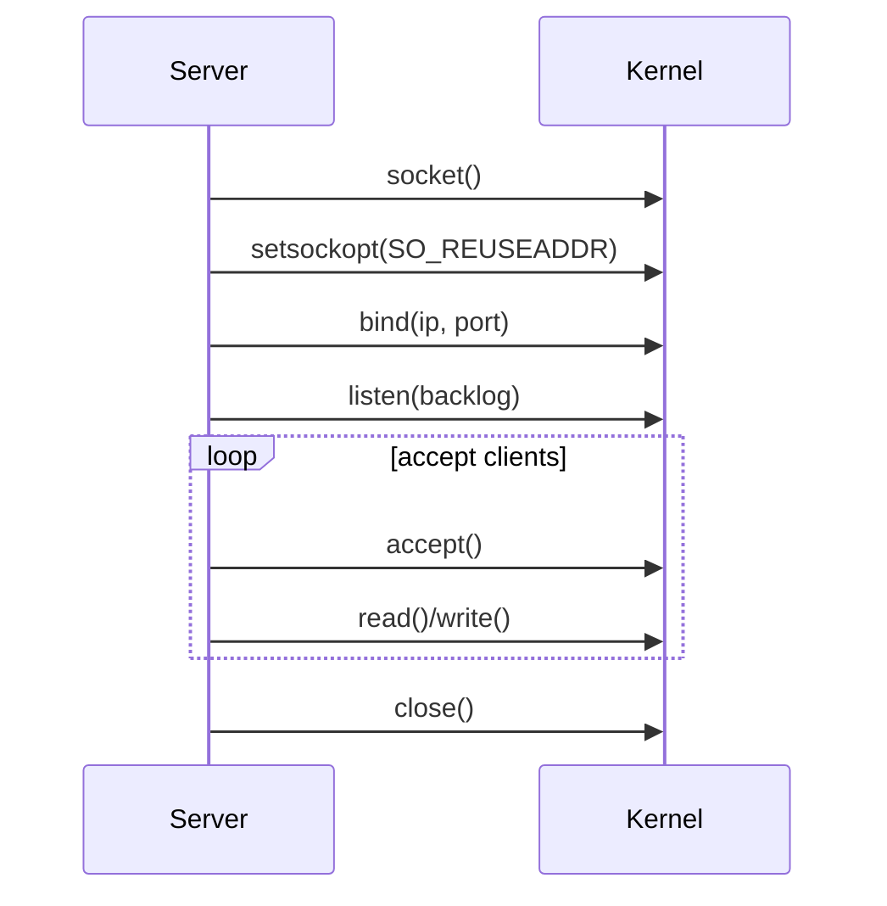

# Linux Socket 与 TCP

## 学习目标

- 理解 socket fd 的创建、绑定、监听、连接、读写和关闭生命周期。
- 能解释 TCP 三次握手、四次挥手和常见状态。
- 能正确处理阻塞/非阻塞 IO、短读短写、常见 `errno`、`SIGPIPE` 和网络字节序。
- 能写出一个可读的 C++ TCP echo server 雏形。

## 核心原理

### socket 生命周期

服务端典型流程：



客户端典型流程：

```text
socket -> connect -> read/write -> close
```

`socket()` 返回的是文件描述符，fd 只是进程访问内核对象的句柄。TCP 连接真正的协议状态、收发缓冲区、拥塞控制等都在内核里。

### 内核队列与连接进入路径

服务端 `listen()` 之后，内核维护的不是一个简单列表。SYN 到达后先进入半连接相关路径，三次握手完成后进入已完成连接队列，应用 `accept()` 只是把一个已完成连接取出来并创建新的连接 fd。队列长度受 `listen(backlog)`、内核参数、SYN cookie、accept 速度和 CPU 调度共同影响，不同 Linux 版本和配置细节会有差异。

典型路径：

```text
client SYN -> server SYN_RECV -> handshake done -> accept queue -> accept returns conn fd
```

如果应用处理太慢，已完成连接队列可能积压；如果遭遇大量半连接，SYN 队列和防护参数会影响行为。诊断时不要只看应用是否调用了 `listen`，还要看 accept 错误、队列溢出、握手重传和服务端 CPU 是否及时调度。

### TCP 状态

常见状态的工程含义：

| 状态 | 常见位置 | 说明 |
| --- | --- | --- |
| `LISTEN` | 服务端监听 socket | 已执行 `listen()`，等待连接 |
| `SYN_SENT` | 客户端 | 已发 SYN，等待 SYN+ACK |
| `SYN_RECV` | 服务端 | 半连接，已收到 SYN 并回 SYN+ACK |
| `ESTABLISHED` | 双方 | 连接建立，可传输数据 |
| `FIN_WAIT_1/2` | 主动关闭方 | 已发 FIN，等待对端确认或关闭 |
| `CLOSE_WAIT` | 被动关闭方 | 收到 FIN，应用还没 close |
| `LAST_ACK` | 被动关闭方 | 已 close 并发 FIN，等待 ACK |
| `TIME_WAIT` | 主动关闭方 | 等待旧报文自然消失，保护连接四元组 |

`TIME_WAIT` 不是错误。它保护可靠关闭和旧报文隔离。真正要警惕的是大量长期 `CLOSE_WAIT`，通常说明应用收到对端关闭后没有释放 fd。

### 建连、关闭与半关闭

TCP 关闭是双向字节流分别关闭。`shutdown(fd, SHUT_WR)` 表示本端不再发送，但仍可读取对端数据；`read()` 返回 0 表示对端发送方向已经关闭，本端是否继续写由协议决定。HTTP/1.1 普通响应通常不需要复杂半关闭，而代理、隧道或自定义流式协议可能需要保留半关闭状态。

常见关闭路径：

```text
local wants close -> stop reading new requests -> flush output -> shutdown write -> wait peer FIN/timeout -> close fd
peer FIN -> read returns 0 -> mark peer half-closed -> flush or close
RST/error -> discard buffers -> close fd
```

`SO_LINGER` 会改变 `close()` 行为，配置不当可能让关闭阻塞或发送 RST。教学和多数业务服务先使用默认关闭语义，再在明确需要快速复位或协议要求时研究它。

### bind、listen、accept、connect

- `bind()` 把本地地址绑定到 socket。服务端通常绑定端口；客户端一般让内核自动选择临时端口。
- `listen()` 把主动 socket 转成监听 socket。`backlog` 影响已完成连接队列容量，具体行为受内核参数影响。
- `accept()` 从已完成连接队列取出一个新连接 fd。监听 fd 继续负责接入，新 fd 负责数据传输。
- `connect()` 对阻塞 socket 通常等到连接建立或失败才返回；对非阻塞 socket 可能返回 `-1` 且 `errno=EINPROGRESS`，之后用可写事件和 `getsockopt(SO_ERROR)` 判断结果。

### 非阻塞 connect 的错误确认

非阻塞 `connect()` 返回 `EINPROGRESS` 不是失败，而是连接正在进行。事件循环监听可写后必须读取 `SO_ERROR`：

```cpp
int err = 0;
socklen_t len = sizeof(err);
if (::getsockopt(fd, SOL_SOCKET, SO_ERROR, &err, &len) < 0) {
    close(fd);                // getsockopt 本身失败，fd 状态不可继续信任
} else if (err == 0) {
    markConnected();
} else {
    errno = err;
    close(fd);                // ECONNREFUSED/ETIMEDOUT/ENETUNREACH 等
}
```

这段是简化片段，省略了 epoll 注册、deadline 和连接对象生命周期。关键是不要把“可写事件”直接等同于连接成功。

### 阻塞与非阻塞

阻塞/非阻塞描述系统调用在资源未就绪时是否等待：

- 阻塞 fd：`read()` 没数据时可能睡眠，`write()` 缓冲区满时可能睡眠。
- 非阻塞 fd：资源未就绪时立即失败，常见 `errno=EAGAIN` 或 `EWOULDBLOCK`。

设置非阻塞：

```cpp
#include <fcntl.h>
#include <stdexcept>

void setNonBlocking(int fd) {
    int flags = ::fcntl(fd, F_GETFL, 0);
    if (flags == -1) throw std::runtime_error("fcntl F_GETFL failed");
    if (::fcntl(fd, F_SETFL, flags | O_NONBLOCK) == -1) {
        throw std::runtime_error("fcntl F_SETFL failed");
    }
}
```

### 常见 errno

| errno | 场景 | 处理 |
| --- | --- | --- |
| `EINTR` | 被信号中断 | 通常重试系统调用 |
| `EAGAIN`/`EWOULDBLOCK` | 非阻塞资源未就绪 | 等下次事件 |
| `ECONNRESET` | 对端复位连接 | 关闭连接 fd |
| `ETIMEDOUT` | 连接或传输超时 | 关闭或按策略重试 |
| `EPIPE` | 向已关闭连接写 | 关闭连接，避免进程被 `SIGPIPE` 终止 |
| `EMFILE` | 进程 fd 达上限 | 限流、释放 idle fd、提高 `ulimit` |
| `ENFILE` | 系统 fd 达上限 | 系统级容量问题 |

### 短读短写

TCP 是字节流，不保留消息边界：

- `read(fd, buf, 4096)` 返回 100 字节并不代表消息只有 100 字节。
- `write(fd, buf, 4096)` 返回 1200 字节说明只写入了一部分，剩余数据必须缓存并等待下次可写。

网络程序不能假设一次读/写对应一次业务消息。

### 读写缓冲区数据流

服务端通常维护输入缓冲区和输出缓冲区：

```text
read fd -> input buffer -> codec -> request -> business -> response -> output buffer -> write fd
```

短读只影响输入缓冲区何时凑够一帧；短写要求把剩余数据留在输出缓冲区，并开启写事件。若输出缓冲区超过高水位，连接应暂停读取、拒绝新请求或断开低优先级客户端，否则慢客户端会把服务端内存拖垮。

### SIGPIPE

进程向已被对端关闭的 socket 写数据，可能收到 `SIGPIPE`，默认动作是终止进程。常见处理方式：

- 进程启动时忽略 `SIGPIPE`：`signal(SIGPIPE, SIG_IGN)`。
- Linux 下发送时使用 `send(fd, buf, len, MSG_NOSIGNAL)`。
- BSD/macOS 常用 `SO_NOSIGPIPE`，以平台文档为准。

### 端序

网络协议通常使用大端序，也叫网络字节序。主机字节序可能是小端，因此端口、IPv4 地址和二进制长度字段需要转换：

```cpp
uint16_t port = htons(8080);
uint32_t ip = htonl(INADDR_ANY);
uint16_t hostPort = ntohs(port);
```

## 工程实践/示例

一个简化的阻塞 echo server：

```cpp
#include <arpa/inet.h>
#include <csignal>
#include <cstring>
#include <iostream>
#include <stdexcept>
#include <sys/socket.h>
#include <unistd.h>

int main() {
    std::signal(SIGPIPE, SIG_IGN);

    int listenFd = ::socket(AF_INET, SOCK_STREAM, 0);
    if (listenFd < 0) throw std::runtime_error("socket failed");

    int on = 1;
    ::setsockopt(listenFd, SOL_SOCKET, SO_REUSEADDR, &on, sizeof(on));

    sockaddr_in addr{};
    addr.sin_family = AF_INET;
    addr.sin_addr.s_addr = htonl(INADDR_ANY);
    addr.sin_port = htons(8080);

    if (::bind(listenFd, reinterpret_cast<sockaddr*>(&addr), sizeof(addr)) < 0) {
        throw std::runtime_error("bind failed");
    }
    if (::listen(listenFd, SOMAXCONN) < 0) {
        throw std::runtime_error("listen failed");
    }

    std::cout << "listen on 0.0.0.0:8080\n";
    while (true) {
        int connFd = ::accept(listenFd, nullptr, nullptr);
        if (connFd < 0) {
            if (errno == EINTR) continue;
            perror("accept");
            continue;
        }

        char buf[4096];
        bool writeFailed = false;
        while (true) {
            ssize_t n = ::read(connFd, buf, sizeof(buf));
            if (n > 0) {
                ssize_t sent = 0;
                while (sent < n) {
                    ssize_t m = ::send(connFd, buf + sent, n - sent, MSG_NOSIGNAL);
                    if (m > 0) sent += m;
                    else if (m < 0 && errno == EINTR) continue;
                    else {
                        writeFailed = true;
                        break;
                    }
                }
                if (writeFailed) break;
            } else if (n == 0) {
                break; // peer closed
            } else if (errno == EINTR) {
                continue;
            } else {
                perror("read");
                break;
            }
        }
        ::close(connFd);
    }
}
```

这个示例易读但不适合大量连接：它一次只处理一个客户端。任意不可恢复的发送失败都会结束当前连接，不能丢弃未发送数据后继续读；阻塞 `send` 还可能被慢读客户端长期卡住，使服务无法继续 accept。高并发服务通常使用非阻塞 fd、输出缓冲和按需写事件。

### 返回值解释

示例里的错误处理边界：

- `socket/bind/listen` 失败是启动阶段不可恢复错误，示例直接抛异常；
- `accept` 被 `EINTR` 中断后继续循环，其他错误记录后继续服务；
- `read` 返回 `0` 表示对端正常关闭发送方向；
- `send` 返回正数可能小于剩余长度，所以继续发送未写完部分；
- `send` 失败后示例关闭连接，没有实现输出缓冲区和重试状态机。

生产代码还要处理 `EMFILE`：进程 fd 达上限时 `accept` 会失败。常见做法包括降低接入速率、关闭空闲连接、暴露告警并保留一个“idle fd”用于临时腾出错误处理空间；具体策略要和服务容量模型一致。

## 故障排查/观测

### 连接状态与队列

常用命令：

```bash
ss -tanp
ss -lnt
cat /proc/net/netstat
```

观察重点：

- `LISTEN` 是否存在，绑定地址是否正确；
- `Recv-Q/Send-Q` 是否长期积压；
- `SYN_RECV` 是否异常多，提示握手或攻击压力；
- `CLOSE_WAIT` 是否长期增长，提示应用未 close；
- `TIME_WAIT` 是否短期大量出现，通常先判断是否符合连接模式。

### 抓包和错误定位

`tcpdump` 能验证三次握手、FIN/RST、重传和窗口变化；应用日志应记录 fd、连接 id、peer/local 地址、状态转换、`errno` 和未发送字节数。连接问题要同时看客户端、服务端和中间负载均衡，因为 RST、超时和半关闭可能来自任一侧。

## 推导示例

### 一次非阻塞发送如何进入状态机

```text
business produce response
append to output buffer
try write
  wrote all -> disable EPOLLOUT
  wrote partial -> keep remaining, enable EPOLLOUT
  EAGAIN -> enable EPOLLOUT
  EPIPE/ECONNRESET -> close
```

这里的关键是输出缓冲区属于连接对象，而不是栈上的临时变量。`send` 返回后未写完的数据必须继续存在，直到下次可写事件处理完成或连接关闭。高水位触发时要暂停读取，否则应用会继续解析请求并产生更多响应。

### CLOSE_WAIT 的最小复盘

如果 `ss -tanp` 看到大量长期 `CLOSE_WAIT`，说明内核已经收到对端 FIN，应用也能从 `read` 看到 0，但进程没有关闭 fd。排查顺序是：读路径是否处理 `n == 0`，状态机是否从 PeerClosing 走到 close，是否有未完成输出缓冲阻塞关闭，是否有 shared_ptr 引用环让连接对象无法析构。

### 如何讲 accept 失败

`accept` 失败要先分临时错误和容量错误。`EINTR` 通常重试，`EAGAIN` 表示非阻塞监听 fd 暂无连接，`EMFILE` 是进程 fd 上限，`ENFILE` 是系统 fd 上限。容量错误需要限流和告警，不是简单 continue。

### 最小验收清单

- 建连成功通过 `SO_ERROR` 确认。
- 读写路径覆盖短读、短写、0、`EINTR`、`EAGAIN`。
- 关闭路径区分 FIN、RST、半关闭和超时。
- 日志包含 fd、连接 id、peer 和 errno。

## 常见误区

- 认为 TCP 是消息协议。TCP 只提供有序可靠字节流。
- 认为 `write()` 成功就等于对端应用已收到。它通常只表示数据进入本机内核发送缓冲区。
- 看到 `TIME_WAIT` 就试图全部消除。它是 TCP 正常机制。
- 忽略 `EINTR`、`EAGAIN` 和短写，导致偶发丢包或连接异常。
- 服务端忘记忽略 `SIGPIPE`，线上被单个断开连接打崩。

## 自测题

1. `accept()` 返回的新 fd 和监听 fd 分别负责什么？
2. 非阻塞 `connect()` 返回 `EINPROGRESS` 后如何判断连接成功？
3. 为什么大量 `CLOSE_WAIT` 比大量短期 `TIME_WAIT` 更值得警惕？
4. `read()` 返回 0 的语义是什么？
5. 为什么长度字段协议要规定字节序？

## 实践任务

- 写一个阻塞 echo server 和 client，用 `nc` 或自写 client 测试。
- 给 server 加上 `SIGPIPE` 处理和短写循环。
- 使用 `ss -tanp` 或 `netstat` 观察连接状态变化。
- 把 fd 改成非阻塞，观察无数据时 `read()` 的返回值和 `errno`。

## 延伸阅读

- `socket(2)`: https://man7.org/linux/man-pages/man2/socket.2.html
- `bind(2)`: https://man7.org/linux/man-pages/man2/bind.2.html
- `listen(2)`: https://man7.org/linux/man-pages/man2/listen.2.html
- `accept(2)`: https://man7.org/linux/man-pages/man2/accept.2.html
- `connect(2)`: https://man7.org/linux/man-pages/man2/connect.2.html
- `tcp(7)`: https://man7.org/linux/man-pages/man7/tcp.7.html
