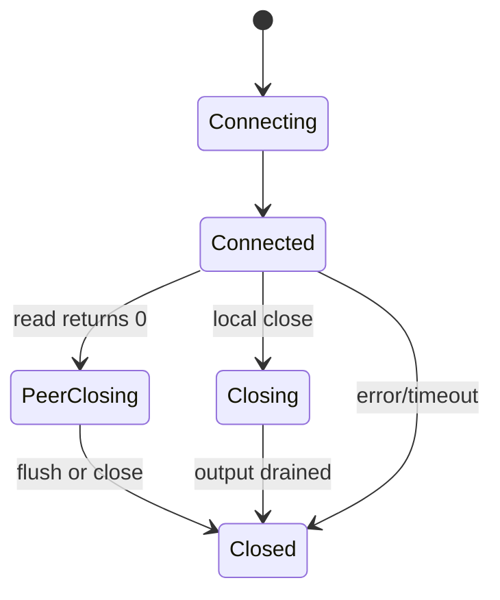

# 连接管理、定时器、线程池

## 学习目标

- 能设计连接对象的状态机和 fd 生命周期。
- 理解心跳、空闲超时、时间轮、最小堆定时器的取舍。
- 掌握线程池与 one-loop-per-thread 的职责边界。
- 理解背压，避免内存被慢连接拖垮。

## 核心原理

### 连接状态机

一个连接对象通常不是简单的 fd 包装，而是状态、缓冲区、定时器、协议解析器和回调的组合。



常见状态：

- `Connecting`：非阻塞 connect 进行中。
- `Connected`：可读写。
- `Closing`：本地决定关闭，可能还要写完输出缓冲区。
- `Closed`：fd 已移出 epoll 并关闭，连接对象等待释放。

### 状态机要驱动动作

状态名不是注释，必须限制允许的动作。例如 `Connected` 可以接收新请求，`Closing` 只能写完已排队响应，`Closed` 不能再刷新定时器或修改 epoll interest。每次状态迁移都应有触发原因、时间戳和最终资源动作。

```text
EPOLLIN -> read -> decode complete -> dispatch
read 0 -> PeerClosing -> no more input
high watermark -> pause reading
write buffer empty && Closing -> shutdown/close
timer expired -> Closing/Closed
```

把状态机写清楚后，连接关闭、超时、背压和跨线程响应都可以落在同一套规则上，而不是散落在各个回调里。

### fd 生命周期

正确顺序通常是：

```text
create fd -> set nonblock/cloexec -> register epoll -> process events -> unregister epoll -> close fd -> destroy connection
```

重要原则：

- fd 关闭前先从 epoll 移除或保证不会再访问对应连接对象。
- 连接对象析构不能和事件处理并发冲突。
- fd 数字会被内核复用，日志和 map key 不能把旧 fd 当成唯一长期身份。可以引入连接 id。

### fd 与连接 id

连接 id 通常由单调递增序号生成，用来区分 fd 复用带来的歧义。map 可以用连接 id 找对象，日志同时记录 fd 和 id：fd 方便和 `ss/lsof` 对照，id 方便追踪应用生命周期。

跨线程任务只携带连接 id 和业务数据，回到 IO 线程后再查表：

```text
worker done -> enqueue(ownerLoop, connId, response) -> ownerLoop find -> state check -> send/drop
```

如果连接已经关闭并被删除，响应直接丢弃或记录取消；不能在 worker 里保存连接裸指针后直接调用 `send`。

### 心跳与空闲超时

心跳用于发现半开连接或应用层长时间无响应；空闲超时用于释放无活动连接。

区别：

| 机制 | 目标 | 常见实现 |
| --- | --- | --- |
| TCP keepalive | 内核层探测死连接 | `SO_KEEPALIVE` 加系统参数 |
| 应用心跳 | 协议层确认对端业务可用 | ping/pong、heartbeat frame |
| 空闲超时 | 清理长时间无读写连接 | 每次活动刷新 deadline |

应用心跳不要过于频繁，否则大量连接会形成周期性流量尖峰。

### 定时器：时间轮与最小堆

| 数据结构 | 优点 | 缺点 | 适用 |
| --- | --- | --- | --- |
| 最小堆 | 实现简单，取最近超时方便 | 删除/更新需要额外索引或惰性删除 | 中小规模、精确超时 |
| 时间轮 | 批量超时效率高 | 精度由 tick 决定，实现复杂 | 大量连接、超时精度要求不高 |

最小堆常用惰性删除：刷新定时器时插入新记录，触发时检查 token/version 是否仍有效。

### 定时器精度与抖动

空闲超时不需要纳秒级精度。时间轮用 tick 换取批量处理效率，适合大量连接；最小堆更直观，适合先实现正确行为。定时器回调不要执行长时间业务逻辑，否则会阻塞同一事件循环的读写处理。大量连接同时刷新心跳时，可以加入少量随机抖动，避免周期性尖峰。

### 线程池

线程池适合处理 CPU 或阻塞型业务任务，避免阻塞 IO 线程。典型结构：

```text
IO thread: read/decode -> enqueue task
worker thread: run business -> produce response
IO thread: encode/write
```

业务线程不要直接操作连接 fd，除非框架设计了清晰的跨线程调度机制。更稳妥的方式是把响应投递回连接所属 IO 线程。

### 线程池队列和背压联动

线程池队列如果无限增长，会把过载变成内存上涨和尾延迟。更可控的做法是设置有界队列，并把队列满映射为明确策略：拒绝请求、返回过载、降级处理、调用方执行或暂停读取。网络层高水位、线程池队列长度和下游连接池等待时间应共同决定是否继续接收新请求。

### one-loop-per-thread

高性能网络库常用一个事件循环绑定一个线程：

- 每个连接固定归属某个 EventLoop。
- 连接的读写、缓冲区和状态机只在归属线程操作。
- 跨线程任务通过队列和 eventfd/pipe 唤醒目标 loop。

这种模型减少锁竞争，也让连接生命周期更可控。

### 跨线程唤醒

跨线程投递需要唤醒目标 loop。Linux 常用 `eventfd`，也可以用 pipe。生产者把任务放进线程安全队列后写 eventfd；IO 线程从 epoll 收到 eventfd 可读，读掉计数并执行队列任务。

```text
worker thread: lock queue -> push functor -> write eventfd
io thread: epoll eventfd readable -> read eventfd -> drain functor queue
```

不要只 push 队列不唤醒，否则目标 loop 可能要等到下一次网络事件或 timeout 才处理响应。

### 背压

背压是系统告诉上游“我处理不过来了”的机制。

网络服务里的背压点：

- 输出缓冲区超过高水位：暂停读取或拒绝新请求。
- 任务队列过长：返回过载错误或限流。
- 下游 RPC 超时/拥塞：减少并发，快速失败。
- 内存接近上限：主动断开低优先级或空闲连接。

没有背压时，慢客户端可能让服务端为每个连接累积大量待发送数据，最终 OOM。

## 工程实践/示例

### 最小堆定时器伪代码

```cpp
struct Timer {
    int64_t deadlineMs;
    uint64_t connId;
    uint64_t version;
    bool operator>(const Timer& other) const {
        return deadlineMs > other.deadlineMs;
    }
};

void refresh(Connection& c, int64_t nowMs, int64_t idleMs) {
    c.timerVersion++;
    heap.push(Timer{nowMs + idleMs, c.id, c.timerVersion});
}

void runExpired(int64_t nowMs) {
    while (!heap.empty() && heap.top().deadlineMs <= nowMs) {
        Timer t = heap.top();
        heap.pop();
        Connection* c = findConnection(t.connId);
        if (!c || c->timerVersion != t.version) continue;
        c->closeBecauseIdle();
    }
}
```

### 跨线程投递

```cpp
void onBusinessDone(EventLoop& ownerLoop, ConnId id, std::string response) {
    ownerLoop.runInLoop([id, response = std::move(response)]() mutable {
        if (Connection* c = findConnection(id)) {
            c->send(std::move(response));
        }
    });
}
```

关键点：业务线程只投递任务，不直接写 fd。

## 故障排查/观测

### 连接泄漏与卡死

连接管理至少暴露这些指标：当前连接数、各状态连接数、输入/输出缓冲区总量、定时器数量、超时关闭数、主动关闭数、错误关闭数。若连接数下降慢，按状态拆开看 `Closing` 是否等待写缓冲、`PeerClosing` 是否未释放、业务线程是否还有未返回任务。

### 定时器与跨线程问题

定时器问题常表现为连接永不超时或集中被关闭。检查刷新时是否增加 version、过期时是否跳过旧 timer、事件循环 timeout 是否取最近 deadline。跨线程问题常表现为业务已完成但客户端没收到响应，优先看 eventfd 写入是否失败、队列是否积压、连接 id 是否已失效。

## 推导示例

### 输出缓冲高水位

```text
output bytes < low watermark  -> normal read
output bytes > high watermark -> disable read interest / reject new request
write drained below low       -> re-enable read interest
```

使用高低水位而不是单一阈值，可以避免读事件在边界附近频繁开关。这个策略会牺牲单个慢连接的吞吐，但保护进程总内存和其他连接的延迟。

### 线程池关闭时的连接响应

如果关闭时选择 drain，线程池要继续执行已接受任务，但连接可能先被客户端断开。业务完成后投递回 IO 线程时必须重新检查连接 id 和状态。若选择 cancel，未开始任务应返回取消状态，IO 线程再决定发送错误响应还是直接关闭连接。

### 如何讲 one-loop-per-thread

这个模型的重点是“连接状态局部化”。每个连接只在所属 loop 线程修改状态、缓冲区和 fd interest；其他线程通过队列投递任务并唤醒 owner loop。它减少锁竞争，但需要处理跨线程投递积压和连接迁移问题。

### 最小验收清单

- 连接状态迁移有触发事件和资源动作。
- timer refresh 有 version 或可删除索引。
- 跨线程投递有 wakeup 和失效连接检查。
- 高低水位能限制输出缓冲增长。

## 常见误区

- fd close 后连接对象仍可能被旧事件访问。
- 业务线程直接读写 socket，破坏连接归属。
- 只做心跳不做空闲超时，死连接仍长期占资源。
- 输出缓冲区无限增长。
- 线程池越大越好。线程过多会增加上下文切换和缓存抖动。

## 自测题

1. 为什么 fd 数字不能作为长期唯一连接身份？
2. one-loop-per-thread 如何减少锁竞争？
3. 最小堆定时器如何处理刷新和删除？
4. 输出缓冲区高水位应该触发什么动作？
5. 业务线程为什么不建议直接操作 socket？

## 实践任务

- 给 epoll echo server 增加连接 id 和状态机。
- 实现空闲超时，分别用最小堆和惰性删除。
- 增加输出缓冲区高水位，超过阈值时暂停读事件。
- 实现一个固定大小线程池，把业务处理投递出去，再投递回 IO 线程写响应。

## 延伸阅读

- `eventfd(2)`: https://man7.org/linux/man-pages/man2/eventfd.2.html
- `timerfd_create(2)`: https://man7.org/linux/man-pages/man2/timerfd_create.2.html
- `pthread(7)`: https://man7.org/linux/man-pages/man7/pthreads.7.html
