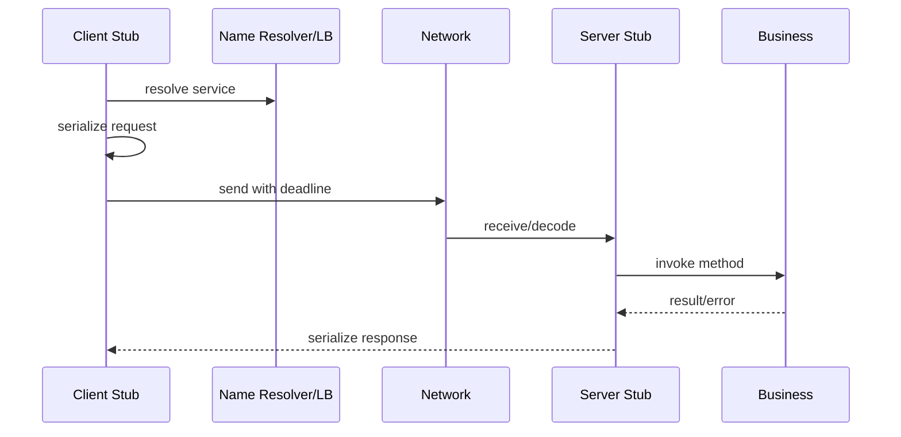

# HTTP、WebSocket、RPC

## 学习目标

- 掌握 HTTP/1.1 的请求响应、连接复用和常见边界。
- 理解 WebSocket 握手、帧和心跳。
- 理解 RPC 从 IDL 到序列化、连接、超时、取消和服务治理的调用链。
- 能在工程中区分协议、框架和治理能力。

## 核心原理

### HTTP/1.1 要点

HTTP/1.1 是文本头部加可选 body 的请求响应协议。典型请求：

```http
GET /users/42 HTTP/1.1
Host: example.com
Connection: keep-alive

```

关键点：

- 请求行：方法、路径、版本。
- 响应行：版本、状态码、原因短语。
- Header：元数据，例如 `Host`、`Content-Length`、`Transfer-Encoding`。
- Body：可选，长度由 `Content-Length` 或 chunked 等机制确定。
- 一个 TCP 连接上可以处理多个请求，称为 keep-alive。

HTTP/1.1 默认支持持久连接，但服务端仍可根据空闲超时、错误或策略关闭连接。

### HTTP/1.1 的数据边界

HTTP 解析要先读 header，再根据规则确定 body 长度。请求方法、响应状态码、`Content-Length`、`Transfer-Encoding: chunked` 等规则共同决定不同报文的 body 语义，不能混用成“读到 close 为止”的简单模型，否则 keep-alive 下会把下一个报文的数据误当成当前 body。具体语义以 RFC 和框架实现为准。

请求处理流：

```text
read bytes -> parse request line/header -> decide body framing -> read body -> route -> write response -> keep/close
```

服务端应限制请求行、header 总量、单 header、body 大小和读取时间。HTTP parser 是安全边界，不只是字符串处理。

### keep-alive

keep-alive 的好处是减少 TCP 握手开销，风险是长连接占用 fd 和内存。服务端通常要配置：

- 最大空闲时间。
- 单连接最大请求数。
- 请求头/body 最大大小。
- 慢请求或慢 body 的读取超时。

### 队头阻塞

HTTP/1.1 单连接上请求和响应顺序受限制，慢请求或慢响应会影响后续请求。即使客户端使用 pipeline，服务端和中间代理支持也有限，工程上更常见的是多连接或 HTTP/2 多路复用。学习 HTTP/1.1 时要先把连接复用、空闲超时和请求顺序处理清楚，再比较 HTTP/2 的差异。

### WebSocket

WebSocket 先通过 HTTP Upgrade 握手：

```http
GET /chat HTTP/1.1
Host: example.com
Upgrade: websocket
Connection: Upgrade
Sec-WebSocket-Key: ...
Sec-WebSocket-Version: 13
```

握手成功后，连接从 HTTP 请求响应切换成 WebSocket 帧协议。

WebSocket 帧关注：

- opcode：文本、二进制、关闭、ping、pong。
- mask：客户端到服务端帧需要 mask，具体规则以 RFC 为准。
- payload length：可能使用扩展长度。
- ping/pong：应用层保活。

### WebSocket 连接管理

WebSocket 是长连接，认证、限流和资源管理不能只在握手时做一次。服务端通常需要连接上限、每连接订阅数上限、消息大小上限、心跳超时、认证过期处理和慢客户端背压。浏览器、代理和移动网络可能在空闲时断开连接，因此 ping/pong 更像可观测的存活检测，不是可靠业务确认。

### RPC 调用链

一次 RPC 通常经过：



RPC 框架通常封装：

- IDL：定义服务、方法、请求和响应。
- 序列化：Protobuf、Thrift 等。
- 传输：HTTP/2、TCP、自定义协议等。
- 超时和取消：deadline、context cancellation。
- 负载均衡和服务发现。
- 重试、熔断、限流和监控。

### status 与错误模型

RPC 错误要区分传输错误、协议错误、服务不可用、超时取消和业务错误。传输错误通常不知道服务端是否执行；业务错误表示请求到达并被明确拒绝；超时可能在任意阶段发生。错误模型如果混乱，客户端就无法判断是否能重试。

一个清晰的 RPC 响应至少包含稳定 status code、可观测 request id、可选业务错误详情和是否可重试的策略来源。不要把所有失败都映射成 `Internal` 或 HTTP 500。

### IDL 与序列化

IDL 的价值在于把跨语言接口固定下来，使 client stub 和 server stub 能由工具生成。序列化只是其中一层。一个好的 RPC 设计还要明确错误模型、超时语义和兼容策略。

### 超时与取消

RPC 必须有 deadline。没有超时的调用会在故障时堆积线程、连接和内存。

取消要沿调用链传播：

```text
client timeout -> cancel local wait -> stop retry -> propagate cancellation -> server stops unnecessary work
```

如果服务端不能感知取消，客户端虽然返回了，后端仍可能继续消耗资源。

### deadline 传播

deadline 是绝对截止时间或可推导的剩余预算，不是每一层重新设置的固定 timeout。A 调 B 还有 80 ms，B 调 C 就不能再给 C 500 ms。服务端收到 deadline 后要在排队、获取连接、执行 SQL/RPC 和写响应前反复检查剩余时间。

### 服务治理

服务治理是围绕 RPC 的运行时能力：

- 服务发现：找到可用实例。
- 负载均衡：分配请求。
- 健康检查：剔除异常实例。
- 熔断限流：保护依赖和自身。
- 观测性：日志、指标、trace。
- 灰度发布：按版本、标签或流量比例路由。

## 工程实践/示例

### HTTP 解析边界

解析 HTTP 时至少限制：

- 请求行长度。
- header 总大小和单 header 大小。
- body 大小。
- header 读取超时。
- keep-alive 空闲超时。

这些限制是安全边界，不只是性能参数。

### RPC deadline 伪代码

```cpp
RpcResult callUserService(Request req, Deadline deadline) {
    if (deadline.expired()) return RpcError::Timeout;

    auto conn = pool.acquire(deadline.remaining());
    if (!conn) return RpcError::Unavailable;

    auto callId = conn->send(req, deadline);
    auto res = conn->wait(callId, deadline.remaining());
    if (res.timeout()) {
        conn->cancel(callId);
        return RpcError::Timeout;
    }
    return res;
}
```

### WebSocket 心跳

服务端可以记录每个连接的最后 pong 时间：

```text
every heartbeatInterval:
  send ping
  if now - lastPong > heartbeatTimeout:
      close connection
```

心跳间隔和超时要结合移动网络、代理和业务实时性设定。

## 故障排查/观测

### HTTP/WebSocket 观测

HTTP 服务至少记录方法、路径模板、状态码、请求大小、响应大小、处理耗时、连接复用信息和限流/超时原因。WebSocket 还要记录连接数、消息速率、ping/pong 延迟、输出缓冲区大小、断开原因和认证刷新失败次数。

### RPC 调用链排查

RPC 问题按阶段拆：解析服务名、获取连接、排队、序列化、网络发送、服务端排队、业务执行、下游调用、响应解码。trace 能显示时间花在哪里；指标要区分 deadline exceeded、cancelled、unavailable、resource exhausted 和业务拒绝。重试日志应包含 attempt、退避时间、剩余 deadline 和最终状态。

## 推导示例

### HTTP body 长度判断

一个 keep-alive 连接上，服务端不能通过“读到连接关闭”判断普通请求体结束，因为连接关闭还意味着无法复用后续请求。解析器必须根据方法、状态码、`Content-Length`、chunked 等规则确定 body 边界；遇到冲突或超过限制时返回 400/413 并关闭或丢弃连接，具体策略取决于框架和协议版本。

### RPC 重试是否安全

读请求通常更容易重试，写请求必须先证明幂等。比如 `CreateOrder` 可以要求客户端提供 idempotency key，服务端用唯一约束保存 key 与结果。第一次执行成功但响应丢失时，第二次请求命中同一 key，返回第一次结果，而不是创建第二个订单。

### 如何讲 RPC deadline

deadline 是调用链预算，不是单个 socket 读超时。讲清楚时要覆盖排队、连接池获取、序列化、网络传输、服务端执行、下游调用和取消传播。没有取消传播时，客户端超时只能释放本地等待，不能释放服务端资源。

### 最小验收清单

- HTTP parser 有 header/body 大小和时间限制。
- WebSocket 有心跳、消息上限和慢客户端策略。
- RPC status 区分取消、超时、不可用和业务错误。
- 重试只发生在幂等或可去重请求上。

## 常见误区

- 把 HTTP keep-alive 当成业务心跳。
- 只给客户端设置超时，不给服务端和下游依赖设置 deadline。
- RPC 重试没有幂等判断，导致重复扣款或重复写入。
- WebSocket 长连接不做认证刷新、心跳和连接上限。
- 服务治理只接入注册中心，不做指标、熔断和限流。

## 自测题

1. HTTP/1.1 如何确定 body 长度？
2. keep-alive 的收益和资源成本是什么？
3. WebSocket 握手为什么从 HTTP Upgrade 开始？
4. RPC deadline 和 socket read timeout 有什么区别？
5. 为什么 RPC 重试需要幂等设计？

## 实践任务

- 写一个最小 HTTP parser，只支持 `GET` 和 `Content-Length`，并限制 header 大小。
- 给 TCP 服务加 WebSocket ping/pong 心跳模型。
- 用 Protobuf 定义一个简单 RPC 方法，并手写 client/server stub 的伪实现。
- 为 RPC 调用加入 deadline、取消和一次受控重试。

## 延伸阅读

- HTTP Semantics: https://www.rfc-editor.org/rfc/rfc9110
- HTTP/1.1: https://www.rfc-editor.org/rfc/rfc9112
- WebSocket RFC: https://www.rfc-editor.org/rfc/rfc6455
- gRPC 官方文档: https://grpc.io/docs/
- Protobuf 官方文档: https://protobuf.dev/
