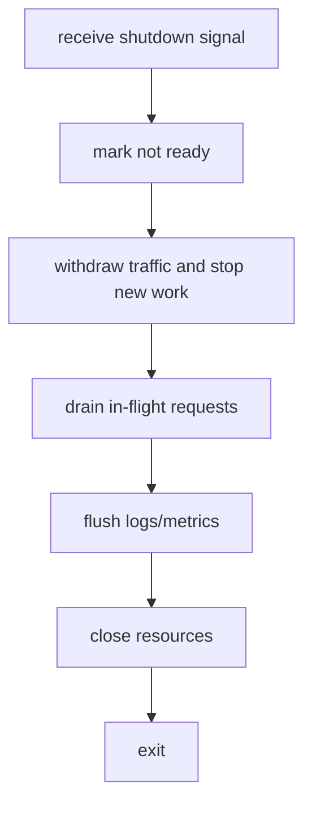
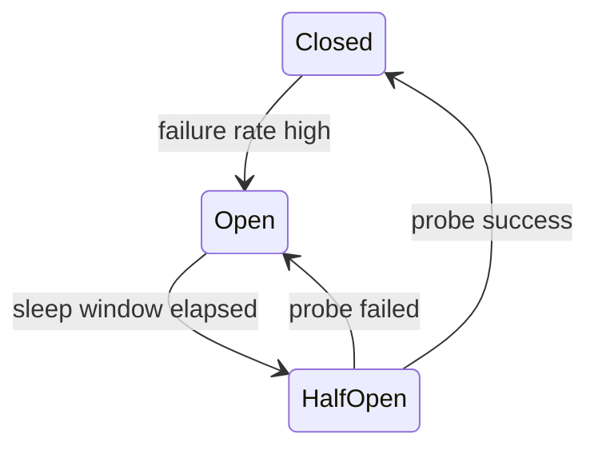

# 生命周期与服务韧性

本章关注单进程/单服务的启动关闭、连接与资源保护；跨服务调用链中的熔断、降级和治理见[韧性工程：限流、熔断、降级](../06-分布式系统/03-韧性工程-限流熔断降级.md)。

## 学习目标

- 理解服务优雅启动、关闭和连接排空。
- 掌握信号处理的安全边界。
- 能解释限流、超时、重试、熔断、降级和幂等。
- 能识别重试风暴和级联故障。

## 核心原理

### 优雅启动

启动不只是 `listen` 成功。生产服务通常需要：

1. 加载配置和密钥。
2. 初始化日志、指标和 tracing。
3. 建立依赖连接池。
4. 完成健康检查依赖。
5. 开始监听端口。
6. 对外暴露 ready 状态。

如果服务还没准备好就接流量，会把初始化失败放大成用户请求失败。

### ready 与 live

`live` 表示进程是否还应该被运行时保留，`ready` 表示实例是否适合接收新流量。启动阶段依赖未准备好时应保持 not ready；关闭排空时也应先切 not ready，让负载均衡停止分配新请求。不要因为一个下游短暂失败就轻易让 live 失败，否则运行时会频繁重启实例并放大故障。

### 优雅关闭与连接排空

关闭流程：



连接排空要求：

- 停止接收新连接或新请求。
- 已接收请求在 deadline 内完成。
- 超过关闭预算后强制结束。
- 对长连接通知客户端重连。

### 关闭预算

优雅关闭必须有总预算。预算内完成：停止接入、等待在途请求、flush 日志指标、释放资源；预算耗尽后进入强制关闭。没有预算会导致发布或缩容卡住，有预算但不记录强制关闭数量会掩盖真实尾部问题。

### 信号处理

信号 handler 里只能做异步信号安全的事情。常见工程做法是：

- handler 设置 `volatile sig_atomic_t` 标志，或向 pipe/eventfd 写一个字节。
- 主事件循环看到标志后执行完整关闭逻辑。

不要在 signal handler 里做复杂日志、加锁、分配内存或关闭大量对象。

### 信号到关闭流程

收到 `SIGTERM` 后不应直接 `exit()`。更稳妥的路径是 handler 通知主循环，主循环切 ready、停止 accept、关闭空闲连接、等待在途请求，并在 deadline 到达后关闭剩余连接。若服务运行在 systemd、Kubernetes 或容器平台，要理解平台发送信号和强杀之间的时间窗口。

### 限流

限流用于保护服务容量。常见策略：

| 策略 | 说明 | 适用 |
| --- | --- | --- |
| 固定窗口 | 每个窗口固定额度 | 简单但边界突刺明显 |
| 滑动窗口 | 按时间片平滑统计 | API 网关 |
| 令牌桶 | 按速率生成令牌，允许短突发 | 通用请求限流 |
| 漏桶 | 固定速率流出 | 平滑下游流量 |
| 并发限制 | 限制同时处理请求数 | 保护线程、连接和下游 |

### 限流返回值

限流不是静默丢弃。HTTP API 通常返回 429 或 503，并带上可选 `Retry-After`；RPC 通常返回资源耗尽或不可用状态。内部队列满时要让调用方知道请求没有被接受，避免调用方以为请求已经进入处理流程。

### 超时

超时应该分层：

- 连接建立超时。
- 请求读取超时。
- 业务处理超时。
- 下游 RPC 超时。
- 整体 deadline。

整体 deadline 应向下游传递，避免每层都重新给一个完整超时，导致总耗时失控。

### 超时覆盖所有等待点

只设置 socket read timeout 不够。请求可能卡在 accept 后读 header、线程池排队、连接池 acquire、下游调用、数据库锁等待或响应写回。每个等待点都要能消费同一个总体 deadline，并在超时后释放占用的槽位。

### 重试

重试只适合短暂、可恢复、幂等或可去重的失败。重试策略需要：

- 最大次数。
- 指数退避和随机抖动。
- 只对可重试错误重试。
- 尊重整体 deadline。
- 配合熔断和限流。

### 熔断与降级

熔断是在依赖持续失败时快速失败，避免继续压垮依赖。常见状态：



降级是在完整能力不可用时提供低成本或弱一致结果，例如返回缓存、默认值、简化结果或只读模式。

### 熔断状态的取舍

熔断器应基于时间窗口内的请求量和失败比例，而不是单纯累计错误数。请求量太少时失败比例没有统计意义；half-open 探测数量太大又会瞬间压回故障依赖。降级结果必须带指标和日志，避免用户长期拿到低质量结果而系统看起来“全绿”。

### 幂等与重试风暴

幂等表示同一请求执行多次与执行一次的业务效果一致。写操作常用幂等键、请求去重表或业务唯一约束保护。

重试风暴是故障时大量客户端同时重试，流量成倍放大。应通过退避、抖动、限流、熔断和服务端 `Retry-After` 等机制控制。

## 工程实践/示例

### 优雅关闭伪代码

```cpp
volatile std::sig_atomic_t stopping = 0;

void onSignal(int) {
    stopping = 1;  // 处理函数只做最小、异步信号安全的通知
}

void eventLoop() {
    bool draining = false;
    while (running) {
        pollOnce();
        if (stopping != 0 && !draining) {
            health.setNotReady();
            acceptor.stop();
            connectionManager.startDrain(std::chrono::seconds(30));
            draining = true;
        }
        connectionManager.closeExpiredDrainingConnections();
        if (connectionManager.drained()) running = false;
    }
}
```

更完整的事件驱动服务可使用 self-pipe、`eventfd` 或 `signalfd`：信号处理函数只执行异步信号安全的通知，真正的健康状态切换、停止 accept 和连接排空仍在事件循环中完成。不要把普通“线程安全”等同于 POSIX 的“异步信号安全”。

### 重试策略伪代码

```cpp
for (int attempt = 0; attempt < maxAttempts; ++attempt) {
    auto result = call(deadline.remaining());
    if (result.ok()) return result;
    if (!result.retryable() || deadline.expired()) return result;
    sleepWithJitter(backoff(attempt), deadline.remaining());
}
```

### 错误分类

重试前先分类错误：

- 可重试：短暂网络错误、连接池暂不可用、被限流且有剩余 deadline；
- 不可重试：参数错误、鉴权失败、业务唯一约束冲突；
- 结果不确定：写请求发送后连接断开、提交阶段超时。

结果不确定的写操作不能简单再次执行，必须依赖幂等键、请求去重表或业务状态查询。

## 故障排查/观测

### 级联故障信号

级联故障常见指标组合是：下游延迟上升、本服务线程池/连接池等待上升、重试次数上升、错误率上升、P99 拉长、队列长度增加。此时盲目扩容客户端或加大连接池可能继续压垮下游。优先减少并发、打开熔断、降低重试和启用降级。

### 关闭验证

验证优雅关闭时应模拟：无请求关闭、长请求关闭、慢客户端关闭、WebSocket 长连接关闭、线程池仍有任务关闭。观察 ready 切换时间、最后一个新请求时间、在途请求完成数、强制关闭数和进程退出码。

## 推导示例

### 调用链 deadline 分配

入口请求剩余 300 ms 时，本服务如果排队用了 40 ms，业务计算用了 30 ms，下游 RPC 就只剩约 230 ms，还要预留响应写回时间。每层重新设置 300 ms 会让总耗时线性放大；多层重试时还可能成倍放大。

```text
ingress deadline -> queue wait -> local work -> downstream remaining -> response
```

### 熔断与限流的顺序

限流保护本服务入口，熔断保护对下游的调用。故障时通常先通过限流限制新请求，再通过熔断快速失败已进入的下游调用，最后按业务重要性降级。三者都要暴露指标，否则无法判断是容量不足、依赖故障还是策略过严。

### 如何讲优雅关闭

完整回答应包含：收到信号、切 not ready、停止 accept 或新请求、等待在途请求、长连接通知重连、超时强制关闭、flush 日志指标和退出码。只说“收到 SIGTERM 后 close”会遗漏流量摘除和关闭预算。

### 最小验收清单

- ready/live 语义分离。
- 每个等待点受 deadline 控制。
- 限流、熔断、降级都有指标。
- 关闭测试覆盖慢请求和长连接。

## 常见误区

- 收到信号后立即 `exit`，丢失正在处理的请求。
- 每层服务都重试三次，导致调用链指数放大。
- 对非幂等写请求无脑重试。
- 熔断只按错误数，不看请求量和时间窗口。
- 降级没有观测指标，线上静默返回低质量结果。

## 自测题

1. ready 和 live 健康检查分别表达什么？
2. 为什么优雅关闭要先停止接入新流量？
3. 整体 deadline 如何防止调用链耗时失控？
4. 熔断的 half-open 状态有什么作用？
5. 如何让创建订单接口支持安全重试？

## 实践任务

- 给 TCP 服务加 `SIGTERM` 优雅关闭。
- 实现一个令牌桶限流器。
- 给 RPC 调用加指数退避和 jitter。
- 设计一个带幂等键的写接口，并说明服务端存储策略。

## 延伸阅读

- `signal-safety(7)`: https://man7.org/linux/man-pages/man7/signal-safety.7.html
- Google SRE Book - Handling Overload: https://sre.google/sre-book/handling-overload/
- Google SRE Book - Addressing Cascading Failures: https://sre.google/sre-book/addressing-cascading-failures/
