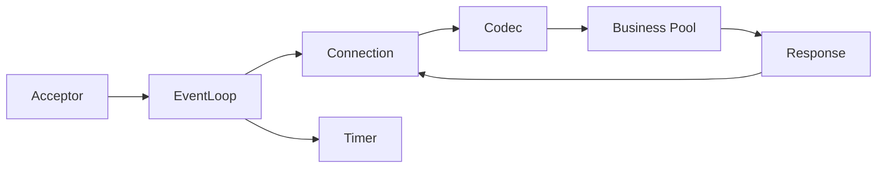

# 网络服务开发

这组笔记面向 C++ 后端网络服务开发：从 Linux socket 和 TCP 基础开始，逐步过渡到 IO 多路复用、连接管理、协议编解码、HTTP/WebSocket/RPC、服务韧性、性能工程与常见框架选型。

## 建议学习顺序

| 顺序 | 文件 | 重点问题 |
| --- | --- | --- |
| 1 | [01-Linux-Socket与TCP.md](01-Linux-Socket与TCP.md) | 一个 TCP 连接如何从 socket 调用走到内核状态机 |
| 2 | [02-IO模型与epoll.md](02-IO模型与epoll.md) | 阻塞、非阻塞、同步、异步和 epoll 的工程含义 |
| 3 | [03-连接管理-定时器-线程池.md](03-连接管理-定时器-线程池.md) | 如何管理大量连接、超时、fd 生命周期和线程模型 |
| 4 | [04-协议编解码.md](04-协议编解码.md) | 半包粘包为什么发生，如何写健壮解码器 |
| 5 | [05-HTTP-WebSocket-RPC.md](05-HTTP-WebSocket-RPC.md) | 常见应用层协议与 RPC 调用链 |
| 6 | [06-生命周期与服务韧性.md](06-生命周期与服务韧性.md) | 服务如何启动、关闭、限流、超时、重试和降级 |
| 7 | [07-资源池与性能工程.md](07-资源池与性能工程.md) | 如何衡量和定位网络服务性能问题 |
| 8 | [08-框架与构建工具.md](08-框架与构建工具.md) | 如何理解框架定位、构建系统和依赖管理 |

## 学习方法

1. 先画出数据流：客户端请求、内核 socket 缓冲区、事件循环、解码器、业务线程、响应写回。
2. 对每个系统调用问三个问题：什么时候阻塞，返回值代表什么，失败后 fd 还能不能继续使用。
3. 小步写实验代码：echo server、长度字段协议、空闲超时、简单线程池、压测和火焰图。
4. 面试复盘时不要背 API，优先解释边界条件：短读短写、EINTR/EAGAIN、连接关闭、背压、重试风暴。

## 知识依赖

- Socket/TCP 是入口：先理解 fd、内核队列、短读短写、半关闭和常见 `errno`。
- IO 模型建立事件循环视角：epoll 只通知就绪，真正读写、缓冲、状态迁移仍由应用完成。
- 连接管理把单连接扩展到多连接：状态机、定时器、one-loop-per-thread 和跨线程唤醒共同决定生命周期。
- 协议编解码定义消息边界：framing、增量解析、校验和兼容性决定网络字节流能否安全变成业务请求。
- HTTP/WebSocket/RPC 是应用层协议实践：deadline、status、取消和 IDL 需要和底层连接模型对齐。
- 生命周期、韧性和性能工程贯穿所有章节：优雅关闭、限流、重试、熔断、池化和压测都要用指标验证。

## 推荐总实践

最终可以实现一个小型 TCP 服务框架：

最小目标：

- 支持非阻塞 TCP echo。
- 支持长度字段协议。
- 支持空闲连接超时。
- 支持优雅关闭。
- 用 `wrk`、`ab`、`iperf` 或自写脚本做基础压测。

阶段成果建议：

- 第一阶段：阻塞 echo server，能解释每个 socket API 返回值和错误路径。
- 第二阶段：epoll Reactor，支持输入/输出缓冲区、按需写事件和连接状态日志。
- 第三阶段：长度字段协议，覆盖半包、多包、非法长度和版本不兼容测试。
- 第四阶段：连接管理，支持空闲超时、跨线程业务投递、背压和优雅关闭。
- 第五阶段：框架对照，用 brpc/gRPC/Asio/Drogon/oatpp 任一实现同类最小服务并写出选型理由。

## 验收证据

- 有能运行的最小服务和客户端，覆盖正常连接、断开、半包和短写。
- 有状态观测：连接数、状态分布、缓冲区长度、定时器数量和错误码。
- 有故障实验：慢客户端、连接池耗尽、线程池队列满、超时取消和优雅关闭。
- 有性能记录：压测命令、并发、QPS、P95/P99、错误率、CPU、内存和瓶颈判断。

## 官方参考入口

- Linux man-pages: https://man7.org/linux/man-pages/
- CMake 文档: https://cmake.org/documentation/
- gRPC 文档: https://grpc.io/docs/
- Protocol Buffers 文档: https://protobuf.dev/
- Boost.Asio 文档: https://www.boost.org/doc/libs/release/doc/html/boost_asio.html
- brpc 文档: https://brpc.apache.org/docs/
