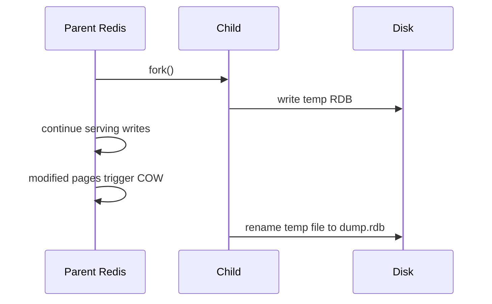
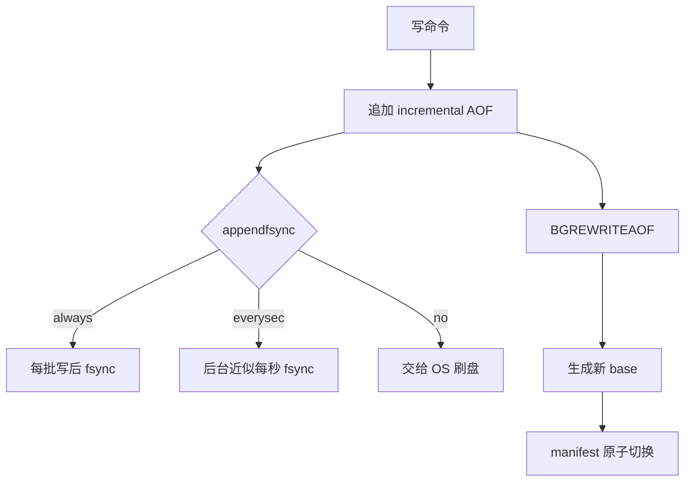
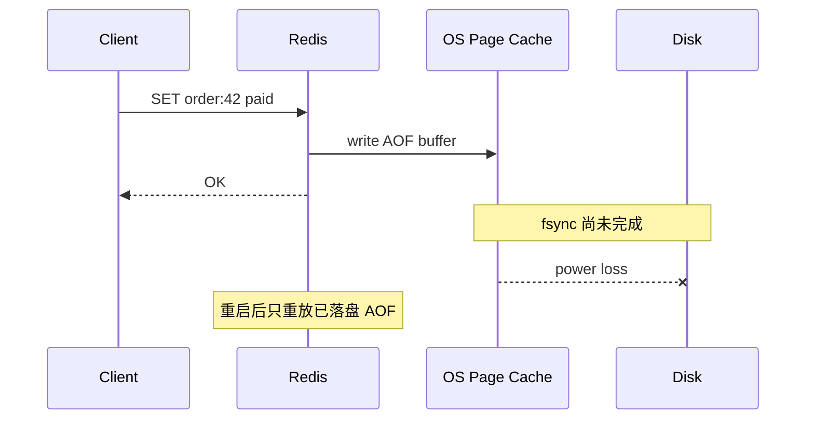

# 持久化：RDB 与 AOF

## 学习目标

- 理解 RDB 快照和 AOF 追加日志的恢复方式、性能代价和数据丢失窗口。
- 能解释 fork、copy-on-write、rewrite、fsync 对延迟、内存和磁盘 IO 的影响。
- 能根据缓存、会话、队列辅助状态、业务状态等场景选择持久化与备份策略。

## 核心原理

Redis 持久化解决“进程或机器重启后如何恢复内存数据”。RDB 保存某个时间点的数据快照；AOF 记录修改数据集的写命令，重启时重放来重建状态。Redis 也允许不开持久化，或同时使用 RDB+AOF；当两者都启用时，恢复通常优先使用包含更新更多的 AOF。

| 维度 | RDB | AOF |
| --- | --- | --- |
| 记录内容 | 数据快照 | 写命令日志，Redis 7 起使用多段 AOF：base、incremental、manifest |
| 恢复速度 | 通常较快，直接加载快照 | 取决于 base + incremental 日志大小 |
| 数据丢失窗口 | 两次快照之间 | 取决于 `appendfsync` 策略和故障类型 |
| IO 模式 | fork 子进程生成临时 RDB 后原子替换 | 追加写、周期 fsync、后台 rewrite |
| 适合场景 | 备份、灾难恢复、可接受较大窗口 | 更关注最近写入保留 |

### RDB：fork、COW 和恢复

`BGSAVE` 会 fork 子进程。子进程基于 fork 时刻的内存视图写临时 RDB 文件，完成后替换旧文件。父进程继续处理请求；如果父进程在快照期间修改页面，操作系统 copy-on-write 会复制被修改页面，导致内存短时升高。



RDB 失败窗口：

- 快照间隔内宕机，最近写入可能丢失。
- fork 期间内存接近上限，COW 额外内存可能触发 OOM 或 swap。
- 大实例加载 RDB 时，恢复时间受磁盘吞吐和数据量影响；恢复完成前服务不可用或数据不完整。

### AOF：追加、刷盘和 rewrite

AOF 在写命令执行后把命令追加到文件缓冲，再按策略刷盘。官方文档列出三类策略：`always`、`everysec`、`no`。`everysec` 是常见折中，故障时可能丢失约 1 秒附近的数据，但不能被描述成严格上限；内核、磁盘、虚拟化和断电方式都会影响结果。

```conf
appendonly yes
appendfsync everysec
```

rewrite 不是“压缩原文件”，而是根据当前内存数据生成一份能重建同等状态的更短日志。Redis 7.0 起多段 AOF 中，rewrite 会生成新的 base 文件，父进程继续写新的 incremental 文件，最后通过 manifest 原子切换。



### RDB 与 AOF 的组合取舍

| 场景 | 建议思路 | 理由 |
| --- | --- | --- |
| 纯缓存，可从 DB 回源 | RDB 或关闭强持久化 | 优先保障延迟和可用性，数据可重建 |
| 会话、限流、任务状态 | AOF `everysec` + 备份演练 | 丢失窗口较小，仍需接受重复/丢失补偿 |
| 账务、订单最终事实 | Redis 不做唯一事实源 | 应以数据库/日志系统为准，Redis 可做缓存或辅助状态 |
| 大实例备份 | RDB 快照 + 异地复制 | RDB 文件适合周期备份，但要错峰 fork |

## 工程实践/示例

### 配置评估清单

```text
数据是否可重建：是/否
允许丢失窗口：0 / 1s级 / 分钟级 / 小时级
恢复时间目标 RTO：多久恢复服务
恢复点目标 RPO：最多丢多少数据
实例内存峰值：used_memory + fork COW + replication/AOF buffer
磁盘余量：RDB/AOF 当前大小 + rewrite 临时空间 + 备份空间
```

### 观测指标

```redis
INFO persistence
INFO memory
INFO stats
```

重点字段：

- `rdb_bgsave_in_progress`、`rdb_last_bgsave_status`：RDB 是否正在生成和上次状态。
- `aof_enabled`、`aof_rewrite_in_progress`、`aof_last_bgrewrite_status`：AOF 与 rewrite 状态。
- `aof_delayed_fsync`：fsync 延迟累计，升高说明磁盘跟不上。
- `used_memory_rss`、`mem_fragmentation_ratio`：结合 COW 判断内存压力。
- `latest_fork_usec`：fork 耗时，和延迟尖刺高度相关。

### 故障时序：AOF everysec 断电



如果这类状态不能丢，不能只靠 Redis AOF；要把最终事实写入数据库或事务日志，并让 Redis 从事实源恢复。

## 常见误区

| 误区 | 正确认知 |
| --- | --- |
| 开了 AOF 就不会丢数据 | fsync 策略决定风险窗口，硬件和内核也会影响结果 |
| RDB 没有线上影响 | fork、copy-on-write、磁盘写入都可能带来延迟尖刺 |
| rewrite 只是压缩文件 | rewrite 会消耗 CPU、内存和磁盘 IO，需要容量余量 |
| 持久化等于备份 | 持久化文件可能被误删或损坏，仍需异地备份与恢复演练 |
| 副本能替代持久化 | 异步复制会复制错误写入和删除，也可能在主重启空数据时被污染 |

## 自测题

1. RDB 生成期间写入大量数据，为什么内存会升高？
2. AOF rewrite 与普通 AOF 追加分别解决什么问题？
3. 缓存集群是否一定要开启 AOF？判断依据是什么？
4. Redis 同时启用 RDB 和 AOF 后，为什么恢复通常使用 AOF？
5. `appendfsync always` 为什么更安全但可能显著增加延迟？

## 实践任务

- 设计一份 Redis 持久化风险评估表，列出数据类型、可重建性、允许丢失窗口、恢复时长目标。
- 在测试环境压测 `BGSAVE` 和 `BGREWRITEAOF` 期间 P99/P999 延迟变化。
- 写一个巡检脚本，输出 `INFO persistence` 中的失败状态、rewrite 状态和 fsync 延迟计数。

## 延伸阅读

- Redis persistence：https://redis.io/docs/latest/operate/oss_and_stack/management/persistence/
- Redis configuration：https://redis.io/docs/latest/operate/oss_and_stack/management/config/
- Redis memory optimization：https://redis.io/docs/latest/operate/oss_and_stack/management/optimization/memory-optimization/
