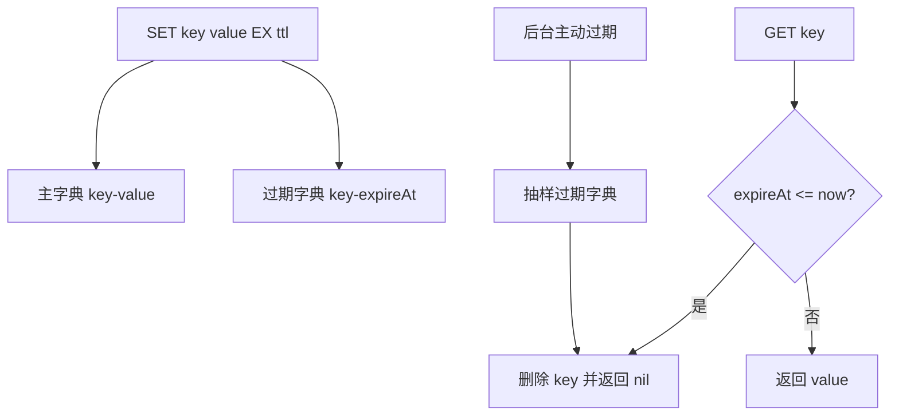
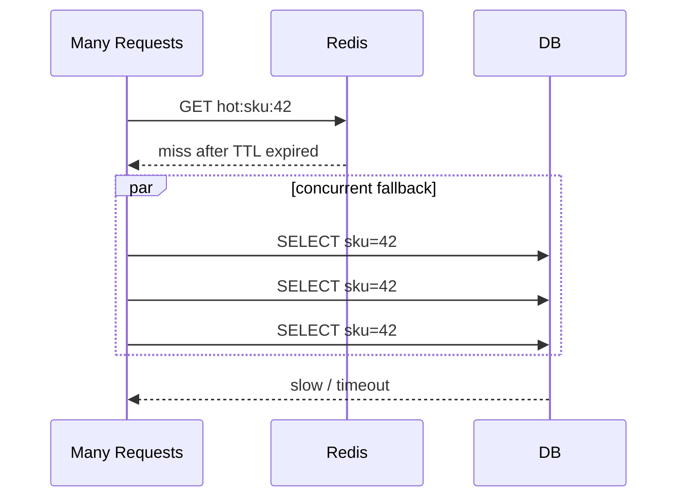

# 过期、淘汰与缓存故障

## 学习目标

- 理解 TTL、过期字典、惰性删除、主动过期和内存淘汰策略的区别。
- 掌握缓存穿透、击穿、雪崩的故障时序、工程处理手段和监控指标。
- 能设计带随机 TTL、空值缓存、互斥回源、逻辑过期、限流和降级保护的缓存方案。

## 核心原理

过期是 key 到达 TTL 后的生命周期管理；淘汰是实例内存达到 `maxmemory` 限制后的空间腾挪。二者不是一回事：没有 TTL 的 key 不会因过期被删除，但在 `allkeys-*` 淘汰策略下仍可能因内存压力被淘汰。

### 过期字典与删除流程

Redis 为设置过期时间的 key 维护过期元数据，可以直观理解为“主字典保存 key-value，过期字典保存 key-expireAt”。key 到期后不保证立刻消失，删除通常来自两条路径：

- 惰性删除：访问 key 时发现过期，先删除再返回不存在。
- 主动过期：后台周期抽样检查过期 key，避免大量冷 key 永久占用内存。



### maxmemory 淘汰

当写入导致内存超过 `maxmemory`，Redis 会按 `maxmemory-policy` 淘汰 key 或返回错误。官方策略包括 `noeviction`、`allkeys-lru`、`allkeys-lfu`、`allkeys-random`、`volatile-lru`、`volatile-lfu`、`volatile-random`、`volatile-ttl` 等；不同 Redis 版本还可能增加策略，生产文档应以当前官方配置说明为准。

| 策略家族 | 候选 key | 适用场景 | 风险 |
| --- | --- | --- | --- |
| `noeviction` | 不淘汰 | Redis 存半持久状态，宁愿写失败 | 写请求报错，业务要处理 |
| `allkeys-*` | 所有 key | 纯缓存 | 没 TTL 的 key 也会被淘汰 |
| `volatile-*` | 只淘汰带 TTL 的 key | 混合缓存和少量常驻状态 | 没足够 TTL key 时可能写失败 |

淘汰不是精准 LRU/LFU 全量排序，工程上应把它当近似策略。更重要的是为 key 设置合理 TTL、拆分大 key、控制写入峰值，并监控内存水位。

### 穿透、击穿、雪崩的故障时序

| 问题 | 成因 | 典型时序 | 常用措施 |
| --- | --- | --- | --- |
| 缓存穿透 | 查询不存在数据，每次打到数据库 | 请求无效 ID -> Redis miss -> DB miss -> 下次仍 miss | 参数校验、空值缓存、布隆过滤器 |
| 缓存击穿 | 单个热点 key 过期，大量请求同时回源 | 热 key 到期 -> 并发 miss -> DB 被同一查询打满 | 互斥锁、逻辑过期、后台刷新 |
| 缓存雪崩 | 大量 key 同时失效或 Redis 不可用 | 批量 TTL 到点/集群故障 -> 大量 miss -> DB/下游崩溃 | TTL 抖动、多级缓存、限流降级 |



## 工程实践/示例

### 互斥回源 + 空值缓存

```pseudo
value = redis.get(key)
if value == EMPTY:
    return not_found
if value exists:
    return deserialize(value)

if redis.set(lock_key, request_id, nx=true, ex=3s):
    try:
        data = db.query(id)
        if data is null:
            redis.set(key, EMPTY, ex=random(30s, 60s))
        else:
            redis.set(key, serialize(data), ex=random(5m, 10m))
        return data
    finally:
        release_lock_by_lua(lock_key, request_id)

sleep(20ms)
return redis.get(key) or degraded_response()
```

空值缓存要短 TTL，并区分“真实空对象”和“缓存占位”。布隆过滤器适合挡掉明显不存在的 ID，但有误判率，并且新增数据时要维护过滤器同步。

### 逻辑过期

热点 key 可以让物理 TTL 更长，在 value 内保存 `logical_expire_at`。请求读到逻辑过期值时，先返回旧值，再由单个后台刷新者异步重建缓存。它牺牲短时间新鲜度，换取热点稳定性。

```json
{
  "logical_expire_at": "2026-08-31T10:05:00Z",
  "payload": {"sku_id": 42, "price": 19900}
}
```

### 观测指标

- `keyspace_hits`、`keyspace_misses`：命中率突降是雪崩或穿透信号。
- `expired_keys`、`evicted_keys`：过期删除和内存淘汰速率。
- `used_memory`、`maxmemory`、`mem_fragmentation_ratio`：内存水位和碎片。
- DB QPS、慢查询、连接池等待：判断 miss 是否已经压垮回源。
- 按业务 key 维度的 miss TopN：定位击穿和穿透来源。

### 容量估算

```text
miss_qps = total_qps * (1 - hit_rate)
db_query_cost = miss_qps * avg_db_latency
雪崩回源峰值 ~= 同批过期 key 数 * 单 key 并发请求数
```

当 miss_qps 超过 DB 可承受吞吐时，增加 Redis 节点通常不是第一手段；先做 TTL 抖动、互斥回源、限流和降级。

## 常见误区

| 误区 | 正确认知 |
| --- | --- |
| 设置 TTL 后内存会准时释放 | 过期删除不是实时强保证 |
| 空值缓存会污染缓存 | 空值缓存要配短 TTL，并区分真实空对象和缓存占位 |
| 布隆过滤器能彻底防穿透 | 布隆过滤器有误判率，且需要处理数据新增同步 |
| 雪崩只靠加机器解决 | 回源风暴会压垮数据库，必须有降级和限流 |
| 淘汰策略能替代容量设计 | 淘汰是最后防线，不能代替 key 规模上限和热点治理 |

## 自测题

1. 缓存击穿和缓存穿透的根因有什么不同？
2. 为什么逻辑过期适合热点 Key？
3. Redis 内存淘汰和 Key TTL 过期有什么区别？
4. `volatile-lru` 在大量 key 没有 TTL 时有什么风险？
5. 命中率下降时如何区分穿透、击穿和雪崩？

## 实践任务

- 为一个秒杀商品缓存设计互斥回源、逻辑过期和降级响应。
- 写出空值缓存的数据格式，要求能避免和真实业务空值混淆。
- 设计一组 Grafana 面板：命中率、过期速率、淘汰速率、DB 回源 QPS、回源锁竞争。

## 延伸阅读

- Redis key expiration：https://redis.io/docs/latest/develop/using-commands/keyspace/
- Redis `EXPIRE` command：https://redis.io/docs/latest/commands/expire/
- Redis eviction：https://redis.io/docs/latest/develop/reference/eviction/
