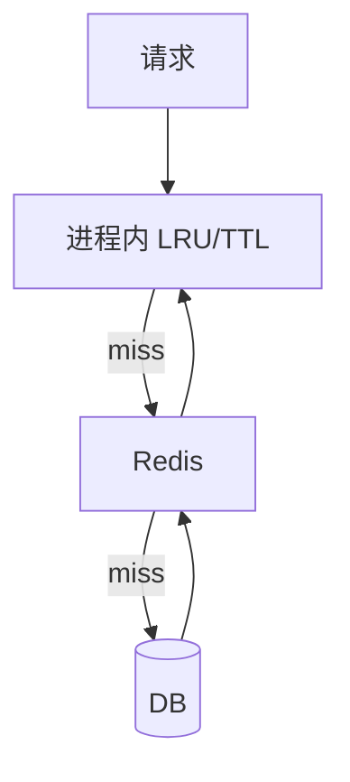
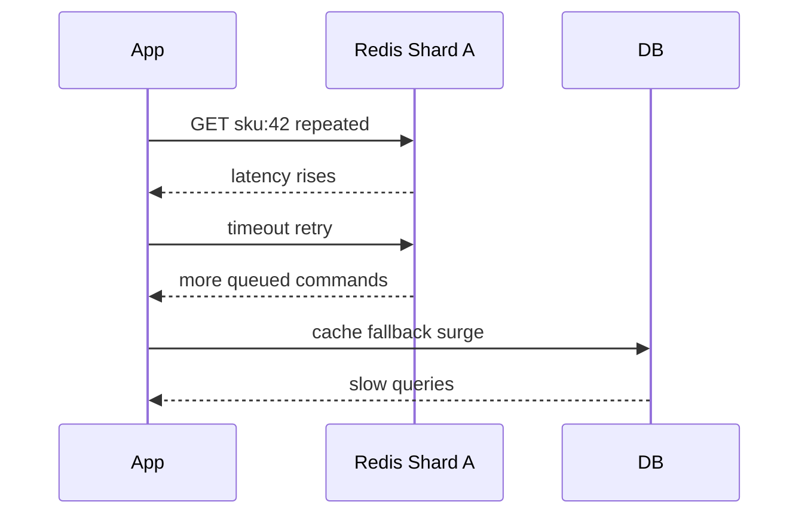

# 热 Key、大 Key 与性能治理

## 学习目标

- 能识别热 Key、大 Key、慢命令和阻塞操作。
- 掌握拆分、复制、本地缓存、限流和异步化等治理方式。
- 理解性能问题往往来自数据模型和访问模式，而不只是 Redis 参数。

## 核心原理

热 Key 是访问集中，容易打满单分片 CPU、网卡或连接；大 Key 是单个 Key 的 value 或元素集合过大，容易导致网络传输、内存分配、删除和复制延迟。

| 类型 | 典型表现 | 检测方式 | 处理方式 |
| --- | --- | --- | --- |
| 热 Key | 单 Key QPS 极高 | 代理统计、客户端埋点、`--hotkeys` | 本地缓存、读副本、Key 分片 |
| 大 Key | value 很大或元素很多 | `MEMORY USAGE`、扫描采样 | 拆 Key、分页、异步删除 |
| 慢命令 | P99/P999 抖动 | slowlog、latency doctor | 替换命令、分批处理 |
| 阻塞 | 整实例响应变慢 | 监控事件循环延迟 | 避免同步大删除和长 Lua |

## 工程实践/示例

大集合删除优先使用异步释放：

```redis
UNLINK huge:set:20260831
```

大 Hash 拆分示例：

```text
user:profile:{uid}:base
user:profile:{uid}:stats
user:profile:{uid}:flags
```

热点商品详情可组合本地缓存和 Redis：



### 热 Key 的发现路径

热 Key 不一定是访问次数最高的 key，也可能是返回体巨大、单次耗时长或集中在某个分片的 key。发现应同时看客户端、代理和 Redis 侧证据：

| 观测位置 | 指标 | 价值 |
| --- | --- | --- |
| 客户端埋点 | key 模板、QPS、P99、错误率、返回字节 | 最接近业务请求，可区分接口来源 |
| 代理/网关 | 单 key TopN、单分片流量、连接数 | 能发现跨服务共享热点 |
| Redis | `SLOWLOG`、`INFO commandstats`、`redis-cli --hotkeys` | 能确认实例压力，但 key 维度有限 |
| 系统层 | CPU、网卡、内存带宽、fork 延迟 | 判断瓶颈是否已经越过 Redis 命令本身 |

`--hotkeys` 依赖采样和内部统计，适合辅助定位，不应作为唯一证据。更稳妥的方案是在客户端封装层按 key 模板聚合，例如把 `sku:123:detail` 归一为 `sku:{id}:detail`，同时保留 TopN 原始 key。

### 大 Key 的拆分与迁移

大 Key 的危险不只是内存占用。它会放大网络传输、慢删除、AOF/RDB fork COW、复制缓冲和 Cluster 迁移成本。拆分时优先按访问边界拆，不要机械分片。

| 大 Key 类型 | 拆分方式 | 读取方式 | 注意点 |
| --- | --- | --- | --- |
| 大 String JSON | 按字段域拆成多个 Hash/String | 只取需要字段 | 保持版本号，避免多 key 组合旧值 |
| 大 Hash | 按业务域或 hash bucket 拆 | `HSCAN`/分页读取 | 字段 TTL 需要 Redis 7.4+；生命周期/容量边界不同仍建议拆开 |
| 大 Set | 按 member hash 分桶 | 分桶判断或离线合并 | 集合运算会变复杂 |
| 大 ZSet | 按时间窗口或排行榜周期拆 | 查询最近窗口再合并 | 全局排名需要额外计算 |

迁移大 Key 时避免一次性 `DUMP/RESTORE` 或跨集群大批量同步压满网络。更安全的流程是：冻结或双写、分批复制、校验数量和抽样 checksum、切读、观察、清理旧 key。删除旧 key 优先 `UNLINK`，让释放内存异步化。

```pseudo
cursor = 0
do:
    cursor, fields = HSCAN(old_key, cursor, COUNT 1000)
    for field, value in fields:
        bucket = crc32(field) % 64
        HSET new_key(bucket), field, value
while cursor != 0
```

### 性能治理决策案例

秒杀商品详情热读：

1. L1 本地缓存设置极短 TTL，降低 Redis QPS。
2. Redis 缓存使用逻辑过期，后台单飞刷新。
3. DB 回源加互斥锁和限流，失败返回可接受的旧值。
4. 大促前预热热点 key，活动结束后降级本地缓存容量。

大 V 粉丝集合：

1. 关注关系最终事实放数据库。
2. Redis Set 只保留常用关系判断或分桶缓存。
3. 粉丝列表分页走数据库/搜索系统，避免 `SMEMBERS`。
4. 离线任务维护计数和 TopN，不在请求路径做大集合交集。

### 故障时序：热 Key 打满单分片



处理顺序应先止血：关闭无意义重试、启用本地缓存/静态降级、限制回源并发；再做拆分、预热、长期模型调整。

### 容量估算与阈值

```text
single_key_bandwidth = key_qps * avg_value_bytes
delete_pause_risk ~= elements_or_bytes / allocator_free_speed
reshard_time ~= key_bytes / effective_network_bandwidth + restore_cost
```

给 key 设计硬阈值：String value 最大大小、集合最大成员数、单次返回最大 M、删除是否必须 `UNLINK`、是否允许在线迁移。超过阈值时写入侧就应拒绝或转入异步存储，而不是等排障时才发现。

## 常见误区

| 误区 | 正确认知 |
| --- | --- |
| 大 Key 只影响内存 | 还影响复制、持久化、网络和删除延迟 |
| 热 Key 加 Redis 节点就能解决 | Cluster 中单 Key 仍落在一个 slot 和分片上 |
| Lua 一定更快 | 长 Lua 会阻塞事件循环，应控制执行时间 |
| 慢查询只看数据库 | Redis 也需要 slowlog 和延迟监控 |

## 自测题

1. 为什么热 Key 在 Cluster 中不能靠自动分片消除？
2. `DEL` 和 `UNLINK` 的工程差异是什么？
3. 如何判断一个 Hash 是否应该拆分？

## 实践任务

- 设计热 Key 发现指标：按 Key QPS、流量、命中率、P99 延迟输出 TopN。
- 将一个包含 100 万成员的 Set 访问方案改造成可分页、可恢复的批处理方案。

## 延伸阅读

- Redis latency：https://redis.io/docs/latest/operate/oss_and_stack/management/optimization/latency/
- Redis memory optimization：https://redis.io/docs/latest/operate/oss_and_stack/management/optimization/memory-optimization/
