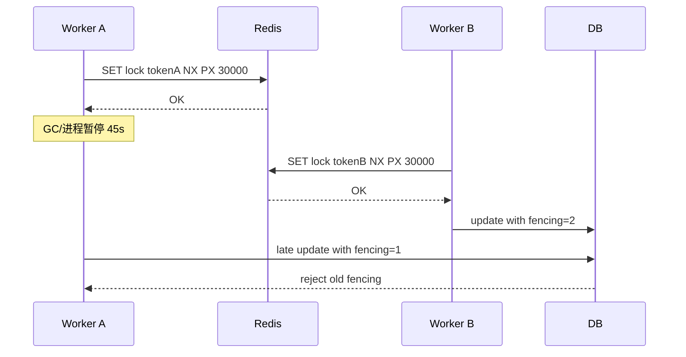

# 分布式锁、事务与一致性边界

## 学习目标

- 区分 Redis 命令原子性、Redis 事务、Lua 原子执行和分布式一致性。
- 掌握 Redis 分布式锁的正确释放、租约、续期和 fencing token 边界。
- 能判断哪些场景不应依赖 Redis 锁作为最终一致性保障。

## 核心原理

Redis 单命令原子性表示一条命令执行期间不会被同实例其他命令打断。Redis 事务用 `MULTI/EXEC` 批量顺序执行命令，但不提供传统数据库事务回滚。Lua 脚本在单实例上原子执行多步逻辑。分布式一致性则涉及多个节点和外部系统，Redis 本身不能自动保证数据库、消息队列、对象存储的端到端一致。

| 概念 | 保证范围 | 不保证 |
| --- | --- | --- |
| 命令原子性 | 单实例单命令 | 多命令业务流程 |
| `MULTI/EXEC` | 命令排队后顺序执行 | 失败自动回滚、跨系统事务 |
| Lua | 单实例脚本整体执行 | 长脚本不阻塞、跨 slot 原子 |
| 分布式锁 | 在租约有效期内减少并发进入 | 业务执行一定完成、外部资源强一致 |
| fencing token | 下游按递增令牌拒绝旧请求 | 下游不校验时无效果 |

## 工程实践/示例

加锁使用随机 value，释放必须校验 value：

```redis
SET lock:order:42 req-uuid NX PX 30000
```

释放锁 Lua：

```lua
if redis.call("GET", KEYS[1]) == ARGV[1] then
  return redis.call("DEL", KEYS[1])
else
  return 0
end
```

锁租约过短会导致任务还在执行时锁已过期；续期可以降低风险，但不能消除进程暂停、网络分区和下游乱序写入。对会产生外部副作用的场景，应让下游资源校验 fencing token：

```pseudo
token = redis.incr("lock_token:resource")
if acquire_lock(resource, token):
    db.update_where_token_greater(resource, token, changes)
```

### MULTI/EXEC/WATCH 的精确语义

`MULTI` 之后命令先排队，`EXEC` 才按顺序执行。Redis 事务提供“执行期间不插入其他客户端命令”的隔离，但不提供关系型数据库那种失败回滚：某条命令在执行阶段报错，其他已执行命令不会自动撤销。`WATCH` 是乐观锁，监控 key 在 `EXEC` 前是否被修改；被修改则 `EXEC` 返回空，客户端应重读并重试。

```redis
WATCH stock:sku42
GET stock:sku42
MULTI
DECRBY stock:sku42 1
SADD order:req:done req-1001
EXEC
```

CAS 重试伪代码：

```pseudo
for i in range(max_retry):
    WATCH key
    old = GET key
    new = compute(old)
    MULTI
    SET key new
    result = EXEC
    if result != null:
        return ok
return conflict
```

### Lua 的边界

Lua 适合把“读-判断-写”放进单实例原子块，例如扣库存、释放锁、幂等记录。脚本运行期间会阻塞 Redis 主线程，所以脚本必须短小、key 数可控、不能做无界循环。在 Cluster 中，脚本访问的 key 必须落在同一个 hash slot，否则客户端或服务端会拒绝跨 slot 原子操作。

```lua
-- KEYS[1]=stock key, KEYS[2]=dedup key, ARGV[1]=request_id
if redis.call("SISMEMBER", KEYS[2], ARGV[1]) == 1 then
  return 2
end
local stock = tonumber(redis.call("GET", KEYS[1]) or "0")
if stock <= 0 then
  return 0
end
redis.call("DECR", KEYS[1])
redis.call("SADD", KEYS[2], ARGV[1])
return 1
```

### 租约锁、续期和进程暂停

Redis 锁通常是租约：`SET lock value NX PX ttl` 成功后，只在 TTL 时间内表示“我大概率是持有者”。如果进程 STW、容器被暂停、网络卡顿或业务下游阻塞，锁可能过期并被别人获得；旧持有者恢复后继续写外部系统，就会产生乱序副作用。



续期只能降低“任务正常但 TTL 不够”的概率，不能消灭暂停和网络分区。涉及外部副作用时，应使用 fencing token，并要求下游按单调递增 token 拒绝旧写。

### 主从切换与锁安全

单主 Redis 锁在主从异步复制下存在切换窗口：客户端 A 在旧主加锁成功，锁尚未复制到副本；旧主宕机，副本晋升；客户端 B 在新主也加锁成功。此时两个客户端都认为自己持有锁。若业务不能接受并发进入，必须使用下游 fencing、数据库唯一约束、事务状态机或更适合的协调系统。

### 观测指标与告警

- 锁获取成功率、等待时间、冲突次数、续期失败次数。
- 锁持有时间分布，尤其是接近 TTL 的比例。
- Lua 执行耗时、慢日志、`BUSY` 或脚本超时事件。
- `WATCH` 冲突率，冲突率高说明 CAS 不适合该热点路径。
- 下游 fencing 拒绝次数；拒绝上升可能代表旧 worker 恢复写入。

## 常见误区

| 误区 | 正确认知 |
| --- | --- |
| Redis 锁等于分布式事务 | 锁不是提交协议，无法自动回滚外部系统 |
| 续期后锁就绝对安全 | 续期线程也会受 GC、调度、网络影响 |
| 释放锁直接 `DEL` | 会误删别人已经重新获取的锁 |
| Redlock 适合所有场景 | 需要结合故障模型、时钟、业务副作用和官方说明谨慎评估 |

## 自测题

1. Redis `MULTI/EXEC` 和关系型数据库事务最大的差异是什么？
2. 为什么释放锁必须比较 value？
3. fencing token 需要下游系统做什么配合？

## 实践任务

- 实现一个库存扣减 Lua 脚本，要求库存不足返回明确错误码。
- 为“生成唯一发票号”场景评估 Redis 锁是否足够，并写出更稳妥方案。

## 延伸阅读

- Redis transactions：https://redis.io/docs/latest/develop/interact/transactions/
- Redis Lua scripting：https://redis.io/docs/latest/develop/programmability/eval-intro/
- Redis distributed locks：https://redis.io/docs/latest/develop/use/patterns/distributed-locks/
