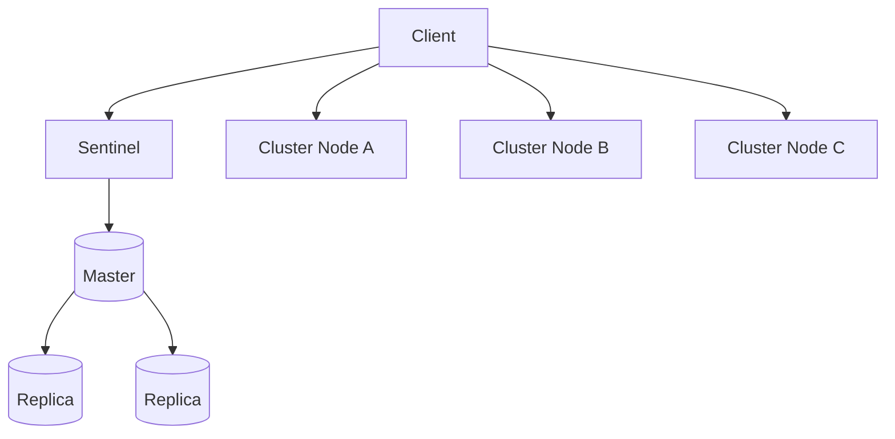
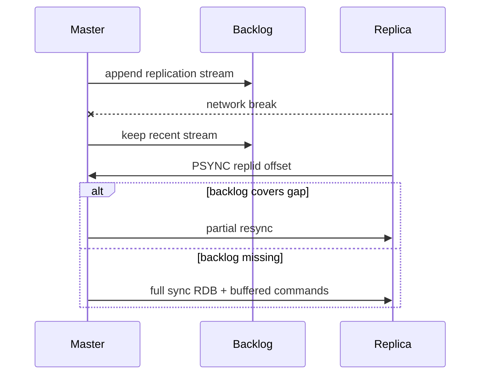
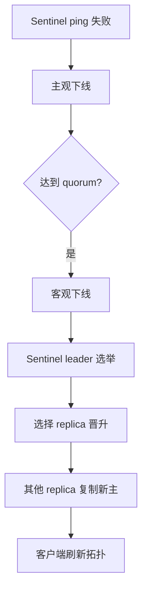

# 主从、哨兵与 Cluster

## 学习目标

- 理解复制、哨兵故障转移和 Cluster 分片的职责。
- 能解释复制延迟、故障切换窗口、slot 迁移和跨 slot 限制。
- 掌握读写分离和高可用架构的常见风险。

## 核心原理

主从复制用于数据副本和读扩展；Sentinel 负责监控、选主和通知；Cluster 通过 16384 个 hash slot 做数据分片并提供高可用。它们解决的是可用性和扩展性，不等于强一致复制。



| 架构 | 解决问题 | 主要限制 |
| --- | --- | --- |
| 主从复制 | 读扩展、数据副本 | 异步复制可能丢数据 |
| Sentinel | 自动故障转移 | 切换期间短暂不可用或写入失败 |
| Cluster | 水平分片、高可用 | 多 Key 跨 slot 操作受限 |

## 工程实践/示例

Cluster 多 Key 操作要使用 hash tag 保证落在同一 slot：

```text
cart:{user42}:items
cart:{user42}:coupon
```

读副本前要评估复制延迟。对“刚写后立即读”的请求，如果读到副本，可能出现短暂旧数据。关键读路径应读主库，或使用业务版本号处理旧值。

### 复制 backlog、全量同步和增量同步

Redis 复制默认按异步复制理解。主节点维护 replication offset 和一段 backlog 缓冲；副本断线重连时携带已处理 offset，请求 `PSYNC`。如果主节点 backlog 仍保留缺失的复制流，可以增量同步；否则需要全量同步，由主节点生成 RDB 并传给副本，再补发期间积累的写命令。



工程配置思路：

- backlog 太小会让短暂断线也变全量同步，放大 fork、网络和磁盘压力。
- 大实例全量同步会冲击主节点和副本，扩容或重建副本要错峰。
- 副本可用于读扩展，但读旧值、复制中断和加载 RDB 阻塞都要纳入 SLA。

### Sentinel failover 控制流程

Sentinel 负责监控主节点、主观下线、客观下线、选举 leader Sentinel、挑选副本晋升、通知其他副本改挂新主，并让客户端刷新主节点地址。它提高可用性，但切换期间会有写失败、连接断开、旧主隔离后恢复等窗口。



失败窗口：

- 旧主接受了未复制写入后宕机，晋升副本缺少这部分数据。
- 客户端连接池未及时刷新，继续向旧地址写入失败或写到恢复后的旧主。
- 网络分区导致短暂双主视角，业务需要幂等、版本或 fencing 兜底。

### Cluster slot、redirect 和 reshard

Redis Cluster 把 key 映射到 16384 个 hash slot，每个 slot 由某个主分片负责。客户端可以请求任意节点；节点发现 slot 不归自己时返回 `MOVED`，客户端应更新 slot cache 并重试。reshard 迁移期间还可能出现 `ASK`，客户端应对单次请求发 `ASKING` 后访问目标节点。

```text
GET user:42
-MOVED 8000 10.0.0.2:6379
```

多 key 命令只有在所有 key 属于同一 slot 时才可执行。hash tag 可以强制同一业务对象落同 slot：

```text
order:{42}:base
order:{42}:items
order:{42}:lock
```

不要滥用 hash tag。把大量热 key 固定到同一 tag 会破坏分片均衡，让 Cluster 退化成单分片热点。

### 观测指标

- `INFO replication`：主节点复制 offset、各 connected replica 的 offset/lag/link status 等；具体字段名按当前 Redis 版本和主从视角确认。
- backlog 命中/全量同步次数：判断断线恢复成本。
- Sentinel 事件：`+sdown`、`+odown`、`+switch-master`。
- Cluster：slot 覆盖完整性、`MOVED/ASK` 数量、迁移中 slot、各分片 key 数和 QPS。
- 客户端：拓扑刷新次数、重连次数、命令重试和超时分布。

## 常见误区

| 误区 | 正确认知 |
| --- | --- |
| 有副本就不会丢数据 | Redis 复制通常是异步的，主节点故障可能丢失未复制写入 |
| Sentinel 能防所有故障 | 客户端重连、DNS、连接池刷新都需要配合 |
| Cluster 可以任意扩展单 Key 性能 | 单 Key 仍只在一个分片上 |
| hash tag 可以随便用 | 过度使用会让大量 Key 聚集到同一 slot |

## 自测题

1. Cluster 为什么限制跨 slot 多 Key 操作？
2. 主从复制延迟会如何影响缓存读路径？
3. Sentinel 切换后客户端需要具备什么能力？

## 实践任务

- 设计一组订单缓存 Key，使同一订单相关 Key 落到同一 slot。
- 写出 Redis 主节点故障时客户端可能遇到的错误和重试策略。

## 延伸阅读

- Redis replication：https://redis.io/docs/latest/operate/oss_and_stack/management/replication/
- Redis Sentinel：https://redis.io/docs/latest/operate/oss_and_stack/management/sentinel/
- Redis Cluster：https://redis.io/docs/latest/operate/oss_and_stack/management/scaling/
