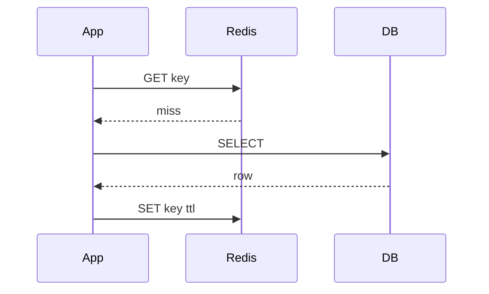
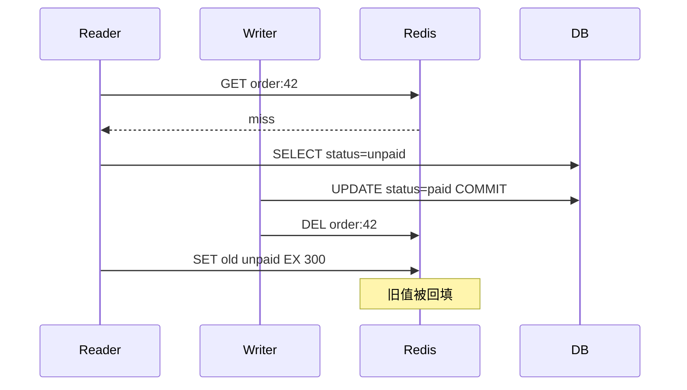

# 缓存与数据库一致性

## 学习目标

- 掌握旁路缓存、读写穿透、写回等常见模式。
- 能分析先删缓存、后写库、延迟双删、binlog 订阅等方案的失败窗口。
- 理解缓存一致性通常是工程上的最终一致，而不是强一致魔法。

## 核心原理

旁路缓存是后端最常见模式：读时先查缓存，未命中查数据库并写缓存；写时先更新数据库，再删除缓存。删除缓存比更新缓存更常见，因为缓存值可能由复杂聚合计算得到。



写路径常用：

```pseudo
begin transaction
update db
commit
delete cache
```

## 工程实践/示例

失败窗口要显式设计补偿：

| 步骤 | 失败后果 | 补偿 |
| --- | --- | --- |
| DB 更新失败 | 缓存旧值仍可读 | 返回失败，不删缓存 |
| DB 成功，删缓存失败 | 旧缓存继续存在 | 重试、消息补偿、binlog 订阅删除 |
| 删缓存后回源并发 | 旧值可能被重新写入缓存 | 写后删、延迟双删、版本校验 |

对于高价值数据，可在缓存值中携带版本号或更新时间：

```json
{"version": 1024, "payload": {"status": "paid"}}
```

### Cache-aside 并发时间线

旁路缓存常用“读 miss 回源写缓存，写 DB 后删缓存”。它不是强一致协议，而是把短暂不一致窗口控制在业务可接受范围内。



这个窗口通常用版本号、写后再删、延迟双删或 CDC 删除降低。延迟双删不是强保证：如果读请求比延迟更慢，仍可能回填旧值；如果删缓存失败，仍需要可靠重试。

### CDC、outbox 与对账

高价值业务不应只依赖“应用写 DB 后顺手删缓存”。更稳的做法是让数据库提交和变更事件有可恢复记录。

| 方案 | 流程 | 优点 | 边界 |
| --- | --- | --- | --- |
| 删除缓存重试表 | DB commit 后写删除任务 | 简单，适合本服务内补偿 | 应用崩溃前没写任务仍有窗口 |
| Outbox | 业务表和 outbox 同事务提交，异步投递删除/事件 | 事务边界清晰，可重放 | 增加 outbox 扫描和投递延迟 |
| CDC/binlog | 订阅数据库变更删除缓存 | 覆盖非本应用写入 | 需要处理延迟、乱序、schema 变更 |
| 周期对账 | DB 与缓存抽样或全量比对 | 发现长期脏数据 | 不是实时修复 |

Outbox 表示例：

```sql
CREATE TABLE outbox_event (
  id BIGINT PRIMARY KEY,
  aggregate_type VARCHAR(64) NOT NULL,
  aggregate_id VARCHAR(128) NOT NULL,
  event_type VARCHAR(64) NOT NULL,
  payload JSON NOT NULL,
  status VARCHAR(16) NOT NULL,
  created_at TIMESTAMP NOT NULL
);
```

### 版本化写缓存

当回源结果可能与写入并发交错时，缓存值携带版本，并使用 Lua 或 CAS 只允许新版本覆盖旧版本。

```pseudo
cached = redis.get(key)
if cached.version <= db_row.version:
    redis.set(key, {version: db_row.version, payload: db_row}, ttl)
```

如果多个 key 共同表达一个对象，应尽量使用同一个版本号。读路径发现组合版本不一致时，可以回源或返回降级结果，避免把不同时间点的字段拼成伪状态。

### 失败矩阵

| 位置 | 故障 | 结果 | 补偿 |
| --- | --- | --- | --- |
| DB 提交前 | DB 失败 | 缓存旧值仍存在 | 返回失败，不删缓存 |
| DB 提交后 | 应用崩溃未删缓存 | 旧值继续可读 | outbox/CDC/定时对账 |
| 删除缓存时 | Redis 超时 | 不知道是否删除成功 | 幂等重试 `DEL` |
| 回源后写缓存 | 写入旧版本 | 脏缓存 | 版本校验、延迟删除 |
| CDC 延迟 | 删除晚到 | 旧缓存窗口变长 | 监控延迟，关键读读 DB |

### 观测指标

- 缓存命中率、miss 回源 QPS、回源耗时。
- 删除缓存失败次数、重试队列堆积、outbox 未投递年龄。
- CDC/binlog 消费延迟、乱序或跳过事件数。
- 缓存版本落后 DB 的抽样比例。
- 业务侧“读到旧状态”的投诉/校验计数。

## 常见误区

| 误区 | 正确认知 |
| --- | --- |
| 更新 DB 后更新缓存更实时 | 并发写可能乱序覆盖，复杂聚合也难保持正确 |
| 延迟双删能保证强一致 | 它只是降低旧值窗口，仍需根据业务容忍度评估 |
| TTL 可以替代一致性设计 | TTL 是兜底，不是故障补偿机制 |
| 缓存和数据库能轻易端到端 exactly-once | 跨系统一致性需要事务消息、幂等和补偿组合 |

## 自测题

1. 为什么常见方案是“更新数据库后删除缓存”？
2. 删除缓存失败应如何处理？
3. 版本号如何降低乱序写缓存风险？

## 实践任务

- 为“订单状态页”设计缓存一致性方案，列出失败窗口和补偿任务。
- 用伪代码实现删除缓存失败后的可靠重试队列。

## 延伸阅读

- Redis caching patterns：https://redis.io/solutions/caching/
- MySQL binary log reference：https://dev.mysql.com/doc/refman/en/binary-log.html
