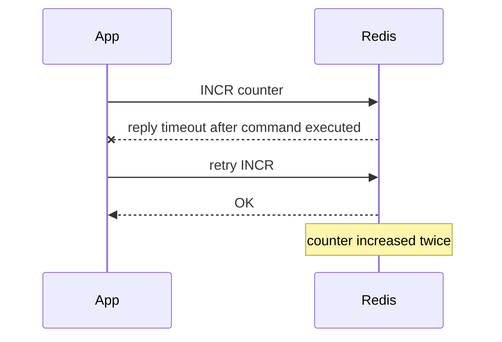

# Pipeline、Lua 与客户端连接池

## 学习目标

- 理解 Pipeline 降低 RTT 的原理和不改变命令语义的边界。
- 掌握 Lua 脚本的原子性、阻塞风险和 Cluster 限制。
- 能在 C++/Python 客户端中设计连接池、超时、重试和熔断。

## 核心原理

Pipeline 把多条命令连续发送到 Redis，减少网络往返次数；它不是事务，不保证中间命令失败时自动回滚。Lua 把多步逻辑放到服务端执行，在单实例上原子完成，但脚本执行期间会阻塞其他命令。

| 能力 | 适用 | 边界 |
| --- | --- | --- |
| Pipeline | 批量读写、减少 RTT | 不提供事务语义 |
| Lua | 库存扣减、条件删除锁、幂等判断 | 长脚本阻塞；Cluster 要同 slot |
| 连接池 | 降低建连成本、控制并发 | 池过大也会放大 Redis 压力 |

## 工程实践/示例

Python 连接池示例：

```python
import redis

pool = redis.ConnectionPool(host="127.0.0.1", port=6379, max_connections=64)
r = redis.Redis(connection_pool=pool, socket_timeout=0.2, socket_connect_timeout=0.2)

with r.pipeline(transaction=False) as pipe:
    for key in ["k1", "k2", "k3"]:
        pipe.get(key)
    values = pipe.execute()
```

C++ 可使用 hiredis 或 redis-plus-plus 这类客户端。连接池要设置最大连接数、等待超时、命令超时和健康检查，并避免在请求线程中无限等待。

```cpp
// 伪代码：真实接口以所选客户端官方文档为准
auto conn = pool.acquire(timeout_ms);
auto value = conn->get("user:42");
pool.release(conn);
```

### Pipeline、事务、Lua 的区别

| 能力 | 减少 RTT | 原子执行 | 条件判断 | 失败回滚 | 典型用途 |
| --- | --- | --- | --- | --- | --- |
| Pipeline | 是 | 否 | 由客户端做 | 否 | 批量 GET/SET |
| `MULTI/EXEC` | 可配合 pipeline | 单实例顺序执行 | `WATCH` 辅助 | 否 | 多命令批量提交 |
| Lua | 是 | 单实例脚本原子 | 脚本内判断 | 否 | 库存、锁释放、幂等 |

Pipeline 只是把命令连续发出去，服务端仍逐条执行并逐条返回。中间某条命令失败不会阻止其他命令，也不会回滚。事务和 Lua 解决的是“命令之间不被插入”的问题，不解决跨系统副作用。

### 客户端超时与重试

Redis 客户端至少要区分连接超时、命令读写超时、连接池等待超时和整体请求 deadline。没有 deadline 的连接池会把上游线程拖死；无条件重试会把故障实例打得更慢。

```text
connect_timeout_ms <= 业务接口预算的 10%-20%
command_timeout_ms 按 P99 + 抖动设置
pool_wait_timeout_ms 小于上游请求剩余时间
max_retries 只对幂等读或带请求号的写开启
```

非幂等命令风险：



计数、扣库存、发券等写操作如果要重试，必须带业务幂等键，或改成 Lua 在同一原子块内检查请求号。

### 连接池参数思路

连接池不是越大越好。过大的池会让更多请求同时进入 Redis，造成排队、超时和雪崩式重试。池大小应由实例 QPS、平均命令耗时、业务线程数和超时预算共同决定。

```text
needed_connections ~= target_qps * avg_command_latency_seconds / pipeline_batch_factor
```

工程配置：

- 每个业务进程设置最大连接数和最大等待时间。
- 慢路径和快路径隔离连接池，避免批处理占满在线请求连接。
- 健康检查失败时短时间熔断，避免所有线程阻塞在同一故障节点。
- TLS、AUTH、DNS、拓扑刷新都应纳入连接初始化成本。

### Cluster 拓扑刷新

Cluster 客户端需要维护 slot 到节点的映射。遇到 `MOVED` 应刷新 slot cache；遇到 reshard 期间的 `ASK` 应按协议对单次请求访问迁移目标。拓扑刷新不能只在启动时做，否则故障转移后连接池会持续打旧主。

```pseudo
try:
    send_to(slot_cache[key_slot])
catch MOVED(slot, endpoint):
    slot_cache[slot] = endpoint
    retry_once(endpoint)
catch ASK(slot, endpoint):
    send_asking_then_command(endpoint)
```

### 批量大小与背压

Pipeline 批量过小收益有限，过大则增加单次响应体、服务端输出缓冲和客户端内存。批量任务应设置最大 key 数、最大字节数和每批 deadline。

```pseudo
batch = []
for key in keys:
    batch.append(GET key)
    if len(batch) >= 500 or batch_bytes >= 1MB:
        execute_with_deadline(batch, 100ms)
        batch.clear()
```

### 观测指标

- 连接池：活跃连接、空闲连接、等待队列长度、等待超时次数。
- 命令：按命令类型的 QPS、P99/P999、超时、重试次数。
- Pipeline：批大小、响应字节、单批耗时、失败命令比例。
- Lua：脚本耗时、慢日志、`BUSY` 错误、脚本缓存 miss。
- Cluster：`MOVED/ASK` 次数、slot cache 刷新、节点连接失败。

## 常见误区

| 误区 | 正确认知 |
| --- | --- |
| Pipeline 等于批量原子提交 | Pipeline 只减少 RTT，不提供隔离和回滚 |
| Lua 越多越好 | 长 Lua 会阻塞实例，应保持短小、可预测 |
| 连接池越大越快 | 过大连接池会增加上下文切换、排队和 Redis 压力 |
| 客户端重试可以默认开启 | 非幂等命令重试可能造成重复写 |

## 自测题

1. Pipeline 和事务的区别是什么？
2. Lua 脚本为什么要避免访问大量 Key？
3. Redis 客户端应设置哪些超时？

## 实践任务

- 用 Pipeline 批量读取 1000 个 Key，对比逐条读取的耗时。
- 设计 C++ 服务的 Redis 连接池参数：最大连接数、等待时间、读写超时、失败熔断。

## 延伸阅读

- Redis pipelining：https://redis.io/docs/latest/develop/using-commands/pipelining/
- Redis programmability：https://redis.io/docs/latest/develop/programmability/
- redis-py docs：https://redis.readthedocs.io/
- redis-plus-plus：https://github.com/sewenew/redis-plus-plus
