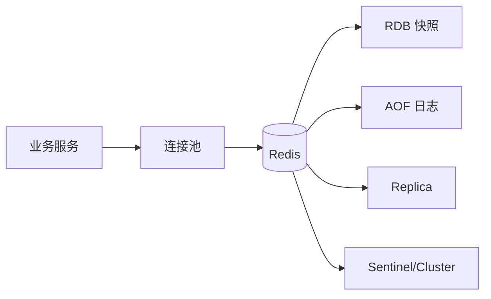

# Redis 学习路径

## 学习目标

- 建立 Redis 数据结构、持久化、高可用、缓存治理和客户端工程化的完整知识框架。
- 能在 C++/Python 后端中判断 Redis 适用边界，并设计可恢复、可观测的缓存方案。
- 清楚区分命令原子性、事务、分布式一致性、分布式锁租约、续期与 fencing token 的不同问题。

## 核心原理

Redis 是以内存数据结构为核心的服务端组件，常用于缓存、计数、排行榜、会话、限流、分布式协调辅助等场景。它的优势来自单线程命令执行模型、紧凑数据结构、事件驱动网络 IO 和丰富的原子命令，但它不是通用数据库，也不是天然的分布式一致性系统。

## 工程实践/示例

推荐阅读顺序：

1. [数据结构与命令复杂度](./01-数据结构与复杂度.md)
2. [持久化：RDB 与 AOF](./02-持久化-RDB-AOF.md)
3. [过期、淘汰与缓存故障](./03-过期淘汰与缓存故障.md)
4. [热 Key、大 Key 与性能治理](./04-热Key大Key与性能治理.md)
5. [分布式锁、事务与一致性边界](./05-分布式锁事务与一致性边界.md)
6. [主从、哨兵与 Cluster](./06-主从哨兵与Cluster.md)
7. [缓存与数据库一致性](./07-缓存与数据库一致性.md)
8. [Pipeline、Lua 与客户端连接池](./08-Pipeline-Lua与客户端连接池.md)

### 学习依赖

建议先具备以下基础，否则容易把 Redis 的局部保证误读成分布式保证：

| 前置知识 | 要掌握到什么程度 |
| --- | --- |
| 哈希表、跳表、链表 | 能用复杂度判断命令是否适合请求路径 |
| 操作系统 fork/COW/fsync | 能解释 RDB/AOF 对延迟和内存的影响 |
| TCP、连接池、超时 | 能设计客户端 deadline、重试和熔断 |
| 数据库事务和 binlog | 能分析缓存与 DB 的失败窗口 |
| 基础分布式系统 | 理解异步复制、故障切换、租约和 fencing |

### 阶段产出

| 阶段 | 阅读范围 | 产出 |
| --- | --- | --- |
| 建模阶段 | 01 | 为 5 个业务场景选择 Redis 类型，写出 key、命令和规模上限 |
| 可靠性阶段 | 02、06 | 写一份 RPO/RTO、持久化、复制和故障切换评估表 |
| 缓存治理阶段 | 03、04、07 | 画出穿透/击穿/雪崩、热 Key、大 Key 和缓存一致性排障流程 |
| 并发语义阶段 | 05、08 | 实现 Lua 幂等扣减、锁释放、Pipeline 批量读和连接池配置 |

### 场景索引

| 场景 | 重点章节 | 关键问题 |
| --- | --- | --- |
| 商品详情缓存 | 01、03、04、07 | TTL 抖动、互斥回源、热 Key、本地缓存、删除失败补偿 |
| 排行榜 | 01、04 | ZSet 复杂度、范围大小、周期榜拆分 |
| 分布式锁 | 05、06 | 租约过期、进程暂停、主从切换、fencing token |
| 会话/限流状态 | 02、03、06 | AOF 风险窗口、淘汰策略、复制延迟 |
| Cluster 多 key 业务 | 06、08 | hash tag、MOVED/ASK、拓扑刷新、跨 slot 限制 |

### 最小可交付检查

学习完本目录后，应能独立输出三类文档：缓存方案设计、Redis 故障排查清单、Redis 客户端配置规范。每份文档都要写明单实例/主从/Sentinel/Cluster 语义边界，不能把事务、锁或 Lua 写成跨系统强一致保证。

## 常见误区

| 误区 | 正确认知 |
| --- | --- |
| Redis 单线程所以不会慢 | 慢命令、大 Key、阻塞持久化和网络拥塞都可能拖垮实例 |
| Redis 事务等于关系型数据库事务 | Redis 事务不提供回滚，也不等于分布式事务 |
| 加锁后就有强一致性 | 锁只能约束部分并发路径，租约过期、时钟、网络分区仍需处理 |
| 缓存命中率高就一定安全 | 热 Key、大 Key、缓存雪崩会让少量键决定系统稳定性 |

## 自测题

1. String、Hash、List、Set、ZSet 分别适合哪些高频业务场景？
2. AOF `appendfsync everysec` 的风险窗口是什么？
3. Redis Cluster 为什么不能直接支持任意多 Key 原子操作？
4. 删除缓存失败时，业务应该如何补偿？

## 实践任务

- 为一个商品详情接口设计缓存 Key、TTL、回源互斥、降级和监控指标。
- 写一个 Lua 脚本实现“库存扣减 + 幂等请求号记录”。
- 用客户端连接池压测 Pipeline 批量读取和逐条读取的延迟差异。

## 延伸阅读

- Redis 官方命令文档：https://redis.io/docs/latest/commands/
- Redis 持久化文档：https://redis.io/docs/latest/operate/oss_and_stack/management/persistence/
- Redis 集群文档：https://redis.io/docs/latest/operate/oss_and_stack/management/scaling/
- Redis 分布式锁说明：https://redis.io/docs/latest/develop/use/patterns/distributed-locks/
