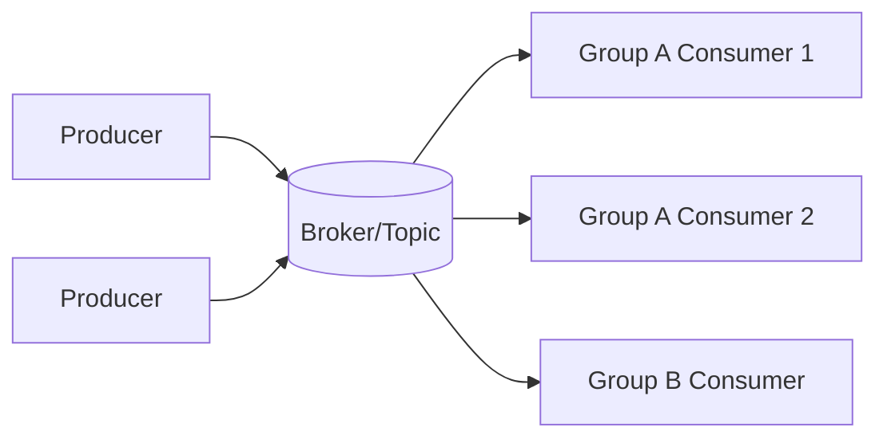
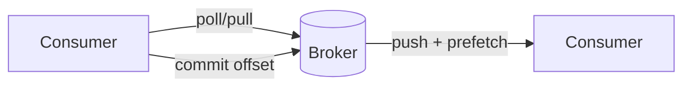

# 通用原理篇

## 学习目标

- 理解生产者、消费者、主题、队列、分区、消费组、ack 的基本概念。
- 掌握 MQ 在削峰、解耦、异步化和广播中的作用。
- 能识别引入 MQ 后新增的复杂性。

## 核心原理

生产者写入消息，Broker 存储并分发消息，消费者拉取或接收消息后处理。消费组用于横向扩展，同一组内一条消息通常只被一个消费者处理，不同组之间互不影响。



| 概念 | 作用 |
| --- | --- |
| Producer | 产生消息，负责序列化、分区选择、发送重试 |
| Topic/Queue | 消息逻辑分类 |
| Partition | 并行和顺序的基本单位 |
| Consumer Group | 消费扩展和负载均衡单位 |
| Ack/Offset | 表示消费进度或处理确认 |

### Queue 与 Log

传统 queue 更强调“消息被某个消费者成功处理后从队列语义上移除”；log 更强调“消息按追加顺序保留一段时间，消费者用 offset 表示自己读到哪里”。Kafka 更接近分布式提交日志；RabbitMQ 经典队列更接近 AMQP queue；RocketMQ 同时提供业务消息能力和队列/日志式存储特征。

| 模型 | 消息保留 | 消费进度 | 适合场景 | 取舍 |
| --- | --- | --- | --- | --- |
| Queue | ack 后通常不再投递给同队列消费者 | broker 维护 ack/inflight | 任务分发、工作队列 | 重放和多订阅模型较弱 |
| Log | 按时间/大小保留，不因某组消费而删除 | consumer group offset | 事件流、审计、日志、CDC | 需要管理分区、offset 和积压 |

### Push 与 Pull

Push 模型由 broker 主动投递，消费者要处理流控、ack 和 inflight；Pull 模型由消费者按自身能力拉取，更容易做批量、背压和位点管理。Kafka consumer 是典型 pull；RabbitMQ 常见使用 broker 推送加 prefetch 控制；RocketMQ 不同 consumer 类型的拉取/推送表现和重试语义不同。



### Topic、Partition、Group、Offset

Topic 是消息分类，partition 是并行和顺序边界，consumer group 是消费进度和负载均衡边界，offset 是某个 group 在某个 partition 上的进度。不同 group 会独立消费同一 topic；同一 group 内，传统 Kafka consumer group 下一个 partition 同时只分配给一个消费者。

```text
topic=order-events
partition=3
group=risk-service
committed_offset=12035
next_record_offset=12036
```

### 语义边界

MQ 只能保证消息系统内的投递语义，不能自动保证数据库、缓存、支付接口和对象存储的外部副作用 exactly-once。工程上常用“至少一次 + 幂等消费 + 状态机 + 补偿对账”。

## 工程实践/示例

订单事件消息建议包含业务主键、事件类型、事件时间、幂等键和版本：

```json
{
  "event_id": "evt_202608310001",
  "order_id": "order_42",
  "type": "OrderPaid",
  "version": 3,
  "occurred_at": "2026-08-31T10:00:00Z"
}
```

### 消息体字段规范

| 字段 | 作用 |
| --- | --- |
| `event_id` | 消息唯一 ID，用于追踪和幂等 |
| `aggregate_id` | 业务聚合根，如订单 ID，用于分区和顺序 |
| `event_type` | 事件类型，用于路由和版本演进 |
| `schema_version` | 消息 schema 版本 |
| `occurred_at` | 业务发生时间，不等于 broker 写入时间 |
| `trace_id` | 链路追踪 |
| `idempotency_key` | 下游幂等键，可与 event_id 或业务请求号不同 |

### 容量估算

```text
write_bytes_per_sec = msg_qps * avg_msg_bytes * replica_factor
consume_capacity = consumer_count * per_consumer_qps
lag_growth_per_sec = produce_qps - consume_qps
retention_storage ~= write_bytes_per_sec * retention_seconds
```

估算时要按峰值而不是日均。消息体只放元数据和小 payload，大文件、解析结果、模型输出应放对象存储或数据库，消息里传 URI。

### 决策案例

| 场景 | 更像 Queue | 更像 Log | 说明 |
| --- | --- | --- | --- |
| 图片转码任务 | 是 | 可选 | 任务成功后无需重放，重点是重试和死信 |
| 订单状态变更 | 否 | 是 | 多个系统订阅，要求保留和重放 |
| 审计日志 | 否 | 是 | 重放、检索、长期保留更重要 |
| 邮件发送 | 是 | 可选 | 幂等发送、退避重试、DLQ 是核心 |

## 常见误区

| 误区 | 正确认知 |
| --- | --- |
| MQ 是数据库替代品 | MQ 主要处理事件流和异步任务，不适合作为唯一事实源 |
| 消息发出就一定被处理 | 需要持久化、确认、重试、监控和补偿 |
| 消费组越多越好 | 每个消费组都会独立消费并保留进度，增加 Broker 压力 |
| 异步化无需考虑用户体验 | 用户仍需要状态查询、失败提示和补偿入口 |

## 自测题

1. 为什么分区是吞吐和顺序的共同边界？
2. Push 模型和 Pull 模型各有什么工程影响？
3. 引入 MQ 会增加哪些故障模式？

## 实践任务

- 画出一个注册成功后“发邮件、发优惠券、写审计日志”的 MQ 架构。
- 为消息体定义字段规范，要求支持追踪、幂等和版本演进。

## 延伸阅读

- Kafka design and concepts：https://kafka.apache.org/43/design/design/
- RabbitMQ concepts：https://www.rabbitmq.com/tutorials/amqp-concepts
