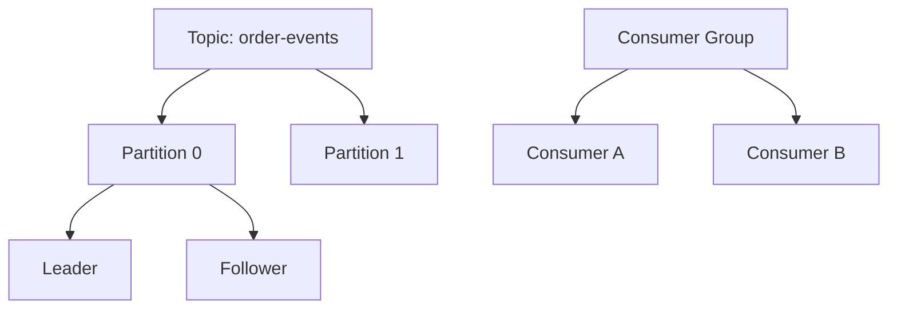
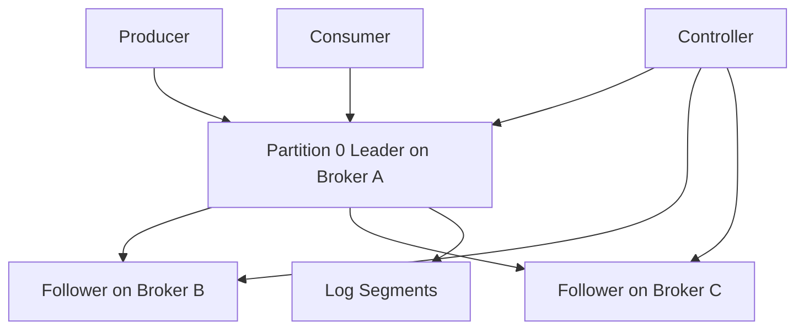
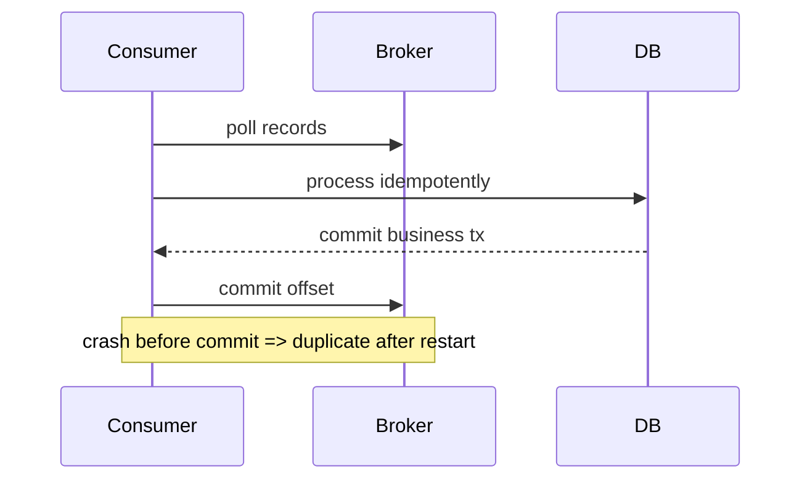

# Kafka 深入篇

## 学习目标

- 理解 Kafka Topic、Partition、Replica、ISR、Consumer Group 和 Offset。
- 掌握生产者确认、消费者提交、再均衡和日志保留。
- 能解释 Kafka 高吞吐来自顺序写、批量、页缓存和零拷贝等机制组合。

## 核心原理

Kafka 的核心抽象是分区日志。每个 Partition 内消息有递增 offset，顺序只在单分区内成立。Broker 存储日志段，副本负责容错，消费者组通过分区分配实现并行消费。



| 参数/机制 | 工程含义 |
| --- | --- |
| `acks` | 生产者等待多少副本确认 |
| `retries` | 发送失败重试，需配合幂等 |
| `linger.ms` | 批量等待时间，影响吞吐和延迟 |
| offset commit | 消费进度提交，决定重复或丢失风险 |
| retention | 消息保留策略，不等于消费成功即删除 |

### Broker、Partition、Leader、Replica、ISR

Kafka topic 被拆成多个 partition。每个 partition 有一个 leader replica 负责读写，follower replica 从 leader 拉取数据。ISR 是当前跟得上的副本集合；`acks=all` 的确认依赖 ISR，而不是所有历史配置过的副本。



Controller 负责集群元数据管理、leader 选举等控制面工作。新版本 Kafka 已逐步转向 KRaft 元数据模式；具体部署参数应以当前版本官方文档为准，不要沿用旧 ZooKeeper 假设。

### Segment、Index 与 Retention

Kafka partition 是追加日志，物理上切成多个 segment。每个 segment 配套 offset/time 等索引，便于按 offset 定位。retention 按时间或大小清理旧 segment；清理不等于某个消费者已经处理成功。

```text
partition-0/
  00000000000000000000.log
  00000000000000000000.index
  00000000000000000000.timeindex
  00000000000001000000.log
```

故障分析要区分：

- log end offset：leader 当前日志末尾。
- high watermark：消费者可见的已复制安全边界。
- committed offset：某个 consumer group 已提交的消费进度。
- consumer lag：log end offset 与 committed/current position 的差距。

### Producer：batching、acks、幂等和顺序

生产者先按 topic-partition 聚合 batch，再发送给目标 partition leader。`linger.ms` 增加等待以换取更大 batch，`batch.size` 控制批大小，压缩减少网络和磁盘。`acks=0/1/all` 影响确认强度；幂等生产者通过 producer id、sequence number 等机制避免单会话内重试写出重复记录。

| 配置/机制 | 作用 | 风险 |
| --- | --- | --- |
| `acks=1` | leader 写入即确认 | leader 确认后未复制就故障可能丢 |
| `acks=all` | 等待当前 ISR 副本确认 | 延迟更高；必须结合 `min.insync.replicas` 判断耐久性 |
| `enable.idempotence` | 避免生产者重试造成同分区重复 | 不处理应用层重新发送的新消息 |
| key 分区 | 同 key 进入同分区 | 分区数变化影响未来映射 |
| `max.in.flight` | 单连接未完成请求数 | 非幂等或错误配置下可能影响顺序 |

`acks=all` 不能脱离 broker/topic 的 `min.insync.replicas` 单独理解：当 ISR 数量低于该下限时，生产请求应失败，而不是在副本不足时继续给出成功确认；若下限设得过低，ISR 退化后确认强度也会下降。生产端要把这类失败纳入超时、重试、告警和容量策略。

### Consumer：poll、rebalance、commit

消费者通过 `poll()` 拉取消息。处理时间过长、心跳异常、成员增减都会触发 rebalance。提交 offset 的时机决定语义：先提交后处理会丢业务，先处理后提交会重复消费。



Rebalance 期间要停止旧分区处理、提交已完成 offset、撤销本地分区状态，再接管新分区。批处理时不要提交尚未完成的最大 offset，否则同批中后续失败会被跳过。

## 工程实践/示例

同一订单的事件需要顺序处理时，按 `order_id` 做 key，使同一订单进入同一分区：

```pseudo
partition = hash(order_id) % partition_count
producer.send(topic="order-events", key=order_id, value=event)
```

消费者处理建议先执行业务幂等逻辑，成功后再提交 offset：

```pseudo
for record in poll():
    process_idempotently(record)
    commit_offset(record)
```

### 端到端监控指标

- Producer：发送成功率、错误率、重试次数、batch size、request latency、record queue time。
- Broker：leader 分布、under-replicated partitions、ISR 收缩、磁盘使用、网络出入、请求队列。
- Consumer：lag、poll 间隔、处理耗时、rebalance 次数、commit 失败。
- Topic：分区倾斜、单分区热点、retention 剩余空间。

### 分区数估算

```text
partition_count >= max(target_produce_mb_s / single_partition_write_mb_s,
                      target_consume_parallelism,
                      ordering_key_distribution_need)
```

分区不是越多越好。更多分区会带来更多文件、leader、网络连接、恢复和 rebalance 成本。先估算吞吐与顺序边界，再预留增长空间。

## 常见误区

| 误区 | 正确认知 |
| --- | --- |
| Kafka Topic 全局有序 | Kafka 只保证单分区内有序 |
| ack=all 就绝不丢消息 | 还要看副本、ISR、刷盘、配置和故障窗口 |
| 提交 offset 就代表业务成功 | 如果先提交后处理，处理失败会造成业务丢失 |
| 分区数可以频繁调整 | 分区增加会影响 key 到分区映射和顺序假设 |

## 自测题

1. Partition leader 和 follower 的职责是什么？
2. offset commit 在业务处理前后分别有什么风险？
3. 为什么增加分区可能破坏按 key 的历史顺序假设？

## 实践任务

- 为订单事件 Topic 设计分区键、分区数评估指标和消费者组部署方式。
- 写出一次 Kafka consumer rebalance 时可能出现的重复消费流程。

## 延伸阅读

- Kafka design：https://kafka.apache.org/43/design/design/
- Kafka producer configs：https://kafka.apache.org/43/configuration/producer-configs/
- Kafka consumer configs：https://kafka.apache.org/43/configuration/consumer-configs/
