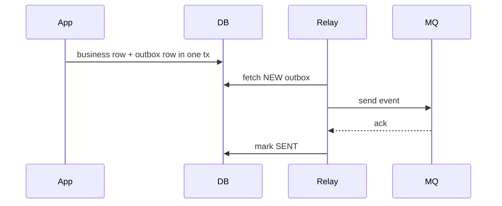

# 可靠性与幂等篇

## 学习目标

- 掌握消息不丢、可重试、可恢复的设计要点。
- 理解重复消费的来源，并能设计幂等处理。
- 准确认识 Kafka exactly-once 语义和限制。

## 核心原理

可靠性是生产、存储、消费三段共同决定的。任一段失败都可能导致丢失、重复、乱序或延迟。工程上通常接受“至少一次投递 + 幂等消费 + 补偿”的组合。

| 阶段 | 风险 | 常用措施 |
| --- | --- | --- |
| 生产 | 发送失败、重试重复 | 幂等生产者、业务 event_id |
| Broker | 副本不足、磁盘故障 | 多副本、ISR 监控、保留策略 |
| 消费 | 处理成功但提交失败 | 幂等表、去重键、事务边界 |
| 下游 | 外部 API 重复调用 | 幂等请求号、状态机校验 |

## 工程实践/示例

幂等消费表：

```sql
CREATE TABLE processed_message (
  consumer_group VARCHAR(128),
  message_id VARCHAR(128),
  processed_at TIMESTAMP,
  PRIMARY KEY (consumer_group, message_id)
);
```

消费伪代码：

```pseudo
begin transaction
insert processed_message(group, message_id)
if duplicate:
    commit
    ack
    return
apply_business_change()
commit
ack
```

Kafka exactly-once 不是端到端魔法保证。它主要通过幂等生产者和事务把“消费输入 offset + 生产输出消息”纳入 Kafka 事务语义。只要流程跨出 Kafka，例如写数据库、调用支付、写对象存储，就必须额外设计幂等、事务消息或补偿。

### 端到端可靠性失败矩阵

| 阶段 | 成功边界 | 故障窗口 | 结果 | 处理 |
| --- | --- | --- | --- | --- |
| 业务写 DB 前发消息 | broker ack 成功，DB 失败 | 消息代表不存在的事实 | 脏事件 | outbox 同事务提交 |
| DB 成功后发消息 | DB commit 后应用崩溃 | 消息未发 | 下游漏处理 | outbox/CDC 补发 |
| producer 发送超时 | broker 可能已写入 | 应用重发 | 重复消息 | event_id + 幂等生产/消费 |
| broker ack 后 leader 故障 | 副本未复制 | 已确认消息丢失 | 丢消息 | `acks=all`、ISR、监控 |
| 消费成功前 commit | offset 已前进 | 业务失败 | 业务丢失 | 处理成功后提交 |
| 消费成功后 commit 失败 | 业务已完成 | 重启重投 | 重复消费 | 幂等表/状态机 |
| 调外部 API 超时 | 对方可能已执行 | 本地重试 | 重复副作用 | 外部幂等请求号 |

### 幂等表与业务状态机

幂等表适合“同一消息只应用一次”的本地数据库变更。关键是插入幂等记录和业务变更必须处在同一个事务中；先查再写不是原子操作，会在并发重投时失效。

```sql
CREATE TABLE coupon_grant (
  user_id BIGINT NOT NULL,
  campaign_id BIGINT NOT NULL,
  status VARCHAR(32) NOT NULL,
  granted_at TIMESTAMP,
  PRIMARY KEY (user_id, campaign_id)
);
```

状态机比简单去重更稳：

```pseudo
begin transaction
row = select coupon_grant for update
if row.status in ["GRANTED", "CANCELLED"]:
    commit; ack; return
if event.type == "GrantCoupon" and row.status == "INIT":
    update status = "GRANTED"
commit
ack
```

状态机让重复、乱序和补偿事件都落在显式转移表里，避免“处理过就跳过”掩盖业务状态不合法。

### Outbox 模式

Outbox 把业务变更和待发送事件写入同一个数据库事务，再由后台 relay 投递到 MQ。relay 投递也可能重复，所以消息仍要带 `event_id`，下游仍要幂等。



### Kafka Exactly-once 的范围

Kafka EOS 可把消费 offset 和生产到 Kafka 的输出放进同一个 Kafka 事务，使“读 topic A、处理、写 topic B、提交 A 的 offset”在 Kafka 内部具备原子提交/中止语义。它不自动包含外部数据库、缓存、HTTP API、对象存储和邮件短信。只要处理链路跨出 Kafka，仍需要本地事务、幂等键、状态机或补偿。

事务输出的读取也有可见性条件：若消费者不应看到未提交或已中止事务的记录，需要使用 `isolation.level=read_committed`；使用 `read_uncommitted` 时可能观察到之后被中止的事务输出。EOS 因此不仅涉及生产者事务，也涉及下游消费者的读取隔离配置。

### 观测指标

- producer：发送错误、超时、重试、幂等错误、事务 abort。
- broker：ISR 收缩、under replicated partition、磁盘满、unclean leader election 风险。
- consumer：重复消息比例、幂等冲突数、commit 失败、rebalance 次数。
- outbox：NEW/SENDING 积压、最老未发送年龄、投递失败原因。
- 业务：状态机非法转移、外部 API 幂等冲突、对账差异。

## 常见误区

| 误区 | 正确认知 |
| --- | --- |
| 重试只会提高成功率 | 重试也会制造重复和峰值放大 |
| 幂等就是简单查一下是否处理过 | 查重与业务变更必须在同一事务或等价原子边界内 |
| exactly-once 能保证数据库也只写一次 | 数据库写入不自动属于 Kafka 事务 |
| ack 失败可以忽略 | ack/commit 失败会导致重新投递 |

## 自测题

1. “处理成功但 offset 提交失败”会发生什么？
2. 幂等键应该使用消息 ID 还是业务 ID？如何选择？
3. Kafka EOS 的边界在哪里？

## 实践任务

- 为“发放优惠券”消费者设计幂等表和状态机。
- 写一份生产者发送失败重试的风险清单。

## 延伸阅读

- Kafka design / delivery semantics：https://kafka.apache.org/43/design/design/
- Kafka Streams exactly-once concepts：https://kafka.apache.org/43/streams/core-concepts/
