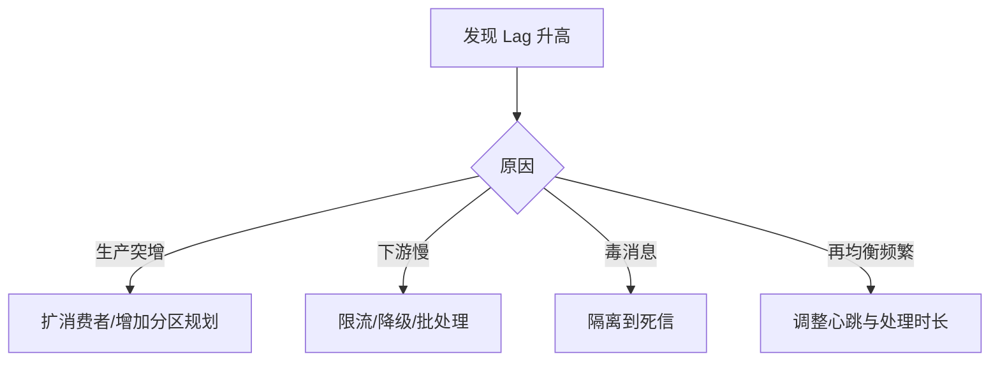
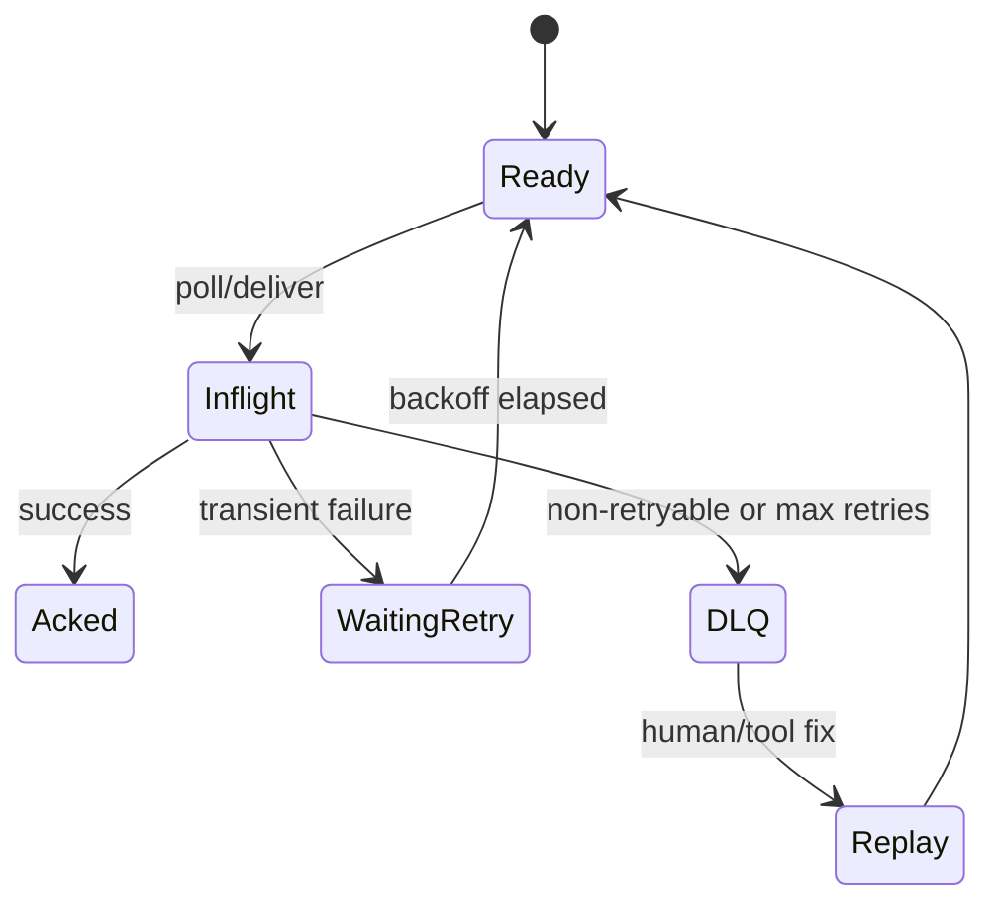

# 顺序、积压、延迟、重试与死信

## 学习目标

- 理解顺序消息的边界和代价。
- 掌握积压、延迟、重试、死信的监控与处理。
- 能设计不阻塞主消费链路的失败处理方案。

## 核心原理

顺序通常以分区、队列或业务键为边界。要求更强顺序会牺牲并行度。积压说明生产速度长期高于消费速度，或消费者处理异常。重试和死信是失败隔离机制，不能替代告警和人工补偿。

| 问题 | 指标 | 处理方式 |
| --- | --- | --- |
| 顺序 | key、partition、offset | 按业务键分区，单键串行 |
| 积压 | consumer lag、消费耗时 | 扩容、优化处理、拆分慢任务 |
| 延迟 | 端到端耗时、排队时长 | 批量、优先级、降级 |
| 重试 | retry count、失败原因 | 指数退避、分类重试 |
| 死信 | DLQ 数量、年龄 | 告警、排查、回放工具 |

## 工程实践/示例

失败分类：

```pseudo
if error is transient:
    retry_with_backoff()
elif error is data_invalid:
    send_to_dlq(reason)
else:
    alert_and_pause_if_needed()
```

积压处理流程：



### 顺序边界

顺序通常只在同一 partition、同一 queue 或同一 message group 内成立。要让同一订单事件有序，就必须让它们使用同一个分区键；不同订单之间不应追求全局顺序，否则会牺牲并行度。

```pseudo
key = order_id
send("order-events", key=key, value=event)
```

顺序消费的代价是“前一个没处理完，后一个不能越过”。如果某个 key 形成热点，单分区或单队列会变成瓶颈。常见优化是缩小顺序范围，例如从“全站订单有序”降为“同一订单有序”。

### 积压容量估算

```text
lag_messages = log_end_offset - committed_offset
lag_seconds ~= lag_messages / current_consume_rate
drain_time ~= lag_messages / max(consume_rate - produce_rate, 1)
required_consumers ~= produce_qps * avg_process_ms / 1000 / target_utilization
```

排查顺序：

1. 生产是否突增：消息 QPS、字节、单 key/partition 倾斜。
2. 消费是否变慢：处理耗时、DB/API 依赖、锁等待、GC、线程池。
3. 是否 rebalance：poll 间隔过长、实例频繁上下线。
4. 是否毒消息：同一 offset 反复失败，后续消息被阻塞。
5. 是否 broker 瓶颈：磁盘、网络、ISR、请求队列。

### 延迟、重试和死信

延迟来自排队时间、拉取间隔、处理耗时、重试退避和下游限流。重试必须分类：瞬时错误可退避重试，数据非法应尽快进死信，未知系统性错误应告警并限速。



死信队列不是垃圾桶，而是“自动链路无法安全处理”的待修复数据。DLQ 消息至少要保留原 topic、partition、offset、失败原因、异常栈摘要、重试次数、首次失败时间和 trace_id。

### 毒消息处理

毒消息是每次消费都会失败的消息，常见原因是 schema 不兼容、业务状态不存在、依赖数据损坏、代码 bug。处理策略：

- 单条消息失败不应无限阻塞整个分区；达到阈值后隔离到 DLQ。
- 修复后回放要保持幂等，不能直接跳过业务状态校验。
- 对顺序强依赖场景，跳过毒消息可能破坏后续事件语义，需要人工决策。

### RabbitMQ/RocketMQ/Kafka 对照

| 能力 | Kafka | RabbitMQ | RocketMQ |
| --- | --- | --- | --- |
| 顺序边界 | partition | queue / single active consumer 等模式 | message group / queue |
| 重试 | 通常业务建 retry topic | ack/nack、TTL、DLX 组合 | 内建消费重试和 DLQ |
| 死信 | 常用独立 DLQ topic | DLX/DLQ 原生常用 | DLQ 原生常用 |
| 积压观察 | consumer lag | queue depth、ready/unacked | topic/group lag、重试状态 |

### 观测指标

- lag messages、lag seconds、drain time。
- 每 partition 生产/消费速率和最大 lag。
- 处理耗时分位数、外部依赖耗时、线程池队列。
- retry topic 堆积、DLQ 新增速率、最老 DLQ 年龄。
- 同一 message_id 或 offset 的失败次数。

## 常见误区

| 误区 | 正确认知 |
| --- | --- |
| 全局顺序是默认能力 | 大多数 MQ 只提供局部顺序 |
| 积压只要扩容消费者 | 分区数、下游瓶颈、锁竞争都可能限制扩容效果 |
| 无限重试最可靠 | 毒消息会阻塞队列并放大故障 |
| 死信队列可以不管 | DLQ 是待处理故障，不是垃圾桶 |

## 自测题

1. 为什么同一分区内慢消息会影响后续消息？
2. consumer lag 升高可能有哪些根因？
3. 什么错误适合重试，什么错误应进入死信？

## 实践任务

- 为支付通知消费者设计 3 次退避重试和死信回放流程。
- 写出一次“消费积压 30 分钟”的排障检查清单。

## 延伸阅读

- Kafka consumer configuration：https://kafka.apache.org/43/configuration/consumer-configs/
- RabbitMQ dead lettering：https://www.rabbitmq.com/docs/dlx
- RocketMQ retry and DLQ：https://rocketmq.apache.org/docs/
