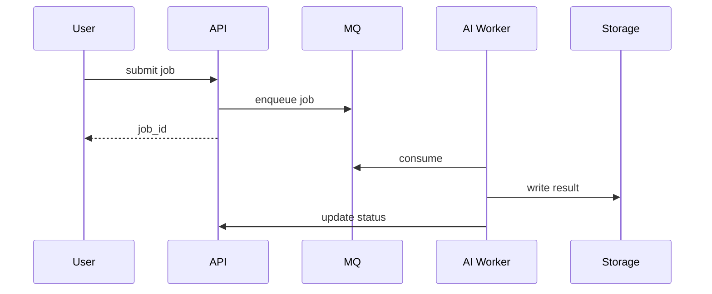
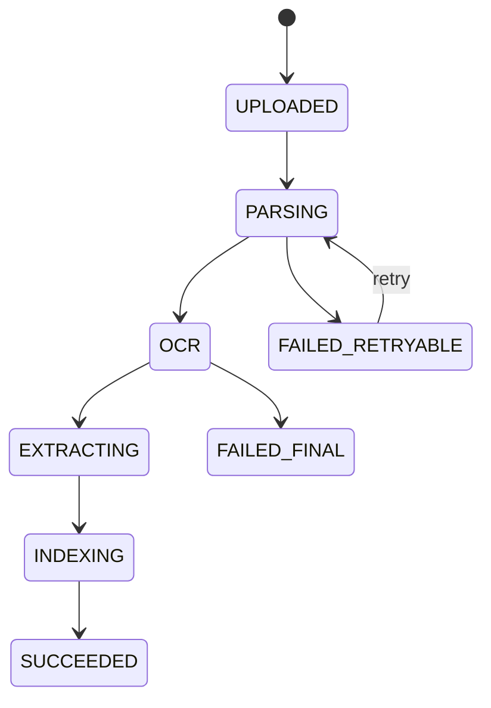

# AI 异步任务实践篇

## 学习目标

- 掌握 AI 推理、批处理、向量化、视频处理等长任务的异步队列设计。
- 能设计任务状态机、幂等提交、取消、重试和结果存储。
- 理解 GPU/模型服务是稀缺资源，队列必须具备背压和优先级控制。

## 核心原理

AI 任务通常耗时长、资源贵、失败模式复杂。前端提交任务后立即返回任务 ID，后端通过 MQ 调度 worker，结果写入数据库或对象存储，用户轮询或通过通知获取状态。



## 工程实践/示例

任务状态机：

| 状态 | 含义 |
| --- | --- |
| `PENDING` | 已创建，等待调度 |
| `RUNNING` | Worker 已开始处理 |
| `SUCCEEDED` | 结果可用 |
| `FAILED_RETRYABLE` | 可重试失败 |
| `FAILED_FINAL` | 不再自动重试 |
| `CANCELLED` | 用户或系统取消 |

消息体示例：

```json
{
  "job_id": "job_42",
  "tenant_id": "tenant_a",
  "model": "embedding",
  "input_uri": "s3://bucket/input/42.json",
  "idempotency_key": "tenant_a:req_1001",
  "priority": "normal"
}
```

### 文档解析任务流

文档解析通常包括上传、杀毒/格式识别、OCR/版面分析、结构化抽取、质检和索引。每一步都可能耗时长且失败原因不同，所以任务表要记录阶段状态，而不是只依赖 MQ offset。



消息只传 URI 和参数：

```json
{
  "job_id": "doc_9001",
  "stage": "OCR",
  "input_uri": "s3://docs/raw/9001.pdf",
  "output_prefix": "s3://docs/parsed/9001/",
  "schema_version": 2
}
```

### Embedding 批处理

Embedding 任务适合批量合并：小文本单条推理会浪费 GPU/CPU，过大 batch 又会导致显存溢出和尾延迟升高。队列消费者可以先拉取一批任务，按模型、租户、长度桶分组，再调用模型服务。

```pseudo
records = poll(max_records=500, max_wait=100ms)
groups = group_by(records, model, tenant, length_bucket)
for group in groups:
    batch = fit_by_token_budget(group, max_tokens, max_items)
    result = embedding_model(batch.inputs)
    write_vectors_idempotently(batch.ids, result)
    commit_offsets_after_db_commit(batch)
```

幂等键应绑定 `tenant_id + document_id + chunk_id + model_version`。模型版本变化时不要覆盖旧向量，先写新 namespace，再切检索配置。

### GPU 背压

GPU 是稀缺资源，队列必须能表达背压。没有背压时，API 层会不断接受任务，MQ lag 看似只是排队，实际用户等待时间已经不可控。

| 指标 | 含义 | 动作 |
| --- | --- | --- |
| GPU 利用率高且 queue lag 增长 | 计算资源不足 | 扩 GPU worker、降级低优先级 |
| 显存 OOM 增加 | batch 太大或输入异常 | 降 batch/token 上限，隔离超长输入 |
| 单租户占用过高 | 公平性风险 | 租户级限流和配额 |
| 结果写入慢 | 存储瓶颈 | 批量写、异步落盘、限速推理 |

```text
max_inflight_batches = gpu_count * streams_per_gpu
admission_rate <= completed_jobs_per_sec * safety_factor
expected_wait_seconds ~= queued_jobs / completed_jobs_per_sec
```

### 批推理和评测队列

批推理通常要求吞吐优先，可以接受分钟级延迟；在线推理队列要求尾延迟优先，batch 等待时间必须很短。评测任务还要保存数据集版本、prompt/model 版本、指标配置和随机种子，否则结果不可复现。

```sql
CREATE TABLE ai_job (
  job_id VARCHAR(64) PRIMARY KEY,
  tenant_id VARCHAR(64) NOT NULL,
  job_type VARCHAR(32) NOT NULL,
  status VARCHAR(32) NOT NULL,
  idempotency_key VARCHAR(128) UNIQUE,
  model_version VARCHAR(64),
  input_uri TEXT NOT NULL,
  output_uri TEXT,
  attempt INT NOT NULL DEFAULT 0,
  worker_id VARCHAR(64),
  lease_version BIGINT NOT NULL DEFAULT 0,
  lease_expires_at TIMESTAMP,
  last_heartbeat_at TIMESTAMP,
  updated_at TIMESTAMP NOT NULL
);
```

### Worker 幂等伪代码

```pseudo
record = poll()
begin transaction
claimed = update ai_job
  set status="RUNNING", attempt=attempt+1,
      worker_id=this_worker, lease_version=lease_version+1,
      lease_expires_at=now()+lease_duration, last_heartbeat_at=now()
  where job_id=record.job_id
    and (status in ["NEW", "RETRY_WAIT"]
         or (status="RUNNING" and lease_expires_at < now()))
if affected_rows(claimed) == 0:
    job = select ai_job where job_id = record.job_id
    commit
    if job.status in ["SUCCEEDED", "FAILED_FINAL", "CANCELLED"]: ack
    else: retry_later
    return
my_lease_version = claimed.lease_version
commit

try:
    output_uri = run_model(record.input_uri)
    begin transaction
    update ai_job set status="SUCCEEDED", output_uri=output_uri
      where job_id=record.job_id and status="RUNNING"
        and worker_id=this_worker and lease_version=my_lease_version
    if affected_rows == 0: discard_late_result_and_retry_or_stop()
    commit
    ack
except Retryable as e:
    mark_retryable(e); nack_or_retry_topic()
except Fatal as e:
    mark_failed_final(e); ack
```

长任务要周期性续租，续租同样校验 `worker_id + lease_version`。租约到期后旧 worker 可能仍在运行；最终条件更新相当于 fencing，阻止旧租约的迟到结果覆盖新 worker 的结果。若推理已经对外部系统产生不可回滚副作用，仍需由外部落点执行幂等或版本校验。

### 观测指标

- API：提交 QPS、拒绝率、幂等命中率、任务创建延迟。
- MQ：按 job_type/priority 的 lag、最老消息年龄、重试次数。
- Worker：模型加载时间、batch 大小、token 数、推理耗时、OOM。
- GPU：利用率、显存、排队 batch、失败 batch。
- 结果：成功率、最终失败原因、取消耗时、评测指标漂移。

## 常见误区

| 误区 | 正确认知 |
| --- | --- |
| AI 任务失败直接重试即可 | 显存不足、输入非法、模型超时要分类处理 |
| 结果可以放在消息里 | 大结果应放对象存储，消息只传 URI 和元数据 |
| GPU worker 越多越好 | 需要按显存、模型加载、批大小和吞吐做容量规划 |
| 取消任务只删消息 | 正在运行的任务还需要协作式取消和状态校验 |

## 自测题

1. AI 异步任务为什么要用任务表而不是只依赖 MQ offset？
2. 如何避免用户重复提交导致重复扣费？
3. 大文件输入输出为什么应放对象存储？

## 实践任务

- 为“批量生成 embedding”设计 Topic、任务表、对象存储路径和失败重试策略。
- 写一个 worker 伪代码，要求支持幂等、状态更新、结果 URI 和错误分类。

## 延伸阅读

- Kafka documentation：https://kafka.apache.org/documentation/
- OpenTelemetry messaging semantic conventions：https://opentelemetry.io/docs/specs/semconv/messaging/
