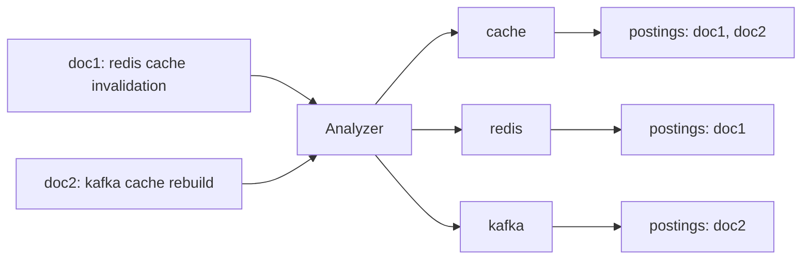
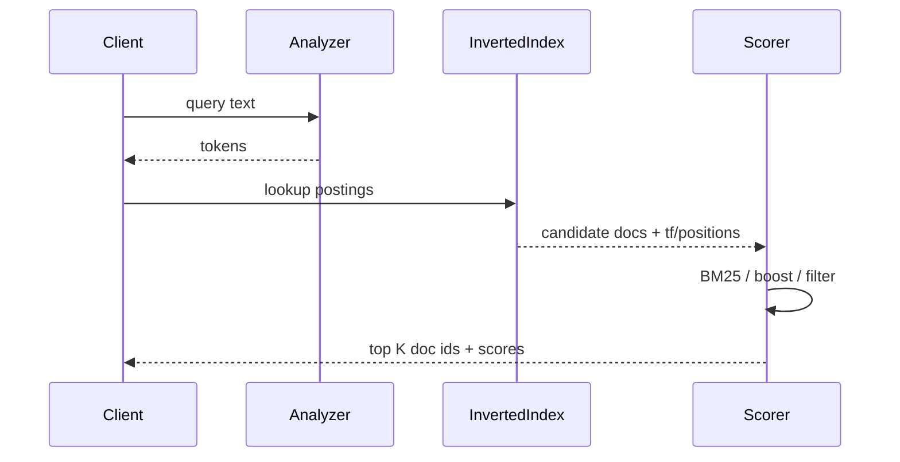

# 搜索原理：倒排索引、分词与 BM25

## 学习目标

- 理解倒排索引从文档、词项到 postings list 的构建流程。
- 掌握 term dictionary、postings、跳表、位置表如何支撑查询、短语匹配和排序。
- 能解释分词、归一化、停用词、同义词对召回、精度和索引膨胀的影响。
- 理解 TF/IDF 与 BM25 的公式直觉、参数含义、工程局限和排查方法。

## 核心原理

### 倒排索引解决什么问题

正排索引是 `doc_id -> 文档内容/字段`，适合按主键取回完整文档；倒排索引是 `term -> doc_id 列表`，适合从词项快速找到候选文档。搜索查询不是扫描全部文档，而是把 query 分析成 term，读取相关 postings list，求交、求并或按评分合并。



理论保证：只要索引构建和查询分析使用一致的 token 规则，包含某个 term 的文档可以通过该 term 的 postings 找到。工程假设：索引和原文之间存在 refresh/提交延迟，删除和更新也可能以 tombstone 或新 segment 的形式延后清理。

### 索引构建流水线

典型构建流程是：解析文档、字段分析、生成 token、记录 term 到 doc 的关系、排序压缩、写入 segment。

```text
raw document
  -> field extraction
  -> char filter
  -> tokenizer
  -> token filters
  -> term dictionary + postings
  -> stored fields / doc values
  -> segment commit
```

postings 中通常不只保存 doc_id，还会按需要保存词频、位置和偏移：

| 数据 | 作用 | 代价 |
| --- | --- | --- |
| doc_id | 找到包含 term 的文档 | 必需，通常差分压缩 |
| term frequency | 计算 TF/BM25 | 增加 postings 元数据 |
| positions | 短语查询、邻近查询、高亮 | 索引更大 |
| offsets | 精确高亮原文片段 | 写入和存储成本更高 |
| norms | 文档长度归一化、字段 boost | 每文档每字段额外信息 |

### Term Dictionary 与 Postings

term dictionary 负责把词项映射到 postings 的位置。工程实现通常会把词典组织成可压缩、可快速定位的数据结构，例如有序词典、前缀压缩、FST 或块索引；postings list 则按 doc_id 递增保存，便于求交、跳跃和压缩。

两个常见查询路径：

1. `must: redis AND cache`：读取两个 postings list，用较短列表驱动求交，跳过不可能命中的 doc_id。
2. `should: redis OR kafka`：合并多个 postings，累加词项分数，再按 top K 维护候选集。

性能关键不只在“有没有索引”，还在 postings 的长度、词项区分度、字段选择、排序条件和是否需要读取原文。

### 分词、归一化与字段建模

Analyzer 通常由 char filter、tokenizer、token filter 组成。英文常见归一化包括小写、词干化、停用词；中文需要词典、粒度和歧义处理；代码、SKU、邮箱、URL、型号字段通常不能按普通自然语言分词处理。

| 字段 | 常见建模 | 原因 |
| --- | --- | --- |
| 标题 | text 分词 + keyword 子字段 | 既支持相关性，也支持精确聚合/排序 |
| SKU/订单号 | keyword | 不应拆词，按完整值精确匹配 |
| 品牌 | keyword + normalizer | 需要大小写/全半角归一化和聚合 |
| 摘要/正文 | text + 领域词典 | 提升召回，保留 BM25 评分 |
| 标签 | keyword 或受控词表 | 方便过滤、聚合和规则提升 |

同义词要区分索引期和查询期。索引期同义词扩大索引、变更后需要重建；查询期同义词更灵活，但查询变重，且多词同义词可能影响短语匹配。停用词也不是越多越好，技术文档中的 `to`、`in`、`go` 可能是语言或命令的一部分。

### TF/IDF 与 BM25 直觉

TF/IDF 的核心直觉是：词在当前文档出现越多越相关，词在全局越少见越有区分度。朴素 TF 容易被长文档放大，BM25 引入词频饱和和文档长度归一化。

BM25 常见形式：

```text
score(D, Q) = sum over q_i in Q:
  IDF(q_i) * ((tf(q_i, D) * (k1 + 1)) /
  (tf(q_i, D) + k1 * (1 - b + b * |D| / avgdl)))
```

参数直觉：

| 参数 | 含义 | 调大后的倾向 |
| --- | --- | --- |
| `tf` | term 在文档字段中的出现次数 | 分数上升但会饱和 |
| `IDF` | term 的稀有程度 | 稀有词影响更大 |
| `k1` | 词频饱和速度 | 更信任重复出现的词 |
| `b` | 文档长度归一化强度 | 更惩罚长字段 |
| `avgdl` | 平均字段长度 | 数据分布变化会影响评分 |

局限：BM25 不理解语义、否定、事实正确性和时间新鲜度；对短字段、模板化文档、同义表达、数字和实体歧义需要额外规则、字段 boost、过滤、向量召回或重排补足。

### 查询执行与评分时序



过滤条件应尽量变成不参与评分的 filter bitset，减少候选集；排序字段若不是相关性，应关注 doc values、字段类型和深分页成本。

## 工程实践/示例

### 技术文档检索字段方案

| 字段 | 类型 | 查询方式 | 监控点 |
| --- | --- | --- | --- |
| `title` | text + keyword | match、短语、精确提升 | 标题命中率、误召回 |
| `body` | text | BM25 主召回 | postings 长度、慢查询 |
| `code_terms` | keyword 数组 | term 精确召回 | 无结果率、大小写问题 |
| `tags` | keyword | filter/boost/aggregation | 标签覆盖率 |
| `updated_at` | date | filter/sort/衰减 | 新内容曝光 |

### 相关性问题排查

```text
query 原文
  -> analyzer 输出是否符合预期
  -> mapping 是否用了正确字段
  -> postings 是否命中目标文档
  -> explain 查看 IDF/tf/长度归一
  -> profile 查看耗时阶段
  -> 调整词典、同义词、boost、filter 或重排
```

核心指标：

| 指标 | 说明 |
| --- | --- |
| 无结果率 | 过高说明分词、同义词或数据覆盖不足 |
| 点击率/首点位置 | 评估排序质量 |
| P95/P99 查询延迟 | 反映 postings、聚合、排序和 IO 压力 |
| 高频 query TopK | 人工评估头部体验 |
| explain 样本 | 验证评分是否符合直觉 |

## 常见误区

| 误区 | 正确认知 |
| --- | --- |
| 分词越细越好 | 太细会提高召回但引入噪声，短词 postings 也更长 |
| BM25 能理解语义 | BM25 主要基于词项匹配，语义同义需要额外召回或重排 |
| 同义词只会提升效果 | 同义词扩大召回，也可能引入误召回和索引膨胀 |
| 搜索相关性只调 boost | mapping、分析器、字段质量、数据新鲜度同样关键 |
| IDF 越高越好 | 稀有词可能是拼写错误、噪声或孤立实体，需要结合业务判断 |

## 自测题

1. 倒排索引和正排索引分别适合什么查询？
2. SKU 字段为什么通常用 keyword，而不是 text？
3. BM25 中 IDF、词频饱和和文档长度归一分别解决什么问题？
4. 查询期同义词和索引期同义词在成本、灵活性和重建上的差异是什么？

## 实践任务

- 为“机场跑道异物检测论文库”设计标题、作者、摘要、关键词、DOI、年份字段的 analyzer 和 mapping。
- 选 10 条查询，记录分词结果、命中文档、explain 分数，并解释召回差异。
- 构造一个误召回案例，分别尝试停用词、同义词、字段 boost 和 filter 的修复效果。

## 延伸阅读

- Elasticsearch analysis：https://www.elastic.co/guide/en/elasticsearch/reference/current/analysis.html
- Elasticsearch similarity：https://www.elastic.co/guide/en/elasticsearch/reference/current/index-modules-similarity.html
- OpenSearch analyzers：https://opensearch.org/docs/latest/analyzers/
