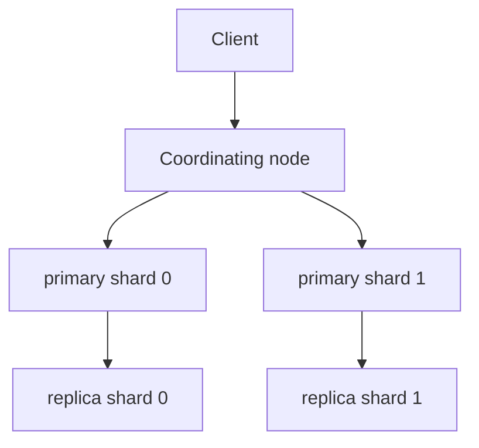
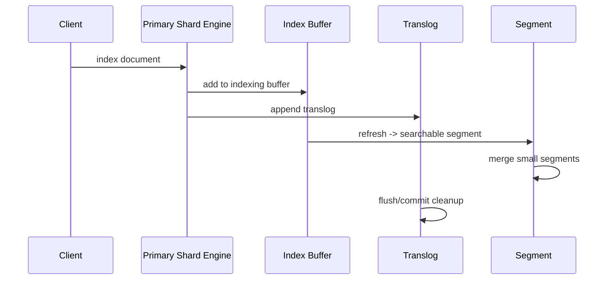

# Elasticsearch/OpenSearch 集群、DSL 与聚合

## 学习目标

- 理解 mapping、segment、refresh、flush、merge、shard、replica、routing 的职责和边界。
- 掌握 bool/filter、排序、聚合、深分页、`search_after`、PIT 的工程使用方式。
- 能用 explain/profile、慢日志和集群指标定位相关性与性能问题。
- 能说明近实时搜索与强一致读写之间的差异。

## 核心原理

### Index、Shard、Replica 与 Routing

一个索引被拆成多个 primary shard，每个 primary 可以有 replica。写入先路由到某个 primary，再复制到 replica；查询通常扇出到相关 shard，收集每个 shard 的 top K，再在协调节点归并。



routing 默认通常由文档 ID 或 routing key 决定。自定义 routing 能把同一租户或同一实体的数据放到同一 shard，减少查询扇出；代价是热点租户可能压垮单 shard，后续拆分也更难。

| 设计项 | 影响 | 典型风险 |
| --- | --- | --- |
| primary shard 数 | 写入并行度、数据上限、查询扇出 | 过少难扩展，过多固定开销大 |
| replica 数 | 容错和读扩展 | 增加复制成本和磁盘成本 |
| routing key | 局部查询效率 | 热点和数据倾斜 |
| refresh 策略 | 可见性延迟 | 过频繁降低写吞吐 |

### Mapping 与字段存储

mapping 决定字段如何索引、分析、存储和聚合。字段类型选错通常比查询写错更难补救，因为历史数据可能需要重建索引。

| 字段类型/能力 | 适合 | 不适合 |
| --- | --- | --- |
| `text` | 全文检索、BM25 | 精确聚合和排序 |
| `keyword` | 精确匹配、过滤、聚合、排序 | 自然语言相关性 |
| `date/numeric` | 范围过滤、排序、直方图 | 文本分析 |
| `doc_values` | 列式排序/聚合 | 需要分词评分的场景 |
| `stored fields/_source` | 结果返回和重建 | 不能替代索引结构 |

工程上常用 multi-fields：同一个 `title` 同时有 `title` 做全文检索、`title.keyword` 做精确匹配或聚合。动态 mapping 在原型期方便，生产中应显式约束关键字段，避免字符串被错误推断或字段爆炸。

### Segment、Refresh、Flush、Merge

ES/OpenSearch 底层基于不可变 segment。写入先进入内存缓冲和事务日志；refresh 生成可搜索的 segment 视图，让新文档被搜索看到；flush 与提交点和事务日志清理相关；merge 把多个小 segment 合并成大 segment，并清理删除标记。



关键边界：

- refresh 让搜索可见，不等于把所有数据都做完持久化提交。
- flush 与持久化提交和 translog 生命周期相关，不等于提升相关性。
- merge 是后台 IO/CPU 重活，能减少 segment 数和删除比例，但会和查询、写入争资源。
- update 本质通常是旧文档删除标记加新文档写入，因此高频更新会制造 merge 压力。

### DSL Bool、Filter 与 Query Context

`must`、`should` 在 query context 中参与评分；`filter`、`must_not` 更偏布尔过滤，通常不贡献相关性分数，并可能被缓存为 bitset。

```json
{
  "query": {
    "bool": {
      "must": [{"match": {"title": "redis 缓存"}}],
      "filter": [
        {"term": {"status": "published"}},
        {"range": {"published_at": {"gte": "now-30d/d"}}}
      ],
      "should": [{"match_phrase": {"title": "缓存击穿"}}],
      "minimum_should_match": 0
    }
  }
}
```

决策表：

| 需求 | 推荐写法 | 原因 |
| --- | --- | --- |
| 必须命中关键词且评分 | `must match` | 参与 BM25 |
| 状态、租户、时间过滤 | `filter term/range` | 不污染评分，利于缓存 |
| 标题短语加分 | `should match_phrase` | 召回不变，排序提升 |
| 排除软删除 | `must_not term` | 控制候选集 |

### 聚合与深分页

聚合通常依赖 doc values 或全局 ordinals，适合在过滤后的匹配集合上做 terms、histogram、date_histogram、cardinality 等统计。高基数字段、大 size、多层嵌套聚合会明显增加内存和协调节点压力。

深分页不能无限使用 `from + size`，因为每个 shard 都要取到较深位置再归并。面向用户翻页可使用 `search_after` 加稳定排序；需要跨请求稳定视图时配合 PIT。批处理遍历则使用适合扫描的 API，而不是模拟用户深翻页。

```text
第一页: sort=[updated_at desc, _id asc]
下一页: search_after=[last_updated_at, last_id]
稳定视图: PIT id + search_after
```

### Explain、Profile 与近实时边界

`explain` 用于解释单文档为什么得分；`profile` 用于拆解查询耗时。相关性问题先看 analyzer 和 explain，性能问题先看 profile、慢日志、segment/shard 状态和资源指标。

近实时意味着写入成功后，搜索可见性取决于 refresh；按 ID 获取和搜索命中可能在短窗口内表现不同。需要读己之写的业务，可以使用显式 refresh、写后查主存储、或把搜索结果设计成最终一致。

## 工程实践/示例

### 文章搜索 Mapping 示例

```json
{
  "mappings": {
    "properties": {
      "title": {"type": "text", "fields": {"keyword": {"type": "keyword"}}},
      "body": {"type": "text"},
      "tags": {"type": "keyword"},
      "author_id": {"type": "keyword"},
      "published_at": {"type": "date"},
      "status": {"type": "keyword"}
    }
  }
}
```

### 慢查询排查路径

```text
请求维度: query DSL / from-size / sort / aggs
索引维度: shard 数 / segment 数 / deleted docs / mapping
集群维度: CPU / heap / GC / disk IO / thread pool / queue
数据维度: 热点 routing / 高基数字段 / 大文档 _source
工具维度: profile / slowlog / tasks / nodes stats
```

监控指标：

| 指标 | 说明 |
| --- | --- |
| search latency P95/P99 | 用户体验和尾延迟 |
| refresh/merge time | 写入可见性和后台压力 |
| segment count/deleted docs | merge 健康度 |
| heap/GC/circuit breaker | 内存风险 |
| thread pool rejected/queue | 过载信号 |
| shard size/skew | 分片是否倾斜 |

## 常见误区

| 误区 | 正确认知 |
| --- | --- |
| replica 可以提高写吞吐 | 写入仍先到 primary，再复制到 replica |
| shard 越多越好 | shard 有固定开销，过多会拖慢查询和管理 |
| refresh 等于 flush | refresh 让搜索可见，flush 与提交和 translog 相关 |
| text 字段适合聚合 | 聚合通常用 keyword 或专门子字段 |
| `from + size` 只是慢一点 | 深分页会放大每个 shard 的排序和内存成本 |
| explain 能定位所有慢查询 | explain 看评分，profile/slowlog 才看执行耗时 |

## 自测题

1. primary shard 和 replica 的职责差异是什么？
2. 为什么 ES/OpenSearch 被称为近实时？
3. `filter` 和 `must` 在评分、缓存和候选集上的区别是什么？
4. `search_after + PIT` 比 `from + size` 解决了什么问题，又要求什么稳定排序条件？
5. refresh、flush、merge 分别影响什么？

## 实践任务

- 为文章搜索设计 mapping，包含 title、body、tags、author_id、published_at、status。
- 写一个按 tag 聚合、按时间过滤、按标题相关性排序的查询，并用 profile 解释耗时。
- 设计一个多租户索引的 routing 策略，列出热点租户和迁移风险。

## 延伸阅读

- Elasticsearch mapping：https://www.elastic.co/guide/en/elasticsearch/reference/current/mapping.html
- Elasticsearch search APIs：https://www.elastic.co/guide/en/elasticsearch/reference/current/search-search.html
- OpenSearch query DSL：https://opensearch.org/docs/latest/query-dsl/
- OpenSearch aggregations：https://opensearch.org/docs/latest/aggregations/
