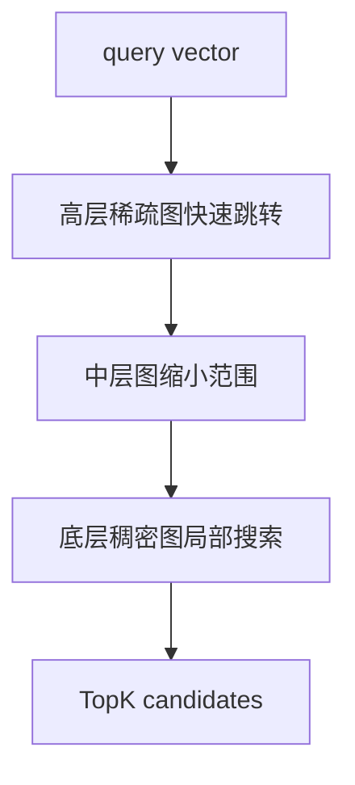
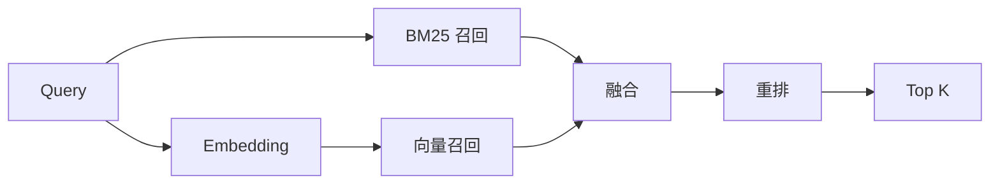

# 向量与混合检索

## 学习目标

- 理解 embedding、距离度量、ANN、HNSW、过滤、召回和重排的职责。
- 掌握关键词检索与向量检索的互补关系，以及 RRF/加权融合的适用边界。
- 能设计 RAG/知识库检索链路中的 chunk、索引、候选集、融合、重排和评估。
- 能用离线评测与线上指标诊断召回不足、排序错误和成本过高。

## 核心原理

### Embedding 表示什么

Embedding 把文本、图片或其他对象编码为固定维度向量，使语义相近的对象在向量空间中距离更近。它不是原文压缩，也不保存可逆语义；模型、训练数据、指令格式、语言和 chunk 粒度都会影响向量质量。

| 维度 | 工程影响 |
| --- | --- |
| 模型版本 | 升级后通常需要重建向量或双写评估 |
| 向量维度 | 影响存储、内存、索引构建和检索成本 |
| chunk 粒度 | 太大稀释主题，太小丢上下文 |
| 文本清洗 | 模板、导航、噪声会污染相似度 |
| 元数据 | 过滤、权限、时间衰减和业务规则依赖它 |

### 距离度量

常见度量包括 cosine similarity、dot product、L2 distance。选择必须与模型训练方式和向量归一化方式匹配。

| 度量 | 直觉 | 注意 |
| --- | --- | --- |
| Cosine | 比较方向，弱化长度 | 常需归一化 |
| Dot product | 方向和长度共同影响 | 向量范数会影响排名 |
| L2 | 欧氏距离越小越近 | 高维空间解释性弱 |

若模型文档要求归一化，索引和查询都要一致处理；否则离线评测和线上召回会出现难以解释的漂移。

### ANN 与 HNSW 直觉

精确 KNN 要和所有向量计算距离，规模大时成本过高。ANN 牺牲少量召回，换取更低延迟。HNSW 可以理解为多层近邻图：上层长跳快速接近目标区域，下层细搜找到局部近邻。



常见参数直觉：

| 参数 | 影响 | 取舍 |
| --- | --- | --- |
| `M` | 每个点连接邻居数 | 越大召回更好，内存和构建更贵 |
| `ef_construction` | 构建时搜索宽度 | 越大图质量更好，构建更慢 |
| `ef_search` | 查询时搜索宽度 | 越大召回更好，延迟更高 |
| TopK | 返回候选数 | 太小漏召回，太大重排成本高 |

这些参数名和默认值随具体引擎变化，生产调参应以所用数据库/搜索引擎官方文档为准。

### 过滤、召回与重排

权限、租户、语言、时间、状态等条件必须进入检索链路。过滤有两类：

- 前过滤：先按 metadata 缩小候选，再做向量搜索。安全、成本低，但过滤后候选太少会影响 ANN 召回。
- 后过滤：先向量召回，再过滤。召回图搜索更完整，但可能返回不足 K 条，且权限过滤不能只依赖客户端。

重排通常对 TopN 候选使用更贵模型或业务规则重算顺序。它不能弥补完全没召回的文档，因此召回层要优先保证 Recall@K。

### 混合检索与融合

关键词检索擅长编号、专有名词、代码、错误码、精确短语；向量检索擅长语义改写、自然语言问题和跨语言/近义表达。混合检索通常双路召回、去重、融合、重排。



融合策略：

| 策略 | 公式/直觉 | 适用 | 局限 |
| --- | --- | --- | --- |
| 加权分数 | `a * bm25_norm + b * vector_norm` | 分数可稳定归一化 | 分数分布漂移会影响权重 |
| RRF | `sum(1 / (k + rank_i))` | 两路分数尺度不同 | 只看排名，不看分数间距 |
| 规则提升 | 标题/标签/权限/新鲜度加权 | 业务强约束 | 规则过多会不可维护 |
| 学习排序 | 用特征训练 ranker | 有点击/标注数据 | 成本和偏差控制更复杂 |

RRF 的核心价值是避免 BM25 分数和向量相似度不可比较；加权融合更可控，但需要持续校准。

### 离线评估与线上闭环

离线评估需要 query、候选文档、人工相关性标注和指标。常用指标：

| 指标 | 说明 |
| --- | --- |
| Recall@K | 相关文档是否进入前 K 候选 |
| MRR | 第一个相关结果出现得多早 |
| nDCG@K | 多级相关性下的排序质量 |
| Precision@K | 前 K 中有多少相关结果 |
| 分路命中率 | BM25、vector、hybrid 各自贡献 |

线上指标要防止只看点击率。无结果率、改写率、二次搜索率、答案引用命中、用户停留、人工差评都能暴露检索问题。

## 工程实践/示例

### RAG 检索链路

```text
文档解析
  -> 清洗和结构识别
  -> chunk + overlap
  -> BM25 字段入索引
  -> embedding 入向量索引
  -> 查询双路召回
  -> metadata 过滤
  -> RRF/加权融合
  -> cross-encoder 或 LLM rerank
  -> 生成答案并保留引用
```

### 失败路径

| 现象 | 可能原因 | 排查 |
| --- | --- | --- |
| 语义问题找不到 | chunk 太大/太小，模型不适配 | Recall@K、样本标注 |
| 错误码查询差 | 只用向量召回 | 增加 keyword/BM25 精确字段 |
| 权限泄漏 | 后过滤遗漏或缓存 key 缺租户 | 权限测试、审计日志 |
| 结果重复 | chunk 重叠或多路召回未去重 | canonical doc_id 去重 |
| 延迟过高 | TopK/ef_search/重排候选过大 | profile、分阶段耗时 |

## 常见误区

| 误区 | 正确认知 |
| --- | --- |
| 向量检索一定比 BM25 好 | 专有名词、数字、代码、型号常需关键词 |
| embedding 一次生成永久适用 | 模型升级、切分策略变化会要求重建或双索引迁移 |
| TopK 越大越好 | 召回更大增加重排成本和噪声 |
| 混合检索只是拼接结果 | 需要去重、归一化、融合、过滤和评估 |
| 重排可以修复所有问题 | 未进入候选集的文档无法被重排提升 |

## 自测题

1. 为什么“HTTP 503”这类查询适合关键词召回？
2. RRF 解决了什么融合问题？
3. 文档切分粒度会如何影响 RAG 效果？
4. 前过滤和后过滤分别有什么风险？
5. 为什么模型升级后要重新做离线评测？

## 实践任务

- 为技术文档问答设计 chunk 规则、embedding 字段、BM25 字段、metadata 过滤和重排流程。
- 准备 20 个评测 query，手工标注相关文档并计算 Recall@5、MRR、nDCG@10。
- 对同一批 query 比较 BM25、vector、hybrid、hybrid+rerank 的指标和延迟。

## 延伸阅读

- Elasticsearch dense vector：https://www.elastic.co/guide/en/elasticsearch/reference/current/dense-vector.html
- OpenSearch vector search：https://opensearch.org/docs/latest/vector-search/
- OpenSearch hybrid search：https://opensearch.org/docs/latest/search-plugins/hybrid-search/
