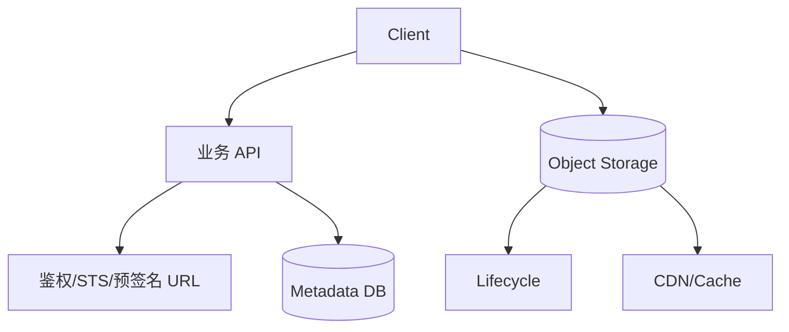
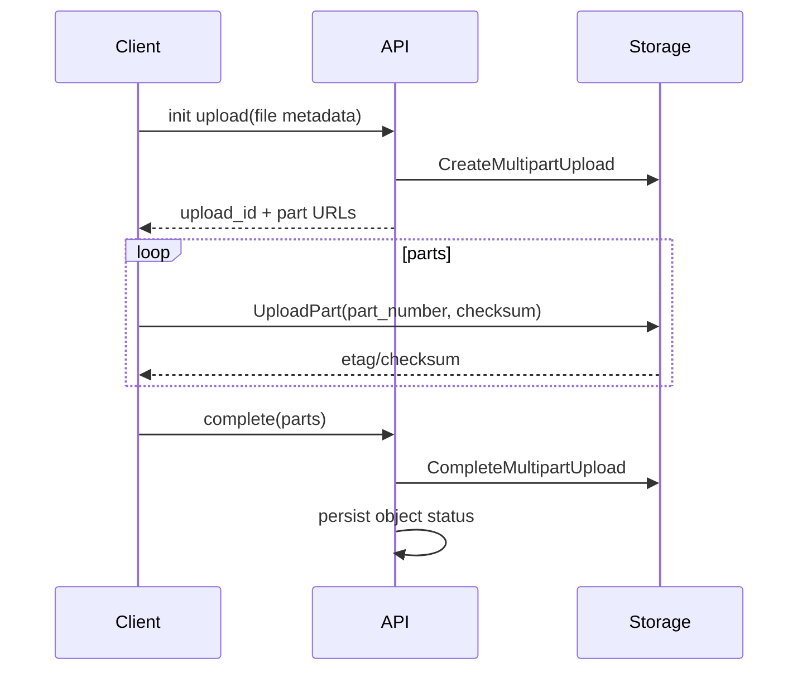

# 对象存储与大文件管理

## 学习目标

- 理解对象存储的 bucket、namespace、object key、metadata、版本、权限和生命周期。
- 掌握 multipart upload、checksum、断点续传、预签名 URL 和大文件下载的工程边界。
- 能设计搜索、AI、日志、备份场景中的对象路径、元数据表、清理和安全策略。
- 能区分对象存储自身保证、业务数据库状态和 CDN/跨地域复制带来的可见性差异。

## 核心原理

### Object、Namespace 与 Metadata

对象存储以 object 为最小管理单位。一个对象通常由 key、内容、系统元数据、用户元数据、版本、校验信息、存储类型和访问策略组成。所谓目录大多是 key 前缀展示，不等价于文件系统 inode 目录。



对象 key 是命名空间设计的核心。好的 key 应支持租户隔离、权限判断、生命周期清理、批量列举和冷热分层；不要把所有业务含义都塞进 key，权威状态仍应在数据库中。

| 元数据 | 推荐位置 | 原因 |
| --- | --- | --- |
| owner/tenant | DB + key 前缀 | 权限和列举都需要 |
| content_type/size/checksum | DB + object metadata | 下载、校验和展示 |
| status/version/ref_count | DB | 业务状态机和清理依据 |
| 临时/归档标记 | DB + lifecycle tag | 自动清理和降本 |

### 版本、删除与生命周期

版本化开启后，同一个 key 可以有多个 version。删除可能只是写入 delete marker，旧版本仍存在；未开启版本化时，覆盖和删除语义更接近“最新对象替换”。生命周期规则可清理临时文件、未完成 multipart、过期版本，或转入低频/归档存储。

删除时序建议：

```text
业务请求删除
  -> DB 记录 deleted/deleting 和目标 version
  -> 搜索索引/缓存失效
  -> 异步删除对象或写 delete marker
  -> 对账任务确认对象、DB、索引一致
```

一致性保证要以具体供应商和功能文档为准。即使对象存储对单对象读写提供较强可见性，`LIST`、CDN、跨地域复制、客户端缓存和异步索引仍可能看到旧状态。

### Multipart Upload 与断点续传

multipart 把大文件拆成多个 part 上传，最后 complete 合并成对象。它降低单次失败成本，支持并行上传和断点续传。



服务端要保存 `upload_id`、part number、part size、etag/checksum、过期时间、owner、目标 key 和状态。客户端重试某个 part 时必须覆盖同一 part number 或生成清晰的新状态，避免 complete 时混入旧分片。

### Checksum 与 ETag 边界

Checksum 是内容完整性验证；ETag 是对象标识或实体标签，具体语义会受 multipart、服务端加密、供应商实现影响，不能无条件当作 MD5。

| 场景 | 推荐做法 |
| --- | --- |
| 单 part 小文件 | 记录服务端返回 checksum，必要时本地预计算 |
| multipart 大文件 | 每个 part 校验 + 完整对象校验 |
| 断点续传 | 对已上传 part 做服务端列表和 checksum 对账 |
| 下载校验 | 比较完整 checksum，失败重试或重新下载 |

### 预签名 URL 与大文件安全

预签名 URL 允许客户端直传/直下，避免业务服务中转大流量。安全边界包括过期时间、HTTP 方法、object key、content type、size、checksum、租户权限和回调确认。

决策表：

| 方案 | 优点 | 风险 | 适用 |
| --- | --- | --- | --- |
| 服务端中转 | 鉴权集中，逻辑简单 | 带宽和内存压力大 | 小文件、敏感转换 |
| 预签名 URL | 低成本直传 | URL 泄漏、过期控制 | Web/移动端大文件 |
| STS 临时凭证 | 支持复杂 SDK 上传 | 权限策略更复杂 | 多文件、断点续传 |
| 后端异步拉取 | 控制输入来源 | 下载失败和超时 | 第三方 URL 导入 |

## 工程实践/示例

### Key 设计

```text
s3://app-prod/tenant/{tenant_id}/jobs/{job_id}/input/{file_id}.json
s3://app-prod/tenant/{tenant_id}/jobs/{job_id}/output/{artifact_id}.json
s3://app-prod/search/raw/{yyyy}/{mm}/{doc_id}/source.pdf
s3://app-prod/tmp/uploads/{tenant_id}/{upload_id}/{part_no}
```

避免把用户原始文件名直接作为 key 的唯一组成部分。原始文件名可以存在 metadata 中，key 使用不可猜测 ID 或业务 ID，降低冲突、遍历和注入风险。

### 元数据表

| 字段 | 说明 |
| --- | --- |
| `object_id` | 业务对象 ID |
| `tenant_id/owner_id` | 权限边界 |
| `bucket/key/version_id` | 定位存储对象 |
| `size/content_type/checksum` | 展示和完整性校验 |
| `status` | uploading、available、deleting、deleted、failed |
| `ref_count` | 是否仍被任务、索引或结果引用 |
| `expires_at` | 临时对象清理 |

### 监控指标

| 指标 | 说明 |
| --- | --- |
| 上传成功率/失败率 | 网络、权限、大小限制问题 |
| multipart 未完成数量 | 泄漏和成本风险 |
| checksum mismatch | 数据完整性风险 |
| 预签名 URL 过期失败 | 客户端耗时和过期策略 |
| 4xx/5xx by operation | 权限、限流、供应商故障 |
| 存储量和生命周期迁移量 | 成本治理 |

## 常见误区

| 误区 | 正确认知 |
| --- | --- |
| 对象存储目录是真目录 | 多数情况下目录是 key 前缀展示 |
| ETag 总是文件 MD5 | multipart 和加密等场景下不能简单等同 |
| 上传成功就不用记录 DB | 业务查询、权限、状态和清理都需要元数据 |
| 大文件应经过业务服务中转 | 通常应使用预签名 URL 或临时凭证直传 |
| 删除对象就完成业务删除 | 还要处理 DB、索引、缓存、版本和对账 |

## 自测题

1. multipart upload 失败后为什么要清理未完成分片？
2. 对象元数据为什么不能只依赖 object key？
3. 生命周期规则适合清理哪些文件？
4. 为什么 ETag 不能被无条件当作内容 MD5？
5. 预签名 URL 的过期时间过长和过短分别有什么风险？

## 实践任务

- 为 AI 任务输入输出设计对象 key、元数据表和生命周期规则。
- 写一个断点续传伪代码，要求支持 part 校验、续传列表、最终合并和失败清理。
- 设计一个“删除文件但允许 7 天恢复”的版本化和生命周期方案。

## 延伸阅读

- Amazon S3 multipart upload：https://docs.aws.amazon.com/AmazonS3/latest/userguide/mpuoverview.html
- Amazon S3 checksums：https://docs.aws.amazon.com/AmazonS3/latest/userguide/checking-object-integrity.html
- Amazon S3 lifecycle：https://docs.aws.amazon.com/AmazonS3/latest/userguide/object-lifecycle-mgmt.html
- OpenSearch snapshots：https://docs.opensearch.org/latest/tuning-your-cluster/availability-and-recovery/snapshots/index/
