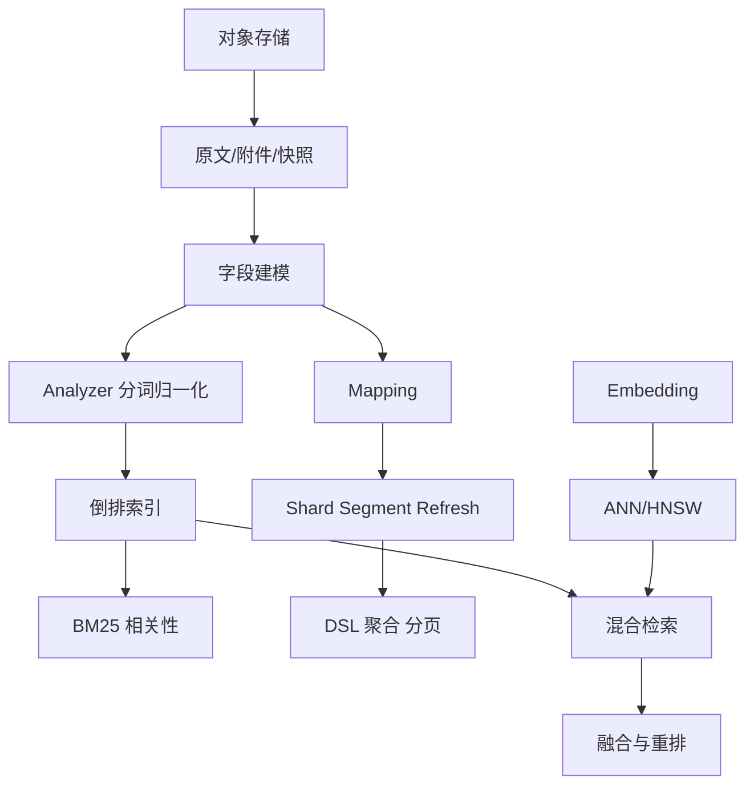

# 搜索与存储学习路径

## 学习目标

- 掌握倒排索引、分词、BM25、向量检索、混合检索和对象存储的核心机制。
- 能使用 Elasticsearch/OpenSearch 设计 mapping、查询、聚合、分页、相关性诊断和集群运维观察点。
- 理解对象存储在搜索原文、AI 数据、日志归档、备份恢复和大文件传输中的基础作用。
- 能把“召回、排序、过滤、重排、存储、权限、生命周期”串成可落地链路。

## 核心原理

搜索系统解决“从大量文档中找到相关内容”的问题，对象存储解决“大对象可靠保存、传输和生命周期管理”的问题。现代检索通常不是单一算法，而是关键词召回、向量召回、业务过滤、融合、重排和观测评估的组合。

知识依赖：



学习产出应包括三类能力：能解释机制，能设计字段和链路，能定位相关性或性能问题。

## 工程实践/示例

### 阅读顺序

1. [搜索原理：倒排索引、分词与 BM25](./01-搜索原理-倒排索引分词BM25.md)
2. [Elasticsearch/OpenSearch 集群、DSL 与聚合](./02-Elasticsearch-OpenSearch集群DSL聚合.md)
3. [向量与混合检索](./03-向量与混合检索.md)
4. [对象存储与大文件管理](./04-对象存储与大文件管理.md)

### 按问题查章节

| 问题 | 入口 |
| --- | --- |
| 为什么搜不到明明存在的文档？ | 分词、mapping、倒排索引、refresh：第 1-2 章 |
| 为什么搜出来的结果排序不符合直觉？ | BM25、boost、explain、重排：第 1-3 章 |
| 为什么查询慢或聚合拖垮集群？ | shard、segment、profile、聚合：第 2 章 |
| 为什么深翻页越来越慢？ | `from + size`、`search_after`、PIT：第 2 章 |
| 为什么向量检索漏掉精确编号？ | BM25 与向量互补、混合检索：第 3 章 |
| 大文件上传失败后如何续传和清理？ | multipart、checksum、生命周期：第 4 章 |
| 搜索原文和索引状态不一致怎么办？ | 对象元数据、refresh、异步索引、对账：第 2/4 章 |

### 端到端链路

```text
对象存储保存原文
  -> 元数据表记录 owner/status/checksum/version
  -> 文档解析和字段抽取
  -> BM25 索引 + 向量索引
  -> query 分析、过滤、双路召回
  -> 融合、重排、返回引用
  -> 指标/日志/点击反馈进入评估
```

## 常见误区

| 误区 | 正确认知 |
| --- | --- |
| 搜索就是数据库 LIKE | 搜索依赖分词、索引、相关性评分和召回排序 |
| refresh 后就是强实时 | ES/OpenSearch 是近实时搜索，业务强一致要另设路径 |
| 向量检索可以替代关键词 | 两者适合不同召回信号，常需要混合 |
| 对象存储就是文件系统 | 对象存储通常是 Key-Object 模型，目录多为前缀语义 |
| 只看线上点击就能评估检索 | 还需要离线标注、Recall@K、nDCG、失败 query 分析 |

## 自测题

1. 倒排索引为什么适合关键词检索？
2. shard、replica、segment、refresh 分别影响什么？
3. multipart upload 解决什么问题？
4. 混合检索中为什么要做去重和融合？
5. 一个搜索结果“召回正确但排序错误”应如何排查？

## 实践任务

- 为“知识库问答”设计文档入库、对象存储路径、关键词检索、向量检索、重排和评估指标。
- 为一个搜索慢查询建立排查清单，包含 DSL、mapping、segment、shard、聚合和资源指标。
- 为一个大文件上传服务设计预签名 URL、断点续传、checksum、元数据表和删除恢复策略。

## 延伸阅读

- Elasticsearch Guide：https://www.elastic.co/guide/
- OpenSearch Documentation：https://opensearch.org/docs/
- Amazon S3 User Guide：https://docs.aws.amazon.com/AmazonS3/latest/userguide/
