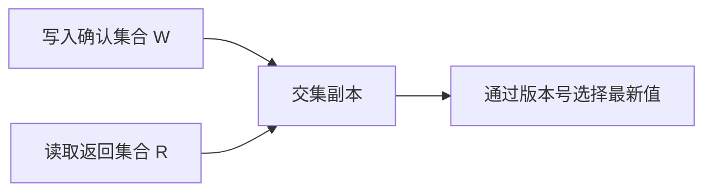

# 01-基本理论：CAP、BASE 与一致性

## 学习目标

- 理解 CAP 不是“三选二口号”，而是网络分区下的一致性与可用性取舍。
- 区分线性一致性、顺序一致性、因果一致性、最终一致性。
- 建立复制、Quorum、故障模型、超时不确定性的直觉。
- 能在系统设计中说明理论保证、工程假设和实现取舍。

## 核心原理

### CAP 的准确理解

CAP 讨论的是分布式数据系统在网络分区存在时，不能同时满足强一致性和每个请求都成功返回。

| 维度 | 含义 | 注意 |
| --- | --- | --- |
| Consistency | 通常指线性一致性：读到最近一次成功写入的效果 | 不是数据库 ACID 里的 C |
| Availability | 每个非故障节点收到请求都必须返回非错误响应 | 返回旧值也算响应，但可能破坏一致性 |
| Partition tolerance | 节点间消息可能丢失、延迟或被隔离 | 真实网络中必须假设会发生 |

理论保证：如果发生分区，系统必须在“拒绝部分请求以保持一致”与“继续响应但可能返回旧数据”之间选择。

工程假设：分区很少发生不等于可以忽略分区；更常见的是长尾延迟、丢包、单向网络故障、DNS/负载均衡异常。

实现取舍：订单扣库存可能优先一致性，社交 feed 可能优先可用性和最终一致性。

### BASE 与最终一致性

BASE 是对强一致事务的一种工程替代思路：

- Basically Available：系统在故障时保留核心可用性。
- Soft State：中间状态允许暂时不一致。
- Eventually Consistent：如果没有新的更新，副本最终收敛。

最终一致性不是“随便不一致”。它要求有可收敛机制，例如重试投递、幂等消费、补偿任务、冲突解决、版本检查。

### 一致性模型对比

| 模型 | 保证 | 典型例子 | 成本 |
| --- | --- | --- | --- |
| 线性一致性 | 操作看起来按真实时间瞬间生效；写完成后新读必须看到 | CP KV、元数据服务、锁服务 | 延迟高，分区时可能拒绝服务 |
| 顺序一致性 | 所有节点看到同一操作顺序，但不要求符合真实时间 | 某些复制状态机抽象 | 比线性一致性弱，仍需全局顺序 |
| 因果一致性 | 有因果关系的操作保持顺序，无关操作可不同序 | 协同编辑、评论回复 | 需要版本向量或依赖追踪 |
| 单调读 | 同一客户端不会读到比自己之前更旧的数据 | 会话一致性缓存 | 依赖会话路由或读版本 |
| 最终一致性 | 无新写入时副本最终收敛 | DNS、异步复制、缓存刷新 | 需要容忍短期旧读和冲突 |

### 复制与故障模型

复制的目标是提高读吞吐、容错和数据持久性，但复制一定引入一致性问题。

| 复制方式 | 写入路径 | 优点 | 风险 |
| --- | --- | --- | --- |
| 主从同步复制 | 主库等待从库确认 | 数据更安全，读更接近最新 | 写延迟高，从库慢会拖垮主库 |
| 主从异步复制 | 主库提交后异步发送 | 写延迟低，吞吐高 | 主库故障可能丢最近写入 |
| 多主复制 | 多节点可写 | 跨地域低延迟写 | 冲突解决复杂 |
| Quorum 复制 | 写 W 个副本，读 R 个副本 | 可调一致性和可用性 | 参数错误会读旧值 |

故障模型要先讲清楚：

- Crash fault：进程宕机或重启，不作恶。
- Omission fault：消息丢失、请求未处理。
- Timing fault：请求过慢、时钟漂移、调度暂停。
- Byzantine fault：节点可能返回任意错误或恶意结果，普通后端系统通常不按此模型设计。

### Quorum 直觉

在 N 个副本中，如果写入需要 W 个确认，读取需要 R 个响应，当 `R + W > N` 时，读集合和写集合至少有一个副本重叠，因此有机会读到最新写入。



关键点是“有机会”而不是自动正确。系统还需要版本号、冲突解决、读修复或强制从多数派读取。

### Sloppy Quorum、Read Repair 与反熵

严格 quorum 要求读写都落在同一组拥有该 key 的副本上。sloppy quorum 在部分目标副本不可用时，允许临时写入其他健康节点，后续再通过 hinted handoff 归还给原副本。它提高可用性，但弱化“读写集合必然相交”的直观推理。

| 机制 | 解决的问题 | 边界 |
| --- | --- | --- |
| Sloppy quorum | 目标副本故障时仍接受写入 | 读可能暂时读不到临时副本上的新值 |
| Hinted handoff | 故障副本恢复后补写 | 提示丢失或过期仍需反熵修复 |
| Read repair | 读到多个版本时顺手修复旧副本 | 只有被读取的 key 才会修复 |
| Anti-entropy | 后台比较副本差异并同步 | 消耗 IO/网络，收敛不是瞬时 |

故障时序示例：

```text
T1: key 属于 A/B/C，写 W=2
T2: C 不可达，系统把副本临时写到 D，返回成功
T3: 读请求只读 A/C，若 A 未包含最新或 C 仍故障，可能读旧值
T4: C 恢复，D 通过 hinted handoff 把写入交还给 C
T5: 后台反熵修复残留差异
```

因此在面试或设计文档中，不能只写 `R + W > N`。还要说明副本选择是否固定、版本比较方式、冲突解决规则、是否允许 sloppy quorum、读修复触发条件和最大收敛窗口。

### 超时的不确定性

超时只能说明“调用方在截止时间前没收到结果”，不能说明服务端没执行。

可能发生的路径：

1. 请求没到服务端。
2. 请求到了，服务端没处理。
3. 服务端处理成功，但响应丢了。
4. 服务端处理成功，响应太慢。
5. 服务端处理一半后崩溃，状态未知。

因此，任何带重试的写操作都需要幂等设计，不能把超时简单等价为失败。

### 一致性模型的观测与测试

一致性不是靠单个指标证明的，但可以通过事件日志和历史检查降低风险。关键是记录每次读写的 key、value/version、客户端时间、服务端逻辑版本、写入确认副本和读取副本集合。

| 目标 | 可观测信号 |
| --- | --- |
| 读己之写 | 同一会话写入版本后读到的最低版本 |
| 单调读 | 客户端读到版本是否倒退 |
| 最终收敛 | 副本版本差距、反熵 backlog、最大落后时间 |
| Quorum 健康 | 成功读写副本数、超时副本、hinted handoff backlog |
| 冲突率 | 多版本返回次数、冲突解决覆盖次数 |

工程上常用 Jepsen 类历史检查、影子读、对账任务和 chaos 测试验证假设。测试结论也要限定在故障模型内：通过 crash fault 测试不代表系统能抵抗 Byzantine fault；通过低延迟网络测试也不代表跨地域分区下仍满足同样 SLA。

### 设计时的保证分层

分布式方案要把数学/协议保证、工程假设、具体实现分开写。这样可以避免把“多数派”“锁”“重试”说成绝对正确。

| 层次 | 示例 | 应写清楚的问题 |
| --- | --- | --- |
| 数学/协议保证 | 多数派集合相交、Raft 已提交日志不丢 | 前提是什么，故障模型是什么 |
| 工程假设 | 故障独立、时钟漂移有限、网络最终恢复 | 假设失效时如何降级或报警 |
| 具体实现 | 超时、重试、读修复、缓存 TTL | 参数如何选，如何观测 |
| 业务语义 | 余额不能错、feed 可延迟 | 错误后果和用户可见状态 |

一个可靠的设计回答通常采用这种句式：“在 crash fault、网络最终恢复、至少多数副本存活的前提下，协议保证已提交写入不会被新 leader 丢弃；工程上仍要监控选举频率、复制延迟、磁盘 fsync 和客户端超时，因为这些会影响可用性和尾延迟。”

## 工程实践/案例

电商下单链路中，“创建订单”通常要求订单号唯一且状态机可恢复；“扣减库存”可使用预占库存或库存流水；“发送短信”可以最终一致。把所有步骤都做成一个强事务，往往牺牲可用性并放大故障影响。

一个常见取舍：

| 子能力 | 一致性目标 | 实现方式 |
| --- | --- | --- |
| 订单状态 | 强约束，不允许乱序跳转 | 状态机 + 乐观锁 |
| 支付回调 | 至少一次，幂等处理 | 幂等键 + 唯一索引 |
| 库存展示 | 可短暂不准 | 缓存 + 异步刷新 |
| 消息通知 | 最终送达即可 | 消息队列 + 重试 + 死信 |

## 常见误区

- 误区：CAP 是 C、A、P 任意三选二。  
  修正：真实系统必须面对 P；分区发生时才在 C 和 A 之间取舍。

- 误区：最终一致性就是不保证。  
  修正：最终一致性需要明确收敛条件、重试机制、冲突处理和可观测性。

- 误区：超时就是失败。  
  修正：超时是未知，重试前必须设计幂等。

- 误区：Quorum 只要 `R + W > N` 就一定强一致。  
  修正：还需要版本比较、最新值选择、故障处理和读写协议约束。

## 自测题

1. 为什么 CAP 中的 C 更接近线性一致性，而不是 ACID 的一致性？
2. `N=3, W=1, R=1` 有什么风险？`W=2, R=2` 又牺牲了什么？
3. 一个 HTTP 写请求超时后，调用方能确认哪些事实？不能确认哪些事实？
4. 顺序一致性和线性一致性的差别是什么？

## 实践任务

设计一个用户资料服务，包含“修改昵称”“读取资料”“异步更新搜索索引”。写出每个操作需要的一致性级别、失败后的补偿方式、是否允许读取旧值，以及为什么。

## 延伸阅读

- Gilbert, Seth; Lynch, Nancy. [Perspectives on the CAP Theorem](https://doi.org/10.1109/MC.2011.389).
- Brewer, Eric. [CAP Twelve Years Later: How the “Rules” Have Changed](https://www.infoq.com/articles/cap-twelve-years-later-how-the-rules-have-changed/).
- Martin Kleppmann, *Designing Data-Intensive Applications*，复制、一致性与分布式系统章节。
