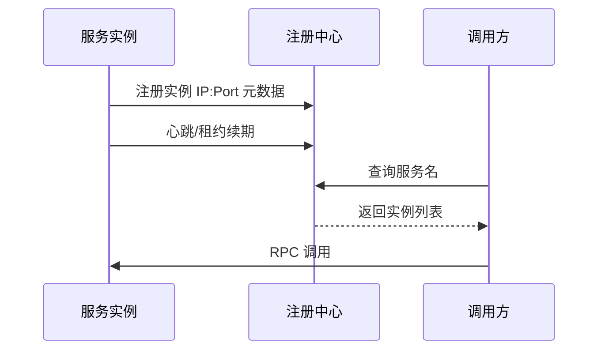
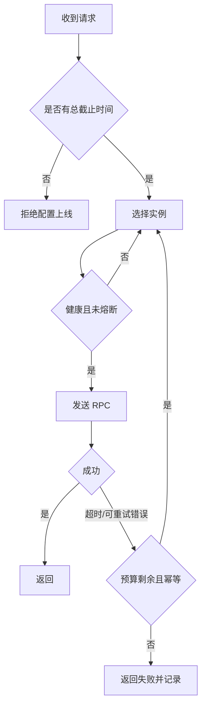

# 02-服务发现：RPC 与负载均衡

## 学习目标

- 理解服务发现、注册、健康检查、负载均衡在调用链中的位置。
- 区分客户端负载均衡、服务端负载均衡和服务网格。
- 掌握常见负载均衡算法、RPC 超时、重试和连接池配置。
- 能说明服务发现的理论边界、工程假设和实现取舍。

## 核心原理

### 服务发现的基本模型

服务发现解决“服务名到可用实例集合”的动态映射。



理论保证：注册中心只能提供某一时刻的视图；在网络延迟和心跳间隔下，实例列表必然可能过期。

工程假设：健康检查、心跳、下线通知和本地缓存足够快，可以把错误路由控制在可接受范围。

实现取舍：心跳太频繁会增加注册中心压力，太慢会延长故障实例摘除时间。

### 租约、DNS 与注册中心一致性

服务发现常见两条路线：DNS 解析和注册中心查询。DNS 简单、通用、缓存层多；注册中心能携带更多实例元数据、健康状态和变更 watch，但自身要处理一致性、租约和可用性。

| 方案 | 优点 | 风险 |
| --- | --- | --- |
| DNS | 标准化、客户端无侵入 | TTL 缓存导致摘除慢，负载策略有限 |
| 注册中心 | 支持 watch、权重、标签、租约 | 客户端复杂，注册中心成为关键依赖 |
| Service Mesh | 统一流量治理 | 数据面/控制面运维复杂 |

租约模型的关键边界：实例续约成功只能说明“注册中心近期收到过该实例心跳”，不能证明实例当前一定能处理业务请求；续约失败也可能是实例到注册中心的网络问题，不等于实例到调用方不可达。因此就绪检查、主动摘流量、本地缓存和失败重试要配合使用。

故障时序：

```text
T1: 实例 A 注册并持续续约
T2: A 的业务线程池耗尽，但心跳线程仍正常
T3: 注册中心仍返回 A，调用方开始出现超时
T4: 客户端 outlier detection/主动健康检查把 A 临时摘除
T5: A 恢复后先 warmup，再逐步恢复权重
```

### RPC 的关键要素

RPC 把远程调用包装得像本地函数，但远程调用具有本地函数没有的不确定性：网络延迟、超时、重试、序列化失败、服务端已执行但响应丢失。

| 配置 | 作用 | 典型风险 |
| --- | --- | --- |
| 连接超时 | 建连截止时间 | 过长会拖垮线程池 |
| 请求超时 | 单次调用截止时间 | 过短导致误判失败 |
| 总截止时间 | 包含重试的总预算 | 没有总预算会放大雪崩 |
| 重试次数 | 提高瞬时失败成功率 | 非幂等写会重复执行 |
| 连接池 | 复用连接降低成本 | 池耗尽导致排队 |
| 序列化协议 | 控制兼容性和性能 | 字段演进不当导致解析失败 |

### Deadline、Cancellation 与重试预算

RPC 超时应按端到端 deadline 传递，而不是每一层重新设置独立超时。上游剩余 200ms 时，下游调用不能再发起 1s 请求；取消信号也应传播到正在排队、执行或等待 IO 的下游，避免已经无用的工作继续消耗资源。

```text
入口 deadline=800ms
  -> 用户服务消耗 120ms，剩余 680ms
  -> 订单服务预算 300ms，库存服务预算 200ms
  -> 第一次库存调用 120ms 超时
  -> 仅当剩余预算、错误类型、幂等性都允许时重试
```

序列化协议演进要遵守兼容规则：新增字段提供默认语义，删除字段先停写再停读，枚举值增加要让旧客户端能处理未知值。灰度发布期间，新旧客户端和服务端会共存，协议兼容性是 RPC 稳定性的一部分。

### 负载均衡算法

| 算法 | 原理 | 适用场景 | 风险 |
| --- | --- | --- | --- |
| 轮询 | 请求依次分配 | 实例性能接近 | 忽略实例负载 |
| 加权轮询 | 按权重分配 | 实例规格不同 | 权重维护成本 |
| 随机 | 随机选择实例 | 简单高吞吐 | 小流量时不均衡 |
| 加权随机 | 按权重随机 | 大规模服务 | 权重不准会倾斜 |
| 最少连接 | 选择连接数少的实例 | 长连接、请求耗时差异大 | 连接数不等于真实负载 |
| P2C | 随机挑两个，选负载低者 | 大规模集群 | 需要负载指标 |
| 一致性哈希 | 同一 key 尽量路由同实例 | 缓存、有状态分片 | 节点变化仍需迁移 |
| 本地优先 | 优先同机房/同可用区 | 降低延迟和跨区流量 | 本地故障时要快速切换 |

### 健康检查

健康检查分为存活检查和就绪检查。

- 存活检查：进程是否还活着，常用于重启。
- 就绪检查：实例是否可以接收业务流量，例如依赖连接、缓存预热、配置加载是否完成。
- 深度检查：验证关键依赖，但不能过重，否则检查本身会造成压力。

健康状态应与负载均衡联动：失败实例摘除，恢复实例预热后逐步放量。

### 观测指标与配置维度

| 维度 | 指标 |
| --- | --- |
| 服务发现 | 注册实例数、租约过期数、watch 延迟、本地缓存年龄 |
| RPC 客户端 | 成功率、错误码、deadline exceeded、重试次数、连接池等待 |
| 负载均衡 | 实例权重、摘除次数、P2C 负载分布、跨区流量比例 |
| 健康检查 | 就绪失败率、恢复耗时、warmup 中实例数 |
| 协议兼容 | 反序列化错误、未知字段/枚举计数、版本分布 |

配置决策应落到可审查项：总 deadline、每跳预算、最大重试次数、可重试错误码、是否只重试幂等请求、连接池上限、每实例并发上限、健康检查周期、摘除阈值、恢复预热窗口。

## 工程实践/案例

一个支付查询 RPC 的推荐策略：

- 读请求可重试，但必须设置总截止时间，例如 800ms 内最多 2 次。
- 写请求只在服务端支持幂等键时重试。
- 超时配置按调用链预算向下分配，不能每层都设置 3 秒。
- 健康检查失败不立即杀进程，先摘流量；进程崩溃由进程管理器拉起。
- 实例上线先进入 warmup 状态，避免刚启动就被大流量击穿。



## 常见误区

- 误区：服务注册成功就等于可调用。  
  修正：注册只说明可被发现，就绪检查才说明可接流量。

- 误区：重试越多成功率越高。  
  修正：重试会增加下游压力，必须受总预算、错误类型和幂等性约束。

- 误区：负载均衡只看 QPS。  
  修正：还要看延迟、连接数、错误率、队列长度、实例权重和机房位置。

- 误区：RPC 像本地函数一样可靠。  
  修正：远程调用的核心状态是成功、失败、未知三类。

## 自测题

1. 为什么就绪检查和存活检查不能混用？
2. P2C 相比普通随机算法有什么优势？
3. 一个非幂等写 RPC 超时后为什么不能盲目重试？
4. 调用链有 5 层时，为什么每层都设置 1 秒超时会导致整体不可控？

## 实践任务

为一个“商品详情页调用库存、价格、评价、推荐”的接口设计 RPC 超时、重试、降级和负载均衡策略。要求说明哪些失败可以降级，哪些失败必须返回错误。

## 延伸阅读

- [gRPC 官方文档](https://grpc.io/docs/guides/)：服务配置、deadline、retry、load balancing。
- [Envoy 官方文档](https://www.envoyproxy.io/docs/envoy/latest/)：outlier detection、health checking、load balancing。
- [Google SRE Book](https://sre.google/sre-book/table-of-contents/)：Handling Overload、Addressing Cascading Failures。
