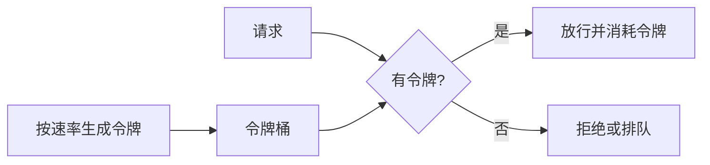
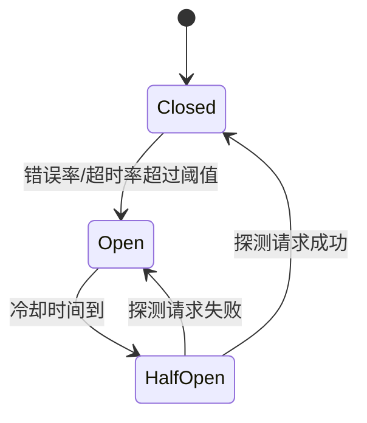

# 03-韧性工程：限流、熔断、降级

本章关注跨服务调用链的故障扩散控制；单服务内的启动关闭、信号处理和连接排空见[生命周期与服务韧性](../02-网络服务开发/06-生命周期与服务韧性.md)。

## 学习目标

- 理解限流、熔断、降级分别解决什么问题。
- 掌握令牌桶、漏桶、并发限制、熔断状态机和隔离策略。
- 能设计防雪崩、防过载、防故障扩散的调用保护。
- 能区分理论上可保证的约束、工程假设和实现取舍。

## 核心原理

### 三类保护手段

| 手段 | 目标 | 触发依据 | 输出 |
| --- | --- | --- | --- |
| 限流 | 控制入口流量或资源消耗 | QPS、并发数、令牌数 | 拒绝、排队、削峰 |
| 熔断 | 下游异常时快速失败 | 错误率、超时率、慢调用比例 | 打开、半开、关闭 |
| 降级 | 保住核心链路 | 业务优先级、依赖状态 | 默认值、缓存值、关闭非核心功能 |

理论保证：限流只能限制进入系统的请求量，不能保证每个请求成功；熔断只能减少继续调用故障依赖的压力，不能修复依赖。

工程假设：指标采样窗口能代表当前状态，错误分类准确，降级结果业务可接受。

实现取舍：保护越激进，误杀越多；保护越保守，故障扩散风险越高。

### 令牌桶与漏桶

令牌桶允许一定突发流量：



漏桶以固定速率流出，强调平滑处理：

| 算法 | 特点 | 适用 |
| --- | --- | --- |
| 令牌桶 | 支持突发，平均速率受控 | API 网关、用户级限流 |
| 漏桶 | 输出平滑，突发被排队或丢弃 | 写入后端、异步处理 |
| 固定窗口 | 实现简单 | 粗粒度限流 |
| 滑动窗口 | 边界更平滑 | 用户、租户、IP 限流 |
| 并发限制 | 控制同时执行数量 | 数据库、线程池、外部依赖 |

### 并发限制与自适应保护

QPS 限流控制进入速率，并发限制控制系统内同时执行的工作量。对于慢依赖，QPS 不高也可能把线程池、连接池和队列占满；此时并发上限比单纯 QPS 更直接。

| 限制对象 | 常见配置 | 失败模式 |
| --- | --- | --- |
| 用户/IP | 每分钟请求数、突发桶容量 | 误伤 NAT 或代理后用户 |
| 租户 | 租户级 QPS/并发 | 大客户被限需要配额治理 |
| 接口 | 写接口、重接口单独限流 | 全局限流掩盖热点接口 |
| 下游依赖 | 每依赖连接/并发上限 | 慢依赖拖垮调用方 |
| 任务队列 | 队列长度、消费速率 | 无限积压导致恢复更慢 |

自适应限流会根据延迟、错误率、队列长度或 CPU 动态调整阈值。它能更快响应过载，但要设置最小/最大边界和回退策略，避免短期指标抖动引起限流振荡。

### 熔断状态机



熔断要点：

- 只对明确可归因于下游或资源耗尽的错误计数。
- 使用滑动窗口，避免单点尖峰永久影响状态。
- 半开只放少量探测请求，避免恢复瞬间又被压垮。
- 熔断结果要进入日志、指标和告警。

### 重试预算与雪崩放大

重试会提高短暂网络抖动下的成功率，也会把流量放大到故障下游。若 3 层调用每层都最多重试 2 次，最坏情况下底层可能承受 `3 * 3 * 3 = 27` 倍请求尝试。工程上要设置重试预算：限制某个时间窗口内由重试产生的额外请求比例，并使用 jitter 避免同步重试。

失败时序：

```text
T1: 库存服务 P99 升高
T2: 上游请求超时，开始重试
T3: 重试流量进一步占满库存线程池
T4: 熔断打开，上游快速失败或降级
T5: 冷却后半开探测，成功才逐步恢复
```

可重试错误必须分类：连接失败、临时 503、明确未执行可以重试；业务校验失败、非幂等写、服务端状态未知通常不能盲目重试。

### 隔离与背压

隔离是防止一个依赖耗尽共享资源：

- 线程池隔离：不同依赖使用独立执行资源。
- 连接池隔离：避免慢依赖占满全局连接。
- 队列隔离：不同优先级使用不同队列。
- 舱壁模式：一个模块故障不影响其他模块。

背压是下游处理不过来时让上游减速或失败，而不是无限排队。

### 观测指标与告警

| 能力 | 指标 |
| --- | --- |
| 限流 | 放行数、拒绝数、排队时长、令牌耗尽率 |
| 熔断 | open/half-open 次数、探测成功率、熔断持续时间 |
| 降级 | 降级命中率、缓存兜底命中率、用户影响面 |
| 隔离 | 线程池活跃数、队列长度、连接池等待、bulkhead 拒绝 |
| 重试 | 重试尝试数、重试成功率、重试预算消耗 |

告警不要只报“熔断打开”。更有价值的是关联上游 QPS、下游错误、限流拒绝、业务成功率和 error budget 燃烧速度，判断是保护机制正常止血，还是保护阈值配置错误。

## 工程实践/案例

活动秒杀系统可以分层保护：

| 层次 | 保护 |
| --- | --- |
| CDN/网关 | IP/用户/接口限流，静态资源缓存 |
| 应用层 | 令牌桶、热点商品队列、非核心依赖降级 |
| 库存层 | 预扣库存、单商品并发限制、幂等扣减 |
| 数据库 | 连接池上限、慢查询保护、写入削峰 |

降级策略要按业务价值排序：商品主信息和库存是核心；推荐、评价摘要、相似商品可以返回缓存或空结果；埋点失败不应阻塞主链路。

## 常见误区

- 误区：限流就是拒绝请求。  
  修正：限流可以拒绝、排队、削峰、动态调参，关键是保护资源边界。

- 误区：熔断阈值越低越安全。  
  修正：阈值过低会导致误熔断，降低正常可用性。

- 误区：降级就是返回假数据。  
  修正：降级必须是业务允许的退化结果，例如缓存、默认值、隐藏模块。

- 误区：队列能解决过载。  
  修正：无限队列会把过载变成延迟爆炸和内存耗尽。

## 自测题

1. 令牌桶为什么比漏桶更适合允许短时突发？
2. 熔断半开状态为什么不能直接放开全部流量？
3. 限流、熔断、降级分别发生在调用链的什么位置？
4. 为什么要把限流拒绝也纳入指标和告警？

## 实践任务

为一个“用户下单接口”设计三级保护：入口限流、库存服务熔断、推荐服务降级。写出触发条件、返回结果、监控指标和恢复条件。

## 延伸阅读

- [Google SRE Book](https://sre.google/sre-book/table-of-contents/)：Handling Overload、Addressing Cascading Failures。
- [Envoy 官方文档](https://www.envoyproxy.io/docs/envoy/latest/)：circuit breakers、outlier detection、rate limit。
- [Netflix Hystrix Wiki](https://github.com/Netflix/Hystrix/wiki)，用于理解熔断和隔离思想；项目状态和生产选型需另行评估。
