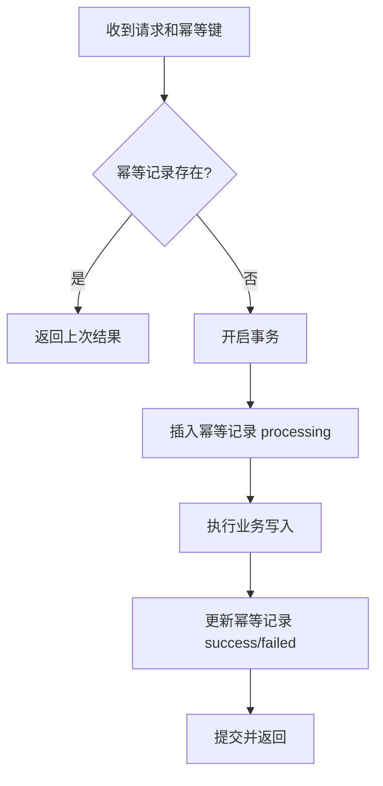

# 04-幂等、分布式锁与分布式 ID

## 学习目标

- 理解幂等是重试、消息至少一次投递、回调重复的基础。
- 掌握幂等键、唯一约束、状态机和去重表设计。
- 理解分布式锁的适用边界和常见风险。
- 掌握 Snowflake 类 ID 的结构、优点和时钟问题。

## 核心原理

### 幂等

幂等表示同一个业务请求执行一次或多次，最终效果一致。它不是接口“不会被调用多次”，而是“被调用多次也不破坏状态”。

| 场景 | 风险 | 幂等手段 |
| --- | --- | --- |
| HTTP 写请求重试 | 重复创建订单 | 幂等键 + 唯一索引 |
| 支付回调重复 | 重复入账 | 支付流水唯一约束 |
| MQ 至少一次投递 | 重复消费 | 消息 ID 去重表 |
| 状态更新乱序 | 状态回退 | 状态机约束 + 版本号 |

理论保证：唯一约束可以保证同一 key 只成功写入一次；状态机可以保证非法状态转移被拒绝。

工程假设：幂等 key 的生成规则稳定，保存期限覆盖最大重试窗口，调用方不会复用错误 key。

实现取舍：去重表永久保存成本高，按业务窗口过期可能允许超长延迟消息重复生效。

### 幂等键与状态机

创建订单可使用 `user_id + client_request_id` 作为幂等键。服务端处理流程：



状态机用于防乱序，例如订单状态：

| 当前状态 | 允许转移 | 禁止转移 |
| --- | --- | --- |
| CREATED | PAID、CANCELLED | SHIPPED |
| PAID | SHIPPED、REFUNDING | CREATED |
| SHIPPED | FINISHED、REFUNDING | CANCELLED |
| FINISHED | 无或售后状态 | PAID |

### 幂等键生命周期

幂等记录不是简单的“请求 ID 去重”。它要覆盖请求开始、处理中、成功、可重试失败、不可重试失败和过期清理。

| 状态 | 含义 | 再次收到同 key |
| --- | --- | --- |
| `processing` | 请求正在执行或结果未知 | 返回处理中、等待或查询业务状态 |
| `success` | 已完成并有确定结果 | 返回第一次结果 |
| `retryable_failed` | 临时失败，允许重试 | 重新执行或由后台恢复 |
| `final_failed` | 参数错误等确定失败 | 返回同样失败 |
| `expired` | 超出去重窗口 | 按业务规则拒绝或当新请求处理 |

保存期限应覆盖客户端重试、网关重放、MQ 延迟、第三方回调补发和人工补偿窗口。过短会让迟到消息重新生效，过长会增加存储和索引成本。请求 payload 哈希也应写入幂等记录，防止调用方复用同一个 key 提交不同业务内容。

### 分布式锁

分布式锁用于跨进程互斥，但它不是事务，也不能替代数据约束。

基础互斥至少需要：

- 原子加锁：只在 key 不存在时设置锁值和过期时间。
- 锁值唯一：释放时只能释放自己持有的锁。
- 过期时间：持锁方崩溃后锁能自动释放。
- 续租机制：长任务需要延长租约，但续租仍不能消除长时间暂停或网络分区。

若锁保护数据库、文件、消息等外部可写资源，还应使用递增的 fencing token，并要求下游根据 token 拒绝旧持有者的写入。若下游不校验，token 本身不产生保护效果。

常见实现：

| 实现 | 优点 | 风险 |
| --- | --- | --- |
| 数据库唯一索引 | 简单，事务语义清晰 | 性能有限，死锁/清理复杂 |
| Redis SET NX PX | 快，易用 | 主从切换、暂停、过期导致并发持锁 |
| ZooKeeper/etcd 临时节点 | 会话语义和顺序节点强 | 运维成本高 |

### Fencing Token 时序

fencing token 是单调递增的持锁凭证。下游资源必须记住已接受的最大 token，并拒绝更小 token 的写入。

```text
T1: Client A 获得锁，token=10
T2: A 长时间 GC 暂停，锁租约过期
T3: Client B 获得锁，token=11，并写数据库
T4: A 恢复后继续写，携带 token=10
T5: 数据库比较 token，拒绝旧写入
```

若 T5 的下游不校验 token，fencing 只是一段无效元数据。分布式锁适合减少并发执行，不应作为余额、库存、订单状态正确性的唯一防线；这些关键状态仍要靠唯一索引、版本号、条件更新和状态机兜底。

### 分布式 ID

分布式 ID 需要在全局唯一、趋势递增、可排序、低延迟、可用性之间取舍。

Snowflake 类结构通常是：

```text
| 时间戳 | 机器/机房 ID | 序列号 |
```

优点：本地生成、趋势递增、吞吐高。风险集中在时钟：

- 时钟回拨可能生成重复 ID。
- 同一毫秒序列号耗尽需要等待下一毫秒。
- 机器 ID 配置冲突会导致重复。
- 跨机房时间不一致会影响全局有序性。

处理方式：

- 监控 NTP 和时钟漂移。
- 发现小幅回拨时等待；大幅回拨时拒绝发号并告警。
- 机器 ID 由注册中心或部署系统分配，避免手工冲突。
- 不把 Snowflake ID 当作严格全局递增事务序号。

### ID 方案决策表与监控

| 方案 | 优点 | 风险 |
| --- | --- | --- |
| 数据库自增 | 简单、严格单点递增 | 单点瓶颈，分库困难 |
| 号段模式 | 吞吐高、数据库压力低 | 服务重启会浪费号段 |
| Snowflake | 本地生成、趋势递增 | 时钟回拨、机器 ID 冲突 |
| UUID/随机 ID | 无中心依赖 | 索引局部性差，可读性弱 |
| ULID/KSUID 类 | 大致按时间排序 | 仍依赖时钟和随机碰撞假设 |

监控项包括：发号 QPS、序列号耗尽次数、等待下一毫秒次数、时钟回拨次数、NTP 偏移、机器 ID 冲突、ID 生成失败率、数据库唯一冲突。发现冲突时应先保护写入路径，停止可疑发号节点，再做数据影响面扫描。

## 工程实践/案例

支付回调处理建议：

1. 以第三方支付流水号建立唯一索引。
2. 回调进入后先查本地流水；已成功则直接返回成功。
3. 状态更新使用 `WHERE status IN (...)` 限制合法转移。
4. 下游发货消息通过 Outbox 或事务消息投递。
5. 所有重复回调记录计数，但不告警为错误。

分布式锁只保护“执行过程互斥”，最终正确性仍应由数据库唯一约束、版本号或状态机兜底。

## 常见误区

- 误区：接口方法是 PUT 就天然幂等。  
  修正：HTTP 语义不自动保证业务幂等，服务端状态写入仍需约束。

- 误区：有分布式锁就不会并发写错。  
  修正：锁可能过期、误释放或脑裂，关键状态仍需数据层校验。

- 误区：Redis 锁可以保护任意长任务。  
  修正：长任务需要续租和 fencing token，否则旧持有者可能继续写。

- 误区：Snowflake ID 全局严格递增。  
  修正：它通常只是趋势递增，严格顺序仍需共识或单点序列。

## 自测题

1. 幂等键应该由客户端生成还是服务端生成？分别适合什么场景？
2. 为什么“先查再插”不能替代唯一索引？
3. Redis 锁释放时为什么必须校验锁值？
4. Snowflake 遇到时钟回拨有哪些处理策略？

## 实践任务

设计一个“优惠券领取接口”：同一用户同一券只能领取一次，接口允许客户端重试。写出表结构关键字段、唯一索引、幂等键、状态机和失败重试策略。

## 延伸阅读

- Redis 官方文档：[SET](https://redis.io/docs/latest/commands/set/) 与[分布式锁模式](https://redis.io/docs/latest/develop/use/patterns/distributed-locks/)。
- Martin Kleppmann：[How to do distributed locking](https://martin.kleppmann.com/2016/02/08/how-to-do-distributed-locking.html)。
- Twitter Archive：[Snowflake](https://github.com/twitter-archive/snowflake)。
