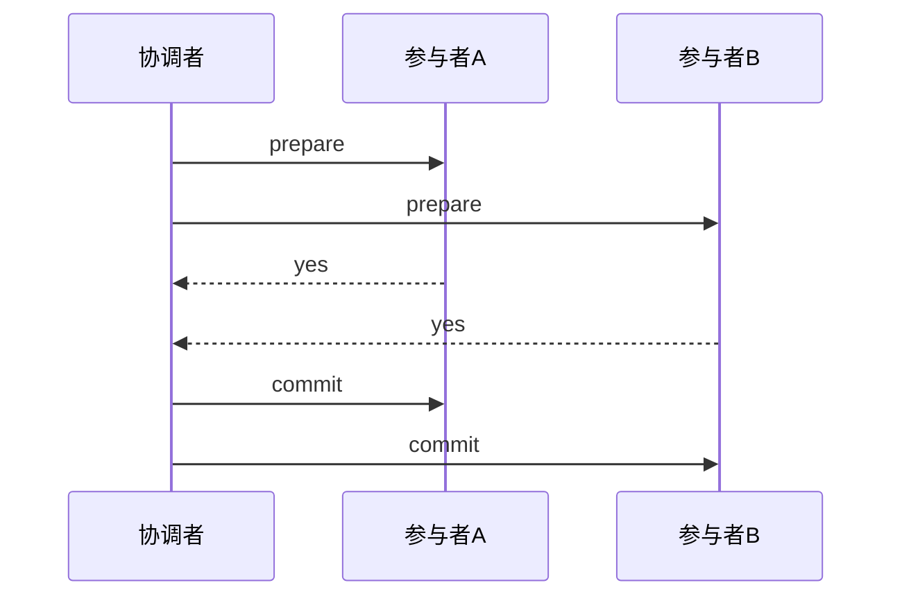
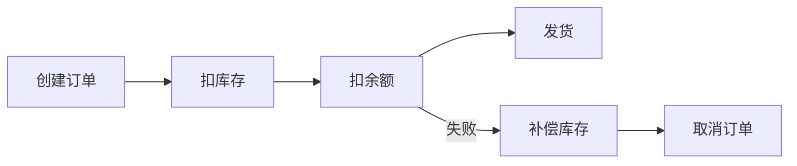
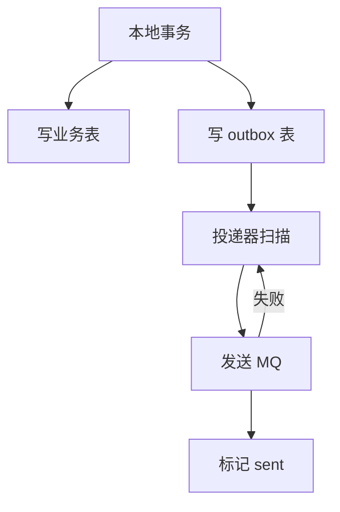

# 05-分布式事务与最终一致性

## 学习目标

- 理解本地事务、分布式事务和业务一致性的区别。
- 掌握 2PC、TCC、Saga、Outbox 的适用场景和代价。
- 能设计最终一致链路中的重试、补偿、幂等和对账。
- 能明确理论保证、工程假设和实现取舍。

## 核心原理

### 为什么需要分布式事务

当一个业务操作跨越多个服务或多个数据库时，本地 ACID 事务无法覆盖全部状态。例如下单同时涉及订单库、库存库、账户库和消息系统。

核心矛盾是：强一致需要协调，协调会增加延迟、阻塞和故障面；最终一致牺牲中间状态一致性，换取可用性和解耦。

### 2PC

两阶段提交包括 prepare 和 commit/rollback。



理论保证：在协调者和参与者正确记录日志并最终恢复的前提下，所有参与者最终提交或回滚。

工程假设：参与者可以长时间锁定资源，协调者可恢复，网络最终恢复。

实现取舍：强一致较好，但阻塞、锁持有时间长，协调者是关键依赖。

故障时序：

```text
T1: 协调者发送 prepare，参与者 A/B 写入 prepare 日志并锁资源
T2: A/B 都返回 yes
T3: 协调者写 commit 决议后宕机，部分参与者未收到 commit
T4: 参与者恢复后发现自己处于 prepared，不知道全局决议
T5: 需要查询协调者日志或等待恢复，否则资源可能长时间阻塞
```

所以 2PC 的问题不是“没有一致性”，而是在故障时可能阻塞，并把参与者资源锁持有时间暴露给协调者和网络可用性。

### TCC

TCC 把业务操作拆成 Try、Confirm、Cancel。

| 阶段 | 作用 | 示例 |
| --- | --- | --- |
| Try | 预留资源 | 冻结余额、预占库存 |
| Confirm | 确认使用资源 | 扣余额、确认库存扣减 |
| Cancel | 释放预留资源 | 解冻余额、释放库存 |

TCC 的难点在业务建模：Confirm 和 Cancel 必须幂等，Cancel 可能先于 Try 到达，需要处理空回滚；Try 成功后重复 Try 要防悬挂。

TCC 状态表至少要记录事务 ID、分支 ID、业务 key、Try 资源、当前状态、版本、过期时间和最后错误。Confirm/Cancel 不能只依赖“有没有记录”，还要按状态机转移。

| 问题 | 含义 | 处理 |
| --- | --- | --- |
| 空回滚 | Cancel 先于 Try 到达 | 记录 cancel 状态，后续 Try 拒绝 |
| 悬挂 | Cancel 后 Try 又成功 | Try 检查全局事务状态 |
| 幂等 | Confirm/Cancel 重复到达 | 唯一约束 + 状态机返回已有结果 |
| 资源冻结 | Try 成功后长期不确认 | 超时扫描和 Cancel 补偿 |

### Saga

Saga 把长事务拆成一系列本地事务，每步失败时执行补偿动作。



理论保证：Saga 不保证隔离性，只保证通过补偿达到业务可接受状态。

工程假设：补偿动作可执行、可重试、幂等，且业务允许中间态暴露。

实现取舍：可用性和解耦更好，但需要复杂状态机、补偿和对账。

### Outbox

Outbox 解决“数据库更新成功但消息发送失败”的原子性问题。业务数据和待发送消息写入同一个本地事务，异步投递器再读取 outbox 表发送消息。



Outbox 通常提供至少一次投递，因此消费者必须幂等。

### CDC、事务消息与 Outbox 取舍

CDC 从数据库变更日志中捕获事件，减少业务代码显式写 outbox 的侵入；事务消息由消息系统提供半消息和确认机制；Outbox 则把业务表和消息表放进同一个本地事务。

| 方案 | 优点 | 风险 |
| --- | --- | --- |
| Outbox | 语义清晰，业务可控 | 需要投递器、清理和去重 |
| CDC | 对业务代码侵入低 | 依赖 binlog/log 配置和消费位点 |
| 事务消息 | 对消息投递友好 | 依赖特定 MQ 语义，仍需业务幂等 |
| 本地事务 + 直接发 MQ | 简单 | DB 成功 MQ 失败会丢事件 |

无论哪种方案，消费者都要按业务 key 幂等，事件要有 schema 版本、事件 ID、发生时间、聚合根版本和可重放语义。

### 补偿、对账与用户可见状态

最终一致系统要让用户看到可解释状态，而不是把中间态伪装成成功。例如订单可显示“处理中”“库存确认中”“支付待确认”“已取消退款中”。后台通过重试、死信、补偿和对账推动收敛。

观测指标：

| 指标 | 说明 |
| --- | --- |
| outbox backlog/最大年龄 | 消息是否积压 |
| 投递成功率/重试次数 | MQ 或消费者健康 |
| 死信数量 | 需要人工或自动补偿的事件 |
| 状态机卡住数量 | 业务流程收敛风险 |
| 对账差异数 | 跨服务数据不一致规模 |
| 补偿成功率 | 恢复能力 |

## 工程实践/案例

下单链路的一种最终一致设计：

1. 订单服务本地事务创建订单和 outbox 消息。
2. 消息投递到库存服务，库存服务按订单号幂等预扣库存。
3. 库存成功后发送库存确认事件。
4. 订单服务收到事件后推进状态。
5. 定时任务扫描超时订单并取消，库存服务释放预扣库存。
6. 对账任务比较订单、库存流水和支付流水。

| 方案 | 一致性 | 可用性 | 开发成本 | 适用 |
| --- | --- | --- | --- | --- |
| 2PC | 强 | 较低 | 中高 | 内部数据库、短事务 |
| TCC | 强业务约束 | 中 | 高 | 金融、库存预占 |
| Saga | 最终一致 | 高 | 高 | 长流程、多服务 |
| Outbox | 消息最终一致 | 高 | 中 | 事件驱动、异步通知 |

## 常见误区

- 误区：分布式事务就是 2PC。  
  修正：2PC 只是一个方案，业务上更常见的是 TCC、Saga、Outbox 和对账。

- 误区：最终一致性不需要事务。  
  修正：每一步本地状态变化仍应使用本地事务保证原子性。

- 误区：消息队列能自动保证业务一致。  
  修正：队列通常只保证投递语义，业务仍需幂等、状态机、补偿和对账。

- 误区：补偿就是反向 SQL。  
  修正：补偿是业务动作，可能不是严格逆操作，例如退款而不是删除支付记录。

## 自测题

1. 2PC 为什么可能阻塞？协调者崩溃时会发生什么？
2. TCC 的空回滚、悬挂、幂等分别是什么意思？
3. Saga 为什么不提供隔离性？会带来哪些业务问题？
4. Outbox 为什么要求消费者幂等？

## 实践任务

为“下单、扣库存、扣优惠券、发积分”设计最终一致方案。要求写出每个服务的本地事务、消息、幂等键、补偿动作、对账任务和用户可见状态。

## 延伸阅读

- Pat Helland, [Life beyond Distributed Transactions](https://www.cidrdb.org/cidr2007/papers/cidr07p15.pdf)。
- Microservices.io：[Saga](https://microservices.io/patterns/data/saga.html) 与 [Transactional Outbox](https://microservices.io/patterns/data/transactional-outbox.html)。
- Martin Fowler：[Saga](https://martinfowler.com/articles/patterns-of-distributed-systems/saga.html)。
