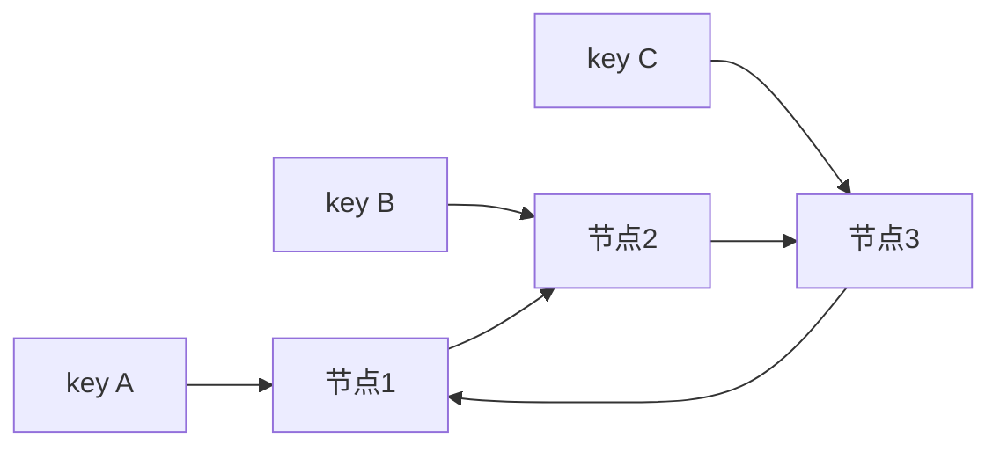
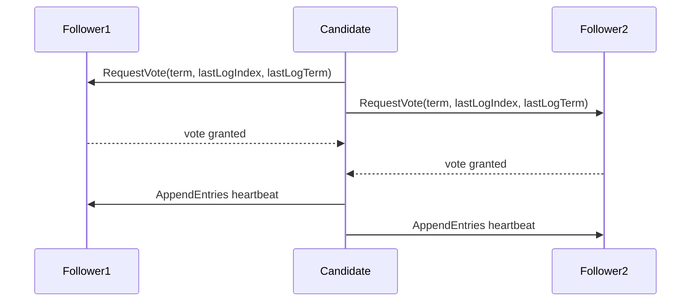
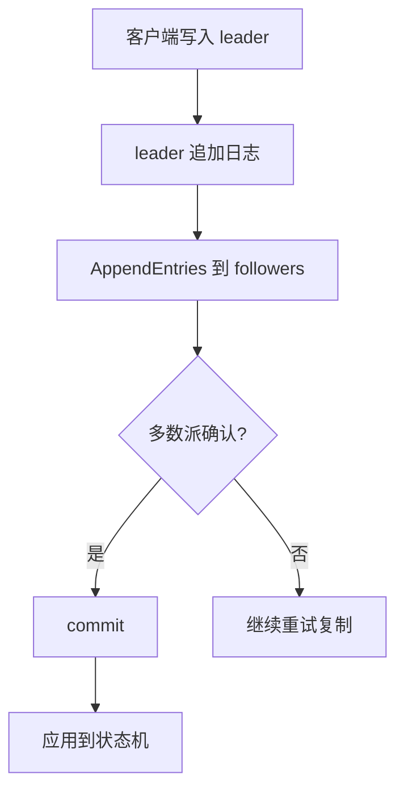

# 06-一致性哈希、选举与 Raft 基础

## 学习目标

- 理解一致性哈希和虚拟节点如何降低节点变化时的数据迁移量。
- 理解 leader election、term、log replication、commit 的基本语义。
- 建立 Raft 安全性直觉：已提交日志不能丢、状态机按同一顺序执行。
- 能区分分片路由、主从选举和共识算法的适用边界。

## 核心原理

### 一致性哈希

普通取模 `hash(key) % N` 在节点数 N 变化时会导致大量 key 重新映射。一致性哈希把节点和 key 映射到同一个哈希环，key 顺时针找到第一个节点。



理论保证：理想哈希均匀时，新增或删除一个节点只影响环上相邻区间。

工程假设：哈希函数分布足够均匀，节点容量差异可通过权重或虚拟节点表达。

实现取舍：虚拟节点越多，负载越均匀，但路由表更大、维护成本更高。

### 虚拟节点

虚拟节点把一个物理节点映射为多个环上位置。作用：

- 平滑数据分布，减少热点。
- 支持按机器规格设置不同虚拟节点数量。
- 节点上下线时迁移更细粒度。

### 再平衡与热点控制

一致性哈希只减少节点变化时的重映射比例，不自动搬迁数据。工程实现还需要迁移任务、双读双写窗口、校验和限速。

```text
新增节点 N4
  -> 计算 N4 接管的 hash 区间
  -> 后台从相邻节点复制数据
  -> 复制期间读旧 owner，或新旧双读
  -> 校验完成后更新路由版本
  -> 清理旧 owner 上迁出数据
```

| 问题 | 处理 |
| --- | --- |
| 热点 key | 单 key 缓存复制、请求合并、局部限流 |
| 节点容量不同 | 按权重设置虚拟节点数量 |
| 路由版本不一致 | 请求携带路由版本，失败后刷新 |
| 迁移影响线上 | 限速、分批、低峰执行、校验后切换 |

一致性哈希适合缓存、分片路由和无共享数据分布；如果每个 key 需要多个副本，还要单独设计副本放置策略，避免副本落在同一故障域。

### 选举问题

选举用于在多个副本中确定一个 leader。它必须处理：

- 多个节点同时认为自己是 leader。
- 网络分区导致脑裂。
- 旧 leader 恢复后继续写入。
- 日志落后的节点被选成 leader。

仅靠心跳和超时可以选出主，但不能自动保证数据安全；安全选举需要日志新旧比较、任期和多数派。

### Raft 基础

Raft 是一种管理复制日志的共识算法。节点角色：

| 角色 | 行为 |
| --- | --- |
| Follower | 被动接收 leader 心跳和日志，参与投票 |
| Candidate | 选举超时后发起投票 |
| Leader | 接收客户端写入，把日志复制给 follower |

Term 是逻辑任期。节点发现更大的 term 必须更新任期并退回 follower。Term 的作用类似分布式系统中的逻辑时间，用来识别过期 leader 和过期消息。

Raft 的核心对象是复制日志，而不是“选主工具”。客户端命令先变成日志项；多数派确认后日志项 committed；各节点按日志顺序把 committed 项应用到状态机。安全性来自 term、投票限制、日志匹配和多数派交集共同作用。

### Leader election



投票关键规则：

- 一个节点在同一 term 最多投一票。
- 候选人的日志至少和投票者一样新，才可能拿到票。
- 获得多数派投票后成为 leader。
- 随机选举超时降低 split vote 概率。

### Log replication 与 commit

leader 收到客户端命令后追加到本地日志，再通过 AppendEntries 复制给 follower。对于 leader **当前 term** 的日志条目，复制到多数派后可以推进 `commitIndex` 并应用到状态机；旧 term 的条目不能仅凭“它已复制到多数派”按同一规则直接提交，通常随之后某个当前 term 条目的提交而间接成为 committed。



安全性直觉：

- 多数派集合一定相交。
- 已提交日志存在于某个多数派。
- 新 leader 必须获得多数派投票。
- 投票限制要求新 leader 日志足够新。
- 因此新 leader 不会丢失已提交日志。

Raft 的重要性质：

| 性质 | 直觉 |
| --- | --- |
| Election Safety | 一个 term 最多一个 leader |
| Leader Append-Only | leader 不覆盖或删除自己的日志 |
| Log Matching | 相同 index 和 term 的日志项之前内容相同 |
| Leader Completeness | 已提交日志会出现在后续 leader 日志中 |
| State Machine Safety | 不同节点不会在同一 index 应用不同命令 |

### Log Matching、回退与追赶

AppendEntries 会携带 `prevLogIndex` 和 `prevLogTerm`。Follower 只有在本地对应位置匹配时才接受新条目；不匹配时拒绝，leader 递减 nextIndex 或用优化信息快速回退，直到找到共同前缀，再覆盖冲突日志。

```text
Leader:   [1:a][1:b][2:c][3:d]
Follower: [1:a][1:b][3:x]
Append(prev=3, term=2) -> reject
Append(prev=2, term=1) -> accept, delete [3:x], append [2:c][3:d]
```

这里使用 `[term:command]` 表示每个索引处的日志项：Follower 的索引 3 属于 term 3，与 leader 期望的 term 2 不匹配，因此第一次 AppendEntries 被拒绝。

这条规则解释了为什么 leader append-only 不代表 follower append-only。Follower 的未提交冲突日志可以被覆盖；已经 committed 的日志依靠 leader completeness 不会被后续 leader 丢失。

### Snapshot、Membership 与 Read

日志无限增长会拖慢恢复和占满磁盘，因此 Raft 系统会做 snapshot，把已应用状态机压缩成快照，并保留快照之后的日志。落后节点可以通过 InstallSnapshot 追上，再继续接收增量日志。

成员变更不能简单一次性替换配置，否则新旧多数派可能不相交。Raft 论文提出 joint consensus 思路，让新旧配置在过渡阶段共同确认，降低脑裂风险。具体系统可能实现 learner、分阶段 add/remove member、自动压缩和限速，操作时要看官方运维文档。

读也有层次：

| 读方式 | 直觉 | 风险/成本 |
| --- | --- | --- |
| Follower 本地读 | 低延迟 | 可能读旧值 |
| Leader 本地读 | 简单 | 旧 leader 若未确认任期可能返回过期读 |
| ReadIndex/线性读 | 确认 leader 仍有多数派后读 | 多一次协调或心跳等待 |
| Lease read | 依赖时钟和租约假设 | 时钟/暂停异常下要谨慎 |

### Raft 观测指标

| 指标 | 说明 |
| --- | --- |
| leader changes | 频繁选举说明网络、GC、磁盘或超时配置异常 |
| current term | 任期增长速度反映稳定性 |
| commit/apply latency | 写入到状态机生效的延迟 |
| replication lag | follower 落后日志数量或字节 |
| fsync latency | 共识写路径常受磁盘尾延迟影响 |
| snapshot duration/size | 快照和恢复成本 |
| quorum availability | 多数派是否健康 |

### 案例：配置中心为什么适合共识

配置中心保存的是小体量、高价值元数据：服务开关、限流阈值、路由规则、灰度策略。它的写 QPS 通常不高，但错误配置或旧配置可能扩大事故，因此更适合用 Raft/类似共识系统保存权威状态。

容量估算：假设 2000 个服务，每个服务 20 个配置项，每项平均 2KB，原始配置约 80MB；每天变更 5000 次，每次写入复制到 3 节点，多数派确认即可提交。瓶颈通常不是存储容量，而是写入 fsync 尾延迟、watch fanout、客户端长连接和错误配置传播。

核心链路：

```text
管理员提交变更
  -> 校验 schema 和灰度范围
  -> 写入 Raft 日志
  -> 多数派提交
  -> 应用到状态机并生成版本
  -> watch 推送到客户端
  -> 客户端按版本生效并上报
```

失败路径：

| 失败 | 处理 |
| --- | --- |
| leader 宕机 | 新 leader 选出后继续服务，客户端重试到新 leader |
| 少数 follower 落后 | 不影响提交，但要监控复制 lag |
| 多数节点不可用 | 拒绝新写入，避免产生无法保证的配置 |
| 客户端 watch 断开 | 带版本号重新拉取全量或增量 |
| 错误配置发布 | 灰度、校验、回滚版本、审计日志 |

这个案例也说明：Raft 保护的是配置状态的顺序和提交安全，不负责判断配置业务上是否正确；业务校验、审批和灰度仍然是上层责任。

## 工程实践/案例

配置中心、服务发现元数据、分布式锁服务适合使用 etcd/Raft、ZooKeeper/Zab 这类共识或协调系统，因为它们更需要一致性和明确主节点。用户 feed、搜索索引、推荐缓存不适合每次写入都走共识，通常使用异步复制和最终一致。

在使用 Raft 系统时：

- 保持奇数节点，例如 3 或 5，便于多数派。
- 不要把跨地域高延迟链路随意放进同一个强一致集群。
- 关注磁盘 fsync、快照、日志压缩和网络尾延迟。
- 客户端写入应走 leader；读强一致数据需使用线性读或读索引机制。

## 常见误区

- 误区：一致性哈希解决数据一致性。  
  修正：它解决 key 到节点的稳定路由，不解决副本一致性。

- 误区：选出 leader 就等于安全。  
  修正：还要保证 leader 持有已提交日志，旧 leader 被任期机制压制。

- 误区：Raft 多数派提交表示所有节点都写入了。  
  修正：多数派提交后即可安全提交，落后节点后续追赶。

- 误区：Raft 能在多数节点不可用时继续写。  
  修正：多数派不可用时不能安全提交新写入。

## 自测题

1. 一致性哈希为什么需要虚拟节点？
2. Raft 中 term 的作用是什么？
3. 为什么一个 term 最多只能有一个 leader？
4. 已提交日志为什么不会被后续 leader 丢失？

## 实践任务

画一个 5 节点 Raft 集群，模拟 leader 宕机、两个 follower 发起选举、一个候选人获得 3 票成为 leader 的过程。标出每个节点的 term、角色和日志变化。

## 延伸阅读

- Diego Ongaro, John Ousterhout. [In Search of an Understandable Consensus Algorithm](https://www.usenix.org/conference/atc14/technical-sessions/presentation/ongaro), USENIX ATC 2014.
- Raft 官方站点：[The Raft Consensus Algorithm](https://raft.github.io/).
- Raft 可视化：[The Secret Lives of Data - Raft](http://thesecretlivesofdata.com/raft/).
