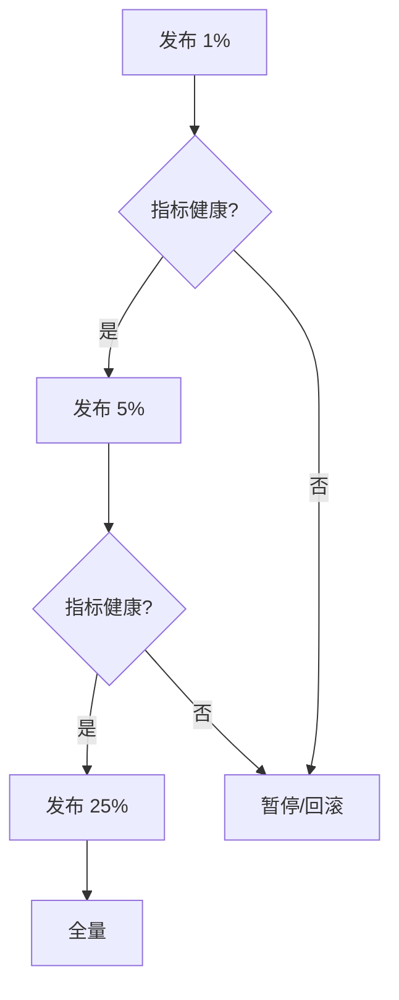

# 07-高可用、容灾与灰度发布

## 学习目标

- 理解高可用、容灾、故障恢复、发布安全之间的关系。
- 掌握 RTO/RPO、多活边界、故障切换和数据恢复。
- 区分蓝绿发布、金丝雀发布、滚动发布和灰度策略。
- 能把 SLO、error budget 和发布决策联系起来。

## 核心原理

### 高可用指标

可用性通常用成功服务时间比例衡量。

| 可用性 | 年不可用时间近似 | 含义 |
| --- | --- | --- |
| 99% | 约 3.65 天 | 普通内部系统 |
| 99.9% | 约 8.76 小时 | 常见在线服务 |
| 99.99% | 约 52.6 分钟 | 核心链路 |
| 99.999% | 约 5.26 分钟 | 极高成本目标 |

理论保证：冗余可以提高抗单点故障能力，但不能消除相关性故障。

工程假设：故障相对独立、切换机制有效、监控能及时发现、容量有冗余。

实现取舍：可用性目标越高，架构复杂度、成本、演练要求越高。

### RTO 与 RPO

| 指标 | 含义 | 例子 |
| --- | --- | --- |
| RTO | 故障后恢复服务所需最长时间 | 15 分钟内恢复下单 |
| RPO | 故障时可接受的数据丢失窗口 | 最多丢 1 分钟订单日志 |

RTO 关注恢复速度，RPO 关注数据丢失。同步复制可降低 RPO，但增加延迟和耦合；异步复制可降低延迟，但故障时可能丢数据。

### 多活边界

多活不是“所有业务到处可写”。多活的核心难点是跨地域写冲突和一致性延迟。

| 模式 | 特点 | 边界 |
| --- | --- | --- |
| 同城双活 | 延迟较低，可同步复制部分数据 | 城市级灾难仍有风险 |
| 异地灾备 | 主站写，备站接管 | RTO/RPO 取决于切换和复制 |
| 单元化多活 | 用户按单元路由，本单元闭环 | 跨单元交易复杂 |
| 全局多写 | 多地都可写 | 冲突解决和一致性成本高 |

工程上应优先做业务分区：用户、商户、地域、租户按规则归属到一个写单元，跨单元操作异步化或显式协调。

### 备份、恢复与演练

备份的目标不是“有一份数据”，而是在事故中按 RTO/RPO 恢复业务。备份体系至少要覆盖快照、增量日志、配置、对象存储、索引重建材料和恢复手册。

| 能力 | 检查点 |
| --- | --- |
| 备份完整性 | 快照成功率、binlog 连续性、对象版本 |
| 恢复可用性 | 恢复演练耗时、校验脚本、抽样查询 |
| 隔离性 | 备份账号权限、跨账号/跨地域保存 |
| 防误删 | 版本化、保留期、延迟删除 |
| 恢复顺序 | 数据库、缓存预热、索引重建、流量切回 |

常见恢复时序：

```text
T1: 主库误删关键表
T2: 立即冻结写入或切只读，保留事故现场
T3: 从最近快照恢复到临时库
T4: 应用增量日志到目标时间点
T5: 校验行数、金额、外键和业务抽样
T6: 切换业务读写或做定向修复
```

没有演练的 RTO/RPO 只是愿望。恢复脚本、权限、网络、依赖版本和数据量都会让纸面目标失效。

### 灰度发布

| 发布方式 | 做法 | 优点 | 风险 |
| --- | --- | --- | --- |
| 滚动发布 | 分批替换实例 | 简单，资源成本低 | 新旧版本长时间共存 |
| 蓝绿发布 | 两套环境切流 | 回滚快 | 资源成本高，数据迁移复杂 |
| 金丝雀发布 | 少量用户/流量先试 | 风险可控 | 需要精细指标和路由 |
| A/B 实验 | 按实验组分流 | 验证产品效果 | 不等于故障灰度 |

发布是否继续应由 SLO 和 error budget 决定。如果错误率、延迟、核心业务指标超出预算，应自动暂停或回滚。



### 灰度兼容性

灰度发布期间，新旧版本会同时读写同一批数据。兼容性检查要先于放量：

| 变更 | 安全顺序 |
| --- | --- |
| 新增字段 | 先服务端兼容读，再写新字段，最后依赖新字段 |
| 删除字段 | 先停读，再停写，最后迁移/删除 |
| 枚举扩展 | 旧版本能处理未知枚举后再发布 |
| 数据库变更 | expand -> migrate -> contract |
| 消息 schema | 生产者和消费者按版本兼容 |

灰度指标不只看 5xx。支付、下单、登录等核心链路还要看业务成功率、P99、下游错误、重试放大、队列积压、回滚能力和影响用户数。

## 工程实践/案例

核心交易服务的高可用设计：

- 单实例故障：负载均衡摘除，实例自动重启。
- 单可用区故障：流量切到其他可用区，数据库主从切换。
- 机房故障：根据 RTO/RPO 触发灾备切换。
- 发布故障：金丝雀阶段基于错误率、P99 延迟、下单成功率自动回滚。
- 数据故障：备份、binlog、快照、恢复演练和只读保护。

### 决策表

| 场景 | 优先目标 | 策略 |
| --- | --- | --- |
| 单实例崩溃 | 快速恢复 | 健康检查摘除、自动重启、连接排空 |
| 单 AZ 故障 | 保持服务 | 多 AZ 部署、容量预留、依赖同级冗余 |
| 主库故障 | 控制 RTO/RPO | 自动或人工确认切主、复制延迟门禁 |
| 跨地域灾难 | 业务连续 | 灾备切换、DNS/GSLB、只读降级 |
| 灰度异常 | 降低影响面 | 暂停、回滚、切旧版本、数据修复 |

容量冗余也要计算。若平时 3 个 AZ 各承载 1/3 流量，单 AZ 故障后剩余 2 个 AZ 要承载 100% 流量，每个 AZ 需要从 33% 提升到 50%，即至少有约 50% 以上余量，还要考虑故障时缓存 miss、重试和恢复流量。

## 常见误区

- 误区：部署多实例就是高可用。  
  修正：还要处理数据库、缓存、消息队列、配置中心等共享依赖。

- 误区：多活可以无成本提升可用性。  
  修正：多活会引入路由、冲突、数据一致性和运维复杂度。

- 误区：有备份就能恢复。  
  修正：备份必须定期恢复演练，否则不知道 RTO/RPO 是否满足。

- 误区：灰度只看服务 5xx。  
  修正：还要看业务成功率、延迟、依赖错误、资源使用和用户影响面。

## 自测题

1. RTO 和 RPO 分别回答什么问题？
2. 为什么异地多活最难的是写冲突？
3. 蓝绿发布和金丝雀发布的主要区别是什么？
4. error budget 如何影响发布节奏？

## 实践任务

为一个“支付服务”设计容灾和灰度发布方案。写出单实例、单机房、数据库主库故障时的恢复策略，以及发布过程中要观察的 5 个指标。

## 延伸阅读

- [Google SRE Book](https://sre.google/sre-book/table-of-contents/)：Service Level Objectives、Release Engineering、Emergency Response。
- [AWS Well-Architected Reliability Pillar](https://docs.aws.amazon.com/wellarchitected/latest/reliability-pillar/welcome.html)。
- [Argo Rollouts 文档](https://argo-rollouts.readthedocs.io/)：渐进式交付的工程实践参考。
