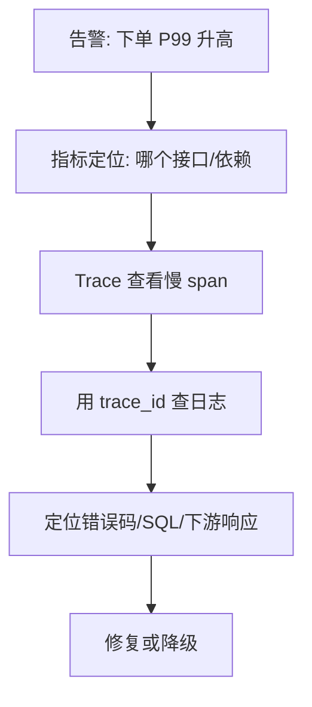

# 08-可观测性：链路追踪与故障定位

## 学习目标

- 理解日志、指标、链路追踪各自回答的问题。
- 掌握 trace id、span、上下文传播和跨服务关联。
- 能用 SLO、error budget、RED/USE 指标定位故障。
- 能设计故障定位路径，而不是只堆监控面板。

## 核心原理

### 三大支柱

| 类型 | 回答的问题 | 典型字段 |
| --- | --- | --- |
| 日志 | 某个事件发生了什么 | trace_id、user_id、order_id、error_code |
| 指标 | 系统整体趋势如何 | QPS、错误率、P99、队列长度 |
| 链路追踪 | 请求经过了哪些服务，耗时在哪里 | trace、span、parent span、duration |

理论保证：观测数据不能自动证明根因，只能提供证据链。

工程假设：时钟误差可接受，上下文传播完整，采样策略没有漏掉关键异常。

实现取舍：全量 trace 成本高，采样会降低细节；日志过多影响性能，过少无法定位。

### 日志、指标、Trace 的关联



关联关键是统一上下文：

- 入口生成 trace id。
- RPC、MQ、异步任务传播 trace id。
- 日志必须带 trace id 和关键业务 id。
- 指标标签要克制，避免 user_id 等高基数字段。
- 错误码要稳定，便于聚合和检索。

### Trace 上下文传播

Trace 的难点不在生成 ID，而在跨边界传播。HTTP 可通过请求头传播，RPC 通过 metadata，MQ 通过 message headers，异步任务通过任务记录或 outbox 事件字段继续传递。

```text
HTTP ingress
  -> traceparent/request-id
  -> RPC metadata
  -> MQ headers
  -> async worker span link
  -> logs include trace_id/span_id/business_id
```

异步链路不一定是严格 parent-child，也可以用 span link 表示“由某个事件触发”。采样策略要保留错误、慢请求和关键业务流量；纯固定比例采样可能漏掉低频严重问题。

### SLO 与 error budget

SLO 是服务对用户体验的目标，例如“99.9% 的下单请求在 300ms 内成功返回”。error budget 是允许失败的预算。

| 概念 | 含义 |
| --- | --- |
| SLI | 可测量指标，例如成功率、延迟 |
| SLO | 目标值，例如 99.9% 成功率 |
| SLA | 对外承诺，通常带补偿条款 |
| Error budget | `1 - SLO` 对应的可失败空间 |

error budget 的价值是把可靠性和迭代速度连接起来：预算充足时可以发布；预算燃烧过快时，应暂停高风险变更，优先修复可靠性问题。

### RED 与 USE

| 方法 | 适用对象 | 指标 |
| --- | --- | --- |
| RED | 请求型服务 | Rate、Errors、Duration |
| USE | 资源型组件 | Utilization、Saturation、Errors |

请求慢时先看 RED：请求量是否突增、错误率是否上升、P95/P99 是否劣化。资源异常时看 USE：CPU、内存、磁盘、网络、连接池、线程池是否饱和。

### SLI 设计和告警窗口

SLI 应贴近用户体验，而不是只贴近机器状态。例如“下单接口 HTTP 200”不等于下单成功，还要看业务状态、支付确认和库存结果。

| 服务 | 推荐 SLI |
| --- | --- |
| API 服务 | 成功率、P95/P99 延迟、可用请求数 |
| MQ 消费 | 消费延迟、积压最大年龄、处理成功率 |
| 搜索服务 | 查询成功率、P99、无结果率、相关性人工样本 |
| 对象上传 | 上传完成率、checksum 失败率、未完成 multipart 数 |

告警通常需要多窗口：短窗口发现快速事故，长窗口过滤抖动。error budget burn rate 可以把“错误率高但持续时间短”和“错误率中等但持续消耗预算”区分开。

## 工程实践/案例

“用户反馈下单慢”的定位路径：

1. 查 SLO 面板，确认是全局慢、局部慢还是单用户慢。
2. 按地域、版本、机房、实例分组查看 P99。
3. 打开慢请求 trace，定位耗时最长 span。
4. 用 trace id 查询相关服务日志。
5. 检查下游依赖指标：数据库慢查询、缓存命中率、MQ 堆积、连接池等待。
6. 关联最近发布、配置变更、流量活动。
7. 先止血：限流、熔断、降级、回滚、扩容。
8. 再根因：代码缺陷、索引缺失、容量不足、依赖故障。

### 日志字段建议

| 字段 | 作用 |
| --- | --- |
| timestamp | 时间排序 |
| level | 严重程度 |
| service | 服务名 |
| instance | 实例 |
| trace_id/span_id | 链路关联 |
| request_id | 请求关联 |
| user_id/order_id | 业务定位 |
| error_code | 聚合分析 |
| latency_ms | 单次耗时 |

### 系统化排障模板

```text
1. 定义现象: 哪个 SLI 变坏，影响多大，何时开始
2. 切分范围: 地域、版本、实例、租户、接口、依赖
3. 找变化点: 发布、配置、流量、数据、依赖状态
4. 追请求链: trace 慢 span -> 日志 -> 下游指标
5. 先止血: 回滚、限流、熔断、降级、扩容、切流
6. 再修复: 根因、补偿、回放、回归测试
7. 复盘固化: 告警、仪表盘、runbook、演练
```

### 决策表

| 现象 | 优先检查 | 常见动作 |
| --- | --- | --- |
| P99 升高，错误率正常 | 慢 span、连接池等待、GC、DB 慢查询 | 扩容、限流、索引修复 |
| 错误率突增 | 版本、依赖 5xx、配置变更 | 回滚、熔断、切流 |
| MQ 积压 | 消费速率、死信、下游延迟 | 扩消费者、暂停生产、修复毒消息 |
| 单租户异常 | 租户标签、数据倾斜、限流 | 单租户隔离、配额调整 |
| 指标正常但用户报错 | 前端/网关日志、业务错误码、采样盲区 | 增加埋点和日志字段 |

## 常见误区

- 误区：有日志就等于可观测。  
  修正：没有指标和 trace，日志很难回答“影响面”和“瓶颈在哪”。

- 误区：所有字段都打进指标标签。  
  修正：高基数字段会导致指标系统成本和查询压力暴涨。

- 误区：平均延迟正常就没问题。  
  修正：用户体验常由 P95/P99 长尾决定。

- 误区：采样 trace 足够定位所有问题。  
  修正：低频严重错误可能被采样漏掉，应对错误请求提高采样率。

## 自测题

1. 日志、指标、Trace 分别适合回答什么问题？
2. 为什么指标标签不能放 user_id？
3. SLO 和 SLA 的区别是什么？
4. 如果 P99 升高但平均值不变，可能说明什么？

## 实践任务

为“订单服务”设计一套可观测性方案。要求列出 10 个核心指标、关键日志字段、trace 跨 HTTP/RPC/MQ 的传播方式，以及 3 条告警规则。

## 延伸阅读

- [OpenTelemetry 官方文档](https://opentelemetry.io/docs/)。
- [Google SRE Book](https://sre.google/sre-book/table-of-contents/)：Monitoring Distributed Systems、Service Level Objectives。
- Brendan Gregg：[USE Method](https://www.brendangregg.com/usemethod.html)。
