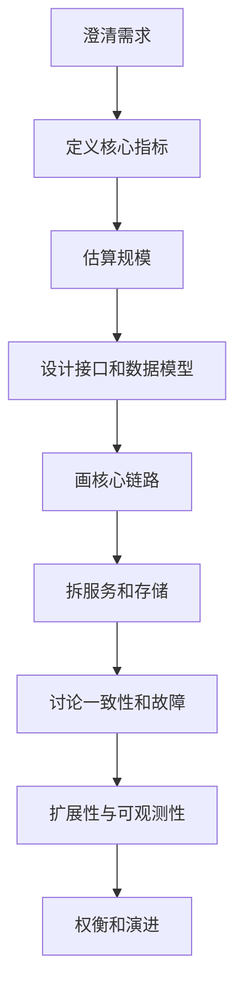

# 09-系统设计方法与案例

## 学习目标

- 掌握系统设计题的拆解顺序和表达框架。
- 能把容量估算、数据模型、接口、缓存、异步、一致性、容灾串起来。
- 能用前面章节的知识解释关键取舍。
- 能输出既能面试表达、又接近工程落地的设计。

## 核心原理

### 系统设计题拆解

建议按以下顺序推进：

理论保证：系统设计没有唯一答案，只有在约束下更合适的取舍。

工程假设：所有估算都要说明假设，例如 DAU、QPS、读写比例、峰值倍数、数据保留周期。

实现取舍：面试中不追求覆盖所有细节，优先讲清主链路、瓶颈、风险和解决方案。

### 常用问题清单

| 类别 | 要问的问题 |
| --- | --- |
| 功能 | 用户能做什么？核心路径是什么？ |
| 非功能 | 延迟、可用性、一致性、成本目标是什么？ |
| 规模 | DAU、QPS、峰值、数据量、增长率？ |
| 数据 | 主实体、索引、分片键、冷热数据？ |
| 接口 | 写接口是否幂等？读接口是否分页？ |
| 一致性 | 哪些必须强一致，哪些可最终一致？ |
| 故障 | 超时、重试、降级、容灾怎么做？ |
| 观测 | SLO、日志、指标、Trace 怎么设计？ |

### 容量估算模板

1. 估 DAU 和请求频次。
2. 估平均 QPS：`日请求量 / 86400`。
3. 估峰值 QPS：平均 QPS 乘以峰值系数。
4. 估存储：单条大小乘以条数和副本数。
5. 估带宽：QPS 乘以平均响应大小。
6. 根据读写比例决定缓存、分库分表、异步队列。

估算要明确峰值和冗余。平均 QPS 只用于量级判断，容量规划要看峰值、热点、故障切换和重试放大。例如平时 2k QPS、峰值系数 5、单 AZ 故障后剩余容量承接全部流量，则有效容量不能只按 10k QPS 准备，还要给缓存失效和下游抖动留预算。

### 一致性决策

| 数据 | 推荐一致性 | 理由 |
| --- | --- | --- |
| 账户余额 | 强业务一致 | 错账不可接受 |
| 订单状态 | 状态机约束 | 防乱序、防重复 |
| 库存扣减 | 预占或强约束 | 防超卖 |
| 搜索索引 | 最终一致 | 可延迟更新 |
| 推荐结果 | 弱一致 | 可缓存和降级 |
| 通知消息 | 最终送达 | 允许延迟和重复处理 |

### 面试表达中的失败路径模板

很多系统设计答案只覆盖正常链路，真正拉开差距的是失败路径。可以按“调用失败、状态未知、消息重复、数据不一致、容量不足、发布回滚”逐项检查。

| 风险 | 必答机制 |
| --- | --- |
| 写请求超时 | 幂等键、状态查询、未知状态处理 |
| 消息重复 | 消费幂等、唯一约束、事件 ID |
| 消息丢失 | Outbox/CDC、投递重试、死信 |
| 缓存不一致 | TTL、主动失效、回源、版本 |
| 分片热点 | routing key、虚拟节点、限流、拆分 |
| 发布不兼容 | expand/migrate/contract、灰度和回滚 |

容量估算也要服务于失败路径：峰值 QPS 决定限流和队列，数据量决定分片和备份恢复时间，带宽决定大文件直传和 CDN，写入冲突概率决定是否需要预占、乐观锁或串行化。

## 工程实践/案例

### 案例：短链系统

需求：用户提交长 URL，系统生成短码；访问短码时跳转到长 URL；要求读多写少、高可用、低延迟。

容量估算假设：DAU 1000 万，每人每天平均访问短链 5 次，创建短链 0.05 次。读请求约 5000 万/天，平均 579 QPS；按峰值 10 倍估算约 5800 QPS。写请求约 50 万/天，平均 6 QPS，峰值约 60 QPS。若每条映射含短码、长 URL、用户、过期时间和索引开销约 1KB，年新增约 1.8 亿条，单副本约 180GB，三副本约 540GB，仍要为访问日志另算存储。

设计要点：

| 模块 | 方案 |
| --- | --- |
| 短码生成 | 发号器或哈希 + 冲突检测 |
| 存储 | `short_code -> long_url` KV/关系库 |
| 缓存 | 热门短链缓存，TTL + 主动失效 |
| 读路径 | 网关解析短码，查缓存，回源数据库 |
| 写路径 | 幂等创建，唯一索引保证短码不冲突 |
| 分片 | 按 short_code 哈希分片 |
| 可用性 | 多副本、缓存降级、限流 |
| 观测 | 跳转成功率、P99、缓存命中率、404 比例 |

一致性取舍：创建后立即访问应尽量读到新值，可以写库后同步写缓存，或读缓存 miss 后回源。访问统计可以异步写入 MQ，最终一致。

失败路径：

| 失败 | 处理 |
| --- | --- |
| 短码冲突 | 唯一索引拒绝后重新生成，记录冲突率 |
| 缓存穿透 | 空值缓存、布隆过滤器、限流 |
| DB 慢 | 热点短链缓存、只读副本、降级到错误页 |
| 创建超时 | 幂等键查询已有结果，避免重复创建 |
| 统计 MQ 积压 | 不影响跳转主链路，延迟消费和采样降级 |

### 案例：秒杀库存

需求：高并发抢购，库存不能超卖，用户体验可降级。

容量估算假设：活动商品库存 1 万件，开抢前 30 秒有 200 万用户进入页面，峰值点击 20 万 QPS。真正能成功的写入最多 1 万单，系统目标是把无效流量尽早拦在网关、CDN、排队层和用户限流处，而不是让 20 万 QPS 全部打到库存数据库。

设计要点：

- 活动开始前预热商品、库存和限流配置。
- 网关按用户和商品限流，拦截异常流量。
- 库存使用预扣模型，扣减写入库存流水。
- 用户维度用唯一约束防重复购买。
- 下单结果可以先返回排队中，异步确认。
- 支付超时后取消订单并释放库存。
- 对账任务检查订单、库存流水、支付流水。

关键取舍：库存不能超卖属于强业务约束；页面库存数字可以最终一致；推荐和评价模块可降级。

失败路径：

| 失败 | 处理 |
| --- | --- |
| 用户重复点击 | 用户+活动唯一约束，返回已有排队/成功状态 |
| 库存服务超时 | 不盲目重试扣减，按请求 ID 查询流水 |
| MQ 积压 | 页面显示排队中，监控最大消息年龄 |
| 支付超时 | 订单过期取消，释放预占库存 |
| 缓存库存不准 | 只作展示，最终以库存流水和数据库条件更新为准 |

### 案例：网盘大文件上传

需求：用户上传大文件，支持断点续传、秒传、权限隔离和下载分享。假设 DAU 100 万，日活上传用户 5%，人均上传 2 个文件，平均文件 50MB，则日上传 10 万个文件、约 5TB 原始数据。三副本或纠删码后的实际成本按存储方案另算；公网带宽要按峰值上传窗口估算。

核心设计：

| 模块 | 方案 |
| --- | --- |
| 元数据 | 文件表、对象表、版本、owner、checksum、引用计数 |
| 上传 | multipart + 预签名 URL + part checksum |
| 秒传 | 用户提交完整 checksum，命中已有对象则增加引用 |
| 下载 | 短期下载 URL，权限校验后签发 |
| 搜索 | 文件名 keyword/text，内容异步抽取后入搜索索引 |
| 清理 | 未完成上传生命周期、删除回收站、引用计数对账 |

失败路径：part 上传失败只重传 part；complete 成功但 DB 更新失败时通过 upload_id 对账补状态；用户删除文件先标记回收站，延迟清理对象；分享链接泄漏靠过期时间、权限版本和撤销列表控制。

## 常见误区

- 误区：一上来画很多服务。  
  修正：先讲需求、规模、核心链路，再拆服务。

- 误区：只说 Redis、MQ、分库分表。  
  修正：必须解释为什么需要、解决什么瓶颈、引入什么风险。

- 误区：所有数据都要求强一致。  
  修正：强一致成本高，应按业务后果分类。

- 误区：忽略失败路径。  
  修正：面试区分度往往来自超时、重试、幂等、补偿、容灾和观测。

## 自测题

1. 系统设计题为什么要先澄清读写比例和一致性目标？
2. 短链系统如何处理短码冲突？
3. 秒杀系统如何防止重复购买和库存超卖？
4. 什么时候应该引入 MQ？引入后必须补哪些机制？

## 实践任务

任选一个题目：评论系统、网盘上传、IM 已读回执、排行榜、优惠券系统。按“需求、规模、接口、数据模型、核心链路、一致性、故障处理、观测、扩展”写出完整设计。

## 延伸阅读

- Alex Xu, *System Design Interview*。
- Martin Kleppmann, *Designing Data-Intensive Applications*。
- [Google SRE Book](https://sre.google/sre-book/table-of-contents/)：可靠性、监控、发布和容量规划章节。
