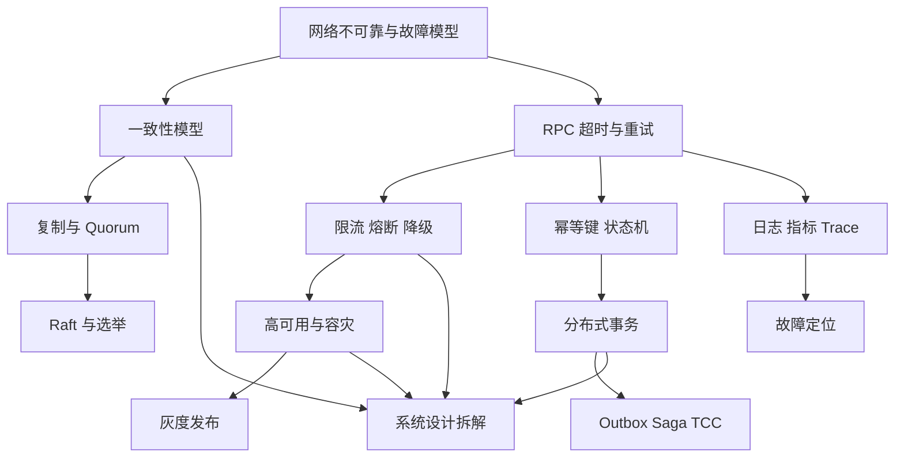

# 分布式系统

这组笔记面向 C++ 后端开发面试与工程实践，目标不是背概念，而是建立一套可迁移的判断框架：先识别故障模型和一致性目标，再选择复制、协调、事务、发布、观测与容灾方案。

## 学习目标

- 建立故障模型、一致性、可用性和工程取舍的共同语言。
- 能设计 RPC、服务发现、限流熔断、幂等、事务、共识、容灾和观测链路。
- 能在系统设计中区分协议保证、工程假设和具体实现配置。
- 能用容量估算、失败路径和 SLO/error budget 支撑架构选择。

## 核心原理

分布式系统的核心矛盾来自“不可靠网络 + 独立故障 + 并发状态”。所有方案都在一致性、可用性、延迟、成本和复杂度之间取舍：共识提高状态安全但牺牲写可用性和延迟；异步化提高吞吐但需要幂等、补偿和对账；多活提高灾难恢复能力但引入路由和冲突处理。

## 工程实践/示例

### 章节地图

| 顺序 | 章节 | 解决的问题 | 前置依赖 |
| --- | --- | --- | --- |
| 1 | [基本理论：CAP、BASE 与一致性](./01-基本理论-CAP-BASE与一致性.md) | 分布式系统能保证什么，不能同时保证什么 | 网络、数据库事务基础 |
| 2 | [服务发现、RPC 与负载均衡](./02-服务发现-RPC与负载均衡.md) | 请求如何找到可用服务并稳定调用 | HTTP/TCP、进程模型 |
| 3 | [韧性工程：限流、熔断、降级](./03-韧性工程-限流熔断降级.md) | 局部故障如何不被放大成系统故障 | 服务调用链、延迟分布 |
| 4 | [幂等、分布式锁与分布式 ID](./04-幂等-分布式锁与分布式ID.md) | 重试、并发和唯一性如何处理 | Redis/数据库唯一约束 |
| 5 | [分布式事务与最终一致性](./05-分布式事务与最终一致性.md) | 跨服务状态如何一致或可补偿 | 事务、消息队列 |
| 6 | [一致性哈希、选举与 Raft 基础](./06-一致性哈希-选举与Raft基础.md) | 节点变化、主从切换和共识如何工作 | 复制、一致性模型 |
| 7 | [高可用、容灾与灰度发布](./07-高可用-容灾与灰度发布.md) | 故障、灾难和变更如何控制影响面 | SLA、发布流水线 |
| 8 | [可观测性：链路追踪与故障定位](./08-可观测性-链路追踪与故障定位.md) | 如何在复杂调用图中定位问题 | 日志、指标、Trace |
| 9 | [系统设计方法与案例](./09-系统设计方法与案例.md) | 如何把需求拆成可落地架构 | 前 8 章 |

### 推荐学习顺序

1. 先读第 1 章，建立“故障模型、一致性、可用性、分区”的共同语言。
2. 再读第 2-4 章，理解日常微服务调用中的发现、路由、重试、限流、幂等和锁。
3. 接着读第 5-6 章，掌握跨服务状态一致性、最终一致性和共识算法的边界。
4. 最后读第 7-9 章，把工程治理、观测定位和系统设计题方法串起来。

### 按问题查章节

| 问题 | 入口 |
| --- | --- |
| 网络分区时为什么不能同时强一致又始终可用？ | 第 1 章 CAP、一致性模型 |
| `R + W > N` 为什么仍可能读旧值？ | 第 1 章 Quorum、sloppy quorum、read repair |
| RPC 超时后到底能不能重试？ | 第 2 章 deadline、重试预算；第 4 章幂等 |
| 限流、熔断、降级分别该放在哪里？ | 第 3 章韧性工程 |
| 分布式锁为什么还需要 fencing token？ | 第 4 章分布式锁 |
| 跨服务写库和发消息如何避免丢事件？ | 第 5 章 Outbox/CDC |
| Raft 为什么不能只靠心跳选主？ | 第 6 章 term、投票、日志匹配 |
| 备份为什么必须恢复演练？ | 第 7 章 RTO/RPO |
| 告警响了如何系统化定位？ | 第 8 章 logs/metrics/traces/SLO |
| 系统设计题如何把容量和失败路径讲完整？ | 第 9 章案例 |

### 知识依赖图

### 阅读方式

每篇笔记都固定包含：学习目标、核心原理、工程实践/案例、常见误区、自测题、实践任务、延伸阅读。阅读时建议把每个主题按三层区分：

- 理论保证：在明确模型下可以证明的性质，例如线性一致性、Raft 安全性、Quorum 交集。
- 工程假设：生产环境为了可用性、成本、延迟所依赖的条件，例如时钟大致同步、故障独立、健康检查可信。
- 实现取舍：具体系统中的参数、算法和降级策略，例如超时时间、重试次数、负载均衡算法、Outbox 投递方式。

### 面试复盘清单

- 能否先说清楚系统目标：读多写少、强一致、最终一致、低延迟、高可用，哪一个优先？
- 能否明确故障模型：进程崩溃、网络分区、慢请求、消息重复、时钟回拨、机房故障？
- 能否解释重试为什么需要幂等，超时为什么不代表失败？
- 能否说明 2PC、TCC、Saga、Outbox 各自牺牲了什么？
- 能否把日志、指标、链路追踪和 SLO/error budget 联系起来？
- 能否在系统设计题中先拆需求、估规模、画数据流，再讨论一致性和故障处理？

### 学习产出

读完这组笔记后，至少应能输出三类材料：

1. 一页一致性决策表：列出核心数据、读写路径、要求的一致性模型、允许的旧读窗口和补偿机制。
2. 一张调用链韧性图：标注每层 deadline、重试、限流、熔断、降级、幂等和监控指标。
3. 一个系统设计答案：包含需求澄清、容量估算、接口和数据模型、核心链路、故障路径、RTO/RPO、灰度和观测。

### 决策速查

| 决策 | 优先问 |
| --- | --- |
| 选择强一致还是最终一致 | 错误结果的业务后果是什么，用户能否接受中间态 |
| 是否引入 MQ | 是否需要削峰、解耦或异步，是否准备好幂等和对账 |
| 是否使用分布式锁 | 锁保护的是效率还是正确性，下游是否支持 fencing |
| 是否跨地域多活 | 写冲突如何解决，按什么维度单元化 |
| 是否自动重试 | 错误是否可重试，请求是否幂等，是否有总预算 |

## 常见误区

| 误区 | 正确认知 |
| --- | --- |
| 多数派等于绝对正确 | 多数派保证依赖协议前提，还要看日志、版本和故障模型 |
| 重试能提高所有请求成功率 | 重试会放大故障，必须受 deadline、预算和幂等约束 |
| 最终一致就是不用管 | 最终一致需要状态机、重试、补偿、死信和对账 |
| 多活只是多部署几套服务 | 多活核心难点是写路由、冲突和容灾切换 |

## 自测题

1. 如何区分数学/协议保证、工程假设和具体实现？
2. 为什么超时是未知状态，而不是确定失败？
3. 哪些业务数据必须强约束，哪些可以最终一致？
4. 一个系统设计答案为什么要包含失败路径和容量估算？

## 实践任务

- 为一个订单系统画出从入口 RPC 到库存、支付、消息、搜索索引的完整一致性和故障处理图。
- 选择一个现有服务，补充 SLI/SLO、error budget、灰度门禁和排障 runbook。
- 用第 9 章模板设计一个“优惠券系统”，要求包含容量估算、幂等、分布式事务、缓存和容灾。

## 延伸阅读

- Google SRE Book：https://sre.google/sre-book/table-of-contents/
- Raft 官方站点：https://raft.github.io/
- Martin Kleppmann, *Designing Data-Intensive Applications*。
