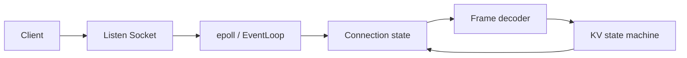
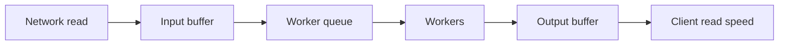

# 项目一：高性能 KV 服务

## 1. 项目目标

实现一个 Linux C++ 内存 KV 服务，支持 `GET/SET/DEL`、TTL 和基本统计。重点不是替代 Redis，而是把 Socket、epoll、Reactor、协议编解码、并发、定时器、优雅关闭和压测串起来。

### 明确非目标

第一版不追求兼容 Redis 协议、分布式复制、无锁数据结构或极限 benchmark 排名。过早增加这些目标会掩盖真正需要验证的内容：连接与资源生命周期是否正确、协议能否增量解析、过载时内存是否有界、关闭时请求语义是否明确。

### 组件所有权

| 组件 | 建议所有者 | 不变量 |
| --- | --- | --- |
| 监听 fd | acceptor 所属 event loop | 只在该 loop 注册、摘除和关闭 |
| 连接 fd 与读写缓冲 | connection 所属 event loop | 同一时刻只由一个 loop 推进 I/O |
| 解码器状态 | connection | 已消费字节不会重复解析，未完成帧继续保留 |
| KV 分片 | 固定 worker/分片 | 单 key 的修改由唯一分片串行化或同一锁保护 |
| 定时器 | event loop 或专用 timer owner | 取消后回调不能访问已销毁连接 |
| 工作队列 | thread pool | 容量有界，关闭后不再接受新任务 |

先写出所有权表，再决定使用裸引用、`unique_ptr`、`shared_ptr` 或消息传递。智能指针只是实现手段，不替代线程归属规则。

## 2. 分阶段实现

### M0：阻塞式基线

- 单线程阻塞 Socket；
- 每行一条文本命令；
- `unordered_map` 保存数据；
- 单元测试覆盖命令解析和 TTL 判断。

验收：明确记录单连接/多连接下的吞吐和延迟，观察阻塞点。

基线的价值是提供对照。用 `strace -c` 统计系统调用，用一个慢客户端证明“单连接阻塞整个服务”，并记录服务在客户端不发送换行时停在哪里。

### M1：非阻塞 Reactor

- 监听 fd 与连接 fd 全部非阻塞；
- epoll LT 模式起步；
- 每连接独立读写缓冲；
- 处理 `EINTR`、`EAGAIN`、短读、短写、对端关闭；
- 只在写缓冲非空时关注可写事件。



验收：慢客户端不会阻塞其他连接；分片发送请求仍能正确解析；恶意超长帧被拒绝。

#### 事件处理细节

- accept 循环持续到 `EAGAIN`；新连接立即设置非阻塞和 close-on-exec。
- 可读事件循环读取到 `EAGAIN`；`read == 0` 表示对端关闭发送方向。
- 先尝试直接写；剩余字节进入输出缓冲并按需启用 `EPOLLOUT`。
- 输出缓冲清空后关闭 `EPOLLOUT`，否则可写 Socket 会让事件循环空转。
- 错误/半关闭事件可能与可读事件一起到达，状态机决定先排空还是关闭。
- 摘除 epoll 兴趣、取消定时器、关闭 fd 和销毁对象的顺序必须固定。

event loop 还需要一个跨线程唤醒 fd（如 `eventfd` 或 pipe）。worker 完成任务后只把完成消息放入队列并唤醒 loop，由 loop 检查连接代数后写回，避免旧任务操作已经复用的 fd。

### M2：二进制协议与状态机

建议帧：`magic | version | type | request_id | body_length | body`。约束最大 body，采用网络字节序，解析前检查加法溢出和长度上限。

状态机至少包含：读头、读体、处理、排队写、半关闭/关闭。`request_id` 让同连接多个在途请求可以关联响应；若不支持乱序，必须在协议中说明。

验收：对解码器做 fuzz/property 测试；任意网络分片不改变消息结果；未知版本/命令返回稳定错误码。

#### 命令语义

| 命令 | 请求字段 | 响应 | 需要说明的边界 |
| --- | --- | --- | --- |
| `GET` | key | value / not-found | value 最大长度、过期是否惰性删除 |
| `SET` | key、value、可选 TTL | stored / error | 覆盖是否重置 TTL、内存上限 |
| `DEL` | key | deleted count | 不存在时是否仍成功，即幂等语义 |
| `EXPIRE` | key、TTL | updated / not-found | TTL 为零、负数和上限如何处理 |
| `STATS` | 可选分组 | 指标快照 | 统计是否精确、读取成本 |

协议错误分为连接级与请求级：magic/长度失真可能使后续边界无法恢复，应关闭连接；未知命令但帧边界完整时可以返回错误并继续。错误响应应携带 `request_id`、稳定错误码和有限文本，不能回显任意恶意输入。

#### 增量解码测试

对同一合法帧枚举所有切分位置：一次输入、逐字节输入、随机分片输入必须产生相同消息。再生成长度小于头、大于限制、长度溢出、未知版本、多个帧拼接和合法帧后跟坏帧等输入。解析器只返回 `NeedMore/Frame/Error`，不在数据不足时越界读取。

### M3：定时器、线程池与背压

- 最小堆或时间轮管理 TTL 与空闲连接；
- CPU/业务任务进入有界工作池；
- 每连接和全局写缓冲有上限；
- 队列满时选择拒绝、降级或暂停读；
- 异步完成结果回到连接所属 event loop，再检查连接代数/生命周期。

不要让工作线程直接无约束地操作连接 fd。事件循环应拥有连接状态，跨线程通过消息传递。

验收：工作池饱和时内存稳定，错误率上升但进程不崩；慢读客户端达到阈值后被限速或断开。

#### TTL 的两个时间问题

过期判断需要区分墙上时钟和单调时钟。进程内“距离现在还有多久”适合单调时钟，避免 NTP 调整导致倒退；若要持久化绝对到期时间，则需要墙上时间并在恢复时重新计算。定时器触发只保证“现在应该检查过期”，不能假设准点执行，因此 `GET` 仍需检查 TTL。

可使用两种结构：

- 最小堆：容易取得最近截止时间；更新 TTL 可能使用新节点 + 版本号惰性删除。
- 时间轮：超时分桶，批量处理成本稳定；精度由 tick 决定，长短超时跨度大时可分层。

#### 背压链路



任何一段变慢都会向前堆积。为输入缓冲、任务队列、每连接输出缓冲和全局输出字节分别设上限；达到软阈值可暂停读事件，达到硬阈值返回过载或断开。只限制任务数不够，因为不同响应大小的内存成本差异很大。

### M4：生命周期与可观测性

关闭流程：

1. 收到终止请求；
2. readiness 变为失败；
3. 停止 accept；
4. 拒绝或限制新请求；
5. 等待在途请求和写缓冲排空；
6. 到截止时间后取消/关闭；
7. 停止线程池、回收线程；
8. 刷新日志并退出。

指标至少包含：当前连接、accept/关闭速率、请求 QPS、错误码、P50/P95/P99、事件循环延迟、读写缓冲字节、任务队列长度、拒绝数、TTL 数量、RSS/CPU/fd。

验收：持续压测中发送终止信号，没有新请求进入，已接受请求在截止时间内完成或得到明确失败，进程无泄漏退出。

## 3. 并发模型选择

可选演进：

- 单 event loop + worker pool：简单，event loop 可能成为瓶颈。
- acceptor + 多 event loop：按连接分发，连接状态局部化。
- 分片 KV：每个 loop/worker 拥有部分 key，减少共享锁，但跨分片操作复杂。

每次只改变一个结构，用压测和火焰图决定是否演进。不要为了“无锁”提前引入难以验证的内存回收算法。

### KV 数据结构设计

最简单的 `unordered_map<string, Entry>` 需要关注哈希攻击、rehash 停顿、字符串分配和全局锁竞争。演进顺序可以是：

1. 单线程 event loop 直接拥有 map，建立正确性基线；
2. 多个分片，每个分片一把 mutex，根据稳定 hash 选分片；
3. 分片由固定 worker 串行拥有，通过队列传递操作，减少共享写；
4. 只有剖析证明分配/锁是瓶颈时，再评估 arena、对象池或更复杂结构。

分片数影响锁竞争和扫描成本。`STATS` 或全量快照需要遍历多个分片，不能假装是免费原子快照；可以返回弱一致统计并明确语义。

## 4. 故障与边界测试

- 客户端只发半个头后停住；
- 声明超大 body 或随机字节；
- 客户端不读响应，触发写缓冲上限；
- fd 接近上限，验证 accept 错误与恢复；
- 工作线程故意变慢，观察队列、延迟和拒绝；
- 关闭过程中持续建连和发送请求；
- 系统时钟变化，TTL 使用单调时钟还是墙上时钟？

### 自动化测试矩阵

| 层级 | 测试内容 | 关键断言 |
| --- | --- | --- |
| 单元 | Buffer、Codec、TTL、命令状态机 | 任意分片等价、边界不越界 |
| 集成 | 真 Socket + event loop | 短读短写、半关闭、并发连接 |
| 并发 | 多 worker、多分片 key | 无数据竞争、结果满足命令语义 |
| 模糊测试 | 随机帧、长度、命令序列 | 不崩溃、内存有界、错误稳定 |
| 故障 | 队列满、fd 耗尽、慢客户端 | 受控拒绝、其他请求继续服务 |
| 生命周期 | 启动失败、SIGTERM、强制截止 | 无新流量、在途有明确结果、线程全部回收 |

Debug/CI 构建分别运行 ASan+UBSan 和 TSan；它们解决的问题不同，不要只跑一次短压测就宣称没有并发缺陷。

## 5. 性能报告模板

报告必须写清：CPU、内存、内核、编译优化、线程数、连接数、请求/响应大小、读写比例、key 分布、持续时间、预热方式、客户端是否成为瓶颈。

| 并发 | QPS | P50 | P95 | P99 | 错误率 | CPU | RSS | 备注 |
| ---: | ---: | ---: | ---: | ---: | ---: | ---: | ---: | --- |
|  |  |  |  |  |  |  |  |  |

优化流程：建立基线 → 提出一个假设 → 用 `perf`/指标验证 → 做最小修改 → 相同负载复测 → 检查尾延迟和正确性回归。

### 负载模型

至少测三类负载：

- 均匀 key、固定小 value：观察网络与协议基线。
- Zipf 热点 key、读多写少：观察锁/分片倾斜和缓存局部性。
- 大小 value 混合、包含慢客户端：观察分配、复制、输出背压和尾延迟。

先做阶梯压测找到饱和点，再在饱和点以下持续运行。若 QPS 不再增长而排队延迟快速上升，说明已经越过容量拐点。报告客户端 CPU/网络，避免把压测机瓶颈误判成服务端能力。

### 容量粗估

若平均每连接状态为 `C` 字节、平均存储 key/value/元数据为 `E` 字节，则内存下界约为：

```text
memory ≈ connections × C + entries × E + buffers + allocator overhead + safety margin
```

实际值必须用 RSS、heap profile 和不同 key/value 分布测量。哈希桶、字符串容量、碎片和未发送响应可能让实际占用显著高于业务数据大小。

## 6. 进阶挑战

- `SO_REUSEPORT` 多 acceptor 对照实验；
- 批量处理 epoll 事件与系统调用；
- 快照 + 增量日志持久化，并做崩溃恢复；
- 主从复制的小型状态机实验；
- 用成熟框架重写网络层，对比代码复杂度与性能。

## 7. 最终交付物

- 架构、线程模型、连接状态机和关闭时序图；
- 协议规范、错误码和兼容策略；
- 单元/集成/fuzz/故障测试命令与结果；
- 至少两轮可复现压测及一次证据驱动优化；
- 一个已知限制清单，例如不支持持久化、统计为弱一致、单机容量上限；
- 从干净 Linux 环境构建、运行、压测和关闭的说明。
